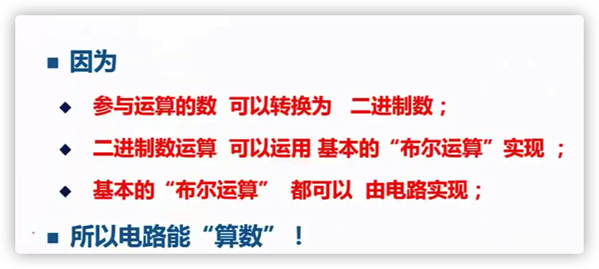
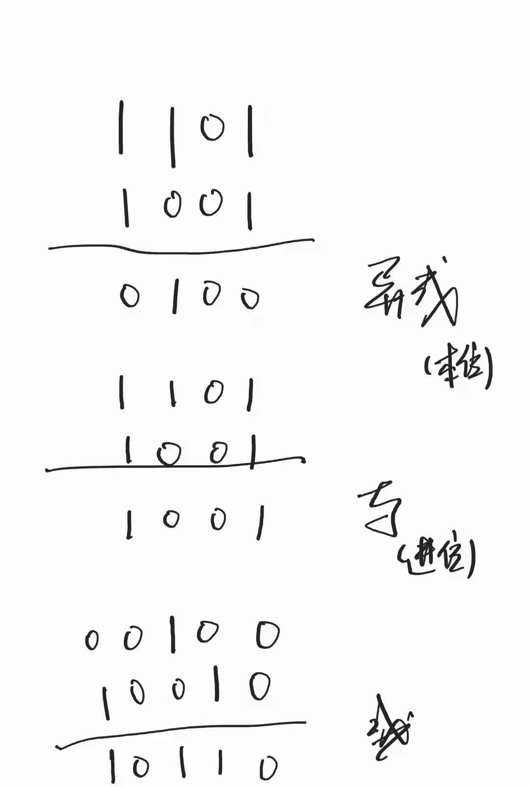
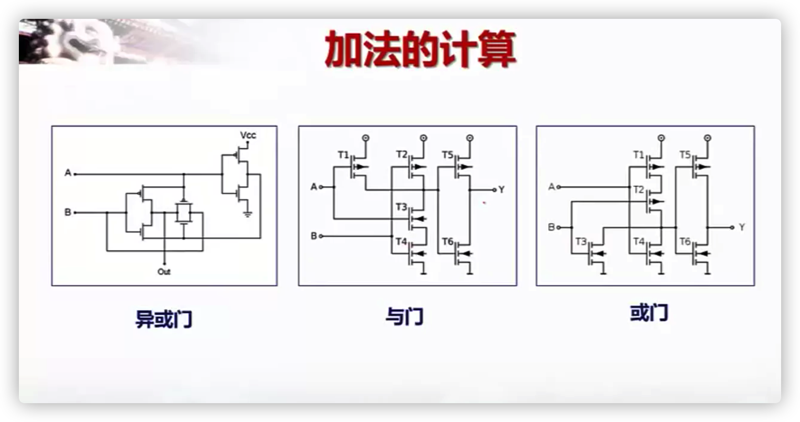

学习内容

- https://www.coursera.org/learn/jisuanji-biancheng/lecture/ngJK4/shu-de-er-jin-zhi-biao-shi

总结：计算机的核心功能就是计算数据，那么如何实现：

1. 首先要表示存储数据

   计算机中用二进制表示数据，原因：电子只有正、负之分，刚好可以利用方便得表示二进制1、0

2. 其次再数据运算

   利用布尔运算理论、使用电路组合，完成基础运算

   

   比如 A等于1101，B等于1001，把这两个数相加

   使用异或运算计算本位、与运算计算进位，两者结果进行或运算就可以得出相加结果

   

   

   