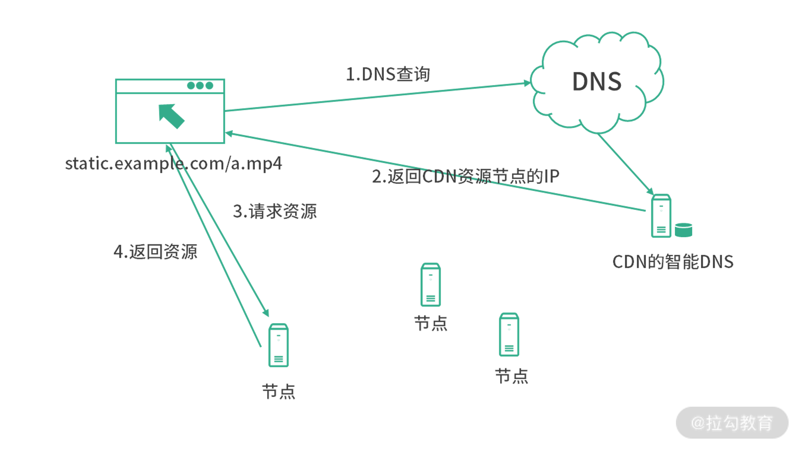
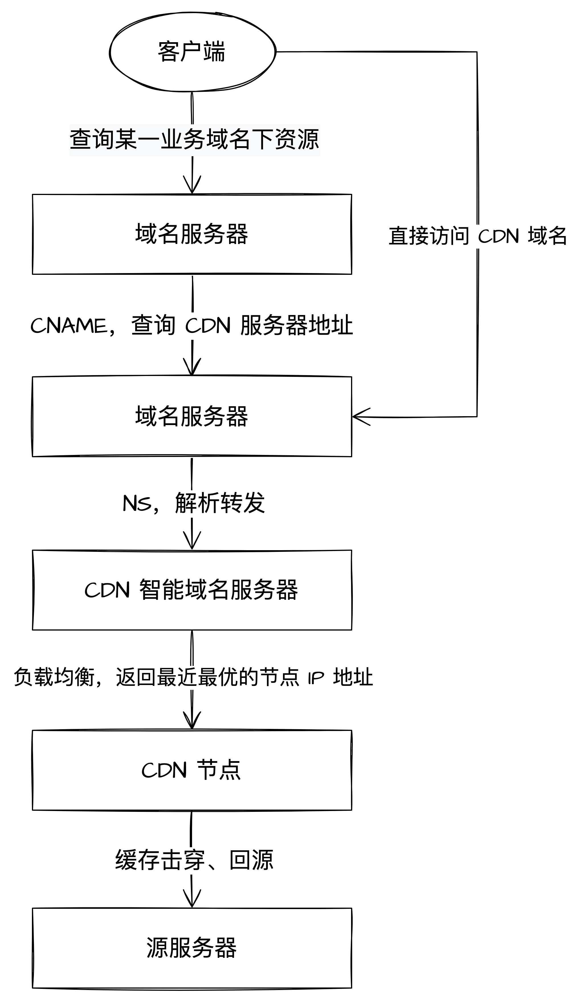

# CDN

CDN，内容分发网络（Content Dilivery Network，CDN）是一个专门用来分发静态内容的分布式应用。通过部署各地网络节点，根据**就近原则**让不同地域的用户可以就近获取内容，从而达到加速访问的效果。

  

CDN 的核心技术组成有两块：

- 智能 DNS 负载均衡：在 CDN 专网中挑选出一个“最佳”节点提供服务
- 缓存系统及回源：缓存资源、提高命中率，缓存丢失失效则回到源站重新获取并缓存

> 命中率：互联网上的资源是无穷无尽的，不管 CDN 厂商有多大的实力，也不可能把所有资源都缓存起来。所以，缓存系统只能有选择地缓存那些最常用的那些资源。

CDN 资源访问流程：

  

1. 当用户访问某个业务域名下的静态资源的时候，首先会触发域名系统的解析
   1. 域名系统发现 CNAME 记录后重新解析厂家的 CDN 的域名（CDN 厂商会提供 CDN 域名给你，通常我们需要将自己的业务域名 CNAME 到厂商的 CDN 域名）
   2. 解析  CDN 域名时，域名系统发现是 NS 记录，将 CDN 的域名解析请求会发送至厂家的 CDN 智能域名系统
2. CDN 智能域名系统返回最近节点的 IP 地址
3. 用户端根据 IP 地址发起节点请求资源
4. 若有缓存则直接返回，否则回源请求并重新缓存返回给客户端

上图的流程结构如下：

  

## CDN 演变发展

CDN 如今不止加速静态资源，还有以下等功能：

- 内容优化：数据压缩、图片格式转换、视频转码等
- 边缘计算
- 动态加速：对动态资源进行回源访问加速
  - 智能 DNS 能得到离用户最近的边缘节点，边缘节点到中心节点到源站一般有高速专有线路连接，或者是动态路径优化，所以动态资源回源要比通过公网速度快很多

## 参考

- 拉钩《计算机网络通关 29 讲》
- 极客《透视 HTTP 协议》