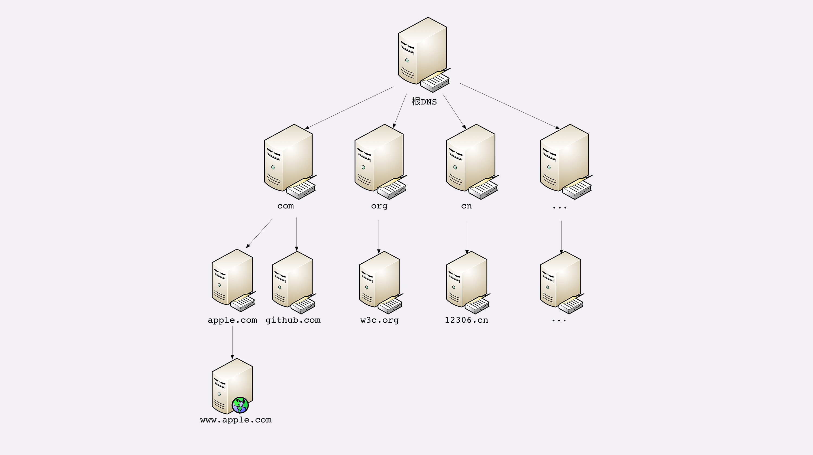
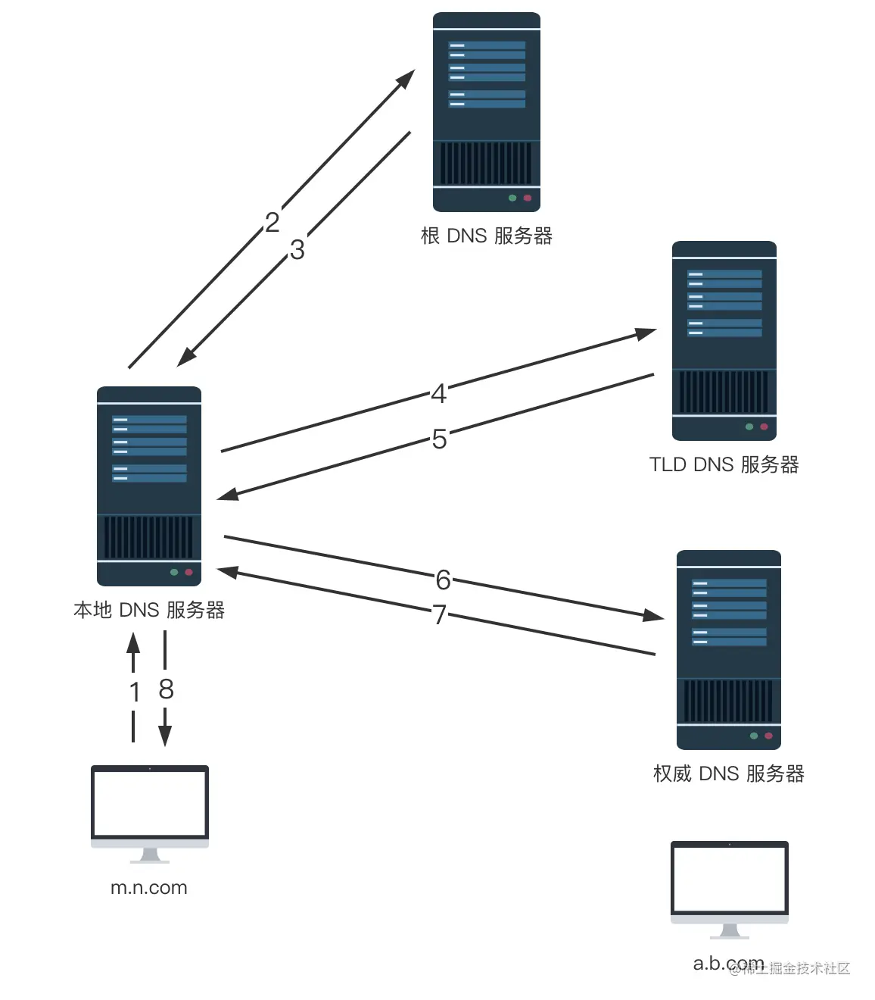

# DNS

- DNS
  - [DNS 架构](#dns-架构)
  - [DNS 记录](#dns-记录)
  - [DNS 查询过程](#dns-查询过程)
  - 应用场景
    - 域名解析
    - 基于 DNS 负载均衡
    - 同一个 IP 地址上运行多个服务

## DNS 架构

DNS（Domain Name System，域名系统）是一个将域名和 IP 地址相互映射，提供分布式存储查找服务，其核心是一个分层结构：

1. 根域名服务器（Root DNS Server）：管理顶级域名服务器，返回“com”“net”“cn”等顶级域名服务器的 IP 地址；
2. 顶级域名服务器（Top-level DNS Server）：管理各自域名下的权威域名服务器，比如 com 顶级域名服务器可以返回 apple.com 域名服务器的 IP 地址；
3. 权威域名服务器（Authoritative DNS Server）：由它管理并返回自己域名下主机的 IP 地址
4. 本地域名服务器/ DNS 递归服务器（操作系统、路由器中的 DNS 缓存、小区的 DNS 服务器、ISP 的 DNS 服务器等）

  

## DNS 记录

```
; 定义www.example.com的ip地址
www.example.com.     IN     A     139.18.28.5;
```

`www.example.com` 是要解析的域名。A 是记录的类型，A 记录代表着这是一条用于解析 IPv4 地址的记录。

- DNS 记录类型
  - A：IPv4 地址记录
  - AAAA：IPv6 地址记录
  - CNAME：域名别名，作用是将一个域名映射到另一个域名
    - 域名解析的时候，如果看到 CNAME 记录，则会从映射目标重新开始查询
    - CNAME 记录必须指向另一个域名，而不能是IP地址
  - MX：邮箱记录
  - NS：DNS 服务器记录，指定到其他域名服务器查询

## DNS 查询过程

我们平常请求查询的 DNS 服务器，一般都是指递归 DNS 服务器。它把分步骤的查询过程（根级 DNS > 顶级 DNS > 权威 DNS）自动化，方便用户一次性得到结果，所以它称为递归 DNS 服务器（recursive DNS server），即可以自动递归查询。所以我们只要向它查询就可以了。

我们在浏览器中输入域名时，整条 DNS 查询链路如下：浏览器缓存 > 操作系统 host 文件 > 递归服务器（比如网络服务商搭建的 DNS 服务器）> 核心 DNS 服务器（ 根级 DNS > 顶级 DNS > 权威 DNS）

整条链路中都存在缓存，经过层层的缓存，最终命中根 DNS 服务、顶级 DNS 服务器以及权威 DNS 服务的请求少之又少。

比如整个的查询过程如下：

1. 客户端向其本地域名服务器发起域名查询，如果存在记录则直接返回结果
2. 否则，本地域名服务器代替客户端向根域名服务器发起查询，得到顶级域名服务器的 IP 地址
3. 本地域名服务器向顶级域名服务器发起查询，得到权威 DNS 服务器的 IP 地址。
4. 本地域名服务器向权威域名服务器发起查询，得到查询的主机 A 记录。
5. 本地 DNS 服务器缓存 DNS 记录并返回给客户端

  

## 参考

- [DNS 查询原理详解](https://www.ruanyifeng.com/blog/2022/08/dns-query.html)
- 极客《透视 HTTP 协议》
- 拉钩《计算机网络通关 29 讲》