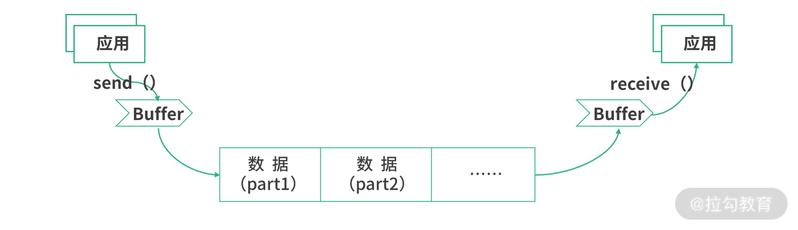
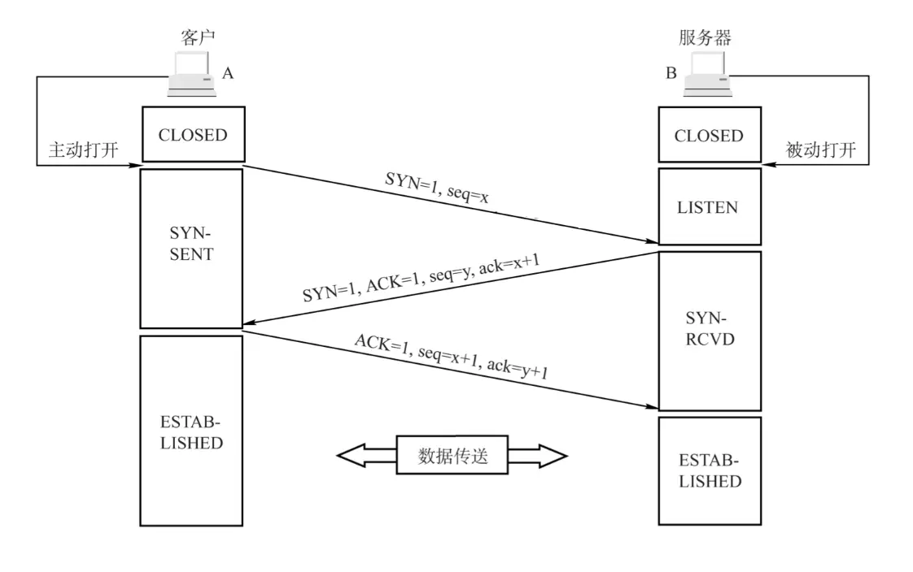
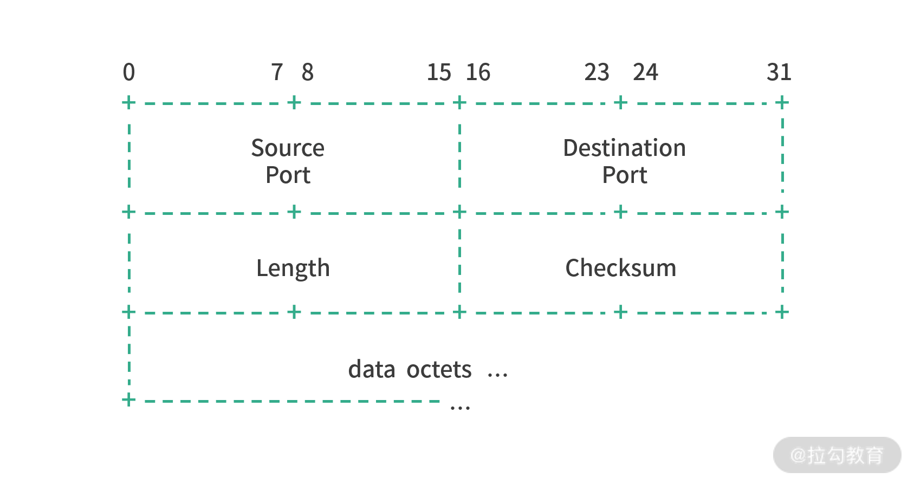

# TCP & UDP

- TCP
  - TCP（Transport Control Protocol）
    - 是一个面向连接、可靠的、基于字节流的传输层通信协议
      - **面向连接**：是一种一对一、端对端的通信行为。通信双方需要在数据传输之前，建立一个连接，具体来说就是数据收发双方的内存中都建立一个用于维护数据传输状态的对象，比如双方 IP 和端口是多少？现在发送了多少数据了？状态健康吗？传输速度如何？等。所以，**连接是网络行为状态的记录**
      - **可靠性**：保证数据无损地到达目的地
        - 全双工
        - 请求/响应的模型
        - 滑动窗口
          - 容错机制
          - 接收方状态
        - 拥塞控制
      - 基于字节流：保证数据有序接收
      - **稳定性**：提升吞吐量、降低延迟、减少丢包率
  - TCP 协议的运作机制
    - TCP 的拆包和粘包
    - TCP 封包结构
    - 流速控制：滑动窗口

## TCP 协议的运作机制

- TCP 为什么不一次发送完所有的数据？
  - 为了稳定性，一次发送的数据越多，出错的概率越大
  - 为了效率，网络中有时候存在着并行的路径，拆分数据包就能更好地利用这些并行的路径
  - 为了系统实时性：因为大量的应用频繁地通过网卡收发数据，网卡只能一个一个处理应用的请求。当网卡忙不过来的时候，数据就需要排队，也就是将数据放入**缓冲区**。如果每个应用都随意发送很大的数据，可能导致其他应用实时性遭到破坏  
- TCP 可靠性，即使数据无损送达：（尽可能）防止丢包
  - 请求/响应模型
    - TCP 中每个发送的请求都需要响应。如果一个请求没有收到响应，发送方就会认为这次发送出现了故障，会触发重发。
  - 丢包重传
- 成本效益？如何提升吞吐量、降低延迟？
  - 单工模式的请求/响应模型 => 效益低
  -   
- 为了提高传输速率，TCP 协议是并行收发将多个 [TCP 段](#tcp-封包结构)
  - **拆包**：即将数据拆分成多个 TCP 段传输，到目的后后再进行重组
  - **粘包**：如果一个 TCP 段太小，为了防止多次发送占用资源，TCP 协议有可能将它们合并成一个 TCP 段发送，在目的地再还原成多个数据
- 接收端如何数据重组：Sequence Number 和 Acknowledgement Number
  - Sequence Number：代表着数据拆分成段的序号，接收数据的时候，虽然得到的是乱序的 TCP 段，但是可以通过 Seq 进行排序重组

## TCP 报文格式

```
 0                   1                   2                   3   
 0 1 2 3 4 5 6 7 8 9 0 1 2 3 4 5 6 7 8 9 0 1 2 3 4 5 6 7 8 9 0 1 
+-+-+-+-+-+-+-+-+-+-+-+-+-+-+-+-+-+-+-+-+-+-+-+-+-+-+-+-+-+-+-+-+
|          Source Port          |       Destination Port        |
+-+-+-+-+-+-+-+-+-+-+-+-+-+-+-+-+-+-+-+-+-+-+-+-+-+-+-+-+-+-+-+-+
|                        Sequence Number                        |
+-+-+-+-+-+-+-+-+-+-+-+-+-+-+-+-+-+-+-+-+-+-+-+-+-+-+-+-+-+-+-+-+
|                    Acknowledgment Number                      |
+-+-+-+-+-+-+-+-+-+-+-+-+-+-+-+-+-+-+-+-+-+-+-+-+-+-+-+-+-+-+-+-+
|  Data |           |U|A|P|R|S|F|                               |
| Offset| Reserved  |R|C|S|S|Y|I|            Window             |
|       |           |G|K|H|T|N|N|                               |
+-+-+-+-+-+-+-+-+-+-+-+-+-+-+-+-+-+-+-+-+-+-+-+-+-+-+-+-+-+-+-+-+
|           Checksum            |         Urgent Pointer        |
+-+-+-+-+-+-+-+-+-+-+-+-+-+-+-+-+-+-+-+-+-+-+-+-+-+-+-+-+-+-+-+-+
|                    Options                    |    Padding    |
+-+-+-+-+-+-+-+-+-+-+-+-+-+-+-+-+-+-+-+-+-+-+-+-+-+-+-+-+-+-+-+-+
|                             data                              |
+-+-+-+-+-+-+-+-+-+-+-+-+-+-+-+-+-+-+-+-+-+-+-+-+-+-+-+-+-+-+-+-+
```

- 序号(seq)：用于重组时排序 TCP 包
  - 序号实际上是字节数
  - 例如，一报文段的序号是 101，共有 100 字节的数据。这就表明：本报文段的数据的第一个字节的序号是 101，最后一个字节的序号是 200。显然，下一个报文段的数据序号应当从 201 开始，即下一个报文段的序号字段值应为 201。
- 确认号(ack)：期望收到对方下一个报文段的第一个数据字节的序号，ack = 已接受序号 + 1
- 标志位：用于描述 TCP 段的行为
  - SYN：请求连接
  - FIN：连接终止
  - ACK：表示发来的数据已确认接收无误
  - PSH：数据推送
  - URG：代表这是一个紧急数据
  - RST
- 窗口（Window）：是 TCP 保证稳定性并进行流量控制的工具
- 校验和（Checksum）：用于校验 TCP 段有没有损坏
- 紧急指针（Urgent Pointer）：指向最后一个紧急数据的序号
- 可选项（Options）：中存储了一些可选字段
  - MSS（Maximun Segment Size）：协商控制了 TCP 段的大小
    - TCP 段的大小（MSS）涉及发送、接收缓冲区的大小设置，双方实际发送接收封包的大小，对拆包和粘包的过程有指导作用，因此需要双方去协商。如果这个字段设置得非常大，就会带来一些影响。
- 填充（Padding）：Options 的长度不固定，需要 Pading 进行对齐

### 滑动窗口

- 滑动窗口
  - 流量控制
  - 拥塞控制

- 在发送前，双方要协商好发送的速率（窗口大小）
- 数据拆包、粘包
- 流速控制：滑动窗口
  - **发送、接收窗口的大小可以用来控制 TCP 协议的流速**。窗口越大，同时可以发送、接收的数据就越多，支持的吞吐量也就越大。当然，窗口越大，如果数据发生错误，损失也就越大，因为需要重传越多的数据。

## 三次握手建立连接

- 握手目的
  - 同步 Sequence 序列号
    - 初始序列号 ISN (Initial Sequence Number)
      - 每个连接每个端都将具有不同的 ISN。如果 ISN 是固定的，攻击者很容易猜出后续的确认号，因此 ISN 是动态生成的。
  - 交换 TCP 通讯参数
    - 如 MSS、

  

### 为什么需要第三次握手？

三次握手的其中一个重要功能是客户端和服务端交换 ISN(Initial Sequence Number)建立状态，以便让对方知道接下来接收数据的时候如何按序列号组装数据。


- 建立连接的时候，连接双方都需要向对方发送 SYC（同步请求）去交互初始序号
- 由于 TCP 可靠性基于请求-应答模式，无论哪一方收到数据后，都需要给发送方一个 ACK（Acknowledgement）响应。
- 而且握手阶段双方都没有烦琐的工作，因此一方向另一方发起同步（SYN）之后，另一方可以将自己的 ACK 和 SYN 打包作为一条消息回复

## 四次挥手：断开连接

  

其中第四次挥手后，客户端需要经过时间等待计时器设置的时间 2MSL（一个报文的来回时间） 后才会进入 CLOSED 状态（这样做的目的是确保服务端收到自己的 ACK 报文。如果服务端在规定时间内没有收到客户端发来的 ACK 报文的话，服务端会重新发送 FIN 报文给客户端，客户端再次收到 FIN 报文之后，就知道之前的 ACK 报文丢失了，然后再次发送 ACK 报文给服务端）。服务端收到 ACK 报文之后，就关闭连接了，处于 CLOSED 状态。

### 为什么四次挥手

1. 当你收到 FIN 报文时，基于可靠性要求，无论是哪方收到消息后，都需要给发送方一个 ACK（Acknowledgement）响应。如果一个请求没有响应，发送方可能会认为自己需要重发这个请求
2. 因为 TCP 是全双工通信的，当你收到 FIN 报文仅仅意味着对方不会再发送数据，但是可以继续接受数据，当你也发送 FIN 报文时才意味着连接可以断开
3. 断开连接需要资源释放处理，因此断开连接不能像握手那样操作将两条消息合并发送

## 数据传输与MSS分段

## 重传与应答机制

## UDP

UDP（User Datagram Protocol）是面向用户数据报文的协议，目标是在传输层提供直接发送报文（Datagram）的能力。Datagram 是数据传输的最小单位。UDP 协议不会帮助拆分数据，它的目标只有一个，就是发送报文。

### UDP 的封包格式

  

- Checksum 是校验和，作用是检查封包是否出错。如果一个数据封包 Datagram 发生了数据损坏，UDP 可以通过 Checksum 纠错或者修复。

## 参考

- [关于 TCP 三次握手和四次挥手，满分回答在此](https://segmentfault.com/a/1190000039165592)