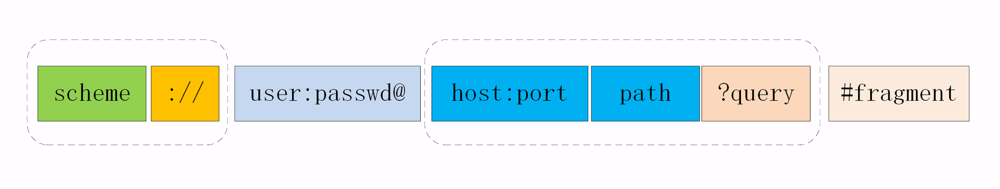
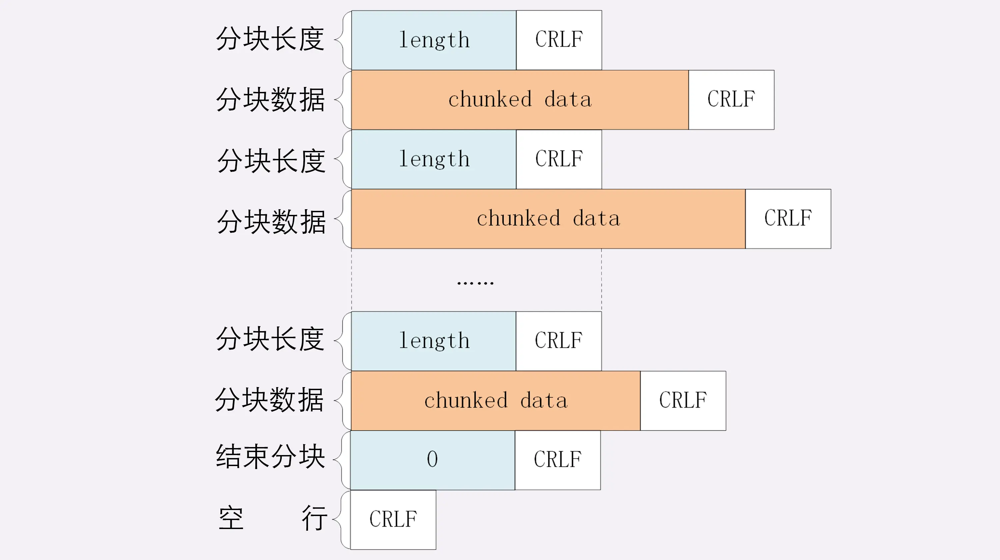
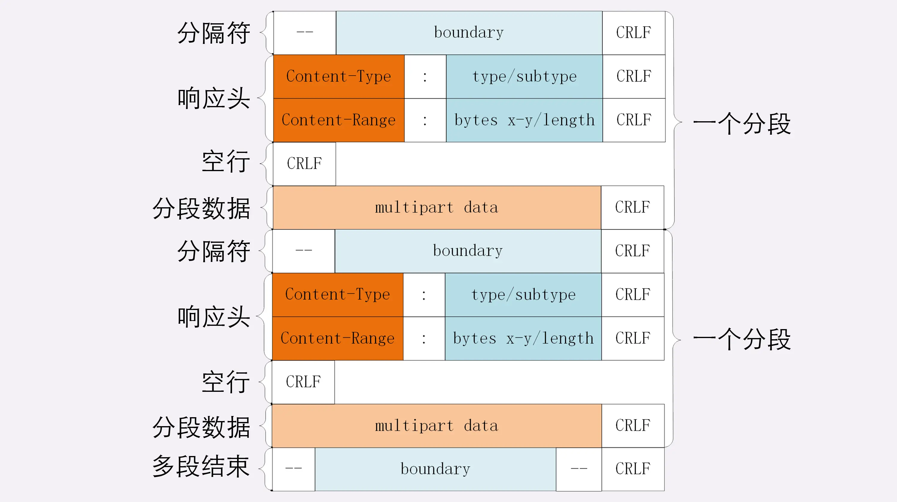
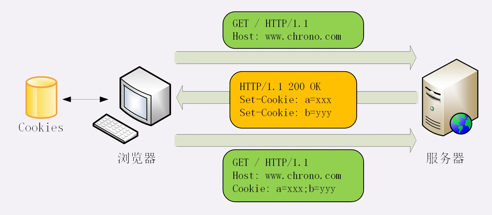
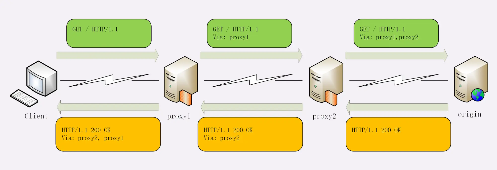

# 开发必知的 HTTP 基础

## HTTP 特点

- HTTP 特点
  - 请求-响应模式
  - 灵活、易于扩展
    - 只规定了报文的基本格式，比如用空格分隔单词，用换行分隔字段，“header+body”等，报文里的各个组成部分都没有做严格的语法语义限制，可以由开发者任意定制。  
    - 不限制具体的下层协议，不仅可以使用 TCP、UNIX Domain Socket，还可以使用 SSL/TLS，甚至是基于 UDP 的 QUIC，**下层可以随意变化，而上层的语义则始终保持稳定**。
  - 无状态
    > 实现上不需要额外的资源来记录状态信息，减轻服务器的负担，能够把更多的 CPU 和内存用来对外提供服务。  
    > 而且，“无状态”也表示服务器都是相同的，没有“状态”的差异，可以轻松实现集群化，让负载均衡把请求转发到任意一台服务器，扩展性能
  - 可靠性，保证数据文件完整性到达，“可靠”只是向使用者提供了一个“承诺”，会在下层用多种手段“尽量”保证数据的完整送达
  - 缺点
    - 明文传输，数据完全肉眼可见，能够方便地研究分析
    - 不安全的，无法验证通信双方的身份，也不能判断报文是否被篡改


- HTTP 所谓的“无状态协议”，这里的状态不是指**会话状态**，而是指的是**通信协议层面的状态**（大多数人容易混淆，而且也跟 Cookies、Session 这些都没有什么大的联系，只不过我们平时会使用它们是去实现应用会话状态）
- 为什么说HTTP是无状态的协议呢？因为它的每个请求都是完全独立的，每个请求包含了处理这个请求所需的完整的数据，发送请求不涉及到状态变更
  - 无状态协议优点：会话状态与连接解耦，如果连接意外断开，整个会话就会丢失，重新连接之后一般需要从头开始
  - 无状态协议的主要缺点在于，单个请求需要的所有信息都必须要包含在请求中一次发送到服务端，这导致单个消息的结构需要比较复杂，必须能够支持大量元数据，因此HTTP消息的解析要比其他许多协议都要复杂得多
- 但 HTTP/2 应该算是一个有状态的协议了，因为有流控，所以以后说“HTTP是无状态的协议”就不太对了，最好说“HTTP 1.x是无状态的协议”
- Cookies/Session的作用是创建和维护多组独立的状态，而不是有状态。这个状态指的是后端服务的状态，而非HTTP协议本身的状态。所以说，HTTP协议是无状态的协议，这个其实跟服务的状态是无关的。一个服务不管使用何种协议，都可以在服务层面上是有状态的，因为这和通信协议无关，只需要它在响应请求时改变自己的状态即可


## HTTP 协议格式

```
请求行（请求方法、请求的路径、协议版本）
请求头（用冒号分隔的名称和值）
/空行/
请求体

响应行（协议版本、状态码、状态文本）
响应头（用冒号分隔的名称和值）
/空行/
响应体
```

## URI 

统一资源标识符，区分资源

URI 的完整格式：

  

- Scheme 部分代表协议，不只有 https，还有 ftp、ssh 等。不同协议代表着不同类型的应用在提供资源。
- Host 部分代表站点，我们今天介绍的 DNS 主要作用就是根据 Host 查找 IP 地址。
- Port 是端口，代表提供服务的应用。
- Path 是路径，代表资源在服务中的路径。
- Query 是查询条件，代表需要的是资源中的某一个部分。
  - 由多个“key=value”组成的字符串，这些 KV 值用字符“&”连接
- Fragment 是二级查询条件，通常不在服务端响应，而是用于前端展示定位内容。

URI 的编码：把非 ASCII 码或特殊字符转换成十六进制字节值，然后前面再加上一个“%”。例如，空格被转义成“%20”。

## 请求方法

- GET：获取资源
- POST：提交资源
- PATCH：差量修改数据
- PUT：全量修改数据
- DELETE：删除资源
- HEAD：获取资源的元信息，HEAD 则是跟 GET 类似，但只返回响应头（想象一个业务情景：欲判断某个资源是否存在，我们通常使用GET，但这里用HEAD则意义更加明确。）
- CONNECT：建立连接隧道，这时 Web服务器充当代理的角色，多用于 HTTPS 和 WebSocket
- OPTIONS：显示服务器对访问资源支持的方法，在响应头 `Allow` 字段里返回，常用于CORS 跨域资源共享 
- TRACE：回显服务器收到的请求，用于定位问题

## 状态码

- 1xx：提示信息，表示目前是协议处理的中间状态，还需要后续的操作
  - 101 切换请求协议，从 HTTP 切换到 WebSocket
- 2xx：请求处理成功
  - 200：请求成功
  - 204：请求成功，但没有返回任何内容
  - 206：分块传输
- 3xx: 重定向，表示客户端请求的资源发生了变动，需要重新请求
  - 301：永久性重定向
  - 302：临时性重定向
  - 304：资源未被修改，客户端重定向缓存
- 4xx：客户端错误，表示请求报文有误，服务器无法处理
  - 400：请求参数错误
  - 401：未授权，请求要求身份验证
  - 403：禁止访问
  - 404：表示请求资源不存在
  - 405：请求方法错误
- 5xx：表示服务器端错误
  - 500：服务端错误
  - 503：服务端暂时性错误或者繁忙，稍后再试
  - 504：网关超时

## 请求头、响应头常见字段

  

  


# 常用 http head 字段总结

- 内容协商
- 传输控制
  - 长连接
  - 分块
  - 重定向
- 缓存

## 内容协商相关

资源类型、压缩编码、语言、字符集

  

1. 数据类型表示实体数据的内容是什么，使用的是 MIME type，相关的头字段是 Accept 和 Content-Type；
2. 数据编码表示实体数据的压缩方式，相关的头字段是 Accept-Encoding 和 Content-Encoding；
3. 语言类型表示实体数据的自然语言，相关的头字段是 Accept-Language 和 Content-Language；
4. 字符集表示实体数据的编码方式，相关的头字段是 Accept-Charset 和 Content-Type；
5. 客户端需要在请求头里使用 Accept 等头字段与服务器进行“内容协商”，要求服务器返回最合适的数据；
6. Accept 等头字段可以用“,”顺序列出多个可能的选项，还可以用“;q=”参数来精确指定权重。
   > 例如，Accept: text/html,application/xml;q=0.9,*/*;q=0.8  
   > 在http 中，“;”的意义是小于“,”

Accept-* 只用于请求中  
Content-* 是实体字段，所以请求和响应里都可以用，作用是指明body数据的类型。(例如，post 请求含有 body 数据)

> tip💡：如果返回 content-type:"octet-stream"，表示不透明的数据流，浏览器不认识这个图片了，转而会下载这个文件

## 大文件分片传输相关

- 数据压缩
- 分块传输
- 分段请求
  - 多段数据

> 这几种方式可以混合起来使用，例如压缩后再分块传输，或者分段后再分块。

### 分块传输

分块传输可以流式收发数据，节约内存和带宽，使用响应头字段**Transfer-Encoding: chunked** 来表示。

“Transfer-Encoding: chunked”和“Content-Length”这两个字段是互斥的，也就是说响应报文里这两个字段不能同时出现，一个响应报文的传输要么是长度已知，要么是长度未知（chunked）。

响应体格式：

  

### 分段请求
范围请求可以只获取部分数据，即“分块请求”，实现视频拖拽或者断点续传.

- 客户端、请求头、字段、**Range: bytes=x-y**：请求范围。
- 服务器、响应头、字段、**Accept-Ranges: bytes**：明确告知客户端：“我是支持范围请求的”。

> tip💡：range是针对原文件的，即使文件在传输过程中被压缩。

假设文件是 100 个字节，那么：
- “0-”表示从文档起点到文档终点，相当于“0-99”，即整个文件；
- “10-”是从第 10 个字节开始到文档末尾，相当于“10-99”；
- “-1”是文档的最后一个字节，相当于“99-99”；
- “-10”是从文档末尾倒数 10 个字节，相当于“90-99”。

服务器要添加一个响应头字段 **Content-Range: bytes x-y/length**，表示片段的实际偏移量和资源的总大小。

#### 多端请求
- 客户端、请求头、字段、**Range: bytes=x-y, x-y, ...**：多个范围请求。
- 服务器、响应头、字段、**Content-Type: multipart/byteranges; boundary=xxx**：明确告知客户端：“我是支持范围请求的”。

响应体格式：

  

## 连接管理

### 长连接（keep-alive）

长连接，也就是持久连接、连接复用。

- 开启
  - 客户端可以在请求头里显示指定字段 **Connection: keep-alive**，明确地要求使用长连接机制（http/1.0 中是默认关闭，http/1.1 默认开启）
  - 如果服务器支持长连接，它总会在响应报文里放一个“Connection: keep-alive”字段
- 关闭
  - 在客户端，可以在请求头里加上“Connection: close” 字段，主动指示服务端
  - 服务器端通常不会主动关闭连接，但服务端也使用一些关闭策略
    > nginx 为例：
    > 1. 使用“keepalive_timeout”指令，设置长连接的超时时间
    > 2. 使用“keepalive_requests”指令，设置长连接上可发送的最大请求次数  

### 重定向

重定向，由服务器来发起的，浏览器使用者无法控制，相对地就可以称为“被动跳转”。

浏览器收到 301/302 报文，会根据响应头的 **Location** 进行跳转。
非绝对的 URI 会根据当前请求去拼出完整的 URI，如果是站外第三方，建议使用绝对的 URI。

301/302 是最常用的重定向状态码，分别是“永久重定向”和“临时重定向”。

## Cookie 机制

HTTP 是“无状态”的？

Cookie 技术，就相似给客户端贴上小纸条，上面写了一些只有服务器才能理解的数据，需要的时候客户端把这些信息发给服务器，服务器看到 Cookie，就能够认出对方是谁了。

Cookie 机制的工作流程：

  

1. **Set-Cookie** 在客户端设置 cookie 信息
2. 服务端通过 **Cookie** 字段获取 cookie 信息

服务器可以在响应头里添加一个甚至多个 Set-Cookie，存储多个“key=value”。但浏览器这边发送时不需要用多个 Cookie 字段，只要在一行里用“;”隔开就行。

## 代理相关

- Via
- X-Forwarded-For
- X-Real-IP

**Via** 是一个通用字段，请求头或响应头里都可以出现。每当报文经过一个代理节点，代理服务器就会把自身的信息追加到字段的末尾,追加的是代理主机名（或者域名）。

  

**X-Forwarded-For**，字面意思是“为谁而转发”，形式上和“Via”差不多，追加的是请求方的 IP 地址。

**X-Real-IP**，相当于是“X-Forwarded-For”的简化版，是记录客户端 IP 地址，没有中间的代理信息。

### 代理协议

通过“X-Forwarded-For”操作代理信息必须要解析 HTTP 报文头，这对于代理来说成本比较高，原本只需要简单地转发消息就好，而现在却必须要费力解析数据再修改数据，会降低代理的转发性能；“X-Forwarded-For” 等头必须要修改原始报文，而有些情况下是不允许甚至不可能的（比如使用 HTTPS 通信被加密）

“代理协议” 虽然不是 RFC 标准，但也是一个“事实标准”，被广泛采用。

“代理协议”有 v1 和 v2 两个版本，v1 和 HTTP 差不多，也是明文，而 v2 是二进制格式。今天只介绍比较好理解的 v1，它在 HTTP 报文前增加了一行 ASCII 码文本，相当于又多了一个头。

`PROXY [TCP4|TCP6] 请求方地址、应答方地址、请求方端口号、应答方端口号`

```
PROXY TCP4 1.1.1.1 2.2.2.2 55555 80\r\n
GET / HTTP/1.1\r\n
Host: www.xxx.com\r\n
\r\n
```

## HTTP 缓存

[HTTP 缓存](./HTTP%20缓存.md)