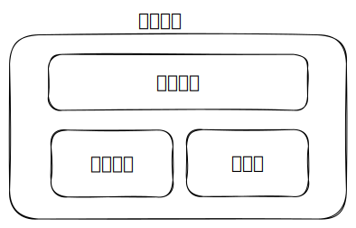
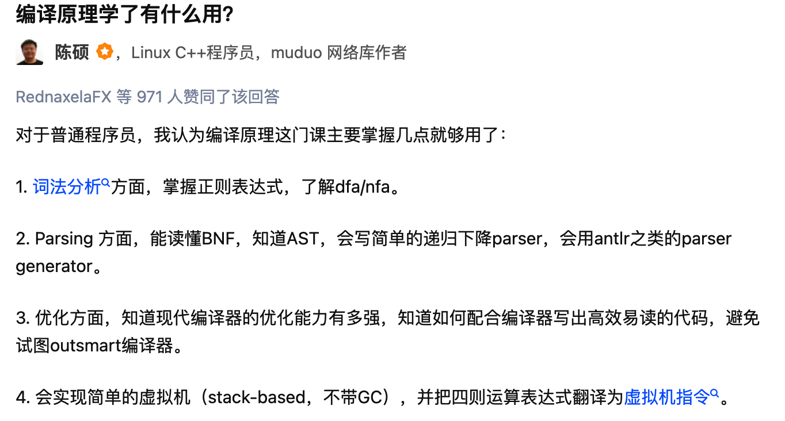

- 编程语言实现  
  
  - 语言特性设计
    - 类型系统
    - 编程范式
      - 面向过程编程
      - 面向对象编程
      - 函数式编程
    - 元编程
  - 运行时实现
    - 虚拟机技术
    - 内存管理
  - 编译原理技术
    - 前端
      - 词法分析/scanning => Tokens
        - Token 分类
          - 关键字
          - 标识符
          - 分隔符
          - 运算符
          - 字面量
          - 注释
          - 空白符
      - 语法分析/parse => 抽象语法树（Abstract Syntax Tree: AST）
        - 通过语法分析出表达式和语句，并构成语法树结构
        - 表达式及运算符
          - 自增自减
          - 算术
          - 比较
          - 逻辑
          - 位运算
          - 三元
          - 关系
        - 语句
          - 声明
          - 赋值
          - 跳转
            - 循环
            - 分支
          - 调用
      - 语义分析
        - 声明绑定、作用域检查
        - 类型检查
    - 中间表示/IR：是编译器中用于表示程序的中间形式，共享 IR 可便于跨平台
    - 后端
      - 代码优化
      - 目标代码生成
        - 机器码
        - 汇编
        - 字节码
      - 汇编器（Assembler）：将汇编代码转换为可执行的机器码
    - 运行机制
      - 转译型：转译成其他语言，再执行该语言
      - 解释型：解释器解释执行
        - AST 解释器
        - 字节码虚拟机
      - 编译型：生成可执行文件





- 词法分析
  - 词法规则定义
    - 正则表达式（正则文法（Formal Grammar））来描述词法（PS，语法规则使用的是上下文无关文法（Context-free Gammar，CFG））
      ```txt
      Identifier: [a-zA-Z_][a-zA-Z0-9_]*
      DecimalLiteral: IntegerLiteral '.' [0-9]* 
                    | '.' [0-9]+
                    | IntegerLiteral 
                    ;
      IntegerLiteral: '0' | [1-9] [0-9]* ;
      ```
  - 依次匹配不同的词法规则 + 递归下降算法
    ```py
    while (!EOF){
      跳过空白字符；
      如果是注释，丢弃掉；
      尝试匹配词法规则1；
      不成功，则回溯，尝试匹配词法规则2；
      不成功，则回溯，尝试匹配词法规则3；
      ...
      直到成功匹配一个词法规则；
    }
    ```
    - 做词法分析的一个最佳实践，就是先把标识符和关键字统一提取出来，然后再从里面把关键字单独提取出来就行了
  - 预读 + 有限自动机（Finite-State Automata，FSA）：提升词法分析性能
    - 如果一个有限自动机针对每个输入，都会发生一次确定的迁移，这种有限自动机就被叫做确定性有限自动机（Determinisitic Finite-State Automata, DFA）。
    - 非确定性的有限自动机（Non-deterministic Finite-State Automata，NFA）：针对一个输入可能会迁移到不止一个状态，或者在没有任何输入的情况下，也会从一个状态迁移到另一个状态
- 词法规则跟上一节学过的语法规则没什么不同嘛，只不过词法的构成要素是字符，而语法的构成要素是 Token
- 语法分析
  - 写出语法规则，比如说用 **EBNF** 格式来表达语法规则
    ```txt
    prog = (functionDecl | functionCall)* ;
    functionDecl: "function" Identifier "(" ")"  functionBody;
    functionBody : '{' functionCall* '}' ;
    functionCall : Identifier '(' parameterList? ')' ;
    parameterList : StringLiteral (',' StringLiteral)* ;
    ```
  - 根据语法规则，分别匹配每个子元素
  - 如果一条语法规则可能有多个展开方式，也要依次尝试去匹配
  - 如果这个语法规则中用到了另一个语法规则，那么我们就需要递归地匹配这条语法规则（递归下降算法）。
    - 提升语法分析性能
      - 预读 
        - 有限自动机（Finite-State Automata，FSA）
        - LL(1) 算法
          - LL(1) 中的 1，意思是需要预读一个 Token
          - 把（表达式）语句所有可能出现的第一个 Token 的集合，叫做 First 集合
          - 对于 statement 来说，我们可以求出每个子规则的 First 集合，只要所有的这些集合都没有交集，那么我们总是可以通过预读一个 Token 来决定采用哪条子规则的
          - Follow 集合
          - 完整的 LL 算法，需要用到每个语法规则的 First 和 Follow 集合，来确定我们应该采用哪个子规则的分支，从而避免回溯，实现性能上的提