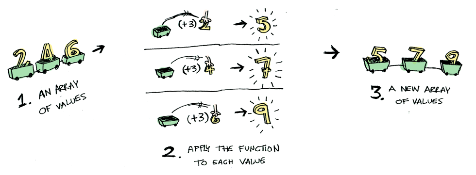

# 函数式编程

- 函数式编程
  - 函数式编程来自 λ 演算法
    - lambda演算，规则非常简单，只有三条
      - `<表达式>::= <标识符>`
      - `<表达式>::= (λ<标识符>.<表达式>)`
      - `<表达式>::= (<表达式> <表达式>)`
  - 特征
    - 函数式编程元素就是函数，**函数是一等公民**
    - **纯函数**：函数式编程中的函数指的是**数学**中的函数
      - 给定同样的输入有且只有唯一的输出
      - **不可变**
        - **无状态**：变量一旦初始化之后就不再改变，也就是没有赋值，意味着数据不可变(immutable)。纯函数式编程语言中的变量不是命令式编程语言中的变量，即存储状态的单元，而是代数中的变量，即**某个符号所对应的值是永远不变的**
          - 如何做到不可变？
            - 在实际上要实现不可变，对于可变变量值的操作并不是修改原来的值，而是修改**复制**新产生的值，原来的值保持不便
            - 如果要使用变量，就使用局部变量
            - 使用语法中不变的修饰符
            - **事件溯源（Event Sourcing）**：把对象的状态每次变化抽象成独立的事件进行保存，对象的状态变化可由一系列事件的调用重现。 编写不变类，无可变化的状态；Event Sourcing记录每一次状态变化
        - **无副作用**：指的是函数不会产生除计算结果以外的事，比如 IO 操作、全局状态修改
    - **组合性**：函数式编程就是把函数当做一个个的构造块，然后将这些函数复合运算起来，构造出一个新的构造块
      - 在函数一等公民下，通过**高阶函数**的方式，接收函数作为输入，返回一个新的函数作为输出。可以用它去做行为的组合
      - 设计可以组合的函数接口，同样也需要**分离关注点**的能力
    - **惰性求值**：惰性求值（Lazy Evaluation）是一种求值策略，它将求值的过程延迟到真正需要这个值的时候
      - Thunk：将把函数的参数看作是个数学上的计算表达式，在真正需要的时候才会计算，相当于带回调参数的函数
      - 定义无穷数据结构，抽象“**数据流**”：由于惰性求值，我们可以抽象构造一个无限长集合，无限长集合中的元素并不是预置进去的，而是在需要的时候才计算出来的。这让我们可以把很多问题抽象化，然后在更高的层面上解决它们。
  - 好处
    - 计算确定性、可预测性、可测试性
    - 并发性：没有共享内存，不会竞争条件
  - 其他技巧及特征
    - 输入
      - 柯里化（Currying）：将一个多参函数，转换成一个依次调用的单参函数
        - 柯里化是为了规范统一函数参数，更好得**适配**函数组合
        - 反柯里化
      - 部分应用函数（Partially Applied Functions）：固定部分的参数，返回一个更少参数的函数
    - 输出
      - 记忆（Memoization）
    - 结构
      - 组合（Compose）：从右往左执行函数列表，为什么组合是反直觉的？因为它是按照传参顺序来排列的，类似 `f(g(x))`
      - 管道（Pipeline）：借鉴于 Unix Shell 的管道操作——把若干个命令串起来，前面命令的输出成为后面命令的输入，如此完成一个流式计算
      - reducer:
      - 集合转换思维
        - map
        - filter
        - reduce
        - 更好表达性
      - composeReducer
      - 递归（recursing）：循环
      - 尾递归优化（tail recursion optimization）：每次递归时都会重用 stack，这样能够提升性能。当然，这需要语言或编译器的支持
    - [函子：Functor、Applicative、Moand](#对象容器functorapplicativemoand)
      - Optional（Maybe Monad）
      - IO Monad：可以用来延迟函数的执行，它的 value 里面存储的是一个函数

## 对象容器：Functor、Moand、Applicative

Functor、Applicative、Moand 都是一种容器对象，本质上是一种设计模式，其实就是包装一个值并且围绕值的一些运算功能。

函子（Functor）：是一个带 map 映射功能的容器，该方法将容器里面的每一个值，映射到另一个容器：

```js
function Just(val) {
    return { map };

    function map(fn) { return Just( fn( val ) ); }
}

const A = Just(3)
const B = A.map(v => v + 2) // Just(5)
```

  

map 也同样可适用于数组数据：

  

应用函子（Applicative）：在 Functor 基础上，能够把一个函数值的函子应用到另一个函子的值上

```js
function Just(val) {
    return { map, ap };

    function map(fn) { return Just( fn( val ) ); }

    function ap(anotherMonad) { return anotherMonad.map( val ); }
}

const A = Just((x, y) => x + y)
const B = Just(2)
A.map(curry( add, 3)).ap(B) // Just(5)
```

  

单子（Monad）：

- 容器对象
- 平铺值:处理嵌套函子
- 链式调用：即通过包装数据并赋予其额外的链式运算能力来简化一系列多步骤的计算

chain 通常又叫做 flatMap 或 bind，它的作用是 flatten 或 unwrap，也就是说它可以展开被 Just 封装的值 val

```js

function Just(val) {
    return { map, chain };
    
    function map(fn) { return Just( fn( val ) ); }
   
    function flatMap(fn) { return fn( val ); }
}
```


- Functor 将一个普通函数应用到被封装的值上
  - 函数的 fmap 其实就是函数复合
- Applicative 将一个封装的函数应用到封装值上
- Monad 将一个 “接受一个普通值并回传一个被封装的值” 的函数应用到一个被封装的值上

实现了 Functor 类型类的数据类型被称为 functor。
实现了 Applicative 类型类的数据类型被称为 applicative。
实现了 Monad 类型类的数据类型被称为 monad。

## 柯里化

```js
// f(a, b, c) => f(a)(b)(c)
function curry(func) {
    return function inner(...args){
        if(args.length >= func.length){
            return func.apply(this, args)
        } else {
            return function(...args2){
                return inner.apply(this, args.concat(args2))
            }
        }
    }
}

function sum(a, b) {
    return a + b
}

let currySum = curry(sum)

console.log('currySum(1)(2)', currySum(1)(2))
console.log('currySum(1, 2)', currySum(1, 2))
```

## 组合

```js
// compose
function compose(...fns) {
  return fns.reduce((fn1, fn2) => (...args) => fn2(fn1(...args)))
}

const add10 = x => x + 10
const mul10 = x => x * 10
const add100 = x => x + 100

// (10 + 100) * 10 + 10 = 1110
compose(add10, mul10, add100)(10)
```

```js
const pipe = (...fns) => (...args) => {
  return fns.reduce((result, next) => {
    return next()
  })
}
```

## 参考

- 极客专栏《软件设计之美》
- [Functors, Applicatives, And Monads In Pictures](https://adit.io/posts/2013-04-17-functors,_applicatives,_and_monads_in_pictures.html)


函数式编程初步
起源于Lambda 演算，我们这里不关心 Lambda 演算的数学逻辑，你只要知道，Lambda 演算和图灵机是等价的，都是那个年代对“计算”这件事探索的结果。

从理论上说，函数式语言也不是通过冯诺伊曼体系结构的机器上运行的，而是通过λ演算来运行的，就是通过变量替换的方式进行，变量替换为其值或表达式，函数也替换为其表达式，并根据运算符进行计算。λ演算是图灵完全（Turing completeness）的，但是大多数情况，函数式程序还是被编译成（冯诺依曼机的）机器语言的指令执行的。


函数式的纯洁性在于对于一个特定的参数，必定存在一个特定的返回值。所以函数式的执行是无关顺序的。
而在现实世界里，很多东西就必须是有顺序的，比如输入输出。于是Haskell决定用monad去模拟这种操作。monad来源于范畴论，他并不解决副作用问题本身，而是对此类问题提供了抽象。