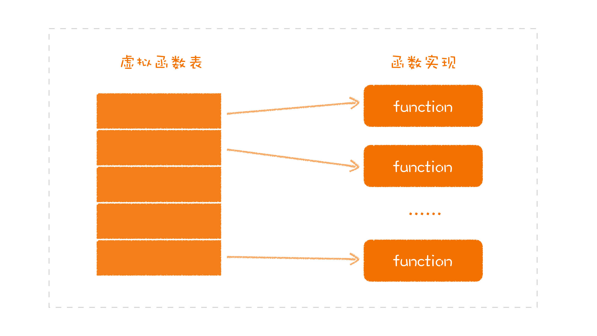

# 面向对象编程  

- 面向对象编程
  - [面向对象及意义](#什么是面向对象及意义)：**封装 + 抽象**
  - 编程特征
    - 封装
      - **隐藏内部数据及实现细节，而对外提供了哪些行为接口**
      - **封装是面向对象的根基**。相比较于结构化编程，面向对象封装则可以设计出一个一个可以**组合**，可以复用的单元。然后通过组合这些单元完成不同的功能。有了封装同时也有了**模块化**的能力，更好得解决了结构化编程下的全局变量、强依赖的问题。同结构化编程相比，面向对象赋予更高角度看待问题的能力。
      - 如何封装：
        - **基于行为进行封装：思考目标对象需要对外提供哪些行为**
        - **不要暴露实现（数据）细节**
        - **最小化接口暴露**
    - [继承](#继承) + [多态：一个接口多种形态](#多态一个接口多种形态)
      - **继承不是一种好的代码复用，组合优于继承**
      - **面向组合编程**：分解需求，将每一个关注点成为一个模块，在需要的时候组装起来
      - **面向接口编程**：通过接口将变的部分和不变的部分隔离开来。
        - 要实现**一个接口多种形态**，需要找出不同事物的共同点，建立起抽象；而找出共同点，前提是要分离关注点
      - 多态的实现不一定要依赖于继承，如[鸭子类型](#鸭子类型多态不一定要依赖于继承)。多态和继承的组合更多是受限于语言局限。
  - 编程模型
    - Class
    - 原型
  - [设计原则及模式](./设计原则及模式.md)

## 什么是面向对象及意义

- 面向对象的核心概念就是**对象**，面向对象面向的是“对象”，而不是类（切勿语言固化），对象本身就是一个**可抽象**的独立个体
- 面向对象带来的思想及意义：**封装 + 抽象**
  - 封装 => 接口 => 抽象 => 可扩展性
    > 封装是面向对象的根基，通过封装明确了**接口**定义，分离了变化，接口即协议，带来了**面向接口编程**原则，这是很多设计原则的基础
    > 多态的实现让程序有了**抽象**的能力，让整个体系能够更好地应对未来的变化，也就是提高了可扩展性。
  - 封装 => **模块化、组合思想** => 可复用性

## 继承

- **继承分类**
  - 实现继承：实现继承是站在子类的视角看问题，从父类实现中继承代码复用
  - 接口继承/类型继承：而继承是一种标记子类型的手段，更多是为了能够类型关联，隐式**向上转型**，实现**多态**

### 实现继承是好的代码复用么？

从实现继承来看父类：父类是干什么用的呢？就是把一些公共代码放进去，之后在实现其他子类时，可以少写一些代码。讲程序库的时候，我们说过，设计的职责之一就是消除重复，代码复用。所以，在很多人的印象中，继承就是一种代码复用的方式。但：

把实现继承当作面向对象编程中代码复用的方式，并不是一种值得鼓励的做法。之所以会有这样的想法，很大程度受到语言的局限。

那么实现继承（代码复用）带来的问题：

- **继承模式**
  - 多重继承，可能带来继承结构复杂化以及功能冲突
  - 单继承，带来不能通过继承多个父类来重用逻辑的限制，不符合代码复用的思想；以及严重制约了多态能力，一旦父类被占据其他抽象类就无法被继承(后面通过面向接口编程解决)
- 继承导致强耦合：所继承的基类方法与属性都是不可控的（违反依赖倒置原则）  
  > 继承可以看作是非常紧耦合的一种关系，父类代码修改，子类行为也会变动。在实践中，过度滥用继承，可能会起到反效果

## 多态：一个接口多种形态

只使用封装和继承的编程方式，我们称之为基于对象（Object Based）编程，而只有把**多态**加进来，才能称之为面向对象（Object Oriented）编程。**抽象是面向对象的核心**，什么是对象，人脑能够联想、感知的东西就是一个对象。而正是有了多态，我们才能够抽象，将程序中变与不变的部分通过**接口**抽象分隔开。

那么什么是多态？**一个接口多种形态**。本质来上来说还是指向函数的指针应用：

```c
// UNIX操作系统将每个 IO 设备 FILE 文件
struct FILE {
    void (*open)(char* name, int mode);
    void (*close)();
    int (*read)();
    void (*write)(char);
    void (*seek)(long index, int mode);
};
```

```c
// 实现控制台
#include "file.h"
void open(char* name, int mode) {/*...*/}
void close() {/*...*/};
int read() {int c;/*...*/ return c;}
void write(char c) {/*...*/}
void seek(long index, int mode) {/*...*/}

struct FILE console = {open, close, read, write, seek};
```

```c
extern struct FILE* STDIN;

int getchar() {
    return STDIN->read();
}
```

`getchar` 的具体行为取决于 STDIN 的指向，比如我们可以指向 `console`。这不正就是**一个接口多种形态**了么？

指针的技巧应用正是面向对象多态的实现基础，但用函数指针显式实现多态的问题就在于函数指针的危险性。因为函数指针是灵活的，上述例子中一旦 STDIN 在程序某处给重新指向其他实例就会发生错误。因此函数指针的调用必须依赖于一系列需要人为遵守的约定，只要有一个程序员没有遵守这些约定，整个程序就会产生极其难以跟踪和消除的 Bug。

在支持面向对象的语言中，有些会限制使用函数指针，对程序控制权的间接转移施加了约束。它们将函数指针赋值的操作下沉到了运行时去实现，将一种常见的编程技巧升华为语法特性，降低程序员犯错的几率。

### 鸭子类型：多态不一定要依赖于继承

在语言实践发展过程中，**多态并不一定要依赖于继承**（多态依赖于继承，这只是某些程序设计语言自身的特点），只要能够遵循相同的接口，就可以表现出来多态，如在动态语言中，有一个常见的说法，叫 **Duck Typing**，就是说，如果走起来像鸭子，叫起来像鸭子，那它就是鸭子：

```js
let duck = {
  call() {
    console.log("鸭叫")
  }
}

let chicken = {
  call() {
    console.log("鸡叫")
  }
}

function make_call(animal) {
  animal.call()
}
make_call(duck)
make_call(chicken)
```

故在面向对象本身的体系之中，封装和多态才是重中之重，而继承则处于一个很尴尬的位置。

## 多态实现（WIP）

- 多态实现：本质运行时动态绑定函数指针
  - AST 解释器
  - 静态编译：vtable

### vtable

一个类在编译时，会给其中的接口实现的函数在虚拟函数表中找到一个位置，把函数指针地址写进去，不同的子类对应不同的虚拟表。当我们用接口去调用对应的函数时，实际上完成的就是在对应的虚拟函数表的一个偏移，不管现在面对的是哪个子类，都可以找到相应的实现函数：

通过分开普通函数和在虚拟列表记录接口函数，隔离了继承重写方法带来的破坏

  

## 学习参考

- 极客专栏《软件设计之美》
- 《Clean Architecture》