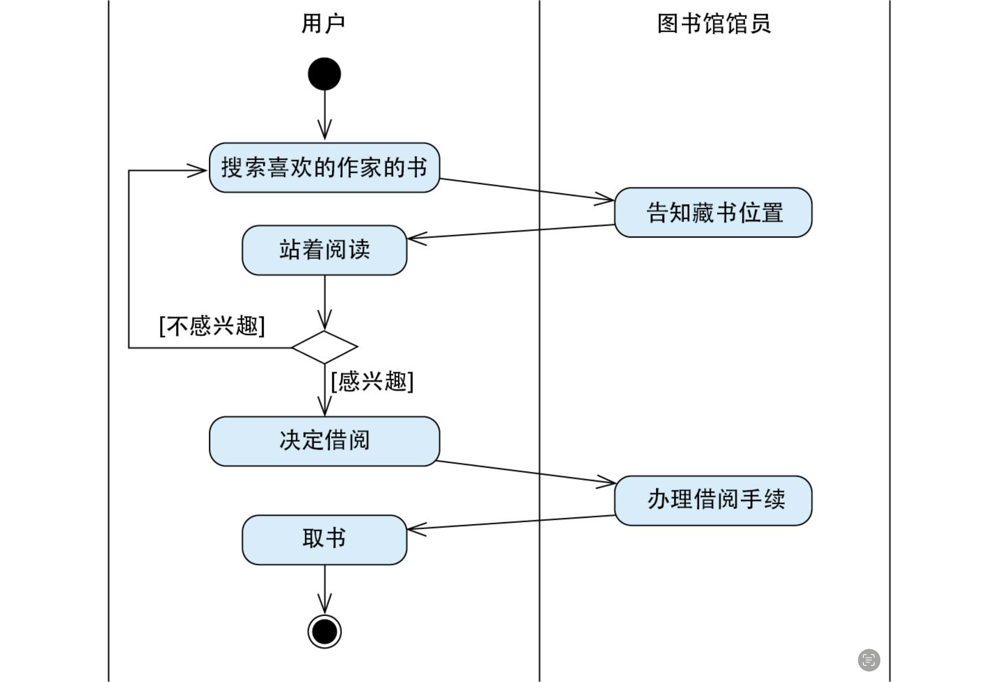
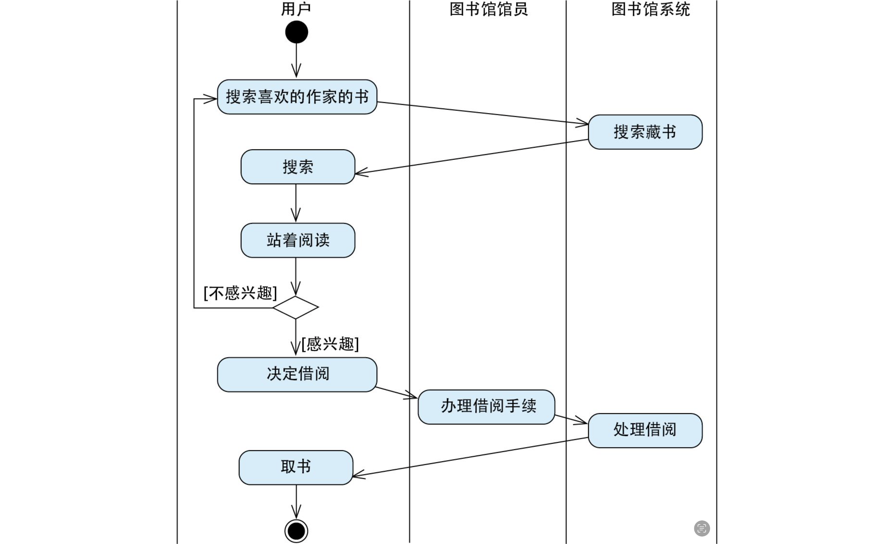

# 软件工程

- 软件工程 = 过程 + 方法 + 工具
  - 软件工程就是采取一些工程方法论对软件开发过程进行规范化和工具化，提高开发效率、质量
  - 软件开发过程
  - 工程方法论
    - 分析、设计、实施、验证

## 软件项目管理

- 软件项目管理
  - 项目规划
  - 文档协作
  - 代码管理
    - 版本控制（Git）
  - 分支管理
  - 提交规范
    - commit msg
      - [conventional-commits](https://www.conventionalcommits.org/zh-hans/v1.0.0-beta.4/#%e7%ba%a6%e5%ae%9a%e5%bc%8f%e6%8f%90%e4%ba%a4%e8%a7%84%e8%8c%83)
      - [commitizen](https://github.com/commitizen/cz-cli)
      - [commitlint](https://github.com/conventional-changelog/commitlint)
    - merge request & code review
      - RFC 机制
  - 自动版本管理和生成 CHANGELOG
    - 版本规范
      - [Semve 语义版本控制](#semver-语义版本控制)
  - 代码规范
  - 代码格式
  - 代码风格和常见错误引发的缺陷：linter
  - 代码组织结构
  - 项目模式
    - Multirepo
    - Monorepo
  - 文件目录结构
    - **脚手架-模板生成**

## 软件开发过程

1. 需求分析
   - 业务分析：整理现实世界的工作的推进方法
   - 需求定义：确定哪些工作可属于计算机范畴，即软件系统功能
     - 图书馆的借阅案例
       -   
       -   
   - 需求评估
     - 可行性分析
       - 技术
       - 市场、成本、风险
     - 优先级评估
   - 需求设计及验证
     - 功能结构图
     - 用例图
     - 业务流程图
     - 原型设计及验证
       - 对需求的验证方式其实是贯穿整个软件项目生命周期的，在需求分析阶段，会反复验证确认设计好的需求是否满足用户的真实需求，例如各种设计评审
2. 软件设计
3. 软件开发
   1. 运行时/框架层
   2. 语言层
4. 软件测试
5. 运行部署
   - CICD
   - WebServer 部署
     - VPS
       - 虚拟机
       - 容器
     - Server
       - 云服务器
     - Serverless
     - Tunnel(SSH)
       - Cloudflare Tunnel
6. 监控及优化

## Semver 语义版本控制

> [Semver](https://semver.org/)

- `major[.minor][.patch]`
  - major version：当进行不兼容的 API 更改时，主要版增加
  - minor version：当以向后兼容的方式添加功能时，次要版本增加
  - patch version：当进行向后兼容的错误修复时，补丁版本递增
  - 修饰符
    - `*`：匹配任何版本
    - `>=version`：表示安装的版本必须是 version 或更高
    - `<=version`表示安装的版本必须是 version 或更低
    - `version1-version2`：等同于>=version1 <=version2
    - `^version`：主版本必须相同，升级次版本号和修订号
    - `~version`：只升级修订号
- 先行版本
  - alpha: 内部版本
  - beta: 公测版本
  - rc: 候选版本(Release candiate)
