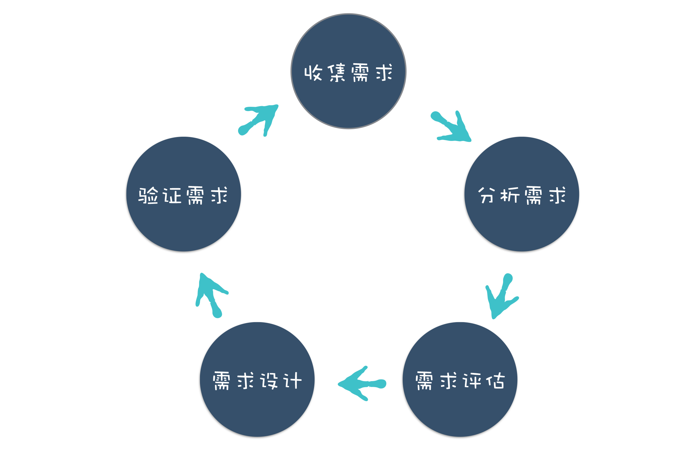
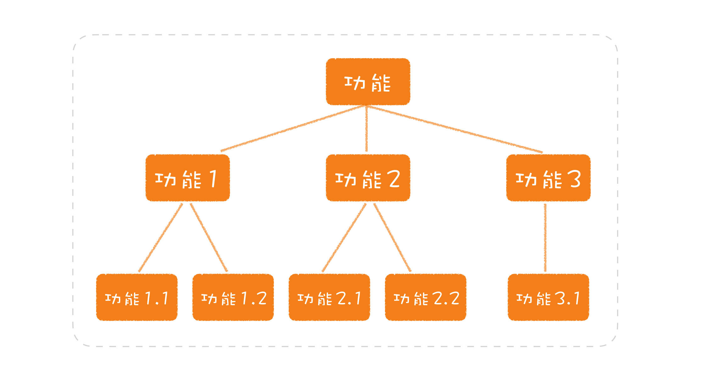

# 软件工程

- 软件工程 = 过程 + 方法 + 工具
  - 软件工程就是采取一些工程方法论对软件开发过程进行规范化和工具化，提高开发效率、质量
  - 软件开发过程
  - 工程方法论

## 软件开发过程

1. 需求分析 
   - 明确需求：需求分成两大类
     - 功能性需求，也就是要完成怎样的业务功能
     - 非功能性需求，是业务功能之外的一些需求
     - 
   - 功能需求结构化分解：
   - 需求评估
     - 可行性分析
       - 技术
       - 市场、成本、风险
     - 优先级
   - 原型设计及验证
     - 对需求的验证方式其实是贯穿整个软件项目生命周期的，在需求分析阶段，会反复验证确认设计好的需求是否满足用户的真实需求，例如各种设计评审
2. 项目规划、文档协作、代码管理
   - 版本工具 Git
     - 分支管理
     - 提交规范
       - commit msg
       - merge request & code review
         - RFC 机制
   - 结构
     - 项目模式
       - Multirepo
       - Monorepo
     - 文件目录结构
       - **脚手架-模板生成**
   - 代码规范
     - 代码格式
     - 代码风格、逻辑检查 linter
3. 软件设计
   1. 架构设计
   2. 技术选型
4. 软件开发/编码
   1. 运行时/框架层
   2. 语言层
   3. 工具层
      1. 软件构建
5. 软件测试
   - 单元测试
   - 端对端测试
6. 运行维护
   - CICD
   - WebServer 部署
     - VPS
       - 虚拟机
       - 容器
     - Server
       - 云服务器
     - Serverless
     - Tunnel(SSH)
       - Cloudflare Tunnel
   - 日志上报与监控
     - CPU Usage
     - Memory Usage
     - Disk Usage
     - Network Usage
     - Service Availability
     - Process Availability
7. 性能优化

## 工具设计

- 构建工具
  - 功能
    - 打包
      - 拆分
    - 缩小
      - 混淆
      - TreeShaking
    - 压缩
    - 转换
    - 热更新
      - watch、重载
      - 热模块替换
    - 开发服务器
<<<<<<< HEAD
- 任务管理
  - 编排
    - 串行
    - 并行
    - 拓扑
  - 增量
  - 监听

## Semver 语义版本控制

> [Semver](https://semver.org/)

- `major[.minor][.patch]`
  - major version：当进行不兼容的 API 更改时，主要版增加
  - minor version：当以向后兼容的方式添加功能时，次要版本增加
  - patch version：当进行向后兼容的错误修复时，补丁版本递增
  - 修饰符
    - `*`：匹配任何版本
    - `>=version`：表示安装的版本必须是version或更高
    - `<=version`表示安装的版本必须是version或更低
    - `version1-version2`：等同于>=version1 <=version2
    - `^version`：主版本必须相同，升级次版本号和修订号
    - `~version`：只升级修订号
- 先行版本
  - alpha: 内部版本
  - beta: 公测版本
<<<<<<< HEAD
  - rc: 候选版本(Release candiate)
=======
  - rc: 候选版本(Release candiate)
>>>>>>> bb97c409 (fix)
=======
>>>>>>> 90fa5dc6 (fix)
