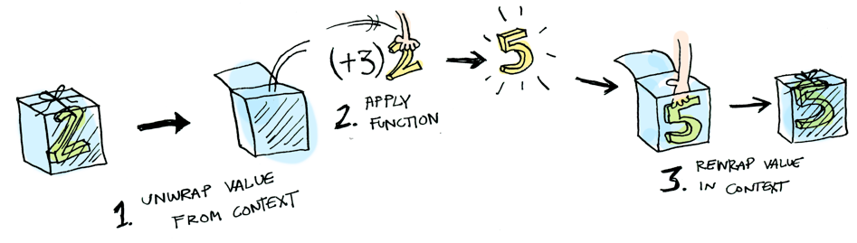
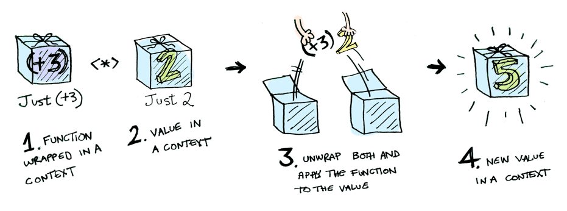

# 函数式编程

- 函数式编程
  - 函数式编程（Functional Programming，FP）是一种将计算视为函数求值过程的编程范式，并强调使用纯函数、不可变数据和函数组合来构建软件系统
  - 特征
    - **纯函数**：函数式编程中的函数指的是**数学**中的函数，即一个输入到输出的映射，其特点：
      - 给定同样的输入有且只有唯一的输出
        - 意味着函数的结果只能依赖于输入参数
      - **无副作用**：函数不会产生除计算结果以外的事，比如 IO 操作、全局状态修改等
    - **不可变数据**：函数式编程语言中的变量不是命令式编程语言中的变量，即存储状态的单元，而是代数中的变量，即**某个符号所对应的值是永远不变的**
    - **函数是一等公民**，强调使用**高阶函数**组合其他函数，将多个函数组合成一个更复杂的函数，提高代码的复用性和可读性
    - **惰性求值**：惰性求值（Lazy Evaluation）是一种求值策略，只有在需要结果时才会进行计算
      - Thunk：将把函数的参数看作是个数学上的计算表达式，在真正需要的时候才会计算，相当于带回调参数的函数
      - 定义无穷数据结构，抽象“**数据流**”：由于惰性求值，我们可以抽象构造一个无限长集合，无限长集合中的元素并不是预置进去的，而是在需要的时候才计算出来的。这让我们可以把很多问题抽象化，然后在更高的层面上解决它们。
  - 函数式编程的优点
    - 可读性：函数式编程强调代码的表达能力和可读性，使代码更易于理解和维护。
    - 可测试性：纯函数和不可变数据使函数式代码更易于测试，减少了对外部状态和依赖的需求。
    - 并发性：函数式编程天然适合并发编程，由于纯函数没有副作用，可以安全地在多线程环境中执行
      - 可以说，**函数式编程对程序中的赋值进行了限制和规范**
  - 函数技巧
    - 输入
      - 柯里化（Currying）：将一个多参函数，转换成一个依次调用的单参函数（柯里化是为了规范统一函数参数，更好得**适配**函数组合）
        - js 实现
          ```js
          // f(a, b, c) => f(a)(b)(c)
          function curry(func) {
              return function inner(...args){
                  if(args.length >= func.length){
                      return func.apply(this, args)
                  } else {
                      return function(...args2){
                          return inner.apply(this, args.concat(args2))
                      }
                  }
              }
          }

          function sum(a, b) {
              return a + b
          }

          let currySum = curry(sum)

          console.log('currySum(1)(2)', currySum(1)(2))
          console.log('currySum(1, 2)', currySum(1, 2))
          ```
        - 反柯里化
      - 部分应用函数（Partially Applied Functions）：固定部分的参数，返回一个更少参数的函数
    - 输出
      - 记忆（Memoization）
    - 结构
      - 组合（Compose）：从右往左执行函数列表，按照类似  `f(g(x))` 的传参执行顺序来排列的
        - js 实现例子
          ```js
          // compose
          function compose(...fns) {
            return fns.reduce((fn1, fn2) => (...args) => fn2(fn1(...args)))
          }

          const add10 = x => x + 10
          const mul10 = x => x * 10
          const add100 = x => x + 100

          // (10 + 100) * 10 + 10 = 1110
          compose(add10, mul10, add100)(10)
          ```
      - 管道（Pipeline）：从左往右执行函数列表
      - reducer: 最主要的作用其实是解决在使用多个 map、filter、reduce 操作大型数组时，可能会发生的性能问题
        - composeReducer
    - 值操作
      - map
      - filter
      - reduce
      - [函子：Functor、Applicative、Moand](#函子functorapplicativemoand)
        - Optional（Maybe Monad）
        - IO Monad：可以用来延迟函数的执行，它的 value 里面存储的是一个函数

## 函子：Functor、Applicative、Moand

函子（Functor）是函数式编程里面最重要的数据类型，也是基本的运算单位和功能单位。可以理解成一种容器对象类型，其包装一个值并且围绕值提供一些特殊的运算功能。函数式编程里面的运算，都是通过函子完成，即运算不直接针对值，而是针对这个值的容器----函子。

学习函数式编程，实际上就是学习函子的各种运算。由于可以把运算方法封装在函子里面，所以又衍生出各种不同类型的函子，有多少种运算，就有多少种函子。函数式编程就变成了运用不同的函子，解决实际问题。

一般约定，函子的标志就是容器具有`map`方法。该方法将容器里面的每一个值，映射到另一个容器：

```js
function Just(val) {
    return { map };

    function map(fn) { return Just( fn( val ) ); }
}

const A = Just(3)
const B = A.map(v => v + 2) // Just(5)
```

  

`map` 也同样可适用于集合：

  

应用函子（Applicative）：在 Functor 基础上，能够把一个函数值的函子应用到另一个函子的值上

```js
function Just(val) {
    return { map, ap };

    function map(fn) { return Just( fn( val ) ); }

    function ap(anotherMonad) { return anotherMonad.map( val ); }
}

const A = Just((x, y) => x + y)
const B = Just(2)
A.map(curry( add, 3)).ap(B) // Just(5)
```

  

函子是一个容器，可以包含任何值。函子之中再包含一个函子，也是完全合法的。但是这样就会出现多层嵌套的函子。

单子（Monad）：单子是一个带有 chain 的函子，

- 平铺值:处理嵌套函子
- 链式调用：即通过包装数据并赋予其额外的链式运算能力来简化一系列多步骤的计算

chain 通常又叫做 flatMap 或 bind，它的作用是 flatten 或 unwrap，也就是说它可以展开被 Just 封装的值 val

```js

function Just(val) {
    return { map, chain };
    
    function map(fn) { return Just( fn( val ) ); }
   
    function flatMap(fn) { return fn( val ); }
}
```
- Applicative 将一个封装的函数应用到封装值上
- Monad 将一个 “接受一个普通值并回传一个被封装的值” 的函数应用到一个被封装的值上


## 参考

- 极客专栏《软件设计之美》
- [函数式编程入门教程](https://www.ruanyifeng.com/blog/2017/02/fp-tutorial.html)
- [对普通程序员来说，Monad有什么用？ - 袁洋的文章 - 知乎](https://zhuanlan.zhihu.com/p/575642401)
- [图解 Functor、Applicative、Monad](https://sxyz.blog/functors-applicatives-and-monads-in-pictures/)


函数式的纯洁性在于对于一个特定的参数，必定存在一个特定的返回值。所以函数式的执行是无关顺序的。
而在现实世界里，很多东西就必须是有顺序的，比如输入输出。于是Haskell决定用monad去模拟这种操作。monad来源于范畴论，他并不解决副作用问题本身，而是对此类问题提供了抽象。

- 函子：它首先是一种范畴，也就是说，是一个容器，包含了值和变形关系。比较特殊的是，它的变形关系可以依次作用于每一个值，将当前容器变形成另一个容器。
  - 一般约定，函子的标志就是容器具有map方法。该方法将容器里面的每一个值，映射到另一个容器。
  - 函子是函数式编程里面最重要的数据类型，也是基本的运算单位和功能单位
- Monad 函子
  - Monad 函子的作用是，总是返回一个单层的函子。它有一个flatMap方法，与map方法作用相同，唯一的区别是如果生成了一个嵌套函子，它会取出后者内部的值，保证返回的永远是一个单层的容器，不会出现嵌套的情况。


我们就理解了Monad大概是个什么。它可以看做是对纯函数的一种补充。如果函数中有一些脏东西，它把脏东西装到盒子里，然后以一种假设/计划的方式描述这个脏东西，使得形成的东西仍然是一个纯函数，没有对世界产生影响。只有当我们真正打算大干一场的时候，才会真正和世界接触交互，把脏活累活给干了

从我们刚谈及的IO Monad角度来看，Monad是一种对程序实现的抽象。我们可以把要怎么干活（计划，纯函数）和具体去干活（实践，不纯的函数）拆分开来，让专业的人/机器/程序做专业的事情

串联的时候可以将泛型内部的值取出来返回新的泛型，可以用来把操作串起来但不执行


- 伴随着范畴论的发展，就发展出一整套函数的运算方法
  - 合成
  - 柯里化
- 函子
  - 它首先是一种范畴，也就是说，是一个容器，包含了值和变形关系。比较特殊的是，它的变形关系可以依次作用于每一个值，将当前容器变形成另一个容器。
- Monad 函子的作用是，总是返回一个单层的函子

