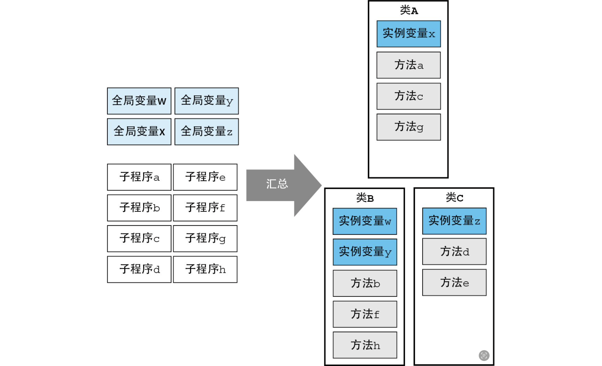
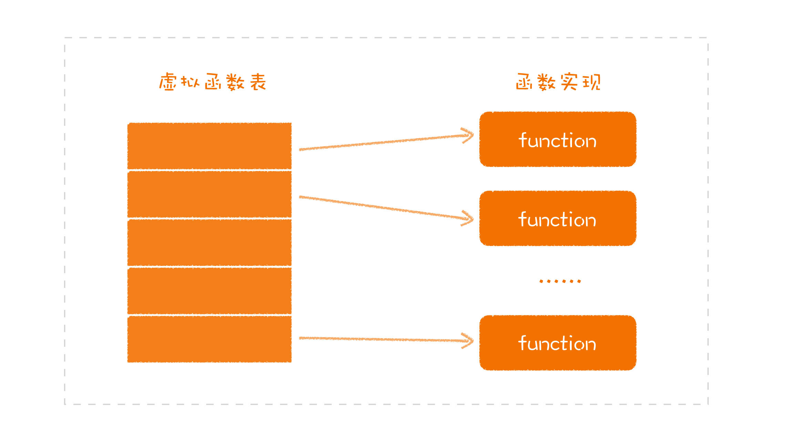

# 面向对象编程

- 面向对象编程
  - 面向对象思想
    - 封装是面向对象的根基：封装是一种数据和行为的归档整理
    - 基于消息传递改变对象状态
    - 面向抽象
      - 面向对象即面向抽象，对象本质是一个可抽象的个体
      - 隐藏内部数据及实现细节，对对象行为抽象，即对外提供了哪些行为接口，接口即协议
  - 面向对象编程
    - 类（封装）
      - 类是“汇总”“隐藏”和“实例模板”的结构” 
      - 有了封装同时也有了**模块化**的能力，更好得解决了结构化编程下的全局变量、强依赖的问题，实例变量是存在期间长的局部变量或者限定访问范围的全局变量
      - **组合性**：通过可以复用的单元组合完成不同的功能
    - [继承](#继承)
    - [多态：一个接口多种形态](#多态一个接口多种形态)
      - [多态实现](#多态的实现)
  - 面向对象设计原则（S.O.L.I.D）
    - 如何封装
      - 单一职责原则（Single responsibility principle，SRP）：职责化封装
    - 如何扩展
      - 开放封闭原则（Open–closed principle，OCP）：对扩展开放，修改封闭
        - 在不修改现有代码的情况下，通过添加新代码来扩展系统的功能
        - 通过抽象和接口实现的扩展点提高系统的扩展性
      - Liskov 替换原则（Liskov substitution principle，LSP）：接口继承
        - 里式替换是一种设计原则，用来指导继承关系中子类该如何设计，站在父类的角度去思考设计**行为一致**的子类，主要是为了不改变父类原有程序的逻辑及不破坏原有程序的正确性
        - 行为一致，也就协议一致，强调“接口继承”
    - 如何依赖
      - 接口隔离原则（Interface segregation principle，ISP）：依赖最小接口
        - 不应强迫用户依赖于它们不使用的方法，接口应该遵循**最小设计原则**
        - 通过识别对象的不同角色职责，设计最小接口
      - 依赖倒置原则（Dependency inversion principle，DIP）：依赖抽象
        - 至上而下的模块设计中，高层模块不应依赖于低层模块，而要让底层模块依赖高层模块的抽象来实现
        - 强调模块之间不应该直接依赖，而是通过抽象来互相依赖

## 继承

在主流面向对象程序设计语言中，继承是构建一个对象体系的重要组成部分，用来表示类之间的 is-a 关系。继承有两种用途：

- 实现继承：实现继承是站在子类的视角看问题，从父类实现中继承代码复用。但**继承不是一种好的代码复用，组合优于继承**
- 接口继承：是一种类型关联、类型层级关系，可隐式向上转型，实现**多态**

### 实现继承是好的代码复用么？

从实现继承来看父类：父类是干什么用的呢？就是把一些公共代码放进去，之后在实现其他子类时，可以少写一些代码。讲程序库的时候，我们说过，设计的职责之一就是消除重复，代码复用。所以，在很多人的印象中，继承就是一种代码复用的方式。但：

把实现继承当作面向对象编程中代码复用的方式，并不是一种值得鼓励的做法。之所以会有这样的想法，很大程度受到语言的局限。实现继承（代码复用）带来的问题：

- 单继承，带来不能通过继承多个父类来重用逻辑的限制，不符合代码复用的思想；以及严重制约了多态能力，一旦父类被占据其他抽象类就无法被继承(后面通过面向接口编程解决)
- 多重继承，可能带来继承结构复杂化以及功能冲突
- 继承层次过深、继承关系过于复杂会影响到代码的可读性和可维护性
- 强耦合：父类的任何变化，都将直接地影响到子类

## 多态：一个接口多种形态

只使用封装和继承的编程方式，我们称之为基于对象（Object Based）编程，而只有把**多态**加进来，才能称之为面向对象（Object Oriented）编程。面向抽象是面向对象思想的核心之一，而多态则是面向抽象的具体体现。

那么什么是多态？即**一个接口多种形态**。

```c
// UNIX操作系统将每个 IO 设备 FILE 文件
struct FILE {
    void (*open)(char* name, int mode);
    void (*close)();
    int (*read)();
    void (*write)(char);
    void (*seek)(long index, int mode);
};
```

```c
// 实现控制台
#include "file.h"
void open(char* name, int mode) {/*...*/}
void close() {/*...*/};
int read() {int c;/*...*/ return c;}
void write(char c) {/*...*/}
void seek(long index, int mode) {/*...*/}

struct FILE console = {open, close, read, write, seek};
```

```c
extern struct FILE* STDIN;

int getchar() {
    return STDIN->read();
}
```

`getchar` 的具体行为取决于 STDIN 的指向，比如我们可以指向 `console`，这不正就是**一个接口多种形态**了么？

指针的技巧应用正是面向对象多态的实现基础，但用函数指针显式实现多态的问题就在于函数指针的危险性。因为函数指针是灵活的，上述例子中一旦 STDIN 在程序某处给重新指向其他实例就会发生错误。因此函数指针的调用必须依赖于一系列需要人为遵守的约定，只要有一个程序员没有遵守这些约定，整个程序就会产生极其难以跟踪和消除的 Bug。

在支持面向对象的语言中，有些会限制使用函数指针，对程序控制权的间接转移施加了约束。它们将函数指针赋值的操作下沉到了运行时去实现，将一种常见的编程技巧升华为语法特性，降低程序员犯错的几率。

### 多态的实现

在代码中使用接口来引用具体类型的时候，代码就具备了运行时多态的能力。一旦使用了关于接口的引用，变量原本的类型被抹去，我们无法单纯从一个指针分析出这个引用具备什么样的能力。

```rs
#[allow(dead_code)]
fn main() {
    trait Summary {
        fn summarize(&self) -> String;
    }

    struct Post {
        title: String,   // 标题
        author: String,  // 作者
        content: String, // 内容
    }

    impl Summary for Post {
        fn summarize(&self) -> String {
            format!("文章{}, 作者是{}", self.title, self.author)
        }
    }

    let post = Post {
        title: "lys".to_string(),
        author: "lys".to_string(),
        content: "lys".to_string(),
    };

    // 函数接口
    fn print_post_summary(_post: &impl Summary) {
        println!("{}", _post.summarize());
    }

    print_post_summary(&post);
}
```

生成 `_post: &impl Summary` 这个接口引用时，需要构建胖指针（除了内存地址还有更多信息），除了指向数据本身外，还需要指向一张涵盖了这个接口所支持方法的列表。

接口实现的函数在虚拟函数表中找到一个位置，把函数指针地址写进去，不同的子类对应不同的虚拟表。当我们用接口去调用对应的函数时，实际上完成的就是在对应的虚拟函数表的一个偏移，不管现在面对的是哪个子类，都可以找到相应的实现函数：

通过分开普通函数和在虚拟列表记录接口函数，隔离了继承重写方法带来的破坏

  

### 鸭子类型：多态不一定要依赖于继承

在语言实践发展过程中，**多态并不一定要依赖于继承**（多态依赖于继承，这只是某些程序设计语言自身的特点），只要能够遵循相同的接口，就可以表现出来多态，如在动态语言中，有一个常见的说法，叫 **Duck Typing**，就是说，如果走起来像鸭子，叫起来像鸭子，那它就是鸭子：

```js
// javascript 例子
let duck = {
  call() {
    console.log("鸭叫")
  }
}

let chicken = {
  call() {
    console.log("鸡叫")
  }
}

function make_call(animal) {
  animal.call()
}
make_call(duck) // 鸭叫
make_call(chicken) // 鸡叫
```

故在面向对象本身的体系之中，封装和多态才是重中之重，而继承则处于一个很尴尬的位置。

## 学习参考

- 极客专栏《软件设计之美》
- 《Clean Architecture》