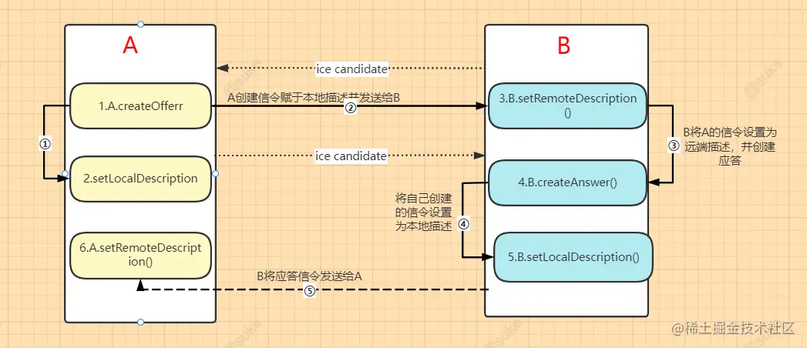

# 音视频

::tl
- 音视频
  - 音视频设备参数概念
    - 摄像头
      - 分辨率
      - 前置或者后置摄像头
      - 帧率
    - 多媒体文件格式
      - 原始数据、自定义格式、可做私有播放
      - flv
        - 支持流式，可边录制边播放
        - 缺点，单视频模式
      - mp4
        - 多媒体格式
  - 流媒体服务
    - 流媒体协议
      - HLS (HTTP Live Streaming)：基于 HTTP 协议的流媒体传输协议
  - 媒体通信协议
    - [WebRTC 会话](#webrtc-会话)
  - Web 音视频接口
    - 媒体设备
      - [MediaDevices](https://developer.mozilla.org/en-US/docs/Web/API/MediaDevices)
        - 安全源限制
          - HTTPS
          - 回路地址：localhost、127.0.0.1、::1
          - `file://` 文件协议
      - `navigator.mediaDevices.enumerateDevices()`
    - 媒体流
      - [MediaStream](https://developer.mozilla.org/en-US/docs/Web/API/Media_Capture_and_Streams_API)
        - 一个媒体流包含多个音频或视频轨道 [MediaStreamTrack](https://developer.mozilla.org/en-US/docs/Web/API/MediaStreamTrack)
          - “轨”在多媒体中表达的就是每条轨数据都是独立的，不会与其他轨相交
          - MediaTrackConstraints   
      - 媒体约束 constraints
        - video
          - 分辨率
          - 帧率
      - 获取用户层面的媒体：[`navigator.mediaDevices.getUserMedia`](https://developer.mozilla.org/en-US/docs/Web/API/MediaDevices/getUserMedia)
      - 屏幕分享：[`navigator.mediaDevices.getDisplayMedia`](https://developer.mozilla.org/en-US/docs/Web/API/MediaDevices/getDisplayMedia)
    - MediaRecorder：媒体录制
    - HTMLVideoElement
::

## WebRTC 会话

- 媒体协商
  - 客户端之间通过信令（Signaling）服务交换 SDP 信息，了解对方媒体能力，找到共同支持的媒体能力
    - 通信双方将它们各自的媒体信息能力按 **SDP** 格式整理好
    - 通过**信令服务**器交换 SDP 信息，并待彼此拿到对方的 SDP 信息后，找出它们共同支持的媒体能力
  - SDP(会话描述协议)
- 连接（Connecting）：ICE(交互式连接建立)
  - NAT 穿透 - 使用 STUN/TURN 进行连接
- 安全加密（Securing）
  - DTLS（数据报传输层安全性），即基于 UDP 的 TLS
- 通信（Communicating）
  - 使用 SRTP（安全实时传输协议）传输的媒体数据
  - 使用 SCTP （流控制传输协议）和 DTLS 加密传输 DataChannel 消息

## SDP(会话描述协议)

> [wiki-Session Description Protocol](https://en.wikipedia.org/wiki/Session_Description_Protocol)
> [SDP: Session Description Protocol](https://datatracker.ietf.org/doc/html/rfc4566#section-8)

- SDP（Session Description Protocal）：用文本描述的各端支持的音频编解码器以及参数、传输协议、音视频媒体等
  - 文本描述格式，其结构是由多个 `<type>=<value>/n` 组成，“=” 两边是不能有空格的 
  - SDP = 一个会话级描述（session level description）+ 多个媒体级描述（media level description）
  - 会话级
    - 从 `v=` 行开始到第一个媒体描述 m 为止
  - 媒体级
    - 从 `m=` 行开始到下一个媒体描述（即下一个 `m=`）为止
    - 媒体级描述：`m=<媒体类型> <端口> <传输协议> <媒体格式>`
    - 属性描述：用于进一步描述媒体信息
      - 从 `a=` 开始，一整行
      - `a=<TYPE>:<VALUES>`
        - TYPE
          - rtpmap：rtp 与 map 的结合，即 RTP 参数映射
          - fmtp：格式化参数

### WebRTC 中的 SDP
 
WebRTC 把媒体级描述的内容分为了：

- 网络描述
- 媒体流描述
- 安全描述（新增属性）
- 服务质量描述（新增属性）

## WebRTC 建立连接

- WebRTC 建立连接
    - ICE（Interactive Connectivity Establishment）：收集各种类型 ICE Candidate，寻找最佳连接方案
      - Candidate 类型及收集
        - host 类型：即本机内网的 IP 和端口
        - srflx 类型：即本机 NAT 映射后的外网的 IP 和端口，通过 **STUN** 协议收集 srflx 类型的 Candidate
          - prflx 类型：与 srflx 一样，但 srflx 是通过 STUN 服务获取的，而prflx 则是直接向目的主机发起请求
        - relay 类型：即中继服务器的 IP 和端口，通过 **TURN** 协议收集 relay 类型的 Candidate
      - WebRTC 按优先级顺序对 Candidate 进行连通性检测
        - 首先对 host 类型的候选者进行**内网之间的连通性检测**，判断两台主机是否处于同一个局域网内
        - 其次尝试 srflx 类型的候选者，也就是尝试让通信双方直接通过 P2P 进行连接
          - WebRTC 首先需要对 NAT 类型做判断，检测出其类型后，才能判断出是否可以打洞成功，只有存在打洞成功的可能性时才会真正尝试打洞
          - 对称型 NAT 与对称型 NAT 是无法进行 P2P 穿越的；而对称型 NAT 与端口限制型 NAT 也是无法进行 P2P 连接的
        - 最后通过中继服务器进行中转
  - 调用 RTCPeerConnection 接口创建连接    
    - 通信双方链路的建立是在设置本地媒体能力，即调用 setLocalDescription 函数之后才进行的

## 实战

- Quetions
  - 连接
    - 端与端之间要建立连接，但它们是如何知道彼此的外网地址呢？
      - SDP
    - 如果两台主机都是在 NAT 之后，它们又是如何穿越 NAT 进行连接的呢？
    - 如果 NAT 穿越不成功，又该如何保证双方之间的连通性呢？
      - 中继服务
  - 开发
    - 网络断开重连
    - 设备切换

 
 

- 音视频服务质量优化与提升
  - 传输速率控制
    - 带宽限制
  - 网络质量
    - 物理链路质量
      - 丢包
      - 延迟
      - 抖动：指的是数据传输一会儿快、一会儿慢，很不稳定。容易造成视觉抖动
        - 缓冲
    - 带宽大小
      - 带宽大小指的是每秒钟可以传输多少数据，单位 bps。
        - 比如 1M 带宽，它表达的是每秒钟可以传输 1M 个 bit 位
        - 换算成字节就是 1Mbps/8 = 128KBps
      - 准则：把带宽尽量占满，但千万别超出带宽的限制
    - 传输速率
  - 数据
    - 分辨率
    - 帧率
    - 音视频压缩码率：指的是单位时间内音视频被压缩后的数据大小
    - 传输控制码率
- 多对多实时通信
  - Mesh 方案，即多个终端之间两两进行连接，形成一个网状结构。

- 虽然出于隐私原因无法访问有关用户摄像头和麦克风的信息，但应用程序可以使用额外的约束来请求它需要和想要的摄像头和麦克风功能
- 性能调优
  - 分辨率\帧率\宽带 调参
  - 视频模糊
    - 宽带问题
    - 关闭 Web RTC 的自适应码率，frameRate，width，height 设置固定值或高范围值。

- 在 WebRTC 端与端之间建立连接，包括三个任务：
为连接的每个端创建一个 RTCPeerConnection 对象，并且给 RTCPeerConnection 对象添加一个本地流，该流是从 getUserMedia() 获取的；
获取本地媒体描述信息，即 SDP 信息，并与对端进行交换；
获得网络信息，即 Candidate（IP 地址和端口），并与远端进行交换