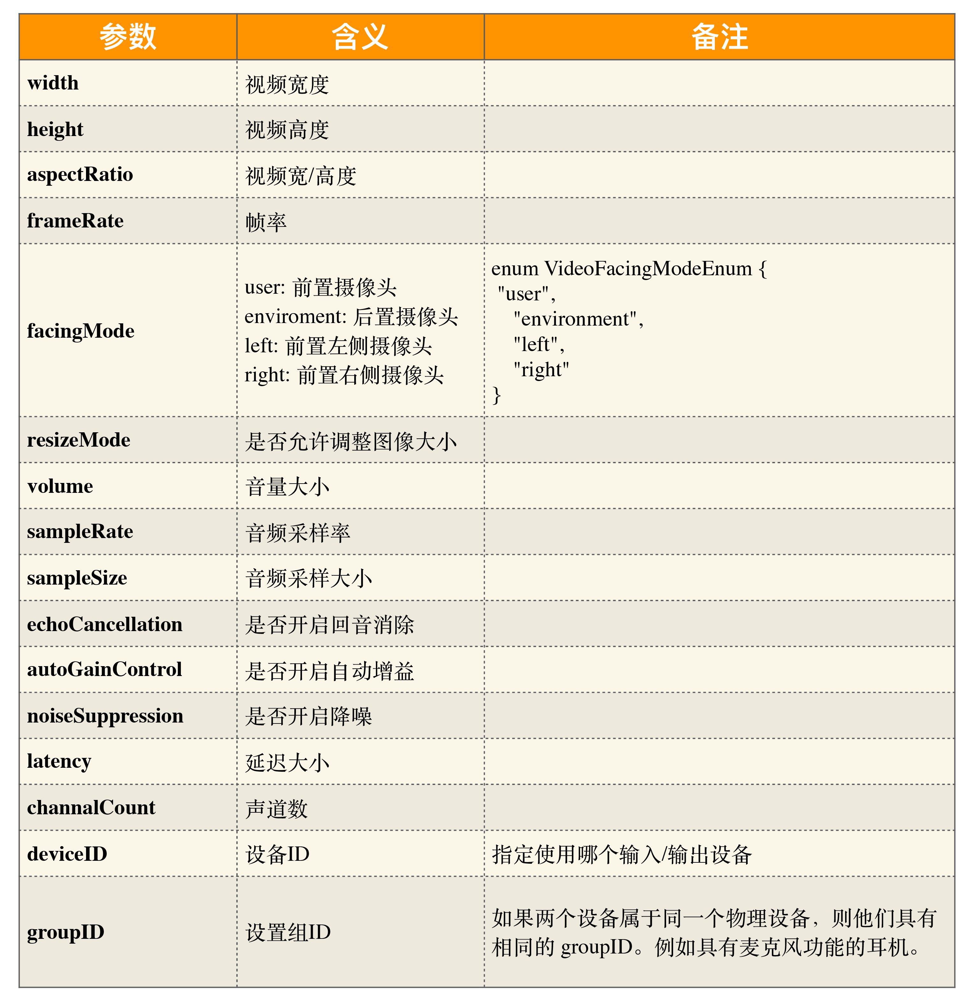
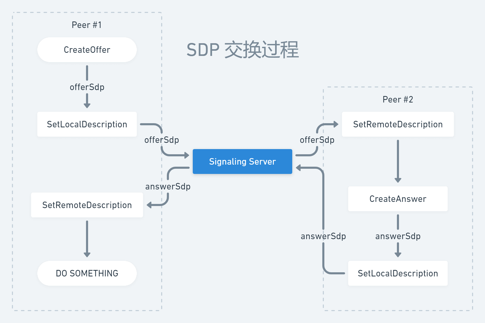
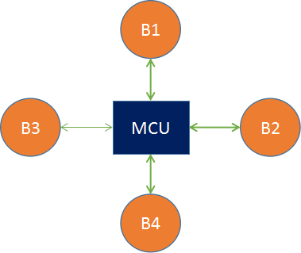
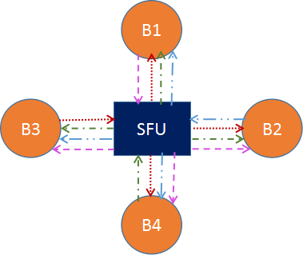
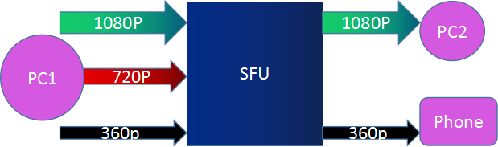
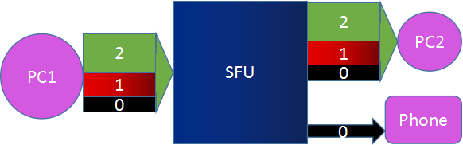

# WebRTC 与音视频

::tl
- 音视频
  - 音视频设备参数概念
    - 摄像头
      - 分辨率
      - 前置或者后置摄像头
      - 帧率
    - 多媒体文件格式
      - 原始数据、自定义格式、可做私有播放
      - flv
        - 支持流式，可边录制边播放
        - 缺点，单视频模式
      - mp4
        - 多媒体格式
  - 流媒体服务
    - 流媒体协议
      - HLS (HTTP Live Streaming)：基于 HTTP 协议的流媒体传输协议
  - 媒体通信协议
    - [WebRTC 会话](#webrtc-会话)
  - Web 音视频接口
    - 媒体设备
      - [MediaDevices](https://developer.mozilla.org/en-US/docs/Web/API/MediaDevices)
        - 安全源限制
          - HTTPS
          - 回路地址：localhost、127.0.0.1、::1
          - `file://` 文件协议
      - `navigator.mediaDevices.enumerateDevices()`
    - 媒体流
      - [MediaStream](https://developer.mozilla.org/en-US/docs/Web/API/Media_Capture_and_Streams_API)
        - 一个媒体流包含多个音频或视频轨道 [MediaStreamTrack](https://developer.mozilla.org/en-US/docs/Web/API/MediaStreamTrack)
          - “轨”在多媒体中表达的就是每条轨数据都是独立的，不会与其他轨相交
          - MediaTrackConstraints   
      - 媒体约束 constraints
        - video
          - 分辨率
          - 帧率
      - 获取用户层面的媒体：[`navigator.mediaDevices.getUserMedia`](https://developer.mozilla.org/en-US/docs/Web/API/MediaDevices/getUserMedia)
      - 屏幕分享：[`navigator.mediaDevices.getDisplayMedia`](https://developer.mozilla.org/en-US/docs/Web/API/MediaDevices/getDisplayMedia)
    - Peer
      - RTCRtpSender
      - createDataChannel
    - MediaRecorder：媒体录制
    - HTMLVideoElement
- [多对多架构](#多对多架构)
::

## WebRTC 会话

- 媒体协商
  - 客户端之间通过信令（Signaling）服务交换 SDP 信息，了解对方媒体能力，找到共同支持的媒体能力
    - 通信双方将它们各自的媒体信息能力按 **SDP** 格式整理好
    - 通过**信令服务**器交换 SDP 信息，并待彼此拿到对方的 SDP 信息后，找出它们共同支持的媒体能力
  - [SDP(会话描述协议)](#sdp会话描述协议)
  -  
- ICE(交互式连接建立)
  - NAT 穿透 - 使用 STUN/TURN 进行连接
- 安全加密（Securing）
  - DTLS（数据报传输层安全性），即基于 UDP 的 TLS
- 通信（Communicating）
  - 使用 SRTP（安全实时传输协议）传输的媒体数据
  - 使用 SCTP （流控制传输协议）和 DTLS 加密传输 DataChannel 消息

## SDP(会话描述协议)

> [wiki-Session Description Protocol](https://en.wikipedia.org/wiki/Session_Description_Protocol)
> [SDP: Session Description Protocol](https://datatracker.ietf.org/doc/html/rfc4566#section-8)

- SDP（Session Description Protocal）：用文本描述的各端支持的音频编解码器以及参数、传输协议、音视频媒体等
  - 文本描述格式，其结构是由多个 `<type>=<value>/n` 组成，“=” 两边是不能有空格的 
  - SDP = 一个会话级描述（session level description）+ 多个媒体级描述（media level description）
  - 会话级
    - 从 `v=` 行开始到第一个媒体描述 m 为止
    - `v`：表示 SDP 的版本号
    - `o=<username> <session id> <version> <network type> <address type> <address>`
      - `<username>`：用户名，当不关心用户名时，可以用 “－” 代替 ；
      - `<session id>`：数字串，在整个会话中，必须是唯一的，建议使用 NTP 时间戳；
      - `<version>`：版本号，每次会话数据修改后，该版本值会递增；
      - `<network type>`：网络类型，一般为“IN”，表示“internet”
      - `<address type>`：地址类型，一般为 IP4；
      - `<address>`：IP 地址
    - `s=<session name>`
    - `t=<start time> <stop time>`：描述了会话的开始时间和结束时间
      - `t=0 0`：表示持久会话
  - 媒体级
    - 从 `m=` 行开始到下一个媒体描述（即下一个 `m=`）为止
    - 媒体级描述：`m=<媒体类型> <端口> <传输协议> <媒体格式>`
    - 属性描述：用于进一步描述媒体信息
      - 从 `a=` 开始，一整行
      - `a=<TYPE>:<VALUES>`
        - TYPE: rtpmap 或者 fmtp
        - rtpmap：rtp 与 map 的结合，即 RTP 参数映射
          - `a=rtpmap:<payload type> <encoding name>/<clock rate>[/<encodingparameters>]`
            - `<payload type>` ：负载类型，对应 RTP 包中的音视频数据负载类型
            - `<encoding name>`：编码器名称，如 VP8、VP9、OPUS 等
            - `<sample rate>`：采样率，如音频的采样率频率 32000、48000 等
            - `<encodingparameters>`：编码参数，如音频是否是双声道，默认为单声道
        - fmtp：格式化参数
          - `a=fmtp:<payload type> <format specific parameters>`
          - `<payload type>`，负载类型，同样对应 RTP 包中的音视频数据负载类型
          - `<format specific parameters>` 指具体参数
- 对于每个媒体层，WebRTC 把媒体级描述的内容分为了
  - 网络描述
  - 媒体流描述
  - 安全描述（新增属性）
  - 服务质量描述（新增属性）

## ICE(交互式连接建立)

::tl
- ICE（Interactive Connectivity Establishment）
  - 收集各类 Candidate 类型
    - host 类型：即本机内网的 IP 和端口
    - srflx 类型：即本机 NAT 映射后的外网的 IP 和端口，使用 **STUN** 协议收集 srflx 类型的 Candidate
      - prflx 类型：与 srflx 一样，但 srflx 是通过 STUN 服务器获取的，而prflx 则是直接向目的主机发起请求
    - relay 类型：即中继服务器的 IP 和端口，使用 **TURN** 协议收集 relay 类型的 Candidate
  - 对 Candidate 进行连通性检测
    - 首先对 host 类型的候选者进行**内网之间的连通性检测**，判断两台主机是否处于同一个局域网内
    - 其次尝试 srflx 类型的候选者，也就是尝试让通信双方直接通过 P2P 进行连接
      - WebRTC 首先需要对 NAT 类型做判断，检测出其类型后，才能判断出是否可以打洞成功，只有存在打洞成功的可能性时才会真正尝试打洞
      - 对称型 NAT 与对称型 NAT 是无法进行 P2P 穿越的；而对称型 NAT 与端口限制型 NAT 也是无法进行 P2P 连接的
    - 最后通过中继服务器进行中转
- 通信双方链路的建立是在设置本地媒体能力，即调用 setLocalDescription 函数之后才进行的
::

## 多对多架构

- Mesh 方案，即多个终端之间两两进行连接，形成一个网状结构
- MCU（Multipoint Conferencing Unit）方案
  -   
  - 由一个服务器和多个终端组成一个星形结构
  - 由服务器混合各端的音视频流再发给各个终端
- SFU（Selective Forwarding Unit）
  -   
  - 由一个服务器和多个终端组成一个星形结构
  - SFU 不对音视频进行混流，只进行转发
  - 视频的处理模式
    - Simulcast 模式就是指视频的共享者可以同时向 SFU 发送多路不同分辨率的视频流；而 SFU 可以将接收到的三路流根据各终端的情况而选择其中某一路发送出去，这对于网络环境差的特别有用
      -   
    - SVC 是可伸缩的视频编码模式：视频编码时将视频分成多层——核心层、中间层和扩展层。上层依赖于底层，而且越上层越清晰，越底层越模糊。在带宽不好的情况下，可以只传输底层，即核心层，在带宽充足的情况下，可以将三层全部传输过去
      -   

## Q

- ice candidate 是什么时候发生
  - setLocalDescription 之后开始收集 candidate
  - sdp 如无媒体描述，是不会进行收集 candidate
  - ice-options:trickle 
  - onicecandidate 事件进行 candidate 交换
- 调试
  - chrome://webrtc-internals/
- 网络断开、重连
  - iceconnectionstatechange
  - restart
- 设备切换
- 音视频服务质量优化与提升
  - 传输速率控制
    - 带宽限制
  - 网络质量
    - 物理链路质量
      - 丢包
      - 延迟
      - 抖动：指的是数据传输一会儿快、一会儿慢，很不稳定。容易造成视觉抖动
        - 缓冲
    - 带宽大小
      - 带宽大小指的是每秒钟可以传输多少数据，单位 bps。
        - 比如 1M 带宽，它表达的是每秒钟可以传输 1M 个 bit 位
        - 换算成字节就是 1Mbps/8 = 128KBps
      - 准则：把带宽尽量占满，但千万别超出带宽的限制
    - 传输速率
  - 数据大小
    - 分辨率
    - 帧率
    - 音视频压缩码率：指的是单位时间内音视频被压缩后的数据大小
    - 传输控制码率
- outbound bandwidth 限制
