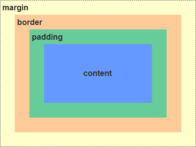
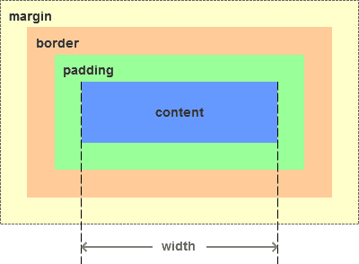
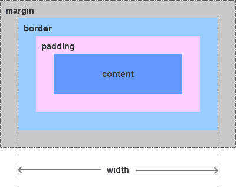

# CSS 页面布局

- CSS layout
  - 基础
    - 盒子模型
      - 标准模型+IE模型
        - box-sizing
          - context-box(标准模型)
          - border-box
      - [外边距重叠](https://developer.mozilla.org/zh-CN/docs/Web/CSS/CSS_Box_Model/Mastering_margin_collapsing)
        > 
      - BFC
    - 层叠上下文
    - 页面布局
      - 文档流
      - 浮动定位
      - 绝对定位
  - 常见页面布局

## 盒子模型

- 盒子模型
  - 内容 content
  - 内边距 padding
  - 边框 border
  - 外边距 margin

  

IE模型和标准模型唯一的区别是内容计算方式的不同

标准模型元素宽度 `width=content`，高度计算相同

  

IE模型元素宽度 `width=content+padding+border`，高度计算相同

  
