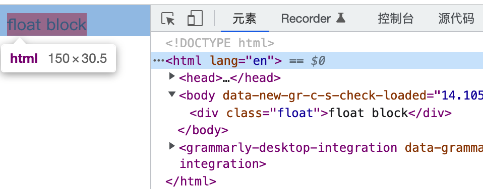

# CSS 布局

- CSS 布局
  - 盒子模型：页面是由一个个相互作用、嵌套的盒子组成
    - 盒子模型：box = content + padding + border + margin
        
    - 怪异模型和标准盒模型
      - 标准模型元素宽度 width = content
        - `box-sizing: border-box`
      - 怪异模型元素宽度 width = content + padding + border
        - `box-sizing: content-box`
  - FC：Formatting context(格式化上下文) 是 W3C CSS2.1 规范中的一个概念。它是页面中的一块独立渲染区域，并且有一套渲染规则，它决定了其子元素将如何定位，以及和其他元素的关系和相互作用
  - BFC 即 Block Formatting Contexts (块级格式化上下文)，就是默认的正常流布局方案
  - 正常流：依次排列，排不下了换行
    - 元素按照其在 HTML 中的先后位置依次排列
    - 块级元素垂直排列、行内元素水平排列
    - 除非另外指定，否则所有元素默认都是普通流定位，也可以说，普通流中元素的位置由该元素在 HTML 文档中的位置决定
  - BFC
    - 创建 BFC 条件
      - 根元素
      - 浮动元素
      - 绝对定位元素，且 position 不是 static 也不是 relative
      - display 为 inline-blocks,table,table-cell,table-caption,flex,inline-flex、grid、inline-grid 等的元素;
      - overflow 不为 visible 的元素
      - [等](https://developer.mozilla.org/zh-CN/docs/Web/Guide/CSS/Block_formatting_context)
    - BFC的原理（渲染规则即正常流/文档流）
      - 独立渲染区域，里面的子元素不会影响到外面元素
      - 同一个 BFC 下的块级元素垂直方向会边距重叠
      - BFC 的区域不会与浮动元素的布局重叠
      - BFC 可以包含浮动的元素（清除浮动）
    - 应用
      - 防止边距重叠
      - 包含浮动元素，防止高度坍塌（清除浮动）
      - BFC 的区域不会与浮动元素的布局重叠（使用 float 实现的多列布局）
  - [display](https://developer.mozilla.org/zh-CN/docs/Web/CSS/display)：控制盒子内容布局，以及在正常流的布局表现
    - `display:  [ <display-outside> | <display-inside> ]`
      - display-outside：指定元素在正常流的布局表现
        - block 块级元素
        - inline 内联元素
      - display-inside：指定元素的内部子元素的布局方式，主要有以下几类
        - 正常流
        - table
        - flex
        - grid
    - inline-block
    - table
    - flex
      - [解决用flex布局时内容可能溢出的问题](https://stackoverflow.com/questions/43809612/prevent-a-child-element-from-overflowing-its-parent-in-flexbox)
        - 本质：flex item 元素初始值 `min-width: auto`
        - 解决：`min-width: 0` 、`overflow: hidden`
    - grid
      - [A Complete Guide to Grid](https://css-tricks.com/snippets/css/complete-guide-grid/)
      - [网格布局](https://developer.mozilla.org/zh-CN/docs/Web/CSS/CSS_Grid_Layout)
  - float
  - position：控制盒子位置，脱离父盒的内部布局
    - static：元素按照正常流布局
    - relative
    - absolute
    - fixed
    - sticky
    - float
  - column-width
  - 层叠上下文和层叠顺序
- 常见页面布局
  - 垂直水平居中
    - flex + justify-content: center + align-items: center
    - position: absolute + left: 50% + top: 50% + transform: translate(-50%, -50%)
  - 多列布局
    - 等列布局
      - inline-block
      - float
    - 自适应宽
      - calc
    - 圣杯布局（三分栏布局）

## 正常流中盒子的生成及

  

## grid 属性

- container 布局网格线、行列、区
  - grid-template-[columns|rows]
    - fr 弹性单位
      - [An Introduction to the `fr` CSS unit](https://css-tricks.com/introduction-fr-css-unit/)
    - 关键词
      - min-content
      - max-content
      - auto
      - fit-content
    - 函数
      - repeat()
      - minmax()
  - grid-template
    - none
    - `<grid-template-rows>  / <grid-template-columns>`
  - grid-auto-[columns|rows] 自动扩充
  - grid-auto-flow 项目排序
    - row 从左往右填充个行，换行
    - column 从上到下填充列，换列
    - [column|row] | dense 如果后面出现了稍小的元素，则会试图去填充网格中前面留下的空白
  - grid-template-areas
    - `<grid-area-name>` – 指定的网格区域的名称 grid-area
    - . – 句点表示一个空的网格单元
    - none – 没有定义网格区域
    - 区域的起始行行和起始列行的名称将是 xxx-start，其最后一行行和最后一列行的名称将是 xxx-end
  - column-gap
  - row-gap
  - `gap: <grid-row-gap> <grid-column-gap>;`
  - flex
    - justify-items
    - align-items
    - `place-items: <align-items> / <justify-items> | value`
    - justify-content
    - align-content
    - `place-content: <align-content> / <justify-content> `
- item（根据网格线、行列、区去定位）
  - grid-[column|row]-[start|end]
    - number 网线编号
      - -1 表示倒数编号 1 开始
    - span [number|name] 横跨多少行/列 
    - name 网格线名
      - name count 重名时 count 表示第几个
  - `grid-[column|row] : <start> / <end> | number`
  - `grid-area: <row-start> /  <column-start> /  <row-end> / <column-end> | name`
  - `grid-areas: <row-start> /  <column-start> /  <row-end> / <column-end>`
  - flex
    - order
    - align-self
    - justify-self
    - place-self

