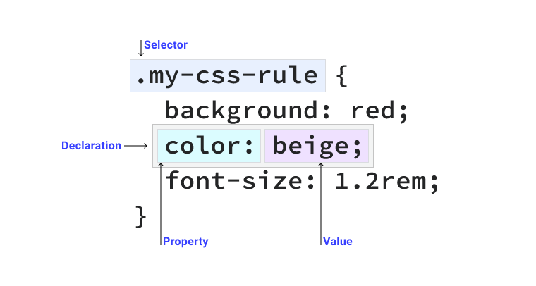
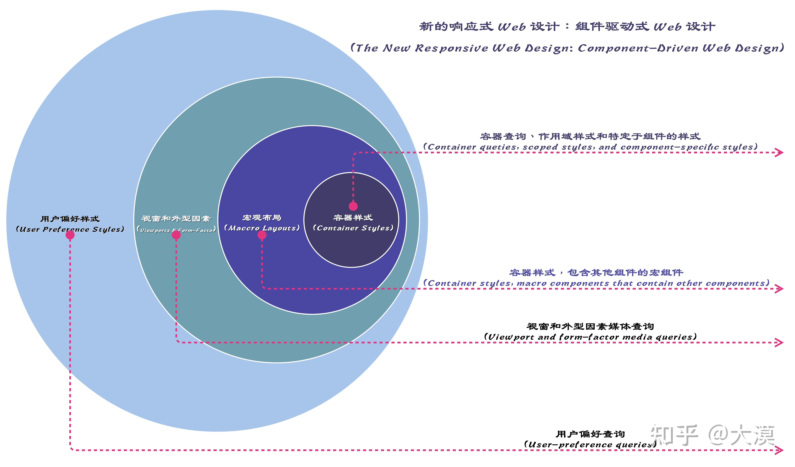

- CSS
  - 特性：[重叠、继承](https://developer.mozilla.org/zh-CN/docs/Learn/CSS/Building_blocks/Cascade_and_inheritance#%E7%90%86%E8%A7%A3%E7%BB%A7%E6%89%BF)
  - 语法
    - @rules
    - CSS 选择器及优先级
        
      ```txt
      1. !important 会覆盖页面内任何位置的元素样式
      1.内联样式，如 style="color: green"，权值为 1000
      2.ID 选择器，如#app，权值为 0100
      3.类、伪类、属性选择器，如.foo, :first-child, div[class="foo"]，权值为 0010
      4.标签、伪元素选择器，如 div::first-line，权值为 0001
      5.通配符、子类选择器、兄弟选择器，如*, >, +，权值为 0000
      6.继承的样式没有权值
      ```
    - 单位、值、function
    - 自定义变量
  - CSSOM
    - [An Introduction and Guide to the CSS Object Model (CSSOM)](https://css-tricks.com/an-introduction-and-guide-to-the-css-object-model-cssom/#top-of-site)
    - element.style
    - styleSheets
    - CSS Typed OM
  - [页面布局](./CSS页面布局.md)
  - 文本排版
    - [基础：CSS 样式文本](https://developer.mozilla.org/en-US/docs/Learn/CSS/Styling_text)
    - [Typography for Developers](https://css-tricks.com/typography-for-developers/)
    - [Typography in CSS](https://cssreference.io/typography/)
    - [CSS Typography: The Basics](https://www.webfx.com/blog/web-design/css-typography-01/)
    - 工具
      - [opentype.js](https://github.com/opentypejs/opentype.js)
      - [awesome web typography](https://github.com/deanhume/typography)
      - [Typography.js](http://kyleamathews.github.io/typography.js/)
  - 响应式设计
    - API
      - 媒体查询
      - 容器查询
      - Viewport 尺寸单位（vw、vh）
    - 实践
      - Viewport 断点
      - 移动优先
      - [组件驱动式Web设计](https://zhuanlan.zhihu.com/p/497961289)
          

  - 页面
    - 颜色形状
    - 变形
      - [zoom和transform:scale的区别](https://www.zhangxinxu.com/wordpress/2015/11/zoom-transform-scale-diff/)
  - 多媒体
    - 图片
  - 交互
    - 动画
      - 库
        - **anime.js**
        - [GSAP](https://github.com/greensock/GSAP)
    - 过度
  - CSS 项目实战
    - UI 设计规范
    - CSS 重置
      - [reseter](https://github.com/resetercss/reseter.css)
      - [normalize.css](https://github.com/necolas/normalize.css)
    - 工程化工具
      - scss
      - postcss
        - [插件](#postcss-插件)
    - CSS 编程
      - 模块
      - 变量
      - 嵌套
      - 复用
        - mixin
        - func
    - 样式封装
      - BEM
      - CSS Modules
  
        > 下面两种需要结合 JS 层面及框架使用
      
      - CSS in JS
      - ShadowDOM
    - 原子化 CSS (Atomic CSS)
      - TailwindCSS
        - [如何评价CSS框架TailwindCSS？ - 山月的回答 - 知乎](https://www.zhihu.com/question/337939566/answer/1752928891)
      - https://github.com/antfu/unocss
    - CSS 项目实践
      - variable 主题控制
      - css utils：原子化 CSS + 工具语法扩展
      - css component：BEM + utils
  - 其他
    - clip-path
- HTML
  - 元素分类
    - 文档元信息
    - 语义标签
    - 链接
    - 替换型标签（script、iframe、媒体相关，如声音、图片、视频等外部元素替换自身的一类标签）
    - 表单
    - 表格
  - 事件冒泡与委托机制
- 专题
  - [滚动穿透](./滚动穿透.md)

## postcss 插件

- postcss-preset-env
- csspre
- [autoprefixer](https://github.com/postcss/autoprefixer#css-in-js) 处理兼容性前缀