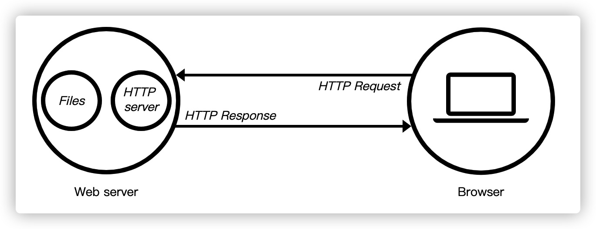
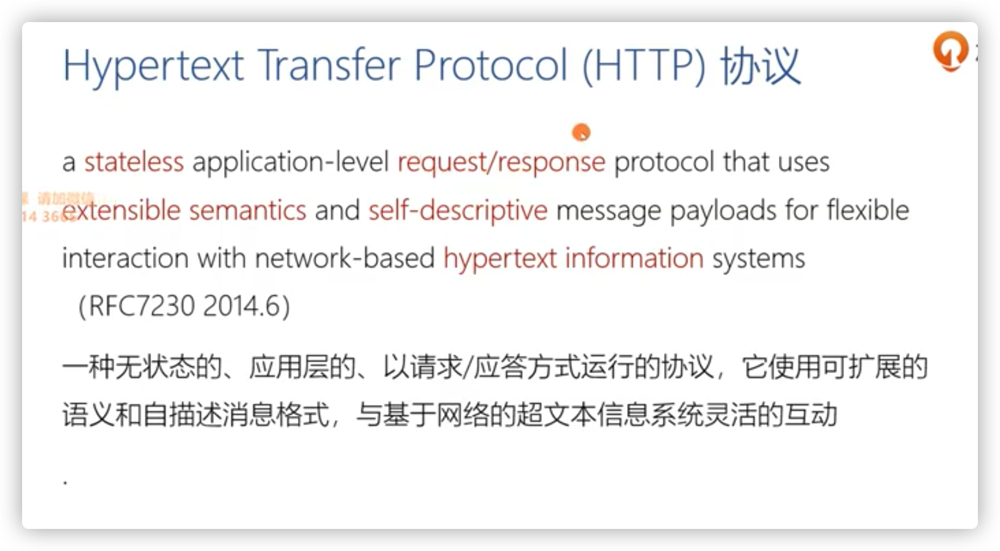

---
tags:
 - http
---

# Http 相关概念及背景

#### 背景

1989 年，任职于欧洲核子研究中心（CERN）的蒂姆·伯纳斯 - 李（Tim Berners-Lee）发表了一篇论文，提出了在互联网上构建超链接文档系统的构想。这篇论文中他确立了三项关键技术：

1. URI：即统一资源标识符，作为互联网上资源的唯一身份；

2. HTML：即超文本标记语言，描述超文本文档；

   *超文本相较于纯文本，就是含有超链接，**超链接**的本质就是从当前的HTML文档跳转到另一个HTML文档，所以是网状结构，文档与文档之间可以相互联系*

3. HTTP：即超文本传输协议，用来传输超文本。

**HTTP 设计之初的目的是用来传输纯文本数据**。但由于形式灵活，搭配 URI、HTML 等技术能够把互联网上的资源都联系起来，构成一个复杂的超文本系统，让人们自由地获取信息，所以得到了迅猛发展。蒂姆把这个系统称为“万维网”（World Wide Web），也就是我们现在所熟知的 Web。

#### HTTP 超文本传输协议

**超文本**，有两层含义：

1. 超文本相较于纯文本，就是含有超链接，能够从一个“超文本”跳跃到另一个“超文本”，形成复杂的非线性、网状的结构关系。

   我们最熟悉的超文本应该是 HTML 了，它本身只是纯文字文件，但内部用很多标签定义了对图片、音频、视频等的链接，再经过浏览器的解释，呈现在我们面前的就是一个含有多种视听信息的页面。

   但是 HTTP 不是 HTML，这个可能要特别强调一下，千万不要把 HTTP 与 HTML 混为一谈，虽然这两者经常是同时出现。**HTML 是超文本的载体，是一种标记语言，使用各种标签描述文字、图片、超链接等资源，并且可以嵌入 CSS、JavaScript 等技术实现复杂的动态效果**。单论次数，在**互联网上 HTTP 传输最多的可能就是 HTML**，但要是论数据量，HTML 可能要往后排了，图片、音频、视频这些类型的资源显然更大。

2. 在互联网早期只是提供纯文本信息，但发展到现在，“文本”的涵义已经被大大地扩展了，图片、音频、视频、甚至是压缩包，在 HTTP 眼里都可以算做是“文本”，故HTTP 传输的是文字、图片、音频、视频等超文本数据。

**传输协议**，计算机之间数据交流通信的规范。

> PS 如今“超文本”容易让人误解，感觉 HTTP 称作“超媒体传输协议” 更恰当。

#### HTTP 协议应用结构

HTTP 协议中的两个端点称为请求方和应答方。请求方通常就是 Web 浏览器，也叫 user agent，应答方是 Web 服务器，存储着网络上的大部分静态或动态的资源。在浏览器和服务器之间还有一些“中间人”的角色，如 CDN、网关、代理等，它们也同样遵守 HTTP 协议，可以帮助用户更快速、更安全地获取资源。HTTP 协议不是一个孤立的协议，需要下层很多其他协议的配合。最基本的是 TCP/IP，实现寻址、路由和可靠的数据传输，还有 DNS 协议实现对互联网上主机的定位查找。对 HTTP 更准确的称呼是“HTTP over TCP/IP”，而另一个“HTTP over SSL/TLS”就是增加了安全功能的 HTTPS。

> 随着时代发展，web 从最初提供文本信息（超文本）到多媒体（超媒体）到提供软件应用服务，即 Web App，是 Web 的一种进化。硬核的翻译过来大概是“基于万维网的应用”，比如你在 Web 浏览器中使用的 Youtube、Twitter、Medium、Github 等等，**它们之间仍然可以通过网址（URL）随意互相链接，遵循 Web 开放标准，并且你几乎可以在任何一个具备浏览器的平台上使用这项服务，因此 Web App 同样是开放的。**
>
> PWA(Progressive Web Apps) 正是对 Web App 更好的衍生发展，并遵循 web 开放准则
>
> **Web 的本质是 Open（开放）与 Decentralized （去中心化），这才是万维网（WWW）的初衷，这才是所有这些特性能成立的前提。**
>
> 而 Hybrid App 或者小程序等，他们只是借用了 web 平台技术标准、以 Web 范式为 Native 平台进行开发，封闭自己生态。**无论他们长得有多像 Web**，**他们都不是 Open Web 平台的一员**。

#### HTTP 发展历程：

1. HTTP 协议始于三十年前蒂姆·伯纳斯 - 李的一篇论文；
2. HTTP/0.9 是个简单的文本协议，只能获取文本资源；
3. HTTP/1.0 确立了大部分现在使用的技术，但它不是正式标准；
4. HTTP/1.1 是目前互联网上使用最广泛的协议，功能也非常完善；
5. HTTP/2 基于 Google 的 SPDY 协议，**注重性能改善**，但还未普及；
6. HTTP/3 基于 Google 的 QUIC 协议，是将来的发展方向。

更多详细可参考 [HTTP的发展](https://developer.mozilla.org/zh-CN/docs/Web/HTTP/Basics_of_HTTP/Evolution_of_HTTP)。

HTTP/2 的制定充分考虑了现今互联网的现状：宽带、移动、不安全，在高度兼容 HTTP/1.1 的同时在性能改善方面做了很大努力，主要的特点有：

1. **二进制协议，不再是纯文本**；
2. 可发起多个请求，废弃了 1.1 里的管道；
3. 使用专用算法压缩头部，减少数据传输量；
4. 允许服务器主动向客户端推送数据；
5. 增强了安全性，“事实上”要求加密通信。

> 

#### 相关协议及软件应用

HTTP 是构建互联网的重要基础技术，它没有实体，依赖许多其他的技术来实现，但同时许多技术也都依赖于它，我们可以把 HTTP 定义为“与 HTTP 协议相关的所有应用层技术的总和”。

互联网(Internet)，包含各式各样的资源，也对应着各式各样的协议，例如超文本资源使用 HTTP，普通文件使用 FTP，电子邮件使用 SMTP 和 POP3 等，而 HTTP 是构成万维网(web)的基础，故万维网只是互联网的一个子集。

在 HTTP 协议里，浏览器本质上是一个 HTTP 协议中的请求方，浏览器的角色被称为“User Agent”即“用户代理”，意思是作为访问者的“代理”来发起 HTTP 请求。不过在不引起混淆的情况下，我们通常都简单地称之为“客户端”。

Web 服务器，在 HTTP 协议里扮演响应方，“Web 服务器”时有两个层面的含义：硬件和软件。软件方面指能够处理 http 请求，并且响应 HTTP 请求的资源或者提供 Web 服务的应用程序，故分为两类

- 静态服务，提供静态资源服务能力，仅仅托管文件，并原样传送给请求方，如 nginx、Tomcat等，当然它们把请求转发给 、Java、Node.js 等业务应用，返回动态的信息。
- 动态服务，服务器会动态处理返回的资源内容

HTTP 是一个client-server 架构协议，中间会经过重重关卡

CDN(Content Delivery Network) 是中间一个重要的角色，翻译过来就是“内容分发网络”。它应用了 HTTP 协议里的缓存和代理技术，代替源站响应客户端的请求，让浏览器的请求不用“千里迢迢”地到达源站服务器，直接在“半路”就可以获取响应。如果 CDN 的调度算法很优秀，更可以找到离用户最近的节点，大幅度缩短响应时间。除了基本的网络加速外，还提供负载均衡、安全防护、边缘计算、跨运营商网络等功能，能够成倍地“放大”源站服务器的服务能力。

Web Service，它的名字与 Web Server 很像，但却是一个完全不同的东西。service通常是指服务程序，跑在server上，server可以理解成容器、平台。Web Service 是一种**应用服务开发规范**，使用 client-server 主从架构，**基于 Web（HTTP）的服务架构技术**。

参考

- 《透视HTTP协议》
- [Web 在继续离我们远去](https://zhuanlan.zhihu.com/p/22561084)

