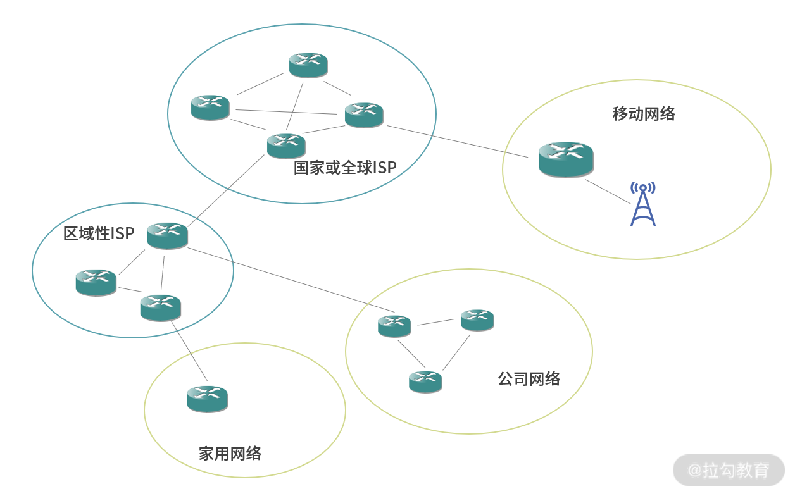

互联网的组成

互联网是一个非常庞大的结构，从整体来看，互联网就是一个立体的、庞大的网状结构，由不同的子网组成。

局域网络之间，可以通过**路由器、交换机**进行连接，从而构成一个更大的局域网。

这个时候因为路径发生了分叉，数据传输到这些节点需要选择方向，因此我们在这些节点需要进行交换（Switch）。

交换技术的本质，就是让数据切换路径。因为，网络中的数据是以分组或封包（Packet）的形式传输，因此这个技术也称作封包交换技术（Packet Switch）。

路由器（Router）和链路层交换机（Link-Layer Switch）。通常情况下，两个网络可以通过路由器进行连接，多台设备可以通过交换机进行连接。但是路由器通常也具有交换机的功能。

在一定范围内的区域，离用户较近的地方还可以部署服务器，帮助用户完成计算。这相当于计算资源的下沉，称为边缘计算。相比中心化的计算，边缘计算延迟低、链路短，能够将更好的体验带给距离边缘计算集群最近的节点。从而让用户享受到更优质、延迟更低、算力更强的服务。

路由器也承担了链路层网关的作用，作为家用电器之间信息的交换设备。

### 数据传输

把网络传输分成两类，

- 一类是端到端（Host-to-Host）的能力，由 TCP/IP 协议群提供。

- 还有一类是广播的能力，是一对多、多对多的能力，可以看作是端到端（Host-to-Host）能力的延伸。

网络基础设施往往不能一次性传输太大的数据量，因此通常会将数据分片传输。比如传输一个 MP3，我们会将 MP3 内容切分成很多个组，每个组也称作一个封包，英文都是 Packet。这样，如果一个封包损坏，只需要重发损坏的封包，而不需要重发所有数据。

另一方面，网络中两点间的路径非常多，如果一条路径阻塞了，部分封包可以考虑走其他路径。发送端将数据拆分成封包（Packet），封包在网络中遇到岔路，由交换器和路由器节点决定走向

