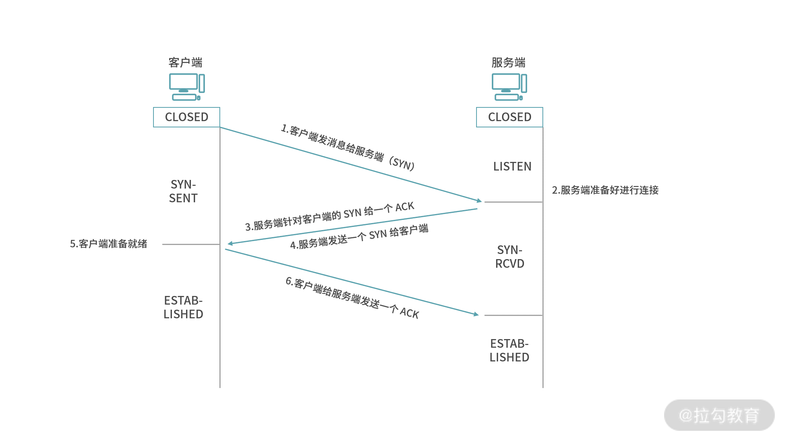
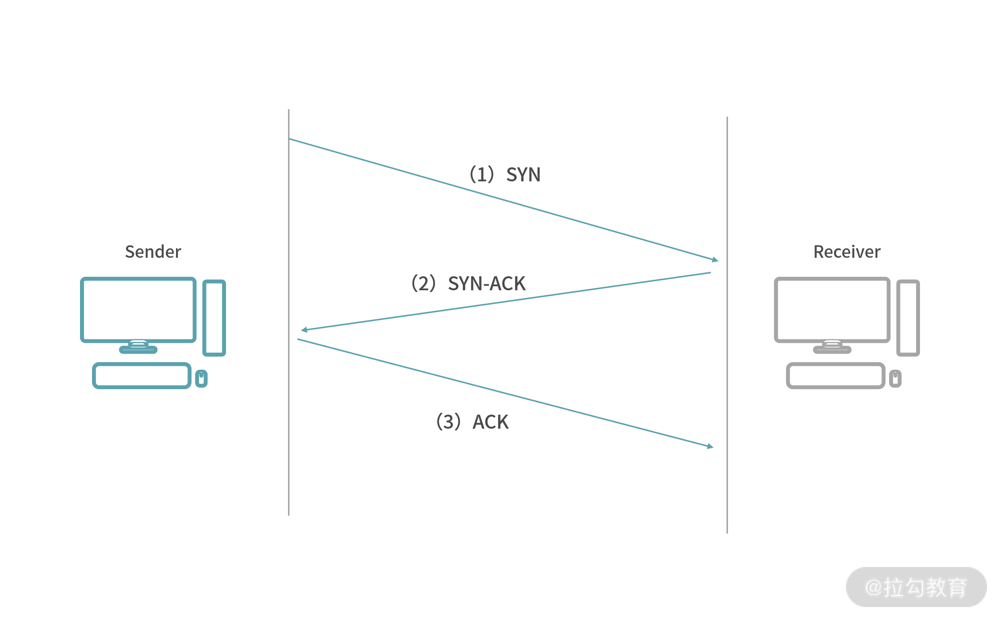
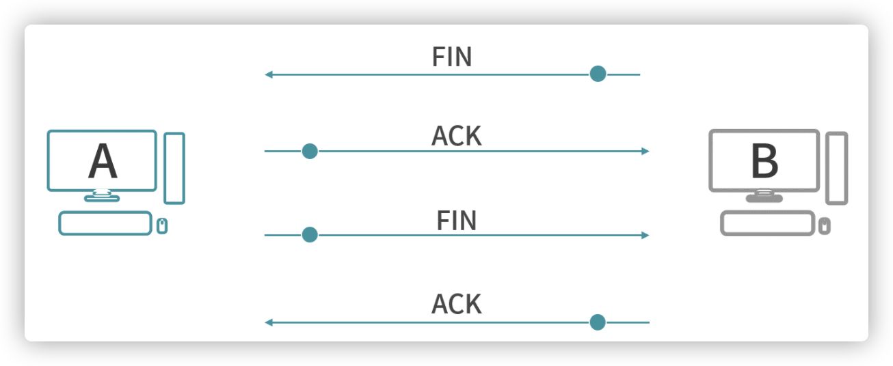

可靠性
- 完整性
  - 对于数据包丢失的情况，TCP 提供重传机制；
  - TCP 引入了数据包排序机制，用来保证把乱序的数据包组合成一个完整的文件

TCP 协议有这样几个基本操作：

- 如果一个 Host 主动向另一个 Host 发起连接，称为 SYN（Synchronization），请求同步；
- 如果一个 Host 主动断开请求，称为 FIN（Finish），请求完成；（表示不会再发送数据，但会可以继续接受数据）
- 如果一个 Host 给另一个 Host 发送数据，称为 PSH（Push），数据推送。

以上 3 种情况，接收方收到数据后，都需要给发送方一个 ACK（Acknowledgement）响应。请求/响应的模型是可靠性的要求，如果一个请求没有响应，发送方可能会认为自己需要重发这个请求。

TCP 为什么握手是 3 次、挥手是 4 次？

1. TCP 是一个面向连接的协议，也就是通信前需要建立连接。

   连接是通信双方的一个约定，目标是让两个在通信的程序之间产生一个默契，保证两个程序都在线，而且尽快地响应对方的请求，这就是连接（Connection）。连接是网络行为状态的记录。

   设计上，连接是一种传输数据的行为。传输之前，建立一个连接。具体来说，数据收发双方的内存中都建立一个用于维护数据传输状态的对象，如ip地址、端口号等。

   TCP 是一个连接导向的协议，设计有建立连接（握手）和断开连接（挥手）的过程；

   UDP 是一个面向报文（Datagram-oriented）的协议——协议双方不需要建立连接，直接传送报文（数据）。

2. 建立连接的过程（三次握手）

   

   简化如下

   

   你可能以为 2 次握手就足够了，为什么需要第三次握手？

   因为服务端还没有确定客户端是否准备好了、接受到信息。比如步骤 3 之后，服务端马上给客户端发送数据，这个时候客户端可能还没有准备好接收数据。因此还需要增加一个过程。

3. 断开连接的过程（4 次挥手）

   

   服务端可不可以像握手那样马上传 FIN 回去？

   不可能，断开连接之前服务端可能需要释放掉一些资源，经过一个等待，确定可以关闭连接了，再发一条 FIN 给客户端。

因为要保持连接和可靠性约束，TCP 协议要保证每一条发出的数据必须给返回，返回数据叫作 ACK（也就是响应）。