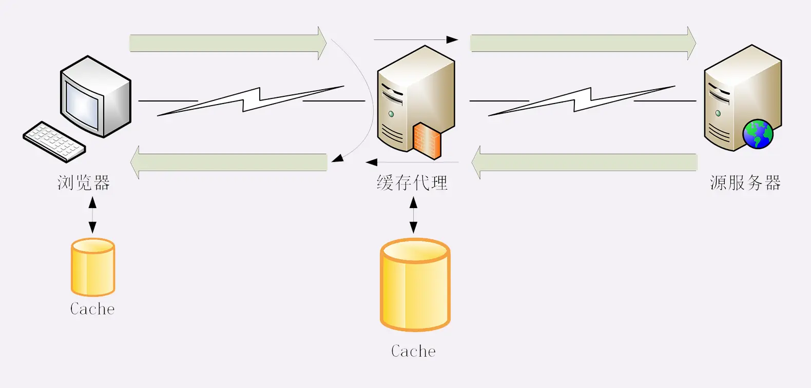
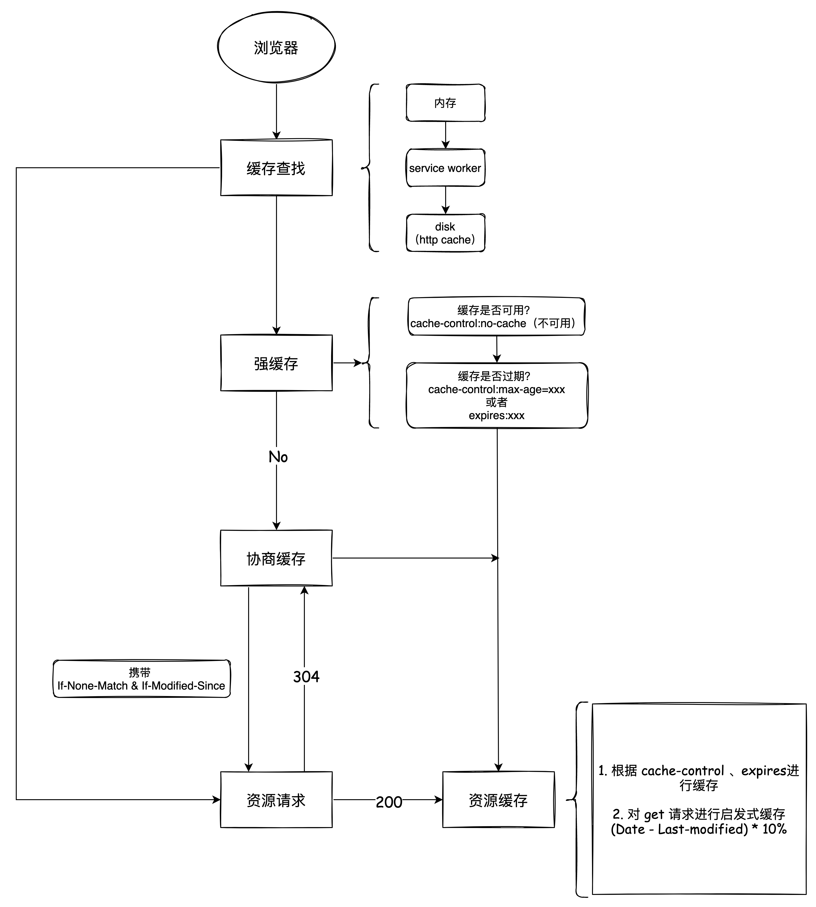
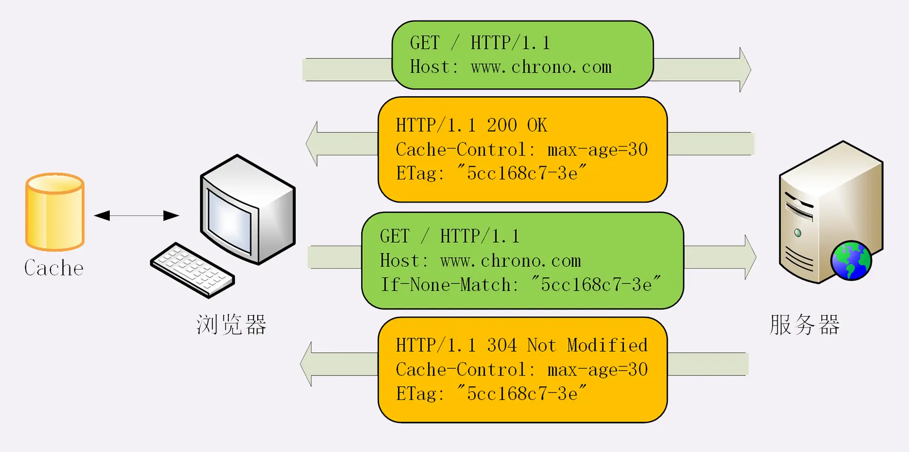
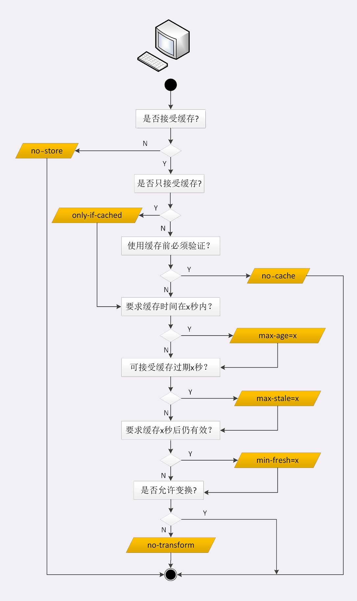
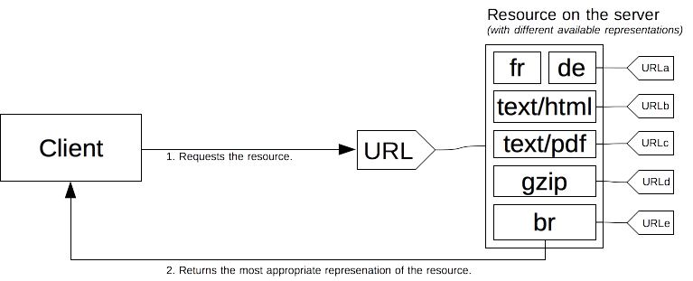
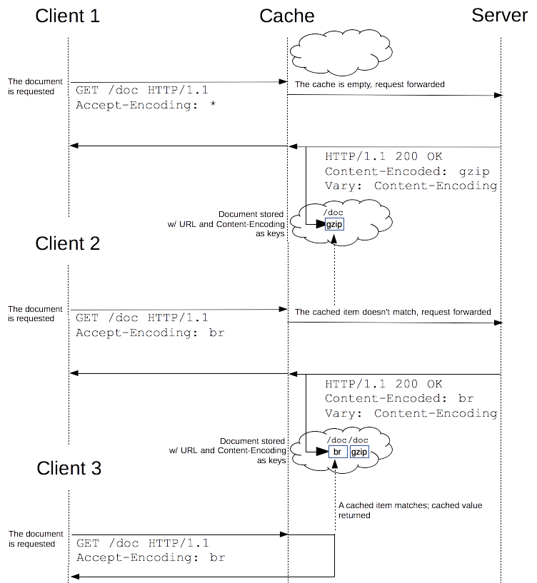

# HTTP 缓存

- HTTP 缓存
  - [Cache-Control](#cache-control)
  - 缓存位置
    - [代理缓存](#代理缓存)
      - [Vary：缓存验证器](#Vary：缓存验证器)
    - [浏览器缓存](#浏览器缓存)
  - [协商缓存](#协商缓存)
  - [缓存设置控制](#缓存设置控制)
    - [通过 response 进行缓存控制](#通过-response-进行缓存控制)
    - [通过 request 进行缓存控制](#通过-request-进行缓存控制)
  - [前端缓存最佳实践](../前端工程化/前端缓存最佳实践.md)
  - SWR：stale-while-revalidate

## Cache-Control

http 中控制缓存的主要字段有一下三个：

1. Cache-Control(HTTP/1.1，优先级高)
2. Expires(HTTP/1.0)
   > HTTP 1.0 的字段，表示缓存到期时间，是一个绝对的时间 (当前时间+缓存时间)
3. Pragma: no-cache(相当于 Cache-Control: no-cache，主要是为了兼容 HTTP/1.0)

重点学习 `Cache-Control`

- Cache-Control
  - no-store，不允许存储缓存资源
  - no-cache，不允许先使用缓存资源，强制发送请求（协商缓存验证）
  - max-age，缓存时间，相对响应报文的创建时刻
    > 当没有显示设置 cache-control 或是 expires 时, 大部分浏览器会使用**启发式缓存**, 把资源缓存下来; 如果真的不想用缓存, 还是主动设置一下 cache-control: no-store。  
    > 启发式计算缓存在 RFC 里的建议是 **(Date - Last-modified) \* 10%**
  - must-revalidate，当缓存失效时必须与回源服务器验证
    > 当缓存失效时，其实带不带 must-revalidate，都会发送请求，那么 must-revalidate 好像没什么作用？主要有一下两个使用场景:
    >
    > 1. HTTP 规范是允许客户端在某些特殊情况下直接使用过期缓存的，比如服务器关闭或失去连接，导致请求发送失败的时候，即使设置了 `Cache-Control: max-age=0` 还是回继续使用缓存；还有比如有配置一些特殊指令（stale-while-revalidate、stale-if-error 等）的时候也会导致继续使用缓存，可以使用 must-revalidate 进行阻止。
    > 2. 与 proxy-revalidate（下文介绍）做区别，must-revalidate 强调**回源服务器**

## 代理缓存

缓存代理身份特殊，即是客户端也是服务端，所以还需要有一些新的“Cache-Control”属性来对它做细致的控制。

- private，表示缓存只能在客户端保存，不能放在代理上与别人共享
- public，缓存完全开放，谁都可以存，谁都可以用
- proxy-revalidate，缓存失效时代理服务器验证即可
- s-maxage，单独设置代理服务器缓存时间，与 max-age 区别开
- no-transform，禁止代理服务对资源做转换

## 浏览器缓存

浏览器对资源的缓存位置分为：
- 内存
  - 预加载器
  - preload 指令
- service-work
- http-cache
- push-cache

> ⚠️ 内存缓存的行为，各个浏览器并没有统一规范，而且内存缓存并不关注 HTTP 语义，浏览器导航中会重用资源，即是资源带有 `max-age=0` 或 `no-cache`。  
> 唯一可能例外的是 `no-store` 内存缓存在某些情况下确实会遵守该指令。

> HTTP Cache 几乎遵从 HTTP 规范，但有一个例外，即是资源带有，HTML 中 prefetch 指令获取的资源会缓存在 HTTP Cache 中一定时间（5分钟）

浏览器 http-cache 策略分为两种：强缓存、协商缓存

1. 缓存查找：查找不到直接发送请求
2. 强制缓存：通过 Expires 和 Cache-Control 判断缓存是否可用是否到期，如果可用则直接使用，否则协商缓存
3. [协商缓存](#协商缓存)：服务端返回资源时会带有 Last-modified、ETag信息，当协商缓存时，客户端直接发起请求并且携带 If-Modified-Since 、If-None-Match 去请求后台，服务器根据条件请求字段判断资源是否更新
   - 若资源更新，返回资源和 200 状态码
   - 否则，返回 304，告诉浏览器直接从缓存获取资源

### 用户行为

> 以下 chrome 实现效果

💡 浏览器某些用户行为会在请求头带上“私货”以控制缓存：

1. 地址栏访问，链接跳转是正常用户行为，将会触发浏览器缓存机制
2. 前进后退也会触发浏览器缓存机制，但某些情况浏览器会直接缓存内存到时直接读取即可（[Back/forward cache](https://web.dev/bfcache/) ）
3. 刷新行为会对 html 文件自动请求带上 `Cache-Control:max-age=0`
4. 强刷或者禁止缓存所有请求会带上 `Cache-Control: no-cache` ，并且不携带 If 条件验证，强制请求，不做协商。

## 协商缓存

HTTP 协议就定义了一系列“If”开头的“条件请求”字段，专门用来与服务器检查验证资源是否过期。**当请求带有条件字段，服务器就会验证资源是否过期**。

- If-Modified-Since 、Last-modified，根据文件修改日期做验证
- If-None-Match 、ETag，

ETag 是“实体标签”（Entity Tag）的缩写，是资源的一个唯一标识，文件内容的 hash 值。比 Last-modified 做判断更精准，做验证时**优先级比 Last-modified 高**， 因为

1. Last-Modified 的时间单位是秒，如果某个文件在 1 秒内改变了多次，那么他们的 Last-Modified 其实并没有体现出来修改
2. 有时一个文件内容没什么变化，但修改时间发生了变化。

ETag 还有“强”“弱”之分。强 ETag 要求资源在字节级别必须完全相符，弱 ETag 在值前有个“W/”标记，只要求资源在语义上没有变化，但内部可能会有部分发生了改变（例如 HTML 里的标签顺序调整，或者多了几个空格）。

ETag 工作原理：

Last-modified 也同样类似。

## 缓存控制

### 通过 response 进行缓存控制

  

### 通过 request 进行缓存控制

`Cache-Control` 是个通用字段，客户端也可以发送附带 `Cache-Control` 缓存指令的请求（但浏览器对请求缓存控制的支持有限，比如仅支持 `Cache-Control: max-age=0` 或者 `Cache-Control: no-cache` 去做刷新）。

- no-cache，不使用缓存，直接发送请求
- max-stale，表明客户端愿意接收一个超过指定过期时间范围内的资源，比如 `max-stale: 5` 过期后 5 秒内都可以
- min-fresh，相当于缩短过期时间，比如 `min-fresh：5`，只允许到期前 5 秒之前的时间内
- only-if-cached，表示只接受代理缓存的数据，不接受源服务器的响应
- no-transform，禁止代理服务对资源做转换

## Vary：缓存验证器

URL 原则上是一种网络上的资源概念，同个 URL 可以有多种资源版本形式。

比如，你可以 `Accept: text/html`，也可以 `Accept: text/csv` 改为以不同的格式获取相同的资源，这些都是服务器[内容协商](https://developer.mozilla.org/zh-CN/docs/Web/HTTP/Content_negotiation)的结果。

vary 虽然不是 cache-control 的属性值，是内容协商的结果，带在响应头部，表示一个内容版本，可协作缓存决策依据。

大多数浏览器都支持 vary 缓存验证，但要注意的是浏览器通常不会实现为同个 URL 存储多个变体的功能，只会为唯一 URL 做单一内容版本存储；而代理服务器通常可自定义实现对同个 URL 多个 vary 缓存。

下图是代理缓存根据 vary 缓存依据流程：

## SWR：stale-while-revalidate

`stale-while-revalidate` 是一种缓存策略：优先使用缓存，然后再更新缓存。这与以往常见的缓存策略：“缓存 -> 过期 -> 更新 -> 使用” 有所不同，SWR：“缓存 -> 过期 -> 使用 -> 更新”。

## 学习参考

- [MDN HTTP 缓存](https://developer.mozilla.org/zh-CN/docs/Web/HTTP/Caching#Cache_validation)
- [可能是最被误用的 HTTP 响应头之一 Cache-Control: must-revalidate](https://zhuanlan.zhihu.com/p/60357719)
- [understanding-vary-header](https://www.smashingmagazine.com/2017/11/understanding-vary-header/)
- [A Tale of Four Caches](https://calendar.perfplanet.com/2016/a-tale-of-four-caches/)
- [Cache-Control 的 stale-while-revalidate 指令](https://zhuanlan.zhihu.com/p/64694485)

- API
- core
  - 缓存请求、缓存策略
    - swr
  - 请求管道
    - 去除重复请求
    - retry
      - 聚焦时重新验证
      - 网络恢复时重新验证
      - 智能错误重试
      - 轮询
    - 中断
  - Optimistic UI
- adapter
- net、cache

