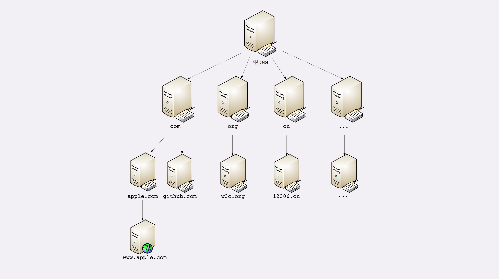
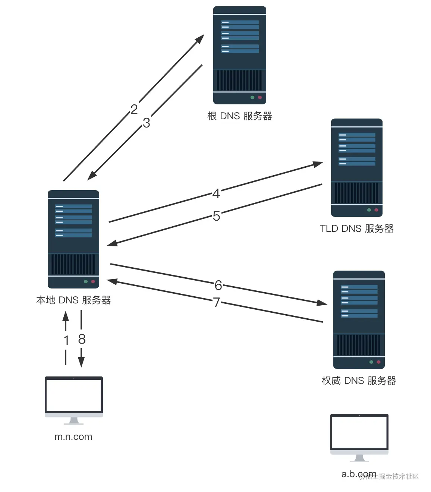

---
tags:
 - http
---
# HTTP

- HTTP
  - 超文本传输协议
    - 超文本
      - 文字、图片、音频、视频等超文本数据
      - 传输超文本标记语言 + 超链接，能够从一个“超文本”跳跃到另一个“超文本”
  - http 相关协议及软件生态
    
    - [网络协议栈](#网络协议栈)
    - [DNS](#dns)
      - [DNS 域名解析过程](#dns-域名解析过程)
      - 基于 DNS 负载均衡
    - [TCP 连接](./TCP%20连接.md)
    - 网络安全
      - DNS 劫持
      - TCP：SYN 泛洪攻击：攻击者不回应 ACK 包（第三次握手不进行）
      - HTTP 劫持
      - TSL 证书链
        - 证书私钥泄漏
        - 客户端安装了不信任的证书
  - [http 各版本协议对比](./http%20各版本协议对比.md)
  - [http 基础](./前端必知的%20http%20基础.md)
  - [http 缓存](./http%20缓存.md)
  - [https](./https.md)

## 网络协议栈

### TCP/IP 协议栈

1. 链接层（link layer）
   - 负责在以太网、WiFi 这样的底层网络上发送原始数据包
   - 通过 MAC 地址来寻找网络上的设备
2. 网络层（internet layer）
   - 通过 IP 地址寻找局域网
3. 传输层（transport layer）
   1. TCP
   2. UDP
4. 应用层（application layer）

### OSI 协议栈（Open System Interconnection Reference Model）

仅仅只是提供标准**参考**的协议栈，毕竟 TCP/IP 等协议先已经在许多网络上实际运行，再推翻重来是不可能的。所以，OSI 分层模型在发布的时候就明确地表明是一个“参考”，不是强制标准。但日常交流的时候我们通常使用 OSI 模型，用四层、七层等术语。

1. 第一层：物理层，网络的物理形式，例如电缆、光纤、网卡、集线器等等；
2. 第二层：数据链路层，它基本相当于 TCP/IP 的链接层；
3. 第三层：网络层，相当于 TCP/IP 里的网际层；
4. 第四层：传输层，相当于 TCP/IP 里的传输层；
5. 第五层：会话层，维护网络中的连接状态，即保持会话和同步；
6. 第六层：表示层，把数据转换为合适、可理解的语法和语义；
7. 第七层：应用层，面向具体的应用传输数据。

日常交流的时候我们通常使用 OSI 模型，用四层、七层等术语:

所谓的“四层负载均衡”就是指工作在传输层上，基于 TCP/IP 协议的特性，例如 IP 地址、端口号等实现对后端服务器的负载均衡。

所谓的“七层负载均衡”就是指工作在应用层上，看到的是 HTTP 协议，解析 HTTP 报文里的 URI、主机名、资源类型等数据，再用适当的策略转发给后端服务器。

## DNS

DNS 核心系统是一个分层结构，提供分布式存储查找服务：

1. 根域名服务器（Root DNS Server）：管理顶级域名服务器，返回“com”“net”“cn”等顶级域名服务器的 IP 地址；
2. 顶级域名服务器（Top-level DNS Server）：管理各自域名下的权威域名服务器，比如 com 顶级域名服务器可以返回 apple.com 域名服务器的 IP 地址；
3. 权威域名服务器（Authoritative DNS Server）：管理自己域名下主机的 IP 地址，比如 apple.com 权威域名服务器可以返回 www.apple.com 的 IP 地址。
4. *本地域名服务器*

  

### DNS 域名解析过程

DNS 查询链路：  
浏览器缓存 > 操作系统缓存 > 本地 DNS 服务器（比如 网络运行商搭建的 DNS 服务器，同样也起着缓存、代理的作用）> 核心 DNS 服务器（ 根级 DNS > 顶级 DNS > 权威 DNS）

DNS 域名解析过程是递归查询 + 迭代查询

- 递归（请求主体发生改变）查询：主机 -> 本地 DNS 服务器发起查找
- 迭代查询：本地 DNS 服务器 -> 核心 DNS 服务器

比如整个的查询过程如下：

1. 主机先向其本地域名服务器发起递归查询
2. 本地域名服务器采用迭代的查询方式，它先向根域名服务器查询
3. 根域名服务器告诉本地域名服务器，下一次应该查询的顶级域名服务器的IP地址。
4. 本地域名服务器向顶级域名服务器发起查询。
5. 顶级域名服务器告诉本地域名服务器，下一次应查询的权限域名服务器IP地址
6. 本地域名服务器向权限域名服务器发起查询。
7. 权限域名服务器告诉本地域名服务器所查询的IP地址。
8. 本地域名服务器把查询结果告诉主机

  
