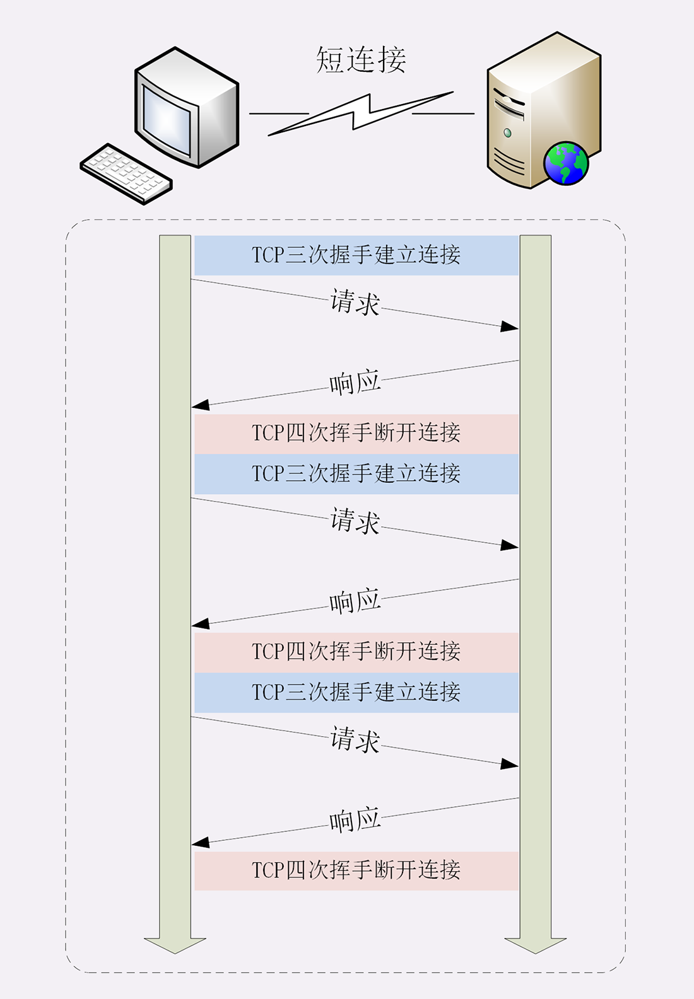
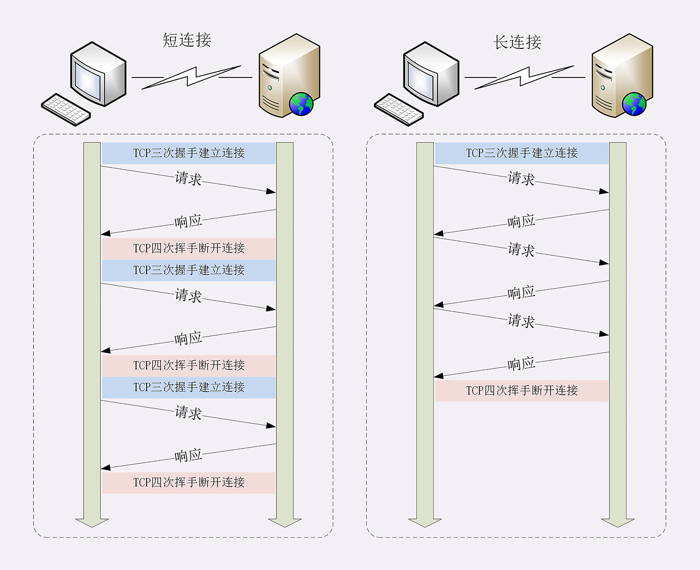
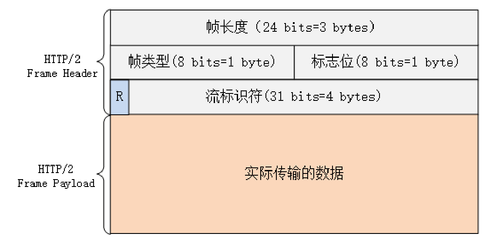
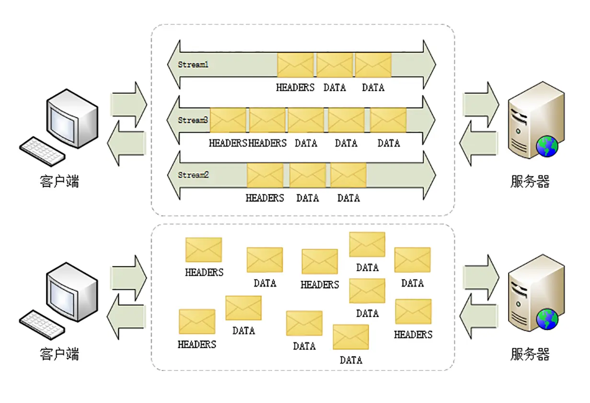

# http 各版本协议对比

- HTTP/1.0
- 增加了 HEAD、POST 等新方法；增加了响应状态码，标记可能的错误原因；引入了协议版本号概念；引入了 HTTP Header（头部）的概念，让 HTTP 处理请求和响应更加灵活；传输的数据不再仅限于文本。
- HTTP/1.1
  - 增加了 PUT、DELETE 等新的方法；
  - 增加了缓存管理和控制；
  - 默认支持长连接
  - 允许响应数据分块（chunked），利于传输大文件；
  - 强制要求 Host 头，让互联网主机托管成为可能。
- [HTTP/2](#http2)
  - 头部压缩
  - 二进制帧格式传输
  - 多路复用，废弃了 1.1 里的管道；
  - 帧控制
  - 服务推送
- 

## HTTP/1.1

### 默认支持长连接

客户端与服务器端的的**每次请求都需要创建 TCP 连接，服务器响应后断开 TCP 连接**，再请求再创建断开。

因为客户端与服务器的整个连接过程很短暂，不会与服务器保持长时间的连接状态，所以就被称为“短连接”（short-lived connections）。

  

TCP 的连接和关闭非常耗时间，长连接即在一个请求结束后保持 TCP 连接不关闭，其他多个请求可以复用到同一 TCP 连接。

  

#### http 队头阻塞

即使是长连接，在同一条 TCP 连接中由于 http 的请求应答模式，决定了 http 是“半双工”，只能一发一回收发数据，队列后边的请求必须等待队首完成，如果队首的请求因为处理的太慢耽误了时间，那么队列里后面的所有请求也不得不跟着一起等待，这就是 http 队头阻塞的根源。

  

#### http 队头阻塞优化：

“并发连接”，即发起多个长连接，但过多连接服务器的资源根本就扛不住，或者被服务器认为是恶意攻击，反而会造成“拒绝服务”。

现代客户端会限制请求并发，比如**大多数浏览器同域连接数在 6~8 个**。

针对并发限制，如果想要我们也可以使用 “域名分发” 技术，将同一服务分发到多个域名。比如 `a.xxx.com`，`b.xxx.com` 等这些域名都指向同一台服务器 `www.xxx.com`，这样实际长连接的数量就又上去了。

### 管道机制

一个TCP连接，可以同时发送多个请求

新增了一些缓存的字段
新增了一些方法，PUT、DELETE、OPTIONS、PATCH
支持断点续传，通过请求头字段Rang来实现

## HTTP/2

HTTP/2 目标就是改进性能，解决了 HTTP/1.x 队头阻塞问题。

### 头部压缩

http 请求头可能带有很多字段或者每次传输重复字段都会导致带宽浪费。

HTTP/2 使用 “HPACK” 算法进行“头部压缩”：
在客户端和服务器两端建立“字典”，用索引号表示重复的字符串，还釆用哈夫曼编码来压缩整数和字符串，可以达到 50%~90% 的高压缩率。

### 二进制格式

> 二进制格式指的是内容格式，不是编码格式，计算机底层下传输的都是二进制数据

HTTP/1.x 里的报文是纯文本形式。对于 TCP 上数据流读取的时候，消息头必须按照必须逐个字符来解析，直到到达换行符为止；而消息体则是按照消息提示的主体长度 `content-length` 去读取。

这也解释了[长连接中队头阻塞问题](#默认支持长连接)：队列后面的 TCP 请求必须等待前面的请求响应完成，**因为文本流读取的过程是一个整体，不可拆分**。

HTTP/2 采用了类似于 TCP 数据包二进制结构，将数据格式化为多个数据包（简称为二进制帧），每个帧的内容都是二进制结构化的，并且每个帧都分配给一个唯一“流” ID。

  

用“HEADERS”帧存放头数据、“DATA”帧存放实体数据。

### 多路复用

每个帧都分配给一个“流”：这里的“流”，其实是一个虚拟的概念，在同一个 TCP 连接中所有消息都是被分成多个二进制帧乱序发送，每条“流”其实可以看作是每个 http 请求，属于同一个 http 请求的消息往返的帧会分配一个唯一的流 ID，将同一个流数据帧按照次序组装起来就是 HTTP/1 里的请求报文和响应报文。

  

http2 就可以在一个 TCP 同时发送接受多个请求 “碎片化”的消息，这就是常说的“多路复用”（ Multiplexing）——多个往返通信都复用一个连接来处理。

### 请求优先级控制

设置数据帧的优先级，让服务器优先处理

### 服务器推送

http2 保留了应用层 http “请求 - 响应答” 语义，是为了兼容保证上层应用继续工作，
但底层不再 “请求 - 响答” 的工作模式，服务器不再是完全被动地响应请求，也可以新建“流”主动向客户端发送消息。比如，在浏览器刚请求 HTML 的时候就提前把可能会用到的 JS、CSS 文件发给客户端，减少等待的延迟，这被称为“服务器推送”（Server Push，也叫 Cache Push）。

## 参考

- [Why is it said that HTTP2 is a binary protocol?](https://stackoverflow.com/questions/58498116/why-is-it-said-that-http2-is-a-binary-protocol)

被问到的一些问题：

管道机制会造成什么样的问题，http2.0是怎么解决的
头部压缩的原理是什么
options方法的作用
http2.0允许服务器主动推送消息，那跟WebSocket有什么区别吗？

- tcp
  - 启动慢
  - 用塞窗口

帧里有流id，流里的帧是有序的
tcp会保证有序送达，多个流是并行乱序发，但看单个流，它里面的帧还是有序的。
tcp层是有序的，所以一个流里的多个帧会按照顺序依次到达，接收方只要依次接收就可以了。

二进制的好处显而易见，用位来表示信息，要比字符串表示简单，比如用01表示host，而用字符串就需要4个字节，而且要用状态机去检测单词，非常麻烦。

http/2在底层是二进制，解析起来快速方便，然后再到应用层对字符串做个映射就行了，不是再编码。

可以再用hpack来理解一下。