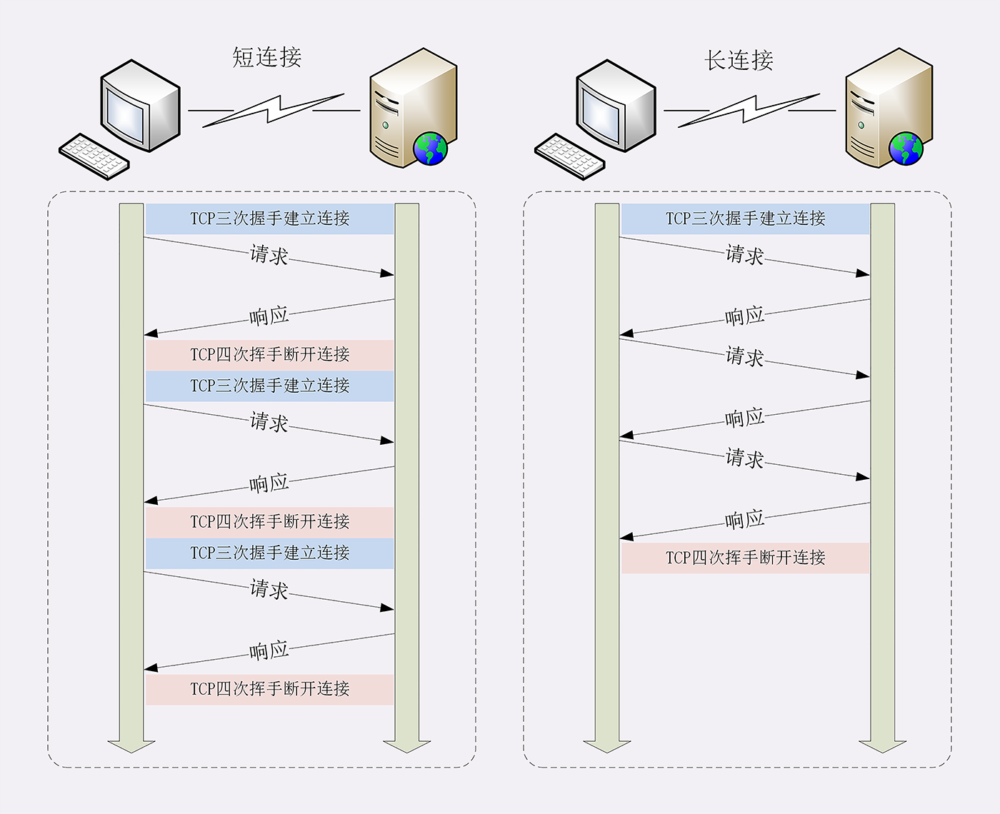

## HTTP/1.1

### 默认支持长连接，也叫“持久连接”

客户端与服务器端的的**每次请求都需要创建 TCP 连接，服务器响应后断开 TCP 连接**，再请求再创建断开。

因为客户端与服务器的整个连接过程很短暂，不会与服务器保持长时间的连接状态，所以就被称为“短连接”（short-lived connections）。

  

TCP 的连接和关闭非常耗时间，长连接即在一个请求结束后保持 TCP 连接不关闭，其他多个请求可以复用到同一 TCP 连接。

  

#### http 队头阻塞

即使是长连接，在同一条连接中由于 http 的请求应答模式，决定了 http 是“半双工”，只能一发一回收发数据，队列后边的请求必须等待队首完成，如果队首的请求因为处理的太慢耽误了时间，那么队列里后面的所有请求也不得不跟着一起等待，这就是 http 队头阻塞的根源。

  

http 队头阻塞优化：

“并发连接”，即发起多个长连接，但过多连接服务器的资源根本就扛不住，或者被服务器认为是恶意攻击，反而会造成“拒绝服务”。

现代客户端会限制请求并发，比如**大多数浏览器同域连接数在 6~8 个**。

针对并发限制，如果想要我们也可以使用 “域名分发” 技术，将同一服务分发到多个域名。比如 `a.xxx.com`，`b.xxx.com` 等这些域名都指向同一台服务器 `www.xxx.com`，这样实际长连接的数量就又上去了。

### 管道机制

一个TCP连接，可以同时发送多个请求

新增了一些缓存的字段
新增了一些方法，PUT、DELETE、OPTIONS、PATCH
支持断点续传，通过请求头字段Rang来实现

## HTTPS（安全连接）

## HTTP/2

目标就是改进性能。

### 头部压缩

HTTP/1 里可以用头字段“Content-Encoding”指定 Body 的编码方式，比如用 gzip 压缩来节约带宽。

使用 “HPACK”算法：在客户端和服务器两端建立“字典”，用索引号表示重复的字符串，还釆用哈夫曼编码来压缩整数和字符串，可以达到 50%~90% 的高压缩率。

### 二进制格式传输

以二进制格式为基础，把原来的“Header+Body”的消息“打散”为数个小片的二进制“帧”（Frame），用“HEADERS”帧存放头数据、“DATA”帧存放实体数据。

### 多路复用

### 请求优先级， 设置数据帧的优先级，让服务器优先处理

### 服务器推送

被问到的一些问题：

管道机制会造成什么样的问题，http2.0是怎么解决的
头部压缩的原理是什么
options方法的作用
http2.0允许服务器主动推送消息，那跟WebSocket有什么区别吗？

> http1.1 没有明确的标识出某个rsp是哪个req的。如果服务端不等待上一个req-rsp结束就发出另一个rsp，那么客户端无法区分收到的数据。
> http2 解决了队头阻塞
> 每个request-response都被拆分为若干个frame发送
> 序号可以区分出rsp是哪个req的