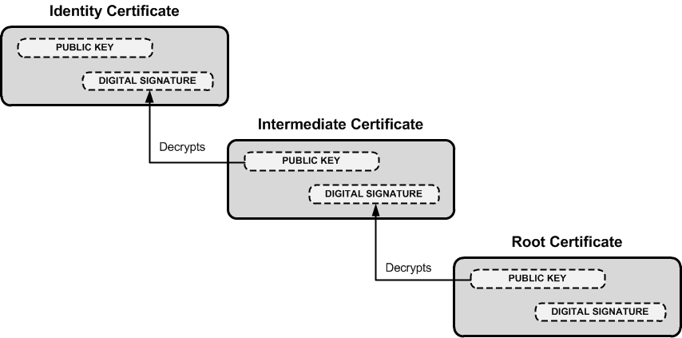
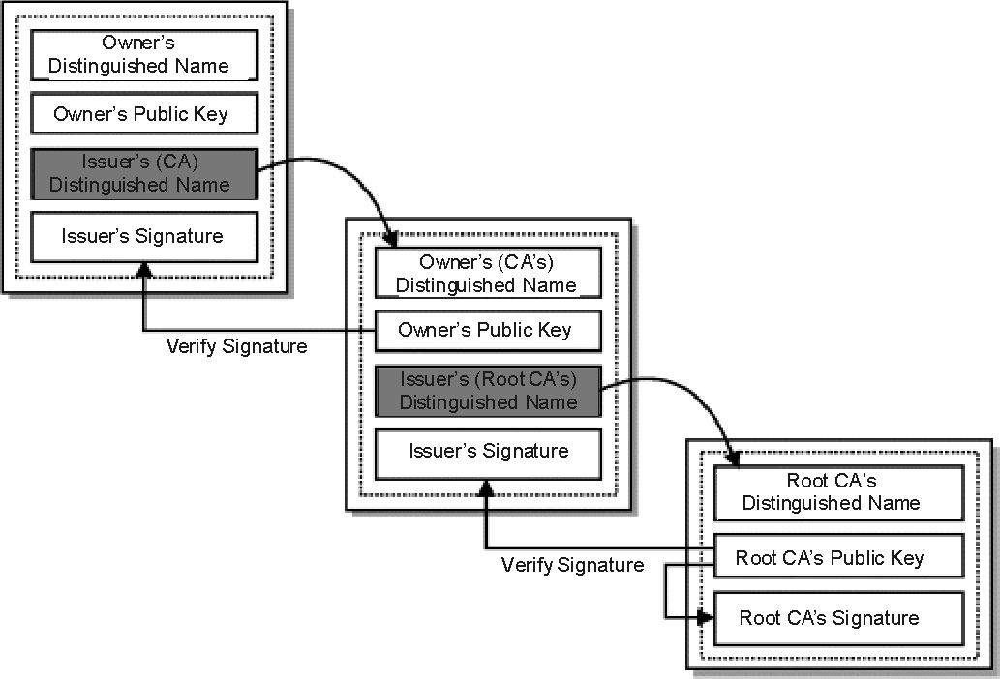
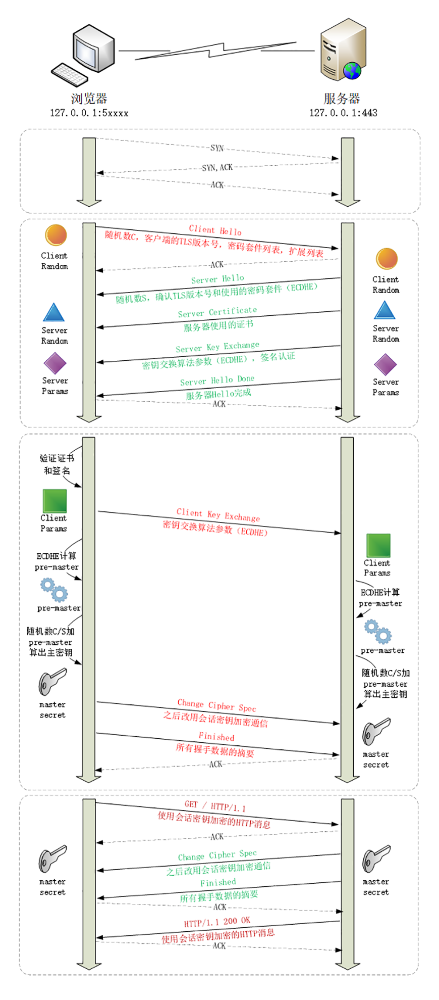
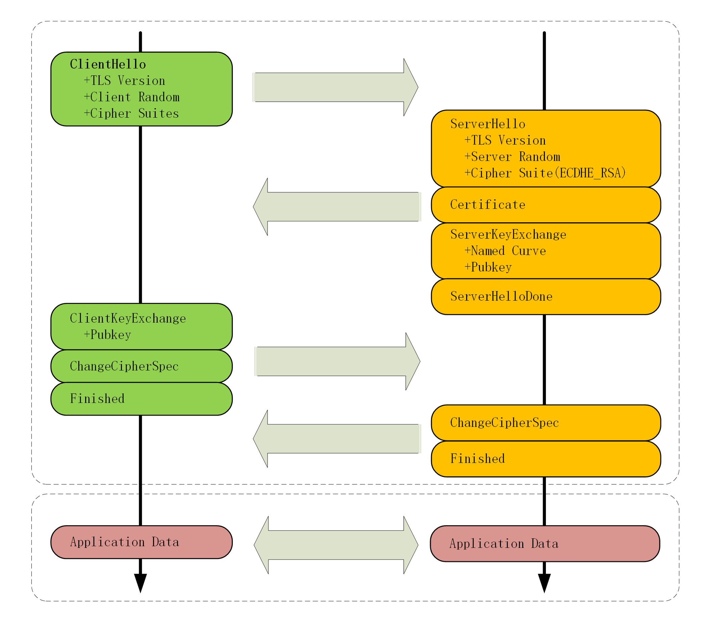
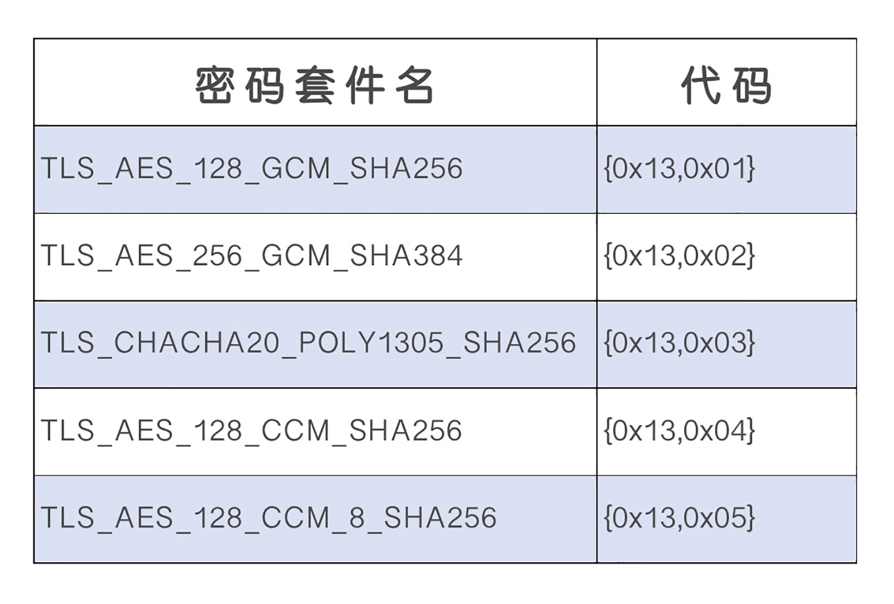
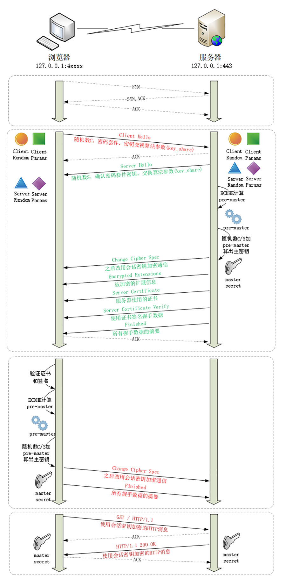

# https

Https 与 http 相比较

- 在 HTTP 协议栈中引入安全协议层（对发起 HTTP 请求的数据进行加密操作和对接收到 HTTP 的内容进行解密操作）
- 端口由默认的 80 改为 443

  

SSL/TLS 为 http 增加了四个安全特性：

- 机密性，只能由可信的人访问，对其他人是不可见
- 完整性，数据在传输过程中没有被篡改
- 身份认证，确认对方的真实身份
- 不可否认，也叫不可抵赖。

## SSL/TLS

SSL 即安全套接层（Secure Sockets Layer），后改名为 TLS（传输层安全，Transport Layer Security），正式标准化，版本号从 1.0 重新算起，所以 TLS1.0 实际上就是 SSLv3.1。到目前为止，应用的最广泛的 TLS 是 1.2。

TLS 由记录协议、握手协议、警告协议、变更密码规范协议、扩展协议等几个子协议组成，综合使用了对称加密、非对称加密、身份认证等许多密码学前沿技术。

> OpenSSL 是著名的开源密码学程序库和工具包，许多应用软件都会使用它作为底层库来实现 TLS 功能，包括常用的 Web 服务器 Apache、Nginx 等

### 加密套件

TLS/SSL 采用**多种先进的加密技术保证通信安全**，这些算法的组合被称为“密码套件”（cipher suite，也叫加密套件），密码套件命名非常规范，格式很固定。基本的形式是“密钥交换算法 + 签名算法 + 对称加密算法 + 摘要算法”。比如

“TLS_ECDHE_RSA_WITH_AES_128_GCM_SHA256”： 

握手时使用 ECDHE 算法进行密钥交换，用 RSA 签名和身份认证，握手后的通信使用 AES 对称算法，密钥长度 128 位，分组模式是 GCM，摘要算法 SHA384 用于消息认证（摘要认证）和伪随机函数产生随机数。

## https 加密原理

因为http的内容是明文传输的，明文数据会经过“中间人”，容易被篡改，而 https 对明文数据进行了加密，使用了混合加密的方式，即对称加密和非对称加密的组合使用。

### 对称加密

通信双方都各自持有同一个密钥，这样就可以加密解密，且别人不知道。

  

但 http 是明文传输，那么如何把密钥安全地传递给对方？

### 非对称加密

非对称加密，使用两把密钥：公钥、私钥，公钥可以公开给任何人使用，而私钥必须严格保密，外部使用公钥加密的内容只能由私钥解开。

  

服务器会将其中的一个公钥通过明文的形式发送给浏览器，浏览器通过公钥加密的内容只有服务器才能解密看到。

### 混合加密

混合加密，简单说通信双方通过非对称加密协商出一个用于对称加密的密钥，因为**非对称加密算法非常耗时，而对称加密快很多**，所以使用非对称加密方式传输对称加密的密钥。流程如下：

1. 服务器发送公钥
2. 客户端生成对称加密的密钥，用服务度公钥加密传送给服务端
3. 服务端利用私钥进行解密
4. 后续用客户端的对称加密的密钥与客户端通信

虽然保证机密性，但却还不够安全，比如中间人通过一套“狸猫换太子”的操作，掉包了服务器传来的公钥，你拿到了假的公钥，你以为自己是在和“某宝”通信，实际上网线的另一端却是黑客，银行卡号、密码等敏感信息就在“安全”的通信过程中被窃取了。

那么如何证明浏览器收到的公钥一定是该网站的公钥？

### 数字证书和 CA 机构

第三方信任机构，对网站颁发的“身份证”，也就是数字证书。数字证书里含有证书持有者信息、公钥信息等。服务器把证书传输给浏览器，浏览器根据证书匹配下信息并从里获取公钥就行了。

但证书本身的传输也是明文的，如何防止被篡改?

### 数字签名

数字签名，就是数字证书的“防伪技术”。其实原理就是用私钥对证书签名，**因为只有私钥加密的东西公钥才能解密，也就能对应认证对方身份**。

  

数字签名的制作过程：

1. CA机构拥有非对称加密的私钥和公钥。
2. CA机构对证书明文数据进行摘要算法（也就是 hash 算法）。
3. 对 hash 值用私钥加密，得到数字签名（摘要算法虽然保证了证书内容的完整性，但是摘要也是明文传输，中间人也可能一起篡改）

> 有了加密，为什么制作数字签名时需要hash一次？  
> 非对称加密效率较差，hash后得到的是固定长度的信息，对 hash 加解密就快很多。

浏览器验证过程：

1. 拿到证书，得到明文T，签名S。
2. 用CA机构的公钥对S解密（由于是浏览器信任的机构，所以浏览器保有它的公钥。详情见下文），得到 hash 值
3. 用证书里指明的摘要算法对证书明文进行 hash
4. 对比两者 hash 值，相等则表明证书可信

### 证书信任链

证书除了由根证书 CA 机构签证，还有中间机构进行签证分发。

  

首先操作系统和浏览器都内置了各大 CA 的根证书。浏览器会对服务器返回的是证书链（不包括根证书，根证书预置在浏览器中）查找到根证书，然后逐级使用上一级证书的公钥对下一级证书进行摘要验签。

  

## TLS 连接

### RSA 握手

  

1. 客户端发一个“Client Hello”消息，里面有本地 TLS 版本号、支持的密码套件列表，还有一个客户端随机数（Client Random）
2. 服务器收到消息后，会确认 TLS 版本，从密码套件列表选择一个密码套件，并生成一个服务端随机数（Server Random），然后返回一个“Server Hello”消息告诉客户端，随后并将自己的证书发送给客户端，然后结束
3. 客户端会进行证书验证，验证通过后，生成 pre-master 随机数，然后用公钥加密传给服务器
4. 服务端使用自己的私钥进行解密，使用 pre-master 随机数、客户端随机数（Client Random）、服务端随机数（Server Random）算出 master secret 会话密钥，客户端也是同样做法
5. 客户端告诉服务器我之后都使用加密进行通信了，结束；服务端也告诉客户端，我也要开始使用加密通信了，over
6. 之后双方使用 master secret进行消息加密

### ECDHE 握手过程  

  



1. 客户端发一个“Client Hello”消息，里面有本地 TLS 版本号、支持的密码套件列表，还有一个客户端随机数（Client Random）
2. 服务器收到消息后，会确认 TLS 版本，从密码套件列表选择一个密码套件，并生成一个服务端随机数（Server Random），然后发送一个“Server Hello”消息告诉客户端，并将自己的证书发送给客户端
3. 服务器发送 “Server Key Exchange” 消息，里面主要是 ECDHE 算法的服务端参数（Server Params），然后发送结束
4. 客户端证书验证通过后，则发送 “Client Key Exchange” 消息，里面是 ECDHE 算法的客户端参数（Client Params）
5. 客户端和服务器可以根据 Client Params、Server Params 用 ECDHE 算法计算出 Pre-Master 随机数，然后使用 Client Random、Server Random 和 Pre-Master 生成会话密钥的主密 Master Secret

## TLS/1.3

TLS/1.3 新增内容：
- 扩展协议
- 强化安全、简化密码套件
- 提升性能：1-RTT 握手

### 扩展协议

由于 1.1、1.2 等协议已经出现了很多年，很多应用软件、中间代理（官方称为“MiddleBox”）只认老的记录协议格式，更新改造很困难，甚至有些只认记录头的 Version 字段仅为 1.2。为了保证兼容旧版本而扩展支持 1.3，新增了扩展协议：

```txt
Handshake Protocol: Client Hello
    Version: TLS 1.2 (0x0303)
    Extension: supported_versions (len=11)
        Supported Version: TLS 1.3 (0x0304)
        Supported Version: TLS 1.2 (0x0303)
```

只要是 TLS1.3 协议，握手的“Hello”消息后面就必须有“supported_versions”扩展，它除了标记了 TLS 的版本号，还支持等其他 1.3 许多重要的功能。使用它就能区分新旧协议，旧服务器不支持 supported_versions 就会忽略，这样自动“后向兼容”降级成了 1.2。

### 强化安全、简化密码套件

TLS1.3 废除了很多有漏洞、加密弱的加密算法，这样简化了密码套件列表：

  

其中最主要废除 RSA 和 DH 密钥交换算法，只保留了 ECDHE 和 DHE。RSA 和 DH 主要不具备“向前安全”性：服务器私钥参与密钥交换算法过程，一旦私钥泄露或被破解，那么黑客就能够使用私钥解密出之前所有报文的“Pre-Master”，再算出会话密钥，破解所有密文；而 ECDHE、DHE 算法在每次握手时都会生成一对临时的公钥和私钥，每次通信的密钥对都是不同的。

### 提升性能：1-RTT 握手

TLS1.2 握手过程需要 2-RTT 才能完成握手，TLS1.3 压缩了以前的“Hello”协商过程，删除了“Key Exchange”消息，把握手时间减少到了“1-RTT”，效率提高了一倍。

  

客户端在“Client Hello”消息里直接用“supported_groups”带上支持的曲线，比如 P-256、x25519，用“key_share”带上曲线对应的客户端公钥参数，用“signature_algorithms”带上签名算法。

```txt
Handshake Protocol: Client Hello
    Version: TLS 1.2 (0x0303)
    Random: cebeb6c05403654d66c2329…
    Cipher Suites (18 suites)
        Cipher Suite: TLS_AES_128_GCM_SHA256 (0x1301)
        Cipher Suite: TLS_CHACHA20_POLY1305_SHA256 (0x1303)
        Cipher Suite: TLS_AES_256_GCM_SHA384 (0x1302)
    Extension: supported_versions (len=9)
        Supported Version: TLS 1.3 (0x0304)
        Supported Version: TLS 1.2 (0x0303)
    Extension: supported_groups (len=14)
        Supported Groups (6 groups)
            Supported Group: x25519 (0x001d)
            Supported Group: secp256r1 (0x0017)
    Extension: key_share (len=107)
        Key Share extension
            Client Key Share Length: 105
            Key Share Entry: Group: x25519
            Key Share Entry: Group: secp256r1
```

服务端还是要给出一个随机数（Server Random）和选定密码套件，最主要在“supported_versions”里确认使用的是 TLS1.3，然后在“key_share”扩展带上曲线和对应的公钥参数。

```txt
Handshake Protocol: Server Hello
    Version: TLS 1.2 (0x0303)
    Random: 12d2bce6568b063d3dee2…
    Cipher Suite: TLS_AES_128_GCM_SHA256 (0x1301)
    Extension: supported_versions (len=2)
        Supported Version: TLS 1.3 (0x0304)
    Extension: key_share (len=36)
        Key Share extension
            Key Share Entry: Group: x25519, Key Exchange length: 32
```

## 总结

http 安全特性：

- 保密性：靠混合加密解决，非对称加密实现对称加密秘钥传递，对称加密实现内容加密
- 完整性：靠摘要算法解决
- 数字签名是私钥对摘要的加密，可以由公钥解密后验证，实现身份认证和不可否认
- 公钥的分发需要使用数字证书，必须由 CA 的信任链来验证，否则就是不可信的

## 参考

- [彻底搞懂HTTPS的加密原理](https://zhuanlan.zhihu.com/p/43789231)
- 《透视 HTTP 协议》
- [SSL Certificate framework 101: How does the browser actually verify the validity of a given server certificate?](https://security.stackexchange.com/questions/56389/ssl-certificate-framework-101-how-does-the-browser-actually-verify-the-validity)


- 原理
  - 混合加密：使用非对称加密传输对称加密密钥
  - 数字证书（包含公钥）
  - 数字签名及验证：私钥加密，证书公钥解密；

 


- charles
  - 代理
    - http
    - tsl
  - 接口修改
    - 静态重写
    - 代理断点
  - 模拟网络速度
  - 接口映射
  - 并发测试


ECDHE中，没有采用服务器公钥来加密数据，而是采用交换两端的椭圆曲线公钥来保证pre_master的安全性
RSA中pre_master由客户端生成，采用服务器公钥加密pre_master来保证pre_master的安全性


然后用随机数产生对称算法使用的“会话密钥”（session key），再用公钥加密。因为会话密钥很短，通常只有 16 字节或 32 字节，所以慢一点也无所谓。
对称加密的私钥又是会话级的随机数=一次会话一个私钥。就算别人baoli破解也只是破解了一个会话（TCP 长连接期间）。

对称加密：AES_128/256
非：RSA，rsa一般要2048位


- 现在客户端和服务器手里有了三个随机数：Client Random、Server Random 和 Pre-Master。用这三个作为原始材料，就可以生成用于加密会话的主密钥，叫“Master Secret”，“PRF”就是伪随机数函数，它基于密码套件里的最后一个参数，比如这次的 SHA384，通过摘要算法来再一次强化“Master Secret”的随机性。
- 客户端发一个“Change Cipher Spec”
- 然后再发一个“Finished”消息
- 服务器也是同样的操作，发“Change Cipher Spec”和“Finished”消息，双方都验证加密解密 OK，握手正式结束，后面就收发被加密的 HTTP 请求和响应了。


主密钥有 48 字节，但它也不是最终用于通信的会话密钥，还会再用 PRF 扩展出更多的密钥，比如客户端发送用的会话密钥（client_write_key）、服务器发送用的会话密钥（server_write_key）等等，避免只用一个密钥带来的安全隐患


ECDHE 算法