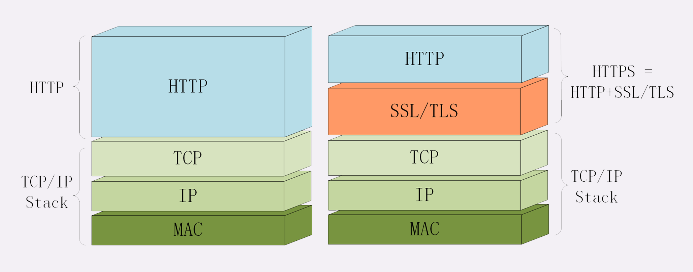

# Https

Https 协议，s 代表SSL/TLS，其协议内容基本跟 http 一样，多一个安全协议，而且默认端口号 443。

  

SSL/TLS 为 http 增加了四个安全特性：

- 机密性，只能由可信的人访问，对其他人是不可见
- 完整性，数据在传输过程中没有被篡改
- 身份认证，确认对方的真实身份
- 不可否认，也叫不可抵赖，意思是不能否认已经发生过的行为，不能“说话不算数”“耍赖皮”。可以确保通信交易安全。

## SSL/TLS

SSL 即安全套接层（Secure Sockets Layer），后改名为 TLS（传输层安全，Transport Layer Security）目前应用的最广泛的 TLS 是 1.2。

SSL/TLS 采用多种先进的加密技术保证通信安全，这些算法的组合被称为“密码套件”（cipher suite，也叫加密套件），密码套件命名非常规范，格式很固定。基本的形式是“密钥交换算法 + 签名算法 + 对称加密算法 + 摘要算法”。

> OpenSSL 是著名的开源密码学工具包，是 SSL/TLS 的具体实现，许多应用软件都会使用它作为底层库来实现 TLS 功能，包括常用的 Web 服务器 Apache、Nginx 等
