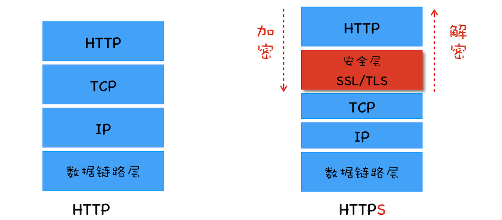
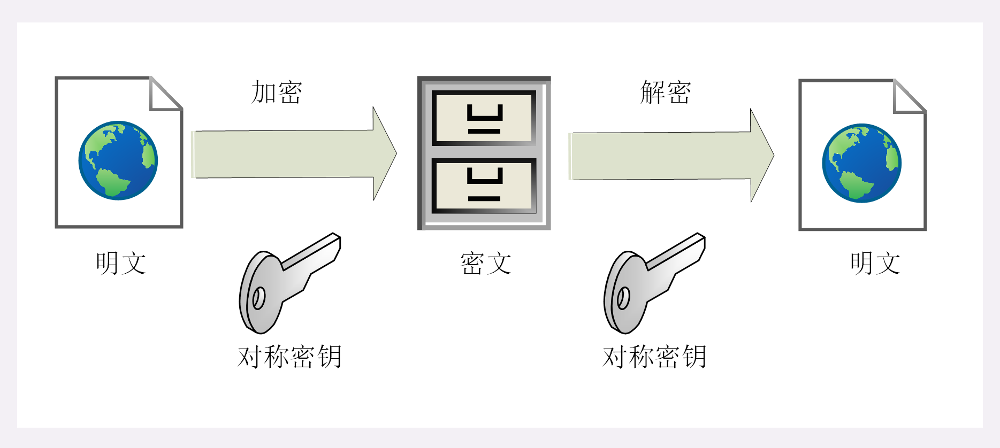
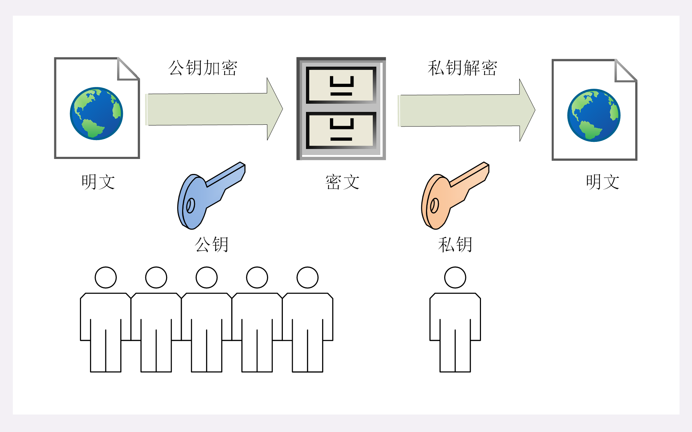
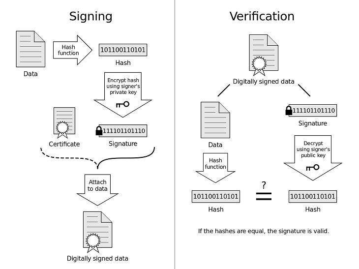
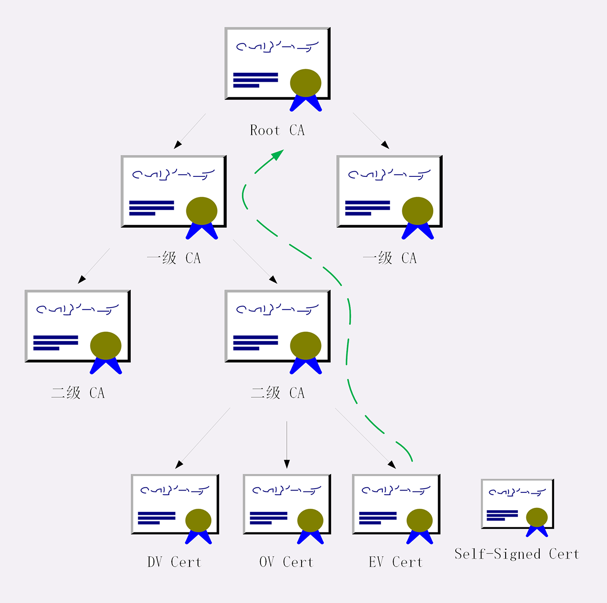

# https

Https 与 http 相比较

- 在 HTTP 协议栈中引入安全协议层（对发起 HTTP 请求的数据进行加密操作和对接收到 HTTP 的内容进行解密操作）
- 端口由默认的 80 改为 443
- 协议内容基本跟 http 一样

  

SSL/TLS 为 http 增加了四个安全特性：

- 机密性，只能由可信的人访问，对其他人是不可见
- 完整性，数据在传输过程中没有被篡改
- 身份认证，确认对方的真实身份
- 不可否认，也叫不可抵赖，意思是不能否认已经发生过的行为，不能“说话不算数”“耍赖皮”。可以确保通信交易安全。

## SSL/TLS

SSL 即安全套接层（Secure Sockets Layer），后改名为 TLS（传输层安全，Transport Layer Security），正式标准化，版本号从 1.0 重新算起，所以 TLS1.0 实际上就是 SSLv3.1。到目前为止，应用的最广泛的 TLS 是 1.2。

SSL/TLS 采用**多种先进的加密技术保证通信安全**，这些算法的组合被称为“密码套件”（cipher suite，也叫加密套件），密码套件命名非常规范，格式很固定。基本的形式是“密钥交换算法（非对称加密） + 签名算法 + 对称加密算法 + 摘要算法”。比如

ECDHE-RSA-AES256-GCM-SHA384：

“握手时使用 ECDHE 算法进行密钥交换，用 RSA 签名和身份认证，握手后的通信使用 AES 对称算法，密钥长度 256 位，分组模式是 GCM，摘要算法 SHA384 用于消息认证和产生随机数。”

> OpenSSL 是著名的开源密码学工具包，是 SSL/TLS 的具体实现，许多应用软件都会使用它作为底层库来实现 TLS 功能，包括常用的 Web 服务器 Apache、Nginx 等

## https 加密原理

> 推荐阅读 [彻底搞懂HTTPS的加密原理](https://zhuanlan.zhihu.com/p/43789231)

因为http的内容是明文传输的，明文数据会经过“中间人”，容易被篡改，而 https 对明文数据进行了加密，使用了混合加密的方式，即对称加密和非对称加密。

### 对称加密

通信双方都各自持有同一个密钥，这样就可以加密解密，且别人不知道。

  

但 http 是明文传输，那么如何把密钥安全地传递给对方？

### 非对称加密

非对称加密，使用两把密钥：公钥、私钥，公钥可以公开给任何人使用，而私钥必须严格保密，外部使用公钥加密的内容然后再由私钥解开。

  

服务器会将其中的一个公钥通过明文的形式发送给浏览器，浏览器通过公钥加密的内容只有服务器才能解密看到。

### 混合加密

混合加密，简单说通信双方通过非对称加密协商出一个用于对称加密的密钥，因为**非对称加密算法非常耗时，而对称加密快很多**，所以使用非对称加密方式传输对称加密的密钥。

1. 服务器发送公钥
2. 客户端生成对称加密的密钥，用服务度公钥加密传送给服务端
3. 服务端利用私钥进行解密
4. 后续用客户端的对称加密的密钥与客户端通信

虽然保证机密性，但却还不够安全，比如中间人通过一套“狸猫换太子”的操作，掉包了服务器传来的公钥，你拿到了假的公钥，你以为自己是在和“某宝”通信，实际上网线的另一端却是黑客，银行卡号、密码等敏感信息就在“安全”的通信过程中被窃取了。

那么如何证明浏览器收到的公钥一定是该网站的公钥？

### 数字证书和 CA 机构

第三方信任机构，对网站颁发的“身份证”，也就是数字证书。数字证书里含有证书持有者信息、公钥信息等。服务器把证书传输给浏览器，浏览器根据证书匹配下信息并从里获取公钥就行了。

但证书本身的传输也是明文的，如何防止被篡改?

### 数字签名

数字签名，就是数字证书的“防伪技术”。其实原理就是用私钥对证书签名，因为只有私钥加密的东西公钥才能解密，也就能对应认证对方身份。

  

数字签名的制作过程：

1. CA机构拥有非对称加密的私钥和公钥。
2. CA机构对证书明文数据进行摘要算法（也就是 hash 算法）。
3. 对 hash 值用私钥加密，得到数字签名（摘要算法虽然保证了证书内容的完整性，但是摘要也是明文传输，中间人也可能一起篡改）

> 有了加密，为什么制作数字签名时需要hash一次？  
> 非对称加密效率较差，hash后得到的是固定长度的信息，对 hash 加解密就快很多。

浏览器验证过程：

1. 拿到证书，得到明文T，签名S。
2. 用CA机构的公钥对S解密（由于是浏览器信任的机构，所以浏览器保有它的公钥。详情见下文），得到 hash 值
3. 用证书里指明的摘要算法对证书明文进行 hash
4. 对比两者 hash 值，相等则表明证书可信

### 证书信任链

首先操作系统和浏览器都内置了各大 CA 的根证书。

服务器返回的是证书链（不包括根证书，根证书预置在浏览器中），然后浏览器就可以使用信任的根证书（根公钥）解析证书链的根证书得到一级证书的公钥+摘要验签，然后拿一级证书的公钥解密一级证书拿到二级证书的公钥和摘要验签，再然后拿二级证书的公钥解密二级证书得到服务器的公钥和摘要验签，验证过程就结束了。

  

## 总结

http 安全特性：

- 保密性：靠混合加密解决，非对称加密实现对称加密秘钥传递，对称加密实现内容加密。
- 完整性：靠摘要算法解决。
- 身份认证：靠数字证书解决，数字证书因为CA机构的信任变成一个完整信任链条，从而实现通过数字证书证明了对方真实身份

## 参考

- [彻底搞懂HTTPS的加密原理](https://zhuanlan.zhihu.com/p/43789231)
- 透视 http 协议
