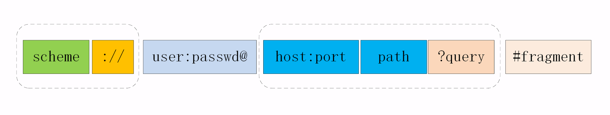
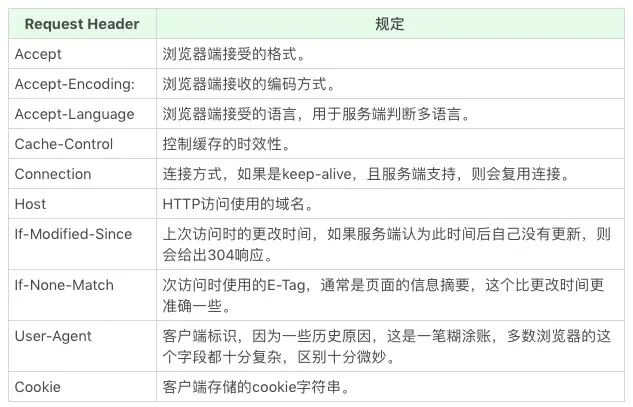
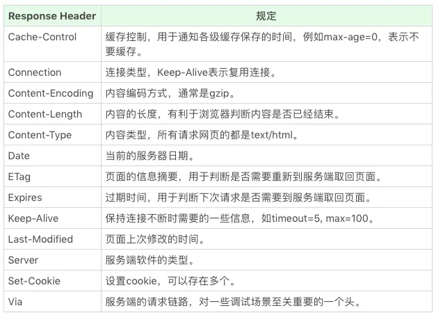

# 前端必知的 http 基础

## http 特点

- http 特点
  - 请求-应答模式
  - 灵活、易于扩展
    > 只规定了报文的基本格式，比如用空格分隔单词，用换行分隔字段，“header+body”等，报文里的各个组成部分都没有做严格的语法语义限制，可以由开发者任意定制。  
    > “灵活、易于扩展”的特性还表现在 HTTP 对“可靠传输”的定义上，它不限制具体的下层协议，不仅可以使用 TCP、UNIX Domain Socket，还可以使用 SSL/TLS，甚至是基于 UDP 的 QUIC，**下层可以随意变化，而上层的语义则始终保持稳定**。
  - 无状态（“状态”其实就是客户端或者服务器里保存的一些数据或者标志，记录了通信过程中的一些变化信息。）
    > 实现上不需要额外的资源来记录状态信息，减轻服务器的负担，能够把更多的 CPU 和内存用来对外提供服务。  
    > 而且，“无状态”也表示服务器都是相同的，没有“状态”的差异，可以轻松实现集群化，让负载均衡把请求转发到任意一台服务器，扩展性能
  - 可靠性，保证数据文件完整性到达，“可靠”只是向使用者提供了一个“承诺”，会在下层用多种手段“尽量”保证数据的完整送达
  - 缺点
    - 明文传输，数据完全肉眼可见，能够方便地研究分析
    - 不安全的，无法验证通信双方的身份，也不能判断报文是否被篡改

## http 协议格式

```text
请求行（请求方法、请求的路径、协议版本）
请求头（用冒号分隔的名称和值）
/空行/
请求体

响应行（协议版本、状态码、状态文本）
响应头（用冒号分隔的名称和值）
/空行/
响应体
```

## URI

URI 的完整格式

  

- URI 的查询参数：由多个“key=value”组成的字符串，这些 KV 值用字符“&”连接
- URI 的编码：把非 ASCII 码或特殊字符转换成十六进制字节值，然后前面再加上一个“%”。例如，空格被转义成“%20”。

## 请求方法

- GET：获取资源
- POST：提交资源
- PUT：修改资源
- DELETE：删除资源
- HEAD：获取资源的元信息，HEAD 则是跟 GET 类似，但只返回响应头（想象一个业务情景：欲判断某个资源是否存在，我们通常使用GET，但这里用HEAD则意义更加明确。）
- CONNECT：要求服务器为客户端和另一台远程服务器建立一条特殊的链接，这时Web服务器充当代理的角色，多用于 HTTPS 和 WebSocket
- OPTIONS：要求服务器列出可对资源实行的操作方法，在响应头Allow字段里返回
- TRACE

## 状态码

- 1xx：提示信息，表示目前是协议处理的中间状态，还需要后续的操作
- 2xx：请求成功。
  - 200：请求成功
  - 204：请求成功，但没有返回任何内容
  - 206：分块传输
- 3xx: 资源位置发生变动，需要客户端重定向请求资源位置
  - 301：永久性重定向
  - 302：临时性重定向
  - 304：资源未被修改，客户端重定向缓存
- 4xx：客户端错误，请求报文有误，服务器无法处理
  - 400：请求参数错误
  - 401：未授权，请求要求身份验证
  - 403：禁止访问
  - 404：表示请求资源不存在
  - 405：请求方法错误
- 5xx：服务器错误，服务器在处理请求时内部发生了错误
  - 500：服务端错误
  - 503：服务端暂时性错误，可以一会再试
  - 504：网关超时

## 请求头、响应头常见字段

  

  

