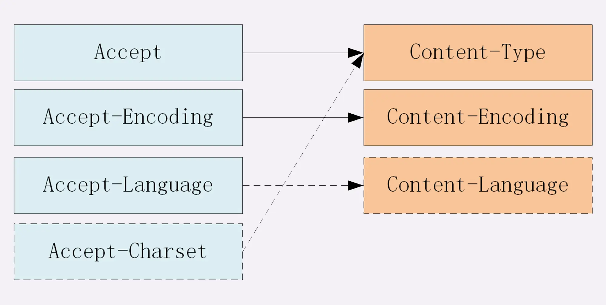
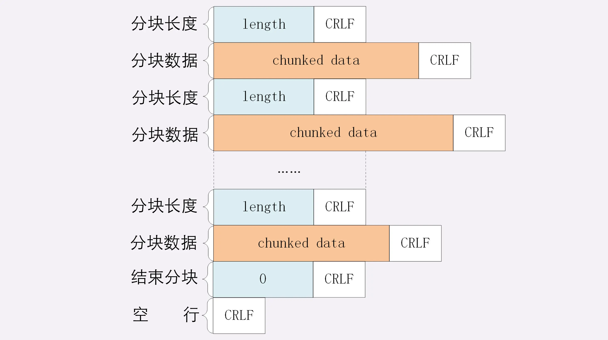
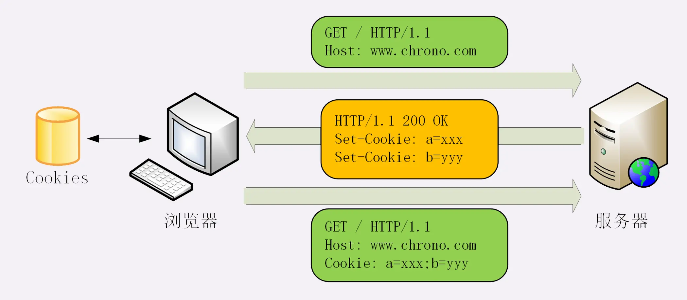
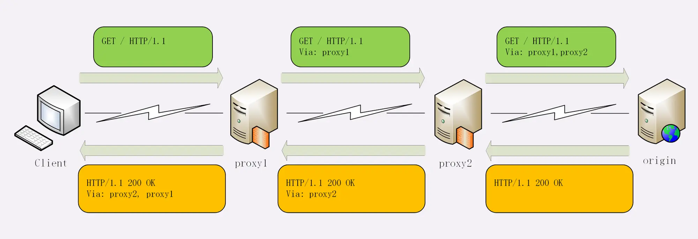

# 常用 http head 字段总结

- 内容协商
- 传输控制
  - 长连接
  - 分块
  - 重定向
- 缓存

## 内容协商相关

资源类型、压缩编码、语言、字符集

  

1. 数据类型表示实体数据的内容是什么，使用的是 MIME type，相关的头字段是 Accept 和 Content-Type；
2. 数据编码表示实体数据的压缩方式，相关的头字段是 Accept-Encoding 和 Content-Encoding；
3. 语言类型表示实体数据的自然语言，相关的头字段是 Accept-Language 和 Content-Language；
4. 字符集表示实体数据的编码方式，相关的头字段是 Accept-Charset 和 Content-Type；
5. 客户端需要在请求头里使用 Accept 等头字段与服务器进行“内容协商”，要求服务器返回最合适的数据；
6. Accept 等头字段可以用“,”顺序列出多个可能的选项，还可以用“;q=”参数来精确指定权重。
   > 例如，Accept: text/html,application/xml;q=0.9,*/*;q=0.8  
   > 在http 中，“;”的意义是小于“,”

Accept-* 只用于请求中  
Content-* 是实体字段，所以请求和响应里都可以用，作用是指明body数据的类型。(例如，post 请求含有 body 数据)

> tip💡：如果返回 content-type:"octet-stream"，表示不透明的数据流，浏览器不认识这个图片了，转而会下载这个文件

## 大文件分片传输相关

- 数据压缩
- 分块传输
- 分段请求
  - 多段数据

> 这几种方式可以混合起来使用，例如压缩后再分块传输，或者分段后再分块。

### 分块传输

分块传输可以流式收发数据，节约内存和带宽，使用响应头字段**Transfer-Encoding: chunked** 来表示。

“Transfer-Encoding: chunked”和“Content-Length”这两个字段是互斥的，也就是说响应报文里这两个字段不能同时出现，一个响应报文的传输要么是长度已知，要么是长度未知（chunked）。

响应体格式：

  

### 分段请求
范围请求可以只获取部分数据，即“分块请求”，实现视频拖拽或者断点续传.

- 客户端、请求头、字段、**Range: bytes=x-y**：请求范围。
- 服务器、响应头、字段、**Accept-Ranges: bytes**：明确告知客户端：“我是支持范围请求的”。

> tip💡：range是针对原文件的，即使文件在传输过程中被压缩。

假设文件是 100 个字节，那么：
- “0-”表示从文档起点到文档终点，相当于“0-99”，即整个文件；
- “10-”是从第 10 个字节开始到文档末尾，相当于“10-99”；
- “-1”是文档的最后一个字节，相当于“99-99”；
- “-10”是从文档末尾倒数 10 个字节，相当于“90-99”。

服务器要添加一个响应头字段 **Content-Range: bytes x-y/length**，表示片段的实际偏移量和资源的总大小。

#### 多端请求
- 客户端、请求头、字段、**Range: bytes=x-y, x-y, ...**：多个范围请求。
- 服务器、响应头、字段、**Content-Type: multipart/byteranges; boundary=xxx**：明确告知客户端：“我是支持范围请求的”。

响应体格式：

  

## 连接管理

### 长连接（keep-alive）

长连接，也就是持久连接、连接复用。

- 开启
  - 客户端可以在请求头里显示指定字段 **Connection: keep-alive**，明确地要求使用长连接机制（http/1.0 中是默认关闭，http/1.1 默认开启）
  - 如果服务器支持长连接，它总会在响应报文里放一个“Connection: keep-alive”字段
- 关闭
  - 在客户端，可以在请求头里加上“Connection: close” 字段，主动指示服务端
  - 服务器端通常不会主动关闭连接，但服务端也使用一些关闭策略
    > nginx 为例：
    > 1. 使用“keepalive_timeout”指令，设置长连接的超时时间
    > 2. 使用“keepalive_requests”指令，设置长连接上可发送的最大请求次数  

### 重定向

重定向，由服务器来发起的，浏览器使用者无法控制，相对地就可以称为“被动跳转”。

浏览器收到 301/302 报文，会根据响应头的 **Location** 进行跳转。
非绝对的 URI 会根据当前请求去拼出完整的 URI，如果是站外第三方，建议使用绝对的 URI。

301/302 是最常用的重定向状态码，分别是“永久重定向”和“临时重定向”。

## Cookie 机制

HTTP 是“无状态”的？

Cookie 技术，就相似给客户端贴上小纸条，上面写了一些只有服务器才能理解的数据，需要的时候客户端把这些信息发给服务器，服务器看到 Cookie，就能够认出对方是谁了。

Cookie 机制的工作流程：

  

1. **Set-Cookie** 在客户端设置 cookie 信息
2. 服务端通过 **Cookie** 字段获取 cookie 信息

服务器可以在响应头里添加一个甚至多个 Set-Cookie，存储多个“key=value”。但浏览器这边发送时不需要用多个 Cookie 字段，只要在一行里用“;”隔开就行。

## 代理相关

- Via
- X-Forwarded-For
- X-Real-IP

**Via** 是一个通用字段，请求头或响应头里都可以出现。每当报文经过一个代理节点，代理服务器就会把自身的信息追加到字段的末尾,追加的是代理主机名（或者域名）。

  

**X-Forwarded-For**，字面意思是“为谁而转发”，形式上和“Via”差不多，追加的是请求方的 IP 地址。

**X-Real-IP**，相当于是“X-Forwarded-For”的简化版，是记录客户端 IP 地址，没有中间的代理信息。

### 代理协议

通过“X-Forwarded-For”操作代理信息必须要解析 HTTP 报文头，这对于代理来说成本比较高，原本只需要简单地转发消息就好，而现在却必须要费力解析数据再修改数据，会降低代理的转发性能；“X-Forwarded-For” 等头必须要修改原始报文，而有些情况下是不允许甚至不可能的（比如使用 HTTPS 通信被加密）

“代理协议” 虽然不是 RFC 标准，但也是一个“事实标准”，被广泛采用。

“代理协议”有 v1 和 v2 两个版本，v1 和 HTTP 差不多，也是明文，而 v2 是二进制格式。今天只介绍比较好理解的 v1，它在 HTTP 报文前增加了一行 ASCII 码文本，相当于又多了一个头。

`PROXY [TCP4|TCP6] 请求方地址、应答方地址、请求方端口号、应答方端口号`

```txt
PROXY TCP4 1.1.1.1 2.2.2.2 55555 80\r\n
GET / HTTP/1.1\r\n
Host: www.xxx.com\r\n
\r\n
```

## HTTP 缓存

[HTTP 缓存](./HTTP%20缓存.md)