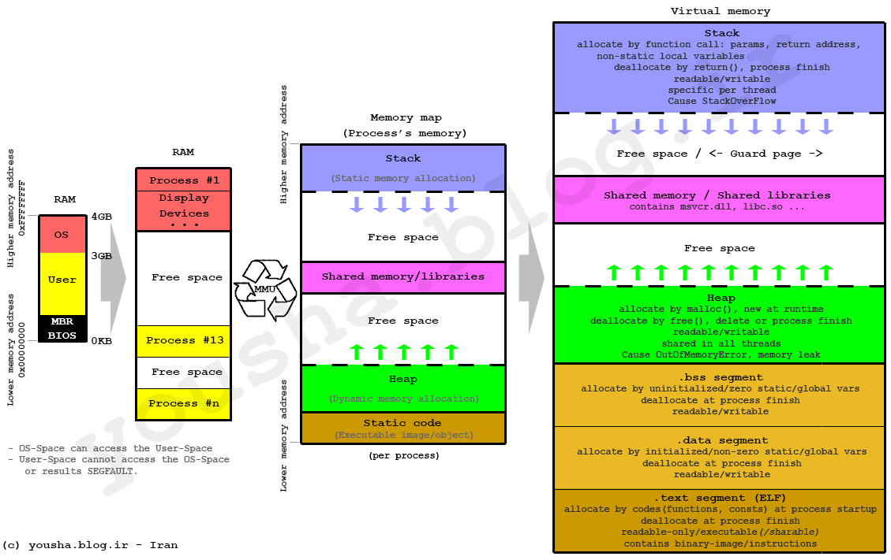

进程内存模型：

	- 操作系统会为进程分配一块为内存区域
 - 内存模型从高位到低位（其实也可以反过来思考，都是从低地址开始占用）
   	- 栈区
   	- 堆区
   	- 数据段
   	- 代码段


### 栈

栈内存区是由操作系统为线程分配管理的，并且每条线程都有自己的内存栈，并且有硬件指令指支持（CPU的 POP 指令和 PUSH 指令、ESP寄存器、EBP寄存器），形成 LIFO（后进先出）的数据管理结构。

栈在内存的分配与归还速度极快，因为也就是指针方向移动而已。

大多数语言利用该内存栈，来保存函数内部的局部变量，并且形成函数调用栈。

栈内存可以通过创建线程时设置

### 堆

堆内存是为动态分配预留的内存，由语言运行时去主动申请（molloc）或者销毁（free），堆内存是同属同一进程内的所有线程共享的。


### 栈的调用过程

- [对于ESP、EBP寄存器的理解](https://www.cnblogs.com/xiangtingshen/p/11221277.html)

- [图解函数调用过程](https://mp.weixin.qq.com/s/Od9X-qnQ3WWyZiLIS4uPFg)


**esp是栈顶指针**，是cpu机制决定的，push、pop指令会自动调整esp的值；

**ebp只是存取某时刻的esp，用来标识栈低**。进入一个函数内后开始，cpu会将esp的值赋给ebp，ebp 记录该栈底。


函数开始

```
 push ebp // 记录上一个栈底
 mov ebp,esp // 设置 ebp 为当前栈底
```

函数调用

```
call Fun // 将返回地址入栈
```

函数结束

```
mov esp, ebp // 将栈顶指针移动栈底
pop ebp // ebp 恢复上一栈底
ret // pop 返回地址，程序返回到主程序中，并执行下一条指令，并且移动 esp
```


消除形参

**释放参数涉及两种子函数调用标准，一种是STDCALL标准，一种是C标准。两种方式的核心思想就是修改esp。**

