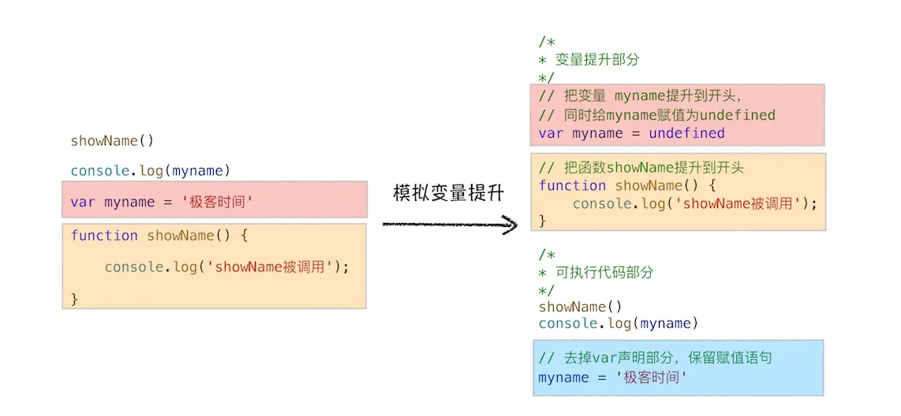
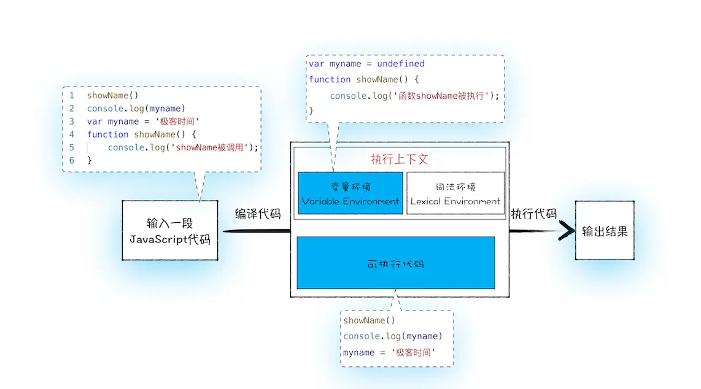

# JavaScript 代码执行机制

- JavaScript 代码执行机制
  - [变量提升](#变量提升)
  - [作用域](#作用域)
  - [调用栈](#调用栈)
  - [作用域链](#作用域链)
    - [闭包](#闭包)
  - 执行上下文
    - 变量环境
      - arguments
      - 变量声明
      - 函数声明
    - 词法环境
    - 作用域链
    - [this](#this-指针)

## 变量提升

所谓的变量提升，相当于代码执行之前 JavaScript 引擎把**变量的声明部分和函数的声明部分**提升到代码开头的“行为”。

  

> 如果一段代码如果定义了两个相同名字的函数，那么最终生效的是最后一个函数；  
> 如果函数声明名称跟变量名相同，函数声明优先

**变量提升，发生在 JavaScript 代码编译阶段。实际上变量和函数声明在代码里的位置是不会改变的，而且是在编译阶段被 JavaScript 引擎放入内存中**。一段 JavaScript 经过编译后，会生成两部分内容：**执行上下文（Execution context）和可执行代码（会被编译为字节码）**。

  

- 执行上下文是 JavaScript 执行一段代码时的运行环境
- 执行上下文中存在一个变量环境的对象（Viriable Environment）
- 变量环境的对象保存了变量提升的内容

有了执行上下文和可执行代码了，那么接下来就到了执行阶段了，JavaScript 引擎会从变量环境中去查找自定义的变量和函数。

## 作用域

通俗地理解，**作用域就是变量与函数的可见范围**。

JavaScript 作用域是由源码中指定词法位置进行划分，分为

- 全局作用域
- 函数作用域
- 块级作用域（ES6）

### 作用域链

作用域与作用域形成嵌套关系，内层作用域能够访问外层作用域的变量，当前作用域查找不到就会往外层作用域进行查找，依次类推，这一条查找链路就是作用域链。

 

### let、const 声明的块级作用域原理及暂时性死区

在 ES6 之前，ES 的作用域只有两种：全局作用域和函数作用域。

var 声明的变量具有全局或者函数级别作用域，因为变量提升机制，使得变量声明都被提升到函数顶部或者全局，这就导致 JavaScript 的代码并不像其他语言直观。

> 函数声明同样具有全局或者函数级别作用域

```js
console.log(myname); // undefined
var myname = "极客时间"
function showName(){
  if(true){
   var myname = "极客邦"
  }
  console.log(myname); // "极客邦"
}
showName()
```

而且变量容易在不被察觉的情况下被覆盖掉

```js
var myname = "极客时间"
function showName(){
  console.log(myname); // undefined
  if(true){
   var myname = "极客邦"
  }
  console.log(myname); // 极客邦
}
showName()
```

本应销毁的变量没有被销毁

```js
function foo(){
  for (var i = 0; i < 7; i++) {
  }
  console.log(i); 
}
foo()
```

ES6 引入了 let 和 const 关键字作为块级作用域变量声明，同时为了保证向下兼容，ES6 在执行上下文新增加了**词法环境**

```js
function foo(){
    var a = 1
    let b = 2
    {
      let b = 3
      var c = 4
      let d = 5
      console.log(a)
      console.log(b)
    }
    console.log(b) 
    console.log(c)
    console.log(d)
}   
foo()
```

词法环境内部，维护了一个小型栈结构，进入一个作用域块后，就会把该作用域块内部的变量压到栈顶，**JavaScript 查找变量时沿着词法环境的栈顶向下查询，然后变量环境**。

  

#### 暂时性死区

由于变量提升机制，所有的声明（function、var、let、const 和 class）都在 JavaScript 编译期间被提升，而 var 声明的变量提升会被初始化为 undefined，而 let 和 const 则未初始化。

只有在 JavaScript 引擎在执行源代码中声明的位置时，它们才会被初始化。

```js
let a; // 如果声明语句没有初始化赋值则默认 undefined
console.log(a); // outputs undefined
a = 5;
```

```js
console.log(a); // ReferenceError: a is not defined
let a = 3;
```

这意味着在引擎在源代码中声明的位置之前，您无法访问该变量，因为该变量还未初始化。这就是我们所说的“临时死区”，变量创建和初始化之间的时间跨度，在那里它们不能被访问。

总之暂时性死区的就是，只要一进入当前作用域，所要使用的变量就已经存在了，但是在变量执行声明语句之前都不可以访问。

> 推荐阅读 [Hoisting in Modern JavaScript — let, const, and var](https://blog.bitsrc.io/hoisting-in-modern-javascript-let-const-and-var-b290405adfda)

除了块级作用域以外，函数参数默认值也会受到 TDZ 影响。

```js
function foo(arg1 = arg2, arg2) {
    // let arg1 = xxx || arg2
    // let arg2 = xxx
    console.log(`${arg1} ${arg2}`)
}

foo(undefined, 'arg2')

// Uncaught ReferenceError: arg2 is not defined
```

#### 函数声明与块级作用域：

1. 允许在块级作用域内声明函数。
2. 函数声明类似于var，即会提升到全局作用域或函数作用域的头部。
3. 同时，函数声明还会提升到所在的块级作用域的头部。

```js
console.log(f) // outside f
function f() { console.log('I am outside!'); }

(function () {
  console.log(f) // undefined
  if (true) {
    console.log(f) // inside f
    function f() { console.log('I am inside!'); }
  }
}());
```

## 调用栈

执行上下文是 JavaScript 代码的运行环境，JavaScript 代码是分一段段执行的，每一段代码执行都分为两个阶段：

- 编译阶段，创建对应的执行上下文，进行变量提升
- 执行阶段

哪些情况下一段代码才会创建执行上下文？一般说来，有这么三种情况：

- 全局代码
- 函数代码
- eval 执行的代码

大多数命令式编程语言都支持过程式调用，都使用栈的数据结构来动态管理代码之间的嵌套调用关系。

  


JavaScript 引擎也是利用栈的这种结构来管理执行上下文的。在执行上下文创建好后，JavaScript 引擎会将执行上下文压入栈中，通常把这种用来管理执行上下文的栈称为执行上下文栈，又称**调用栈**。

```js
function multiply(x, y) {
  return x * y;
}

function printSquare(x) {
  var s = multiply(x, x);
  console.log(s);
}

printSquare(5);
```

  

其中

1. 调用栈底是全局执行上下文
2. 当前函数执行完毕后，栈顶该函数的执行上下文会被弹出栈

那么调用栈有什么用？

- 追踪代码动态调用执行轨迹
- 栈内存管理更方便快捷

## 闭包

闭包形成的本质：词法作用域 + 函数是一等公民

词法作用域，就是按照源码指定的词法位置范围划分作用域，JavaScript 作用域分为

- 全局作用域
- 函数作用域
- 块作用域

当前作用域变量查找不到时就会往外层作用域查找，依次类推，形成的查找链路就是作用域链

根据词法作用域规则，内部函数可以访问外部作用域的变量。

如果仅仅是词法作用域，那么嵌套函数调用关系可以用调用栈去表示并且根据调用栈去查找变量。

但是 JavaScript 中函数是一等公民，函数也可以作为变量赋值，意味着函数可以在其他外部作用域被调用。

根据词法作用域原则，当外部函数被销毁，需要将内部函数引用到的外部作用域变量保留下来，跟该函数关联起来，以便引擎执行该函数代码能够继续查找到原词法位置中外部的变量，这样就形成了闭包。

在 JavaScript 中，外部作用域变量的集合是闭包对象，被引用保存在函数的作用域链中，跟该函数关联起来。

理解作用域链是理解闭包的基础，因为闭包就是函数作用域链中的一环。

闭包的形成时是在编译期间，跟函数动态调用栈没什么关系。

另外总结下变量查找过程：


### 闭包实现原理

```javascript
function foo() {
    var myName = "极客时间"
    let test1 = 1
    const test2 = 2
    var innerBar = { 
        setName:function(newName){
            myName = newName
        },
        getName:function(){
            console.log(test1)
            return myName
        }
    }
    return innerBar
}
var bar = foo()
bar.setName("极客邦")
bar.getName()
console.log(bar.getName())
```

1. 当在编译 foo 函数过程中，遇到内部函数 setName，JavaScript 引擎会**对内部函数做一次快速的词法扫描**，发现该内部函数引用了 foo 函数中的 myName 变量，由于是内部函数引用了外部函数的变量，所以 JavaScript 引擎判断这是一个闭包，于是在堆空间创建换一个 `closure(foo)` 的对象（这是一个内部对象，JavaScript 是无法访问的），用来保存 myName 变量，`closure(foo)` 保存在 setName 的作用域链属性 `[[scopes]]` 上。
2. 接着继续扫描到 getName 方法时，发现该函数内部还引用变量 test1，于是 JavaScript 引擎又将 test1 添加到`[[scopes]]`对象中。这时候堆中的`[[scopes]]`对象中就包含了 myName 和 test1 两个变量了。
3. 由于 test2 并没有被内部函数引用，所以 test2 依然保存在调用栈中，当调用结束，test2 也就会被销毁。
4. 当执行到 foo 函数时，闭包就产生了；当 foo 函数执行结束之后，返回的 getName 和 setName 方法都引用 `clourse(foo)` 对象，所以即使 foo 函数退出了，**`clourse(foo)`依然被其内部的 getName 和 setName 方法引用**。所以在下次调用 bar.setName 或者 bar.getName 时，通过作用域链上的 `clourse(foo)` 找到相应变量。

  

`closure(foo)` 只会保留使用到的变量。

  

通过作用域链上的 `clourse(foo)` 找到相应变量。

总的来说，产生闭包的核心有两步：

1. 第一步是需要预扫描内部函数；
2. 第二步是把内部函数引用的外部变量保存到堆中。

### eval 下的闭包

一般情况下会预扫描内部函数只保存内部需要的变量，但 eval 执行的是动态脚本无法静态分析，这会导致闭包会把**外层作用域的变量全保存**！


### 闭包缺点

  

发现多层嵌套情况下，内部函数闭包的形成会在外部函数作用域链的基础上继续扩展。

闭包是外部函数的变量集合，保存在堆里，如果闭包使用不正确，会很容易造成内存泄漏的。

> 内存泄漏是指内存空间明明已经不再被使用，但由于某种原因并没有被释放的现象。

> [JavaScript 内存管理机制](./JavaScript%20内存管理机制.md) 了解 JavaScript 是如何回收内存。

因为函数是一等公民，函数引用可以被传递到处使用，如果引用闭包的函数是个局部变量，那么等函数销毁后，那么 JavaScript 引擎的垃圾回收器就会回收这块内存。如果外部变量保持引用活着，那么就会一直占用内存，可能造成内存泄漏。

> 相比较传统面对象编程 Java，函数只是对象的方法，被限制在对象这个域里 :thinking:

## this 指针

JavaScirpt 的变量查找机制有两种：

- 作用域链机制
- this、原型链机制
  > this 是面向对象机制的 JavaScript 变量查找，即通过对象属性，面向对象还有一个继承机制，对应在 JavaScript 中也就是原型链查找机制 

this 存在执行上下文中

  

### this 指向

this 的指向，是在调用函数时根据执行上下文所动态确定的。

而函数使用一半存在以下几种：

- 默认情况下普通函数执行上下文中的 this 是指向全局对象 window 的，但在严格模式下，this 值则是 undefined
- 对象方法调用（指向该对象）
- call、bind、apply（指向传入的参数对象）
- 构造函数（this 指向新创建的对象）
- 箭头函数（执行上下文没有 this，依靠作用域链继承外层作用域的 this）

题目

```js
// 嵌套函数中的 this 不会从外层函数中继承
var myObj = {
  name : "极客时间", 
  showThis: function(){
    console.log(this) // myObj
    function bar(){console.log(this)} // window
    bar()
  }
}
myObj.showThis()

// 缓存 this
// 把 this 体系转换为了作用域的体系，通过作用域链去继承
var myObj = {
  name : "极客时间", 
  showThis: function(){
    console.log(this)
    var self = this
    function bar(){
      self.name = "极客邦"
    }
    bar()
  }
}
myObj.showThis()
console.log(myObj.name)
console.log(window.name)

// 箭头函数
// ES6 中的箭头函数其自身的执行上下文没有 this，所以箭头函数中的 this 取决于它的外部函数。
var myObj = {
  name : "极客时间", 
  showThis: function(){
    console.log(this)
    var bar = ()=>{
      this.name = "极客邦"
      console.log(this)
    }
    bar()
  }
}
myObj.showThis()
console.log(myObj.name)
console.log(window.name)
```