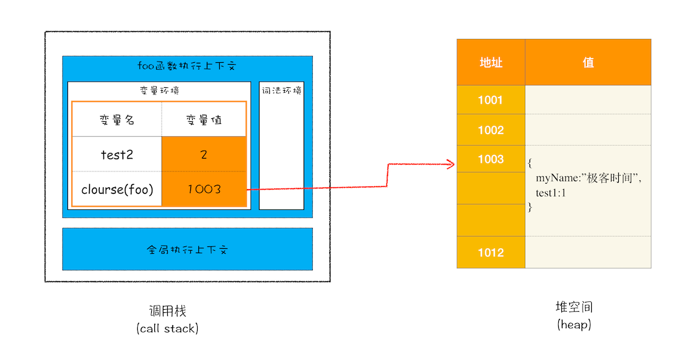

# JavaScript 代码执行过程（运行时）

- JavaScript 执行机制
  - 变量提升
  - 作用域
  - 调用栈
  - 作用域链
    - 闭包
  - 执行上下文
    - 变量环境
      - arguments
      - 变量声明
      - 函数声明
    - 词法环境 scope chain
    - this
## 变量提升（Hoisting）

所谓的变量提升，就是代码执行之前 JavaScript 引擎把**变量的声明部分和函数的声明部分**提升到代码开头的“行为”。

  

> 如果一段代码如果定义了两个相同名字的函数，那么最终生效的是最后一个函数

**变量提升，发生在 JavaScript 代码编译阶段。实际上变量和函数声明在代码里的位置是不会改变的，而且是在编译阶段被 JavaScript 引擎放入内存中**。一段 JavaScript 经过编译后，会生成两部分内容：**执行上下文（Execution context）和可执行代码（会被编译为字节码）**。

  

- 执行上下文是 JavaScript 执行一段代码时的运行环境
- 执行上下文中存在一个变量环境的对象（Viriable Environment）
- 变量环境的对象保存了变量提升的内容

有了执行上下文和可执行代码了，那么接下来就到了执行阶段了，JavaScript 引擎会从变量环境中去查找自定义的变量和函数。

## 作用域

作用域是指在程序中定义变量的区域，该位置决定了变量的生命周期。通俗地理解，作用域就是变量与函数的可访问范围，即作用域控制着变量和函数的可见性和生命周期。

- JavaScript 作用域
  - 全局作用域
  - 函数作用域
  - 块级作用域（ES6）

### 块级作用域

在 ES6 之前，ES 的作用域只有两种：全局作用域和函数作用域。var 声明的变量具有全局或者函数级别作用域，而且由于变量提升机制，使得某个函数内的变量声明都被提升到函数顶部，这就导致 JavaScript 的代码并不像其他语言直观。

```js
var myname = "极客时间"
function showName(){
  if(true){
   var myname = "极客邦"
  }
  console.log(myname); // "极客邦"
}
showName()
console.log(myname); // "极客时间"
```

而且变量容易在不被察觉的情况下被覆盖掉

```js
var myname = "极客时间"
function showName(){
  console.log(myname); // undefined
  if(true){
   var myname = "极客邦"
  }
  console.log(myname); // 极客邦
}
showName()
```

本应销毁的变量没有被销毁

```js
function foo(){
  for (var i = 0; i < 7; i++) {
  }
  console.log(i); 
}
foo()
```

### let、const 声明的块级作用域原理及暂时性死区

为了保证向下兼容，并且 let、const 声明的块级作用域，ES6 在执行上下文增加了**词法环境**

```js
function foo(){
    var a = 1
    let b = 2
    {
      let b = 3
      var c = 4
      let d = 5
      console.log(a)
      console.log(b)
    }
    console.log(b) 
    console.log(c)
    console.log(d)
}   
foo()
```

词法环境内部，维护了一个小型栈结构，进入一个作用域块后，就会把该作用域块内部的变量压到栈顶，**JavaScript 查找变量时沿着词法环境的栈顶向下查询，然后变量环境**。

  

#### 暂时性死区

由于变量提升机制，所有的声明（function、var、let、const 和 class）都在 JavaScript 编译期间被提升，而 var 声明的变量提升会被初始化为 undefined，而 let 和 const 则未初始化。

只有在 JavaScript 引擎在执行源代码中声明的位置时，它们才会被初始化。

```js
let a; // 如果声明语句没有初始化赋值则默认 undefined
console.log(a); // outputs undefined
a = 5;
```

这意味着在引擎在源代码中声明的位置之前，您无法访问该变量，因为该变量还未初始化。这就是我们所说的“临时死区”，变量创建和初始化之间的时间跨度，在那里它们不能被访问。

```js
console.log(a); // ReferenceError: a is not defined
let a = 3;
```

暂时性死区的本质就是，只要一进入当前作用域，所要使用的变量就已经存在了，但是不可获取，只有等到声明变量的那一行代码出现，才可以获取和使用该变量。

> 推荐阅读 [Hoisting in Modern JavaScript — let, const, and var](https://blog.bitsrc.io/hoisting-in-modern-javascript-let-const-and-var-b290405adfda)

## 调用栈

执行上下文是 JavaScript 代码的运行环境，那哪些代码会创建执行上下文？

- 全局代码
- 函数代码
- eval 执行的代码

大多数命令式编程语言都支持过程式调用，都使用栈的数据结构来管理函数之间的调用关系，即函数嵌套调用情况。

  


JavaScript 引擎也是利用栈的这种结构来管理执行上下文的。在执行上下文创建好后，JavaScript 引擎会将执行上下文压入栈中，通常把这种用来管理执行上下文的栈称为执行上下文栈，又称调用栈。

调用栈底是全局执行上下文。

当前函数执行完毕后，JavaScript 引擎会将栈顶该函数的执行上下文弹出栈。

通过调用栈就能够追踪到哪个函数正在被执行以及各函数之间的调用关系，形成函数错误栈信息。

## 闭包

闭包利用函数声明的词法环境将数据与函数相关联。

闭包就是能够读取外层函数变量的函数。

一个拥有外层函数对象所对应的活跃对象引用的函数对象就被称为闭包。

```javascript
function foo() {
    var myName = "极客时间"
    let test1 = 1
    const test2 = 2
    var innerBar = { 
        setName:function(newName){
            myName = newName
        },
        getName:function(){
            console.log(test1)
            return myName
        }
    }
    return innerBar
}
var bar = foo()
bar.setName("极客邦")
bar.getName()
console.log(bar.getName())
```

## 内存模型的角度来分析 JavaScript 闭包过程

1. 当 JavaScript 引擎执行到 foo 函数时，首先会编译，并创建一个空执行上下文。
2. 在编译过程中，遇到内部函数 setName，JavaScript 引擎还要**对内部函数做一次快速的词法扫描**，发现该内部函数引用了 foo 函数中的 myName 变量，由于是内部函数引用了外部函数的变量，所以 JavaScript 引擎判断这是一个闭包，于是在堆空间创建换一个“closure(foo)”的对象（这是一个内部对象，JavaScript 是无法访问的），用来保存 myName 变量。
3. 接着继续扫描到 getName 方法时，发现该函数内部还引用变量 test1，于是 JavaScript 引擎又将 test1 添加到“closure(foo)”对象中。这时候堆中的“closure(foo)”对象中就包含了 myName 和 test1 两个变量了。
4. 由于 test2 并没有被内部函数引用，所以 test2 依然保存在调用栈中。
5. 当执行到 foo 函数时，闭包就产生了；当 foo 函数执行结束之后，返回的 getName 和 setName 方法都引用“clourse(foo)”对象，所以即使 foo 函数退出了，**“clourse(foo)”依然被其内部的 getName 和 setName 方法引用**。所以在下次调用bar.setName或者bar.getName时，创建的执行上下文中就包含了“clourse(foo)”。



总的来说，产生闭包的核心有两步：**第一步是需要预扫描内部函数；第二步是把内部函数引用的外部变量保存到堆中**。


闭包是外部函数的变量集合，内部函数setname保留着对外部函数的变量引用，这个变量引用指向了堆内存中的closeure(foo)