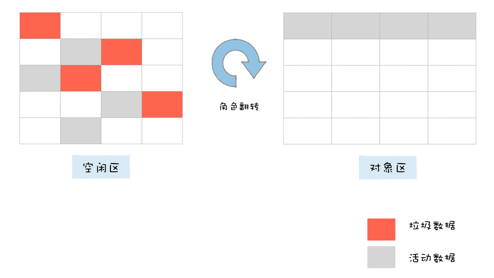
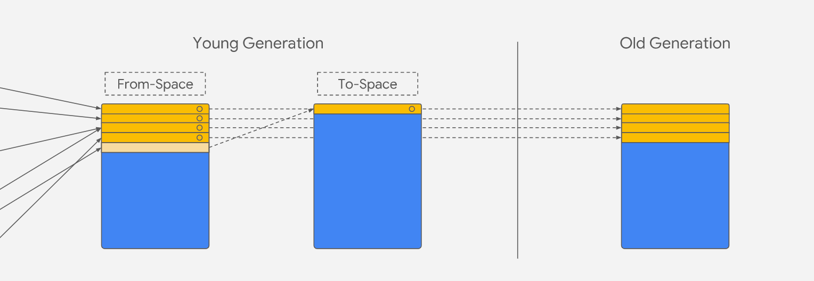

# JavaScript 内存管理机制

- 内存管理
  - 内存生命周期
    - 申请：静态分配 vs 动态分配
        
    - 读写
    - 释放
  - 内存模型
    - 堆栈内存：原始值和引用；大小在编译时已知；分配固定数量的内存
    - 堆内存  
    - 数据段
    - 代码段  
  - 垃圾回收
    - 栈内存回收：通过移动 ESP 栈顶指针（修改 ESP 寄存器值）
    - 堆内存回收
      - 手动回收策略：何时分配内存、何时销毁内存都是由代码控制的
      - 自动回收策略：垃圾数据是由**垃圾回收器**来释放的，并不需要手动通过代码来释放
        - 权衡利弊
        - 垃圾回收算法机制
          - 引用计数
            - 缺点：循环引用
          - [标记-清除](#标记-清除算法)
            - 缺点
              - 内存碎片
              - 全停顿（Stop-The-World）：GC 时会会暂停代码执行
                - 解决方案
                  - 增量标记
            - [V8 堆内存回收机制](#v8-堆内存回收)
              - [分代收集](#新生代和老生代)
          - 所有权
- [常见 JavaScript 内存泄漏及优化](#常见-javascript-内存泄漏及优化)
  - 1: 全局变量
- Chrome Devtool 内存泄漏分析

## 标记-清除算法

算法流程：

1. 标记：从一组 GC Root 对象开始进行**可达性分析**，标记活动对象和非活动对象
2. 清理：回收非活动对象所占据的内存
3. 整理（这步其实是可选的，因为有的垃圾回收器不会产生内存碎片）：对内存碎片化进行整理

> 可达性：从根对象的引用链开始遍历到的对象都是具有可访问性的

在浏览器环境中，GC Root 通常包括了以下几种 (但是不止于这几种)：
- 全局的 window 对象（位于每个 iframe 中）
- DOM
- 栈上变量

  

很多后续的优化算法都是基于标记-清除算法：
- [分代：代际假说和分代收集](#代际假说和分代收集)
- 增量
- 并发
- 并行

## V8 堆内存回收机制

### 新生代和老生代

#### 代际假说和分代收集

代际假说：
1. 第一个是大部分对象在内存中存在的时间很短，简单来说，就是很多对象一经分配内存，很快就变得不可访问；
2. 第二个是不死的对象，会活得更久。

基于代际假说，大多数垃圾回收器都会将堆内存分为两个区域并采取不同的回收算法。

V8 中会把堆分为**新生代和老生代**两个区域。对于这两块区域，V8 分别使用两个不同的垃圾回收器，以便更高效地实施垃圾回收。

- 副垃圾回收器 -Minor GC (Scavenger)，主要负责新生代的垃圾回收。
- 主垃圾回收器 -Major GC，主要负责老生代的垃圾回收。

### 新生代采用 Scavenge 算法回收

1. 新生代空间对半划分为两个区域，**一半是对象区域，一半是空闲区域**    
2. 新加入的对象都会存放到对象区域
3. 当对象区域快被写满时，对对象区域中的垃圾做标记
4. 标记完后，将存活的对象整齐复制到空闲区域中，也就相当于完成了内存整理操作，复制后空闲区域就没有内存碎片了    
5. 完成复制后，清空对象区，然后将对象区域与空闲区域进行角色翻转，也就是原来的对象区域变成空闲区域，原来的空闲区域变成了对象区域    

**默认下，由于新生代中的对象存活存活周期短，需要经常进行垃圾回收，而且 Scavenge 算法会复制移动数据，故不能设置过大空间影响回收效率**。

所以在新生代空间有限的情况下，那些多次存活的对象需要转移到老生区去。JavaScript 引擎采用了**对象晋升策略**，**经过两次垃圾回收依然还存活的对象，会被移动到老生区中**。

  

### 老生代垃圾回收：标记-清除-整理算法

在老生代区中除了新生区中晋升的对象，一些大的对象会直接被分配到老生区。因此老生区中的对象有两个特点，

- 一个是对象占用空间大
- 另一个是对象存活时间长

相比较， Scavenge 算法只适合一些小对象，而且 Scavenge 算法需要将内存分为两半还要复制移动。老生代主要采用**标记-清除-整理算法（mark-sweep-compact）**：
1. 标记(三色“白-灰-黑”标记系统)：从一组 GC Root 对象开始进行**可达性分析**，标记活动对象和非活动对象
2. 清除：清除非活动对象，并将碎片空间记录到空闲列表以便复用  
3. 整理：当高度碎片化时（复制移动是很费时的），将所有存活的对象移动到一端的空闲位置

### 增量标记算法

JavaScript 是运行在主线程之上的，一旦执行垃圾回收算法，如果都需要将正在执行的 JavaScript 脚本暂停下来，待垃圾回收完毕后再恢复脚本执行，那么我们把这种行为叫做**全停顿（Stop-The-World）**。这种情况，应用的性能和响应能力都会直线下降。


在 V8 新生代的垃圾回收中，因其空间较小，且存活对象较少，所以全停顿的影响不大，但老生代就不一样了。为了降低老生代的垃圾回收而造成的卡顿，V8 将标记过程分为一个个的子标记过程，同时让垃圾回收标记和 JavaScript 应用逻辑交替进行，直到标记阶段完成，我们把这个算法称为**增量标记（Incremental Marking）算法**。


使用增量标记算法，可以把一个完整的垃圾回收任务拆分为很多小的任务，与其他任务交替执行，避免阻塞线程造成页面卡顿的感觉。

## 常见 JavaScript 内存泄漏及优化

- 对象引用连
  - 全局变量
  - DOM外引用
- 比包、作用于连
  - 被遗忘的定时器和回调函数

1. 全局变量：可达性分析是从根对象开始遍历标记存活对象

   标记清除算法从根开始遍历标记存活对象，根，就是像 window、document 等全局对象，我们应该减少创建或其他的对象数据引用保留到分支链中，比如应该 消除DOM，却被我们引用又要留全局中

   ```javascript
   var elements = {
     button: document.getElementById('button'),
     image: document.getElementById('image')
   };
   
   function doStuff() {
     elements.image.src = 'http://example.com/image_name.png';
   }
   
   function removeImage() {
       // image 元素是 body 元素的直系后代元素
       document.body.removeChild(document.getElementById('image'));
       // 这时，我们仍然在 elements 全局对象中引用了 #button 元素
       // 换句话说，按钮元素仍然在内存中且不能够被垃圾回收器收集
   }
   ```


2. 弱引用

   WeakMap 和 WeakSet

3. 手动清除定时器

4. 不再使用的对象，手动赋为 null，WeakMap 和 WeakSet


## Chrome Devtool 内存泄漏分析

> 先记录相关文章内容、后续再做整理 😁

如何判断 JavaScript 中内存泄漏的？

可通过 Performance来观察，如果是有规律的周期平稳变化，则不存在内存泄漏，如果整体趋势上涨则说明存在内存泄漏。

- [记一次网页内存溢出分析及解决实践](https://juejin.im/post/5c3dce07e51d4551e960d840)

## 阅读参考

- [垃圾回收：垃圾数据是如何自动回收的？](https://time.geekbang.org/column/article/131233)
- [How JavaScript works: memory management + how to handle 4 common memory leaks](https://blog.sessionstack.com/how-javascript-works-memory-management-how-to-handle-4-common-memory-leaks-3f28b94cfbec)
- [Visualizing memory management in V8 Engine (JavaScript, NodeJS, Deno, WebAssembly)](https://deepu.tech/memory-management-in-v8/)
- [Trash talk: the Orinoco garbage collector](https://v8.dev/blog/trash-talk)


内存垃圾回收器的反直观行为
内存垃圾回收具有不可预见性。你不能确定内存垃圾回收的确切时机。

但是大多数 GC 的实现都共享一种模式，即在内存分配期间进行垃圾回收。如果没有进行内存分配，大多数的内存垃圾回收器就会保持闲置状态。考虑以下情况：

分配一段相当大的内存。
大多数的元素(或所有)被标记为不可获得(假设我们赋值我们不再需要的缓存为 null )
不再分配其它内存。

在该情况下，大多数的内存垃圾回收器不会再运行任何的内存垃圾回收。换句话说，即使可以对不可获得的引用进行垃圾回收，但是垃圾收集器不会进行标记。虽然这不是严格意义上的内存泄漏，但是这会导致高于平常的内存使用率。


由于算法无法知道何时不再需要内存，JavaScript应用程序可能会使用比实际需要更多的内存。

即使对象被标记为垃圾，也要由垃圾收集器决定何时以及是否收集分配的内存。