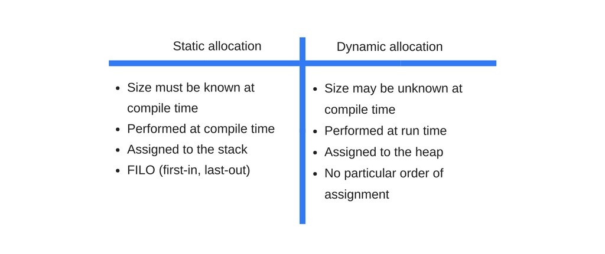
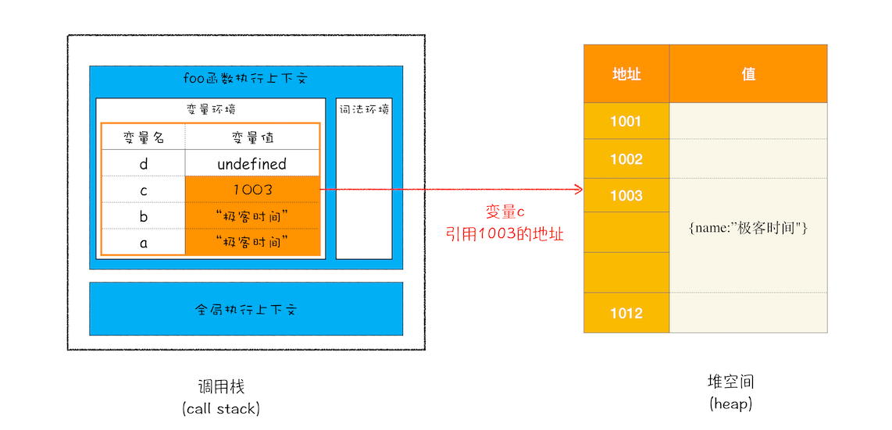
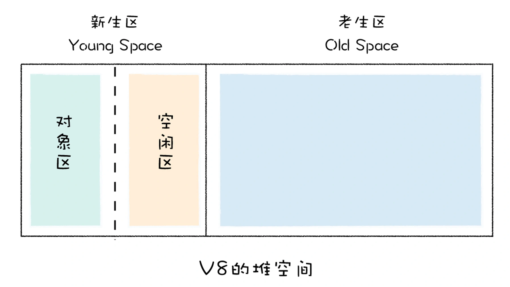
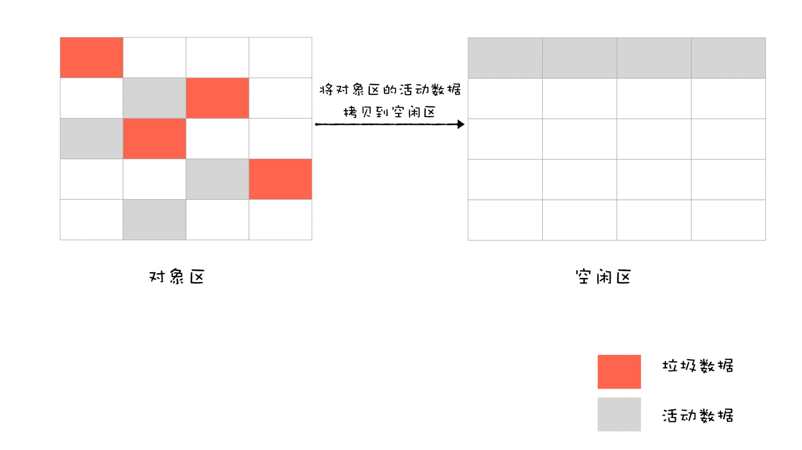

# JavaScript 内存管理机制

- 内存管理
  - 内存生命周期
    - 申请：静态分配 vs 动态分配
        
    - 读写
    - 释放
  - 内存模型
    - 栈：存储执行上下文
    - 堆
    - 数据段
    - 代码段
        
  - 垃圾回收
    - 栈内存回收：通过移动 ESP 栈顶指针（修改 ESP 寄存器值）
    - 堆内存回收
      - 手动回收策略：何时分配内存、何时销毁内存都是由代码控制的
      - 自动回收策略：垃圾数据是由**垃圾回收器**来释放的，并不需要手动通过代码来释放
        - 垃圾回收算法：[V8 堆内存回收机制](#v8-堆内存回收)
          - 算法流程
            - 标记：标记活动对象和非活动对象
              - 引用计数
                - 缺点：循环引用
              - **可达性分析**
            - 清除：回收非活动对象所占据的内存
            - 整理：对内存碎片化整理
          - 优化策略
            - 分代：代际假说和分代收集
            - 并发
            - 增量
  - fefe
    - 1: 全局变量

## V8 堆内存回收机制

任何垃圾回收器都必须经历以下任务流程：
1. 标记：对一组 GC Root 对象进行**可达性分析**，标记活动对象和非活动对象
2. 清理：回收非活动对象所占据的内存
3. 整理：对内存碎片化进行整理（可选）

> 可达性：从根对象的引用链上任何可以遍历到的值都是可访问性

在浏览器环境中，GC Root 通常包括了以下几种 (但是不止于这几种)：
- 全局的 window 对象（位于每个 iframe 中）
- DOM
- 栈上变量

  

### 代际假说和分代收集

代际假说：
1. 第一个是大部分对象在内存中存在的时间很短，简单来说，就是很多对象一经分配内存，很快就变得不可访问；
2. 第二个是不死的对象，会活得更久。

根据此理论基础，V8 中会把堆分为**新生代和老生代**两个区域。对于这两块区域，V8 分别使用两个不同的垃圾回收器，以便更高效地实施垃圾回收。

- 副垃圾回收器 -Minor GC (Scavenger)，主要负责新生代的垃圾回收。
- 主垃圾回收器 -Major GC，主要负责老生代的垃圾回收。

### 新生代采用 Scavenge 算法回收

1. 新生代空间对半划分为两个区域，**一半是对象区域，一半是空闲区域**
     
2. 新加入的对象都会存放到对象区域
3. 当对象区域快被写满时，对对象区域中的垃圾做标记
4. 标记完成之后，执行一次垃圾清理操作
5. 将存活的对象整齐复制到空闲区域中，也就相当于完成了内存整理操作
     
6. 完成复制后，对象区域与空闲区域进行角色翻转，也就是原来的对象区域变成空闲区域，原来的空闲区域变成了对象区域

**默认下，由于新生代中的对象存活存活周期短，需要经常进行垃圾回收，而且 Scavenger算法会复制移动数据，故不能设置过大空间影响回收效率**。

所以在新生代空间有限的情况下，那些多次存活的对象需要转移到老生区去。JavaScript 引擎采用了**对象晋升策略**，**经过两次垃圾回收依然还存活的对象，会被移动到老生区中**。

### 老生代垃圾回收

主垃圾回收器主要负责老生区中的垃圾回收。除了新生区中晋升的对象，一些大的对象会直接被分配到老生区。因此老生区中的对象有两个特点，

- 一个是对象占用空间大
- 另一个是对象存活时间长

老生代主要采用**标记-清除-压缩算法（mark-sweep-compact）**：
1. 标记：对 GC Root 对象进行**可达性分析**，标记活动对象和非活动对象
2. 清除：清除非活动对象，并将碎片空间记录到空闲列表以便复用
3. 压缩（可选）：当高度碎片化时，将所有存活的对象移动到一端的空闲位置

相比较， Scavenge 算法只适合一些小对象，而且 Scavenge 算法需要将内存分为两半而且还要复制移动。


### 全停顿（Stop-The-World）

由于 JavaScript 是运行在主线程之上的，因此，一旦执行垃圾回收算法，都需要将正在执行的 JavaScript 脚本暂停下来，待垃圾回收完毕后再恢复脚本执行。我们把这种行为叫做全停顿（Stop-The-World）。如果浏览器清理内存过长就会造成页面的卡顿 (Jank)。

#### 增量标记算法

JavaScript 是运行在主线程之上的，一旦执行垃圾回收算法，如果都需要将正在执行的 JavaScript 脚本暂停下来，待垃圾回收完毕后再恢复脚本执行，那么我们把这种行为叫做**全停顿（Stop-The-World）**。这种情况，应用的性能和响应能力都会直线下降。


在 V8 新生代的垃圾回收中，因其空间较小，且存活对象较少，所以全停顿的影响不大，但老生代就不一样了。为了降低老生代的垃圾回收而造成的卡顿，V8 将标记过程分为一个个的子标记过程，同时让垃圾回收标记和 JavaScript 应用逻辑交替进行，直到标记阶段完成，我们把这个算法称为**增量标记（Incremental Marking）算法**。


使用增量标记算法，可以把一个完整的垃圾回收任务拆分为很多小的任务，与其他任务交替执行，避免阻塞线程造成页面卡顿的感觉。

## 优化策略

引用是内存垃圾回收算法所依赖的主要概念之一，无论是引用计数还是标记清除，都需要使用到“引用”。虽然浏览器会自动帮助我们进行垃圾回收，但是根据垃圾回收机制，我们还是有必要了解一下常见的几种避免内存泄漏的方式，主要还是围绕“引用”展开：

1. 尽可能少地创建全局变量，以及保留数据引用到全局中

   标记清除算法从根开始遍历标记存活对象，根，就是像 window、document 等全局对象，我们应该减少创建或其他的对象数据引用保留到分支链中，比如应该 消除DOM，却被我们引用又要留全局中

   ```javascript
   var elements = {
     button: document.getElementById('button'),
     image: document.getElementById('image')
   };
   
   function doStuff() {
     elements.image.src = 'http://example.com/image_name.png';
   }
   
   function removeImage() {
       // image 元素是 body 元素的直系后代元素
       document.body.removeChild(document.getElementById('image'));
       // 这时，我们仍然在 elements 全局对象中引用了 #button 元素
       // 换句话说，按钮元素仍然在内存中且不能够被垃圾回收器收集
   }
   ```

2. 少用闭包

3. 弱引用

   WeakMap 和 WeakSet

4. 手动清除定时器

5. 不再使用的对象，手动赋为 null

为了提高应用稳定、和响应速度，总的来说，宗旨是尽可能**减少内存占用，尽可能减少 GC 触发**。

## 内存分析实战

如何判断 JavaScript 中内存泄漏的？

可通过 Performance来观察，如果是有规律的周期平稳变化，则不存在内存泄漏，如果整体趋势上涨则说明存在内存泄漏。


[通过垃圾回收机制理解 JavaScript 内存管理](https://juejin.im/post/5c4409fbf265da616f703d5a)
[如何处理 JavaScript 内存泄漏](https://mp.weixin.qq.com/s?__biz=MzA5NzkwNDk3MQ==&mid=2650585408&idx=1&sn=4de7b5bbfa969d9587c163e98bc90684&source=41#wechat_redirect)
[垃圾回收](https://segmentfault.com/a/1190000003641343)
[编写内存友好的代码](https://segmentfault.com/a/1190000007887891)
[JavaScript 中 4 种常见的内存泄漏陷阱](https://mp.weixin.qq.com/s?__biz=MzAxODE2MjM1MA==&mid=2651551451&idx=1&sn=b8447a12eceb467992d432b014d9c026&chksm=8025a11ab752280c7915db4ef726611f645d2fee590d6f0f3f9aeedd55c956454f66f786873a&scene=0#wechat_redirect)
[记一次网页内存溢出分析及解决实践](https://juejin.im/post/5c3dce07e51d4551e960d840)

## 阅读参考

- [垃圾回收：垃圾数据是如何自动回收的？](https://time.geekbang.org/column/article/131233)
- [内存管理及如何处理 4 类常见的内存泄漏问题](https://github.com/Troland/how-javascript-works/blob/master/memory-management.md)
- [V8引擎的内存管理](https://mp.weixin.qq.com/s/vvZy6rBb8RyTaiBKo5ryHg)