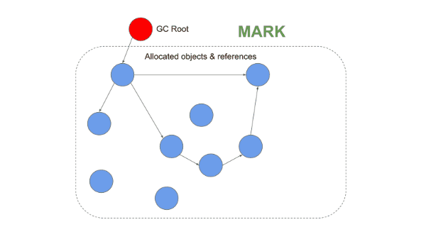

# JavaScript 内存管理机制

- 内存管理
  - 内存生命周期
    - 申请：静态分配 vs 动态分配
        
    - 读写
    - 释放
  - 内存模型
    - 栈：原始值和引用（数据类型分配的内存大小是固定的）
    - 堆  
    - 数据段
    - 代码段  
  - 垃圾回收
    - 栈内存回收：通过移动 ESP 栈顶指针（修改 ESP 寄存器值）
    - 堆内存回收
      - 手动回收策略：何时分配内存、何时销毁内存都是由用户自己手动控制的
      - 自动回收策略
        - 引用计数（ARC）：在编译时自动添加维护引用计数的代码，减轻开发者维护堆内存的负担。但同样地，它也会有不小的运行时性能损耗
          - 优点
            - 实现简单、延迟低：引用计数为零时，发现垃圾立即回收
            - 由于释放操作是针对个别执行的，因此和其他算法相比，由 GC 而产生的中断时间比较短
          - 缺点
            - **循环引用**
            - 空间开销比较大
        - 追踪式 GC：由垃圾回收器定期扫描堆上数据还有没有人引用，来替开发者管理堆内存
          - [标记-清除算法](#标记-清除算法)
          - 优点：主要解决了“引用计数算法”不能清除循环引用的问题
          - 缺点
            - 内存碎片化
            - 全停顿（Stop-The-World）：GC 时会会暂停代码执行
            - 不可预见性：你不能确定内存垃圾回收的确切时机
          - [V8 堆内存回收机制](#v8-堆内存回收)
            - 分代假设
              - 新生代：Scavenge 算法
              - 老生代：标记-清除-整理算法
            - 分代假设
            - 增量回收
            - 并发
            - 并行
        - [所有权、借用及生命周期](../Rust/内存安全：所有权、借用及生命周期.md)
- 内存问题
  - 内存泄漏：当一块内存不再被应用程序使用的时候，由于某种原因，这块内存没有被回收，一直被占用着造成内存浪费
  - 内存膨胀：是属于程序员对内存不科学的管理，突然加载了过多资源，需要合理规划项目，充分利用缓存等技术来减轻项目中不必要的内存占用
  - 频繁垃圾回收：频繁垃圾回收会造成系统响应变缓，一般是频繁使用大的临时变量，导致了空间很快被装满，从而频繁触发垃圾回收
- [常见 JavaScript 内存泄漏及优化](#常见-javascript-内存泄漏及优化)
- 使用 Chrome Devtool 内存泄漏分析

## 标记-清除算法

算法流程：

1. 标记：从一组 GC Root 对象的引用链开始进行**可达性分析**，标记活动对象和非活动对象
2. 清理：回收非活动对象所占据的内存
3. 整理（可选）：对内存碎片化进行整理

> 可达性：从根对象的引用链开始遍历到的对象都是具有可访问性的

在浏览器环境中，GC Root 通常包括了以下几种 (但是不止于这几种)：
- 全局的 window 对象（位于每个 iframe 中）
- DOM
- 堆栈上变量

  

很多后续的优化算法都是基于标记-清除算法：

- 分代假设
- 增量回收
- 并发
- 并行

## V8 堆内存回收机制

### 分代假设

#### 代际假说和分代收集

代际假说：
1. 第一个是大部分对象在内存中存在的时间很短，简单来说，就是很多对象一经分配内存，很快就变得不可访问；
2. 第二个是不死的对象，会活得更久。

基于代际假说，大多数垃圾回收器都会将堆内存分为两个区域并采取不同的回收算法。

V8 中会把堆分为**新生代和老生代**两个区域。对于这两块区域，V8 分别使用两个不同的垃圾回收器，以便更高效地实施垃圾回收。

- 副垃圾回收器 -Minor GC (Scavenger)，主要负责新生代的垃圾回收。
- 主垃圾回收器 -Major GC，主要负责老生代的垃圾回收。

### 新生代：Scavenge 算法

1. 将内存分为两个对等空间，分别为 From 区域和 To 区域。 
2. 新加入的对象都会存放到 From 区域
3. 当 From 区域快被写满时执行清除操作：跟踪 From 区域的活动对象并复制到 To 区域，相当于完成了内存整理操作，复制后空闲区域就没有内存碎片了   
4. 完成复制后，From 区域与 To 区域进行角色翻转，  

**默认下，由于新生代中的对象存活存活周期短，需要经常进行垃圾回收，而且 Scavenge 算法会复制移动数据，故不能设置过大空间影响回收效率**。

在新生代空间有限的情况下，那些多次存活的对象需要转移到老生区去。JavaScript 引擎采用了**对象晋升策略**，**经过两次垃圾回收依然还存活的对象，会被移动到老生区中**。

  

### 老生代：标记-清除-整理算法

在老生代区中除了新生区中晋升的对象，一些大的对象会直接被分配到老生区。因此老生区中的对象有两个特点，

- 一个是对象占用空间大
- 另一个是对象存活时间长

相比较，而且 Scavenge 算法需要将内存分为两半还要复制移动，Scavenge 算法只适合一些小对象。故老生代主要采用**标记-清除-整理算法（mark-sweep-compact）**：
1. 标记：从一组 GC Root 对象开始进行**可达性分析**，标记活动对象和非活动对象
2. 清除：清除非活动对象，并将碎片空间记录到空闲列表以便复用  
3. 整理：当高度碎片化或者空间不足时进行内存整理，将所有存活的对象移动到一端的空闲位置

### 回收效率优化

#### 副垃圾回收器：并行回收

指垃圾回收器在主线程上执行的过程中，还会开启多个协助线程，同时执行同样的回收工作

  

#### 主垃圾回收器：并发标记清除、并行压缩、增量式回收

  

1. 主线程执行 JavaScript 和辅助线程标记任务并发执行，通过三色标记 + 读写屏障技术确保一致堆的引用状态
2. 当并发标记完成，或者我们达到动态分配限制时。主线程和辅助线程并发清理、并行整理（整理关系到指针的更新，所以主线必须停止执行代码，一起参与整理）

#### 三色标记 + 读写屏障

采用增量垃圾回收时，垃圾回收器没有必要一次执行完整的垃圾回收过程，每次执行的只是整个垃圾回收过程中的一小部分工作

并发回收，回收线程在执行 JavaScript 的过程，辅助线程能够在后台完成的执行垃圾回收的操作。


使用增量标记算法，可以把一个完整的垃圾回收任务拆分为很多小的任务，与其他任务交替执行，避免阻塞线程造成页面卡顿的感觉。

## 常见 JavaScript 内存泄漏及优化

**根据 JavaScript 垃圾回收机制，造成内存泄漏 (Memory leak) 的主要原因是不再需要 (没有作用) 的内存数据依然还在 GC 根对象的引用链上**。

开发人员常见的疏忽导致 JavaScript 内存泄漏情况有：
- 全局变量
- 缓存
  - 持有 DOM 外引用
- 闭包
- 被遗忘的定时器和回调函数

### 全局变量

非严格模式下，未定义的变量默认会被声明为全局变量；普通函数调用默认情况下 this 是指向 window 对象

```js
function foo(arg) {
  bar = "some text";
}


function foo() {
    //创建一个临时的temp_array
    this.temp_array = new Array(200000)
   /**
    * this.temp_array
    */
}
```

  

```js
function out() {
    const bigData = new Buffer(100);
    inner = function () {

    }
}
```
这里举得例子只是简单的将引用挂在全局对象上，实际的业务情况可能是挂在某个可以从 root 追溯到的对象上导致的

1. 手动清除定时器

2. 不再使用的对象，手动赋为 null，WeakMap 和 WeakSet


## Chrome Devtool 内存泄漏分析

> WIP

> 先记录相关内容、后续再做整理 😁

如何判断 JavaScript 中内存泄漏的？

可通过 Performance来观察，如果是有规律的周期平稳变化，则不存在内存泄漏，如果整体趋势上涨则说明存在内存泄漏。

- [记一次网页内存溢出分析及解决实践](https://juejin.im/post/5c3dce07e51d4551e960d840)

- 内存排查
  - 查看内存是否周期性增长

## 学习参考

- [垃圾回收：垃圾数据是如何自动回收的？](https://time.geekbang.org/column/article/131233)
- [How JavaScript works: memory management + how to handle 4 common memory leaks](https://blog.sessionstack.com/how-javascript-works-memory-management-how-to-handle-4-common-memory-leaks-3f28b94cfbec)
- [Visualizing memory management in V8 Engine (JavaScript, NodeJS, Deno, WebAssembly)](https://deepu.tech/memory-management-in-v8/)
- [Trash talk: the Orinoco garbage collector](https://v8.dev/blog/trash-talk)
- 《图解 Google V8》


先说说思考题：内存泄漏问题的定位，一般是通过chrome的devtool中memory report来观察的，nodejs环境中的mem leak case我们研究的比较多，一般通过结合memwatch等c++扩展包把report文件dump在线上机磁盘上，然后download下来在本地的chrome浏览器devtool中进行复盘。比较常见的case是一些js工程师对scope的理解不够深，复杂的闭包里出现了隐式的引用持有却没释放。此类问题一般隐蔽性比较强，而且如果不是大厂的业务线（业务高峰产生高并发环境），往往可能压根发现不了，因为就算有leak 内存逐渐增长到v8的heap limit后node进程死掉就会被pm2/forever等守护进程复活，这个重启只要不是非常频繁往往是业务无感的～