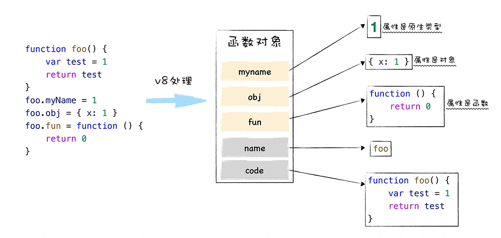

# JavaScript 函数

JavaScript 中的函数称是一等公民。可以赋值给一个变量，还可以将函数作为一个参数传递给另外一个函数，甚至可以使得一个函数返回另外一个函数。

JavaScript 是一门基于对象 (Object-Based) 的语言，JavaScript 中的函数就是一种特殊的对象。它和对象一样可以拥有属性和值，但是函数和普通对象不同的是，函数可以被调用。V8 内部是会为函数对象添加了两个隐藏属性，具体属性如下图所示：

  

隐藏 name 属性的值就是函数名称，如果某个函数没有设置函数名，该函数对象的默认的 name 属性值就是 anonymous，表示该函数对象没有被设置名称。另外一个隐藏属性是 code 属性，其值表示函数代码，以字符串的形式存储在内存中。当执行到一个函数调用语句时，V8 便会从函数对象中取出 code 属性值，也就是函数代码，然后再解释执行这段函数代码。

## 闭包

JavaScript 的函数是一等公民，函数可以作为函数的返回值，由于 JavaScript 的函数是静态作用域，函数的作用域只跟声明位置有关，当返回函数被调用时，如果内部函数引用了外部的变量时，就需要即使外部函数销毁时也要保留引用到的外部变量，这种将外部变量和和函数绑定起来的技术称为闭包。

```javascript
function foo(){
    var number = 1
    function bar(){
        number++
        console.log(number)
    }
    return bar
}
var mybar = foo()
mybar()
```