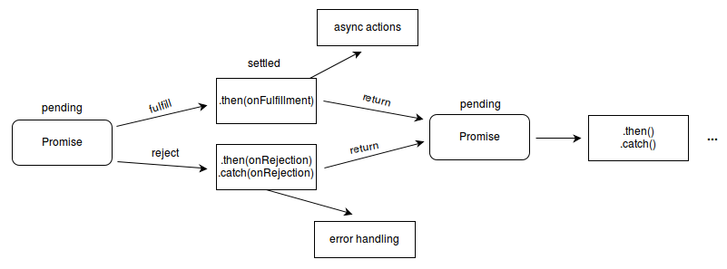

# JavaScript 异步编程

- JavaScript 异步编程
  - [异步编程](#何为异步编程)
  - JavaScript 的执行环境：事件循环与消息队列
  - JavaScript 异步编程范式
    - 异步回调
    - 发布订阅模式
    - Promise
    - 函数响应式编程
    - Generator & co
    - Async/Await

## 何为异步编程

同步/异步是一种术语在不同场景下有不同层面的意思。个人觉得比较广义的说法，同步/异步关注的是事物之间的行为模式、协作关系：一个事物的发生必须等待另一事物的结果，这就是同步，反之亦是异步，说明事物之间没有因果顺序关系，是独立性的。

在编程语言中，同步编程意味着任务的执行流程跟代码的编写、调用顺序是一样的，而异步编程模型中，代码更多是被组织成为了异步任务单元，任务的发生、执行顺序不再像同步编程那样直观、可预测，因为他们之间没有明确的时序关系，统一由异步运行时并发调度。

> 💡 并发是系统拥有同时与多件事情打交道的能力；并行是同时处理多件事情的手段；并行是并发的子集 

编程语言的异步体系构成：
- 硬件层
- 操作系统
- 并发模型

硬件层：我们世界的事物是在并发发生的，计算机的内部硬件同样如此。比如多个 CPU 可以并行工作；CPU 可以与 IO 设备异步进行，IO 设备通过 DMA 方式直接与内存打交道，然后通过中断信号后通知 CPU 再来读取相应的设备缓冲区。

操作系统：大多数编程语言都是同步模型，但实际上我们的程序在计算机内部却是并发执行的，操作系统以线程作为最小调度执行单位并且分时调度我们的代码（操作系统会保存上下文及执行位置以便恢复原来执行），这对于开发者来说是无感的，并且操作系统还帮我们屏蔽硬件层面的异步，（主要）提供了阻塞的系统调用，这样的一切使得我们程序表现出一种同步执行效果。

并发模型：为了保证并发系统设计的正确性人们试图通过形式化的模型来规范它，并发模型主要分为**线程模型**和**异步模型（事件驱动）**，从理论上说，本质上两者是等价的，它们都是调度代码执行的手段，或者说在计算机里模拟并发性的手段。区别：
- 线程适合处理事务之间有着明显因果关系或者相关性很强的场合，事件驱动机制会把代码搞的支离破碎
- 事件驱动比较擅长处理异步事件的问题，但当需要处理跨事件的事务逻辑时，事件驱动都会变得复杂难解；事务驱动有一点优势的地方，就是它与生俱来的并发性和灵活性
- 线程是分时调度或抢占式调度机制；而事件驱动机制则采用单线程事件循环、协程这样一种协作式的调度机制
- 使用协作式多任务处理的应用程序的编程难点在于，切换处理，保持上下文环境，这些职责都落在了可怜的开发者肩上了或者由编程语言去实现异步运行时和编程范式；而线程模型则由操作系统自带

那么异步编程相比同步编程究竟有什么好处？使用异步编程可以提高系统的并发性，相当于提高系统的响应性和资源利用率。

任务一般分为 IO 密集型和 CPU 密集型。而 web 领域是一个 IO 密集的场景：主流的多线程并发方案不仅要面对竞争条件、死锁等编程问题，更重要的是绝大部分线程都处在等待网络响应或者等待磁盘读取中，CPU 的利用率依然很低，而且大部分 CPU 都耗在操作系统的线程调度上了；而且线程也是资源，它们不是免费的，系统有数量限制。

**异步编程主要是解决 CPU 上下文切换消耗问题，提高 CPU 利用率**。  

**异步编程本质上是带有用户空间线程的协作式多任务处理机制**，应用程序在用户空间中管理"线程"和上下文切换，由用户程序自行任务调度避免了**阻塞原来线程，CPU 在线程上下文切换消耗**。

> 协作式的核心是“主动”协调：我不放弃执行权，任何人不能强制我休眠；我做完了自己的工作，那就一定要主动放弃执行权，方便其它人使用CPU工作。

总结来说，异步编程是一种并发编程模型，**任务只有具备异步特性才能并发执行**，但保证单个事务的连续性（代码是可异步执行，但业务逻辑必须是同步关系）是编程中**异步处理**的关键解决之道。

接下来，我们来看看 JavaScript 异步编程中的异步运行时和编程范式。

## JavaScript 的执行环境：事件循环 + 异步回调队列

JavaScript 是一门单线程语言，一旦遇到阻塞任务整个线程就会卡住
JavaScript 引擎基于一个事件循环的单线程环境，

JS 任务主要是单线程同步执行，对于异步任务的实现主要是通过环境提供的异步 API + 异步回调的范式去支持

## JavaScript 异步编程范式

- JavaScript 异步编程范式
  - 回调
    - 问题
      - 回调地狱
      - 分流结果处理：每种任务的处理结果存在两种可能性（成功或失败），那么需要在每种任务执行结束后分别处理这两种可能性
  - 发布订阅模式：发布订阅模式解决了回调地狱的问题，但逻辑碎片化的问题没有解决
  - [Promise](#promise)
  - Generator & co
  - Async/Await
  - 函数响应式编程：是一种发布订阅模式和迭代模式的结合，

### Promise

Promise 通过链式调用的写法解决了回调地狱的问题，并且保证了相关逻辑线型内聚，更符合人的线性思维模式，提高了一定的可读性。

Promise 是一种数据结构，本质可以看作是状态机和观察者模式结合。

- Promise 实例
  - state    
    - pending
    - fulfilled
    - rejected
  - value
  - reason
  - then：接受两个参数，一个是成功时回调，另一个是失败时的回调，两者都是可选的
    - 链式调用
    - 延迟绑定
    - 值穿透：当我们不在 then 中放入参数，或者参数不为 function，例：promise.then().then()，那么其后面的 then 依旧可以得到之前 then 返回的值
    - 返回值穿透
    - 错误冒泡
  - catch
  - finally
- Promise 静态方法
  - resolve
  - reject
  - all：返回所有状态成功的 Promise，否则返回失败的 Promise
  - allSettled：所有的 Promise 状态完成就返回，不管其是否处理成功
  - any：接收一个Promise对象的集合，返回状态优先成功的 Promise，否则返回全部失败结果
  - race：接收一个Promise对象的集合，返回状态优先完成的 Promise


协程本质上和单线程+状态机是等价的，只是用协程的话，协程负责来保存状态，开发起来方便些。

### Async/Await 实现原理

Async/Await 其实只是语法糖，通过编译器编译成 Generator 函数和通过 Promise 实现一个自动执行器。

```js
function _async(gen) {
  const g = gen()
  return new Promise((resolve, reject) => {
    const co = function(res, err) {
      try {
        let { value, done } = err ? g.throw(err) : g.next(res);
        if(done) {
          resolve(value) 
        } else {
          Promise.resolve(value).then(co, (err) => co(null, err))
        }
      } catch (error) {
        reject(error)
      }
    };
    co();
  });
}

function* g() {
  let res = yield Promise.resolve(1);
  const fn = () => 2
  // const fn = () => { throw 2 }
  res += yield Promise.resolve(fn());
  // try {
  //       res += yield Promise.resolve(fn());
  // } catch (error) {
  //       console.log(error)
  // }
  return res;
}

_async(g).then((res) => {
  console.log(res); // 3
});
```

把生成器 g 跟 async 函数版本对比一下，不就是：

- function* 换成 async
- yield 换成 await
- value 用 Promise.resolve(value) 包装

```js
async g() {
  let res = await 1;
  const fn = () => { throw 2 }
  res += await fn();
  return res;
}
```

## 参考

- [从根本上了解异步编程体系](https://zhuanlan.zhihu.com/p/434361727)
- [白话并发模型和异步编程范式](https://code2life.top/2021/05/31/0062-concurrent-model-async-programming/)
- [并发编程模型：事件驱动 vs 线程](https://zhuanlan.zhihu.com/p/32961438)
- [Asynchronous programming. Blocking I/O and non-blocking I/O](https://luminousmen.com/post/asynchronous-programming-blocking-and-non-blocking)
- [Asynchronous programming. Cooperative multitasking](https://luminousmen.com/post/asynchronous-programming-cooperative-multitasking)
- [Asynchronous programming. Await the Future](https://luminousmen.com/post/asynchronous-programming-await-the-future)