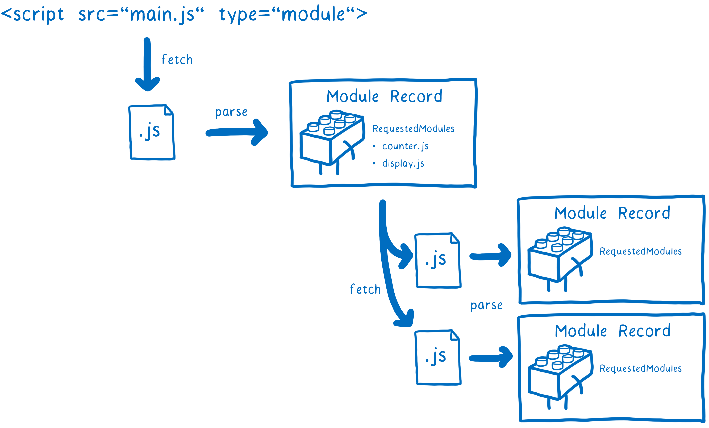
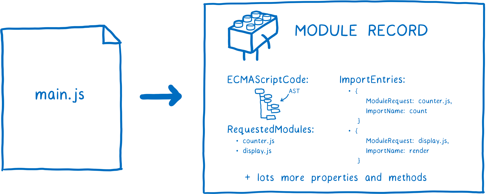
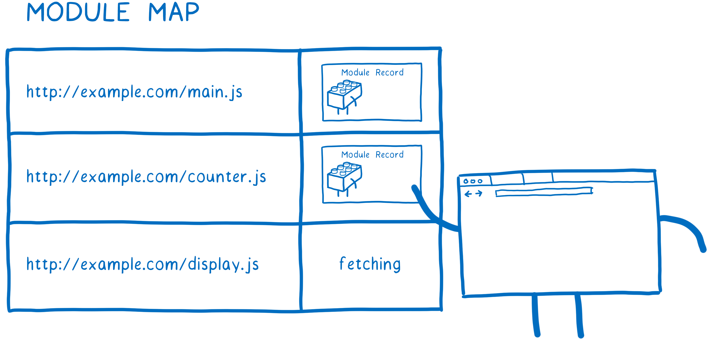
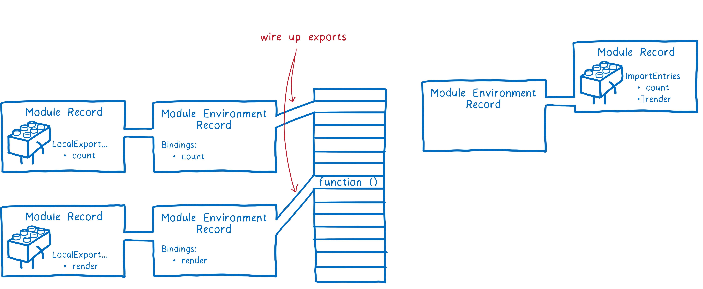
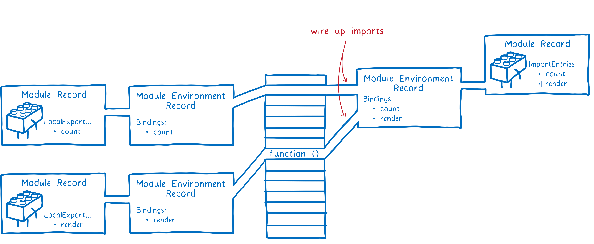

# JavaScript 模块

- JavaScript 模块
  - [模块化发展历程](#javascript-模块发展历程)
  - [ES Modules](#es-modules)

## JavaScript 模块发展历程

1. 原始阶段
   1. 文件划分
   2. 对象命名空间
   3. IIFE
2. 社区标准化阶段
   1. **CommonJS**：适用于服务端的同步模块加载机制  
   2. AMD：适用于浏览器的异步模块加载机制
      1. RequireJS
   3. UMD：通用模块标准
3. **ES Modules**

### 原始阶段：文件划分、对象命名空间方式、IIFE

- 文件划分：以文件形式上模块化划分变量
- IIFE + 对象命名空间：解决了全局污染、解决命名冲突、成员访问控制

```js
// module-a.js
;(function () {
  var name = 'module-a'
  function method1 () {
    console.log(name + '#method1')
  }

  window.moduleA = {
    method1: method1
  }
})()

// module-b.js
;(function () {
  var name = 'module-b'
  function method1 () {
    console.log(name + '#method1')
  }

  window.moduleB = {
    method1: method1
  }
})()


<!DOCTYPE html>
<html>
<head>
  <meta charset="UTF-8">
  <title>Stage 2</title>
</head>
<body>
  <script src="module-a.js"></script>
  <script src="module-b.js"></script>
  <script>
    moduleA.method1()
    moduleB.method1()
  </script>
</body>
</html>
```

依赖混乱

## ES Modules

- ES Modules
  - 语法
    - 动态导入 `import()`
    - `import.meta`
    - systemjs
  - 工作机制
  - 循环加载：如何解决依赖循环导致的死循环问题？

### ES Modules 语法

- export 声明
  - `export let a` 单变量声明导出
  - `export {a, b, c}`  变量名列表导出
  - `export default let a` 默认导出 
  - `export default a` 表达式导出 
- import 声明
  - `import x from "./a.js"` 默认引入
  - `import {a as x, modify} from "./a.js"` 成员引入
  - `import * as x from "./a.js"` 把模块中所有的变量以类似对象属性的方式引入
- 导入导出
  - `export * from 'a.js'`

### ES modules 是如何工作的？

每个 ES module 的加载主要会经历构建、实例化、执行求值这个三个阶段，并且这三个阶段是**异步执行**：

- *入口文件*：**模块加载器**第一个加载的模块
- 构建    
  - 依赖解析    
    - Modules Resolve：模块 URL 解析
    - [Import maps](https://github.com/WICG/import-maps)
  - 文件获取：文件的加载是
  - 文件解析
    - 构建的主要目的就是将文件解析成**模块记录**    
      - 一个模块在构建时直到所有相关依赖的文件都被获取、解析完才算构建完成
      - 每一个模块只存在一条对应的模块记录
    - 代码处理
      - "use strict"
      - 顶层 await
    - [**Module Map**：缓存模块](https://html.spec.whatwg.org/multipage/webappapis.html#module-map)    
- 实例化：将所有模块导入导出的内存地址关联起来
  - 编译模块时，JS 引擎会创建一条**模块环境的记录**，管理模块导出内容的内存位置
    - 所有被导出的函数声明将会在这个阶段被初始化，而普通变量则未初始化，只有在执行求值过程才会被填充    
  - 在实例化模块的过程，根据依赖树引擎将会采用深度优先后续遍历的算法，也就是在完成子模块导出成员的内存记录后，在返回上层模块才能获取导入成员的内存**引用**    
  - 模块实例 = 代码 + 状态（导出内容）
  - **Module Map** 同样也会缓存到这些模块实例
- 求值：由于模块缓存，每一个模块**只执行一次求值**

### 如何解决依赖循环导致的死循环问题？

“依赖循环”（circular dependency）指的是，a 脚本的执行依赖b脚本，而 b 脚本的执行又依赖 a 脚本，这通常会导致在模块加载过程中发生**死循环**。

但是实际上，这是很难避免的，尤其是依赖关系复杂的大项目。这意味着，模块加载机制必须考虑“循环加载”的情况。

解决模块依赖导致的死循环问题关键是**使用模块缓存避免重复加载**，只不过 CommonJS、ES Modules 发生模块缓存的机制不同：

CommonJS 是在**运行时**加载模块时**会先创建一个模块对象缓存起来再执行**，

```js
{
  id: '...',
  exports: { ... },
  loaded: true,
  ...
}
```

在返回模块实例前就遍历完其整个依赖关系树：完成加载、实例化以及对各。另外，一旦出现某个模块被"循环加载"，就**只输出已经执行的部分，还未执行的部分不会输出值**：

模块 A：

```javascript
exports.loaded = false
const b = require('./b')
module.exports = { 
    bWasLoaded: b.loaded, 
    loaded: true 
}
```

模块 B：

```javascript
exports.loaded = false
const a = require('./a')
module.exports = { 
    aWasLoaded: a.loaded, 
    loaded: true 
}
```

在 index.js 中调用：

```javascript
const a = require('./a');
const b = require('./b') 
console.log(a)
console.log(b)
```

这种情况下，并未出现死循环崩溃的现象，而是输出：

```json
{ bWasLoaded: true, loaded: true }
{ aWasLoaded: false, loaded: true }
```

从例子看出：

- CommonJS 模块遇到循环加载时，返回的是当前已经执行的部分的值，而不是代码全部执行后的值
- CommonJS 输入的是被输出值的拷贝，不是引用

相比较 CommonJS 的运行时模块缓存，**ES Modules 则是在编译时就生成一个模块记录并缓存，且其记录模块的输出接口**。

```js
// a.mjs
import {bar} from './b';
console.log('a.mjs');
console.log(bar());
function foo() { return 'foo' }
export {foo};

// b.mjs
import {foo} from './a';
console.log('b.mjs');
console.log(foo());
function bar() { return 'bar' }
export {bar};
```

执行 a 文件后：

```shell
console.log(foo);
            ^

ReferenceError: Cannot access 'foo' before initialization
```

b 文件里执行到加载 a 文件时，同样由于模块缓存的作用避免重复加载，但导入的接口拿到的是一个**引用**，由于 a 模块只是定义了 foo 接口但未初始化，所以会导致 b 模块中访问时报错。

#### 总结

总的来说，两者解决死循环的本质还是得靠**模块缓存**，避免重复加载。但两者模块缓存的时机不同：CommonJS 是在运行时，而 ES modules 是在编译时。使用过程中需要注意的是，已执行部分的接口输出是有值，而未执行部分的接口输出可能是没有值（CommonJS）或者不可访问（ES modules）。

### ES modules 与 CommonJS 的区别

- ES6 模块与 CommonJS 模块的区别
  - CommonJS 模块导出的是一个值的拷贝，ES6 模块导出的是值的引用
  - CommonJS 模块是运行时加载，ES6 模块是编译时输出接口。
  - CommonJS 模块的require()是同步加载模块，ES6 模块的import命令是异步加载，有一个独立的模块依赖的解析阶段。
  - CommonJS 模块使用 `require()` 和 module.exports，ES6 模块使用 import 和 export
  - CommonJs 是单个值导出，ES6 Module可以导出多个
  - CommonJs 的 this 是当前模块，ES6 Module的 this 是 undefined
  - ES6 模块的运行机制与 CommonJS 不一样。JS 引擎对脚本静态分析的时候，遇到模块加载命令import，就会生成一个只读引用。等到脚本真正执行时，再根据这个只读引用，到被加载的那个模块里面去取值。
  - **原因是模块加载过程的缓存机制：Node.js 对模块加载进行了缓存**
  - 在模块中，import 实际上不会直接执行模块，而是只生成一个引用。在模块内真正引用依赖逻辑时，再到模块里取值**

### 在 Node.js 中使用 ES modules

- 模块加载
  - `.mjs` 文件总是以 ES6 模块加载
  - `.cjs` 文件总是以 CommonJS 模块加载
  - `.js` 文件的加载取决于 package.json 里面 `type` 字段的设置
    - commonjs（默认）
    - module
- 模块入口
  - main
  - exports
    - exports字段的优先级高于main字段
- 内部变量：ES6 模块应该是通用的，同一个模块不用修改，就可以用在浏览器环境和服务器环境。为了达到这个目标，Node.js 规定 ES6 模块之中不能使用 CommonJS 模块的特有的一些内部变量。

## 学习参考

- [ES modules: A cartoon deep-dive](https://hacks.mozilla.org/2018/03/es-modules-a-cartoon-deep-dive/)