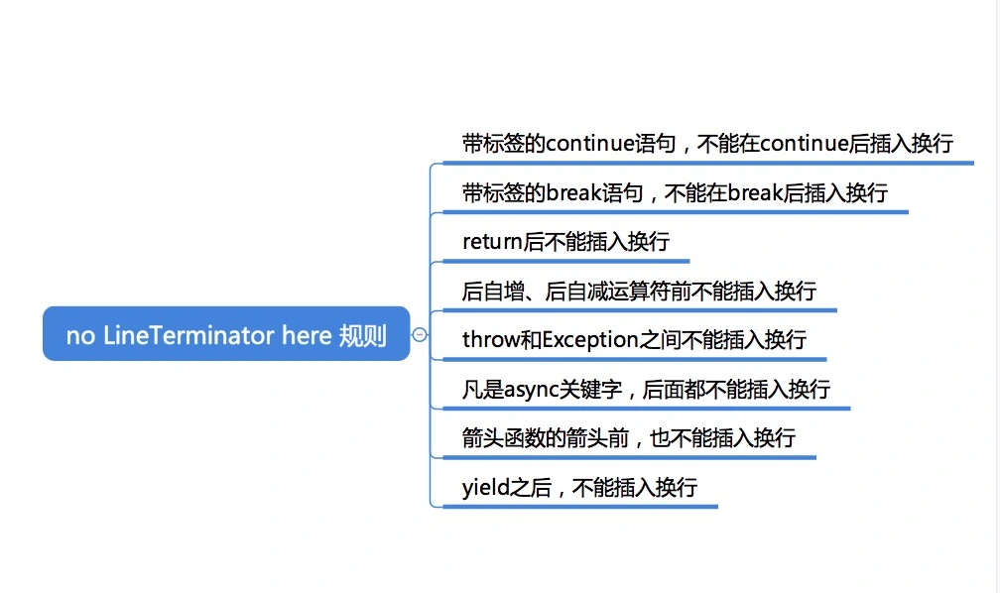

# JavaScript

- JavaScript
  - 基础
    - 变量声明、值和类型
    - 函数/过程
    - 控制流
      - 分支
      - 循环
    - 表达式及运算符
    - 注释
  - [类型系统](./JavaScript%20类型系统.md)
  - 数据结构
    - [数组](./JavaScript%20数组%20API%20总结.md)
    - Set
    - Map
  - [JavaScript 模块](./JavaScript%20模块.md)
  - [JavaScript 对象](./JavaScript%20对象.md)
  - [JavaScript 异步编程](./JavaScript%20异步编程.md)
    - 事件驱动与回调函数
    - Promise
    - Generator & co
    - async/await
  - 函数式编程
    - [Master the JavaScript Interview: What is a Pure Function?](https://medium.com/javascript-scene/master-the-javascript-interview-what-is-a-pure-function-d1c076bec976#.kt48h2bfa)
    - 函数柯里化
    - [ts-belt](https://github.com/mobily/ts-belt)
  - 运行时
    - [内存管理机制](./JavaScript%20内存管理机制.md)
      - 堆栈内存
      - 标记-清除
    - 运行原理
      - [编译时](./JavaScript%20代码执行过程（编译时）.md)
      - [JavaScript 代码执行机制](./JavaScript%20代码执行机制.md)
  - 元编程
  - [JavaScript 正则表达式](./JavaScript%20正则表达式.md)
- api
  - [手写 call、apply、bind](https://github.com/laoergege/laoergege-blog/issues/79)
  - [手写 Promise](https://github.com/laoergege/laoergege-blog/issues/81)
    - [JavaScript Promise迷你书（中文版）](http://liubin.org/promises-book/#introduction)
  - [手写 instanceof](https://github.com/laoergege/laoergege-blog/issues/74)
  - [手写 new](https://github.com/laoergege/laoergege-blog/issues/78)
  - [数组扁平化](https://github.com/laoergege/laoergege-blog/issues/64)
  - [数组去重](https://github.com/laoergege/laoergege-blog/issues/63)
  - [手写节流、防抖](https://github.com/laoergege/laoergege-blog/issues/83)
  - [EventEmitter 实现](https://github.com/laoergege/laoergege-blog/issues/84)
- 学习资料
  - [You-Dont-Know-JS](https://github.com/getify/You-Dont-Know-JS)
  - [ES6 入门教程](https://es6.ruanyifeng.com/)
  - 重新前端
  - [JavaScript开发者应懂的33个概念](https://github.com/stephentian/33-js-concepts)
  - [Deep JavaScript](https://exploringjs.com/deep-js/toc.html)
- js 学习路线
  - 开始
    - 基本语法
    - api
  - 深入
    1. 变量提升机制（历史问题）
    2. 类型系统
    3. 静态作用域（链）
    4. 对象模型
    5. 原型（链）
    6. 闭包
    7. 元编程
       1. function
       2. eval
       3. with
  - 更深
    - ES 语言规范
    - 了解 V8 JS 编译原理
    - 关注 JS 编译器比如 V8 团队，及周边发展
  - 底层
    - 研究 V8 源码
    - 语言设计及编译原理


## 分号

JavaScript 程序代码可以不用写分号符，编译器会对换行符进行判断，**是否忽视或者自动插入分号**，但在某些情况下最好写上分号符，因为编译器区分不出是否要插入分号。

```js
function f(){
    return 1
    +
    2
}
f() // 3
```

```js
let a = 1
let b = 2
// 相当于
// let a = 1; let b= 2
```

自动插入分号规则总结如下：

1. 要有换行符，且下一个符号是不符合语法的，那么就尝试插入分号。
2. 有换行符，且语法中规定此处**不能有换行符**，那么就自动插入分号。
3. 源代码结束处，不能形成完整的脚本或者模块结构，那么就自动插入分号。

### no LineTerminator here （不能有换行符）规则

  

自增、后自减运算符：

```js
let a = 1

a /*no LineTerminator here*/
++
// a; ++

console.log(a) // 1
```

### 手写分号的特殊情况

需要手写分号的都是编译器无法区分的情况，即上一个符号与下一个符号之间组合可能存在意义比如 

```js
let a = [[1]]
[0].map(e => 2)
// 被当作数组下标运算 [][] 
// let a = [[1]][0].map(e => 2)

console.log(a) // [2]
```

总结有：

1. 以括号开头的语句，比如 IIFE。

  ```js
  (function(a){ console.log(a);})()
  (function(a){ console.log(a);})()
  ```
  JavaScript 引擎会认为第一个 IIFE 返回的是一个函数，第二 IIFE 会被当作函数调用传参，导致抛出错误。

2. 以数组开头的语句。
3. 以正则表达式开头的语句，正则的第一个斜杠被理解成了除号。
4. 以 Template 开头的语句。


一段脚本：
1. 脚本
2. 模块
3. 函数

JavaScript 语法的全局结构，JavaScript 有两种源文件，一种叫做脚本，一种叫做模块。介绍完脚本和模块的基础概念，我们再来把它们往下分，脚本中可以包含语句。模块中可以包含三种内容：import 声明，export 声明和语句。最后，我介绍了两个 JavaScript 语法的全局机制：预处理和指令序言。


循环
- 递归
- while/do while
- for
- for in
- for of
  - 具有迭代属性的对象
  - 生成器对象
- for await of

