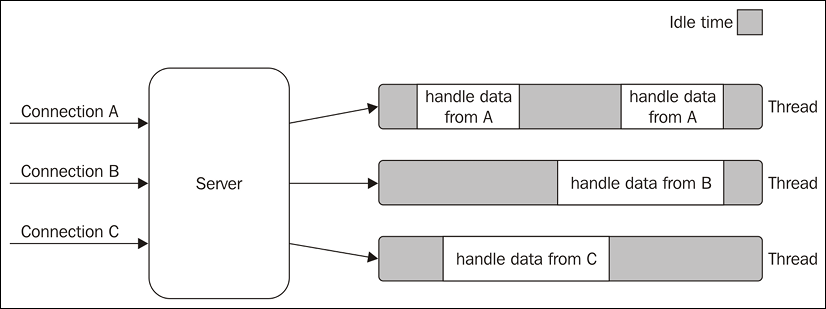
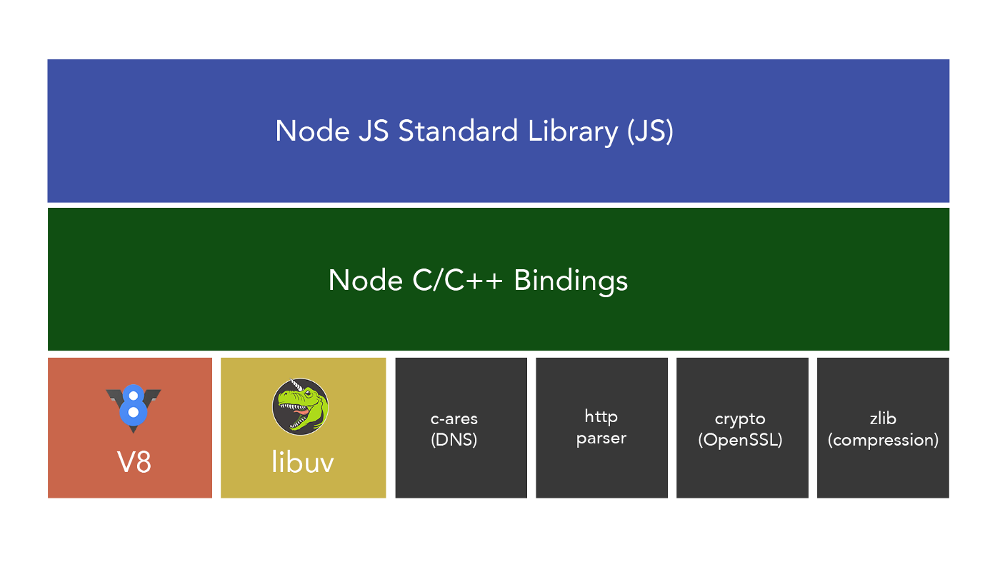

为了保证安全和协同，只有内核才能与硬件直接打交互

系统调用过程
多数操作系统的设计都遵循一个原则：进程向内核发起一个请求，然后将 CPU 执行权限让出给内核。内核接手 CPU 执行权限，然后完成请求，再转让出 CPU 执行权限给调用进程

按照权限管理的原则，多数应用程序应该运行在最小权限下。因此，很多操作系统，将内存分成了两个区域：
- 内核空间（Kernal Space），这个空间只有内核程序可以访问；
- 用户空间（User Space），这部分内存专门给应用程序使用。

用户态和内核态
用户空间中的代码被限制了只能使用一个局部的内存空间，我们说这些程序在用户态（User Mode） 执行。内核空间中的代码可以访问所有内存，我们称这些程序在内核态（Kernal Mode） 执行。

进程切换，时机：
1. 中断
2. 系统调用

提到 NodeJS，总会想到异步回调、非阻塞 IO，


# Node.js 事件驱动架构

当发起 I/O 的系统调用，线程/进程会进入阻塞状态。

> 因为要让一个进程进入 等待（waiting） 的状态, 要么是它主动调用 `wait()` 或 `sleep()` 等挂起自己的操作， 另一种就是它调用 System Call, 而 System Call 因为涉及到了 I/O 操作， 不能立即完成， 于是内核就会先将该进程置为等待状态， 调度其他进程的运行， 等到它所请求的 I/O 操作完成了以后，再将其状态更改回 ready。 
>  
> 作者：萧萧  
> 链接：https://www.zhihu.com/question/19732473/answer/241673170  
> 来源：知乎  
> 著作权归作者所有。商业转载请联系作者获得授权，非商业转载请注明出处。

传统并发模型：多线程 + 阻塞 I/O

  

缺点：请求越多线程越多，**线程上下文切换占据的时间和内存浪费的也就越多**。

除了阻塞 I/O 系统调用外，大多数现代操作系统还支持另一种访问资源的机制，称为非阻塞 I/O，即发起  I/O 系统调用时线程不会被阻塞，但对于资源的获取，你得主动轮询。**没必要的轮询也只会浪费 CPU 时间**。

```
resources = [socketA, socketB, fileA]
while (!resources.isEmpty()) {
  for (resource of resources) {
    // try to read
    data = resource.read()
    if (data === NO_DATA_AVAILABLE) {
      // there is no data to read at the moment
      continue
    }
    if (data === RESOURCE_CLOSED) {
      // the resource was closed, remove it from the list
      resources.remove(i)
    } else {
      //some data was received, process it
      consumeData(data)
    }
  }
}
```


非阻塞 I/O 模型
- 主动轮询
  - 浪费 CPU 时间
- 异步 I/O 模型

reactor 模式

没有进程内竞争条件和多线程同步如何使我们能够使用更简单的并发策略


1. 如何防止单线程被阻塞？
2. 单线程如何实现高并发？
  


单线程
- 注册事件、事件分发
- 事件循环处理回调