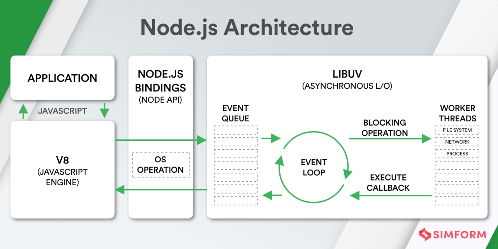

---
tags:
  - nodejs
---
## NodeJS

- NodeJS
  - 组成结构   
  - 架构：事件驱动、非阻塞模型   
  - [异步编程](../JavaScript/JavaScript%20异步编程.md)
  - corepack 与包管理
  - 模块机制
    - CommonJS 模块规范
    - 模块解析以及加载机制
  - [npm 包管理](./npm.md)
  - [Node.js 事件循环](./Node.js%20事件循环.md)
  - 调试
    - [调试指南](https://nodejs.org/zh-cn/docs/guides/debugging-getting-started/)
    - [Debugging Node.js with Chrome DevTools](https://medium.com/@paul_irish/debugging-node-js-nightlies-with-chrome-devtools-7c4a1b95ae27)
    - [node-clinic](https://github.com/clinicjs/node-clinic)
  - 内置模块
    - Buffer
      - 内存分配策略
    - stream
      - [Node Stream](https://github.com/zoubin/streamify-your-node-program/blob/master/README.md)
      - [Node.js Streams: Everything you need to know](https://www.freecodecamp.org/news/node-js-streams-everything-you-need-to-know-c9141306be93/)
      - [stream-handbook](https://github.com/substack/stream-handbook)
    - file
    - ChildProcess
    - WorkerThreads
      - [深入理解 Node.js Worker Threads](https://zhuanlan.zhihu.com/p/167920353)
    - VM
      - [NPM酷库：vm2，安全的沙箱环境](https://segmentfault.com/a/1190000012672620)
  - 全局对象
    - process、buffer、__filename 和 __dirname
    - console 和 setTimeout 之类
    - ECMAScript 语言定义的全局对象，如 Date
- 深入
  - [Node.js 源码剖析](https://theanarkh.github.io/understand-nodejs/)
  - 第三方扩展
    - C++ addons NAPI
    - DLL
      - [node-ffi](https://github.com/node-ffi/node-ffi)
    - WebAssembly
- 实战
  - 开发环境
    - [nodemon](https://github.com/remy/nodemon)
  - 项目架构
    - 微服务（服务发现） + BFF（服务调用、模板渲染）
  - [RPC 通信](./RPC 通信.md)
  - 内存泄漏
  - 数据类型验证
    - JSON Schema
    - typescript 运行验证
  - 开发
    - [BFF: API Gateway](./BFF:%20API%20Gateway.md)
    - [Node CLI](./Node%20CLI.md)
  - 测试
  - 部署
  - 监控
  - 性能优化
  - Node 的 Web 服务开发
    - 路由层
    - 模板渲染
      - 模板引擎
        - ES6 模板引擎
        - include 模板
        - xss 过滤、模板 helper 函数
      - SSR 同构
        - 数据？
    - Rest API
    - GraphQL 专注数据聚合，前端要什么返回什么
      - 对接后台服务？
    - 压测 http 服务（ab）
        - QPS
        - 吞吐率
  - 性能优化
    - 性能监控
      - [clinicjs](https://clinicjs.org/)
      - [easy-monitor](https://github.com/hyj1991/easy-monitor)
    - 性能优化
      - CPU（计算性能优化、JS Profile）
        1. 减少不必要的计算
        2. 空间换时间
        3. 提高计算能力
           1. C++ 插件
      - 内存（提高系统性能）
        - 减少内存使用，减少GC次数
          - 内存池 Buffer？
        - 内存泄漏，导致 GC 过久
- 资料
  - [使用 Node.js 构建 JavaScript 应用程序](https://docs.microsoft.com/zh-cn/learn/paths/build-javascript-applications-nodejs/)
  - Node.js 设计模式
  - [An Introduction to libuv](http://nikhilm.github.io/uvbook/)
  - [node-in-debugging](https://github.com/nswbmw/node-in-debugging)
- 生态
  - file
    - watcher
      - https://github.com/paulmillr/chokidar
  - 调试
    - [debug](https://github.com/visionmedia/debug)
  - 监控
    - [easy-monitor](https://github.com/hyj1991/easy-monitor)
- Deno
  - 资料
    - [Deno 运行时入门教程：Node.js 的替代品](https://www.ruanyifeng.com/blog/2020/01/deno-intro.html)
- awasome
  - 线程池 [piscina](https://github.com/piscinajs/piscina)

## 计算阻塞

- cluster
- thread worker
