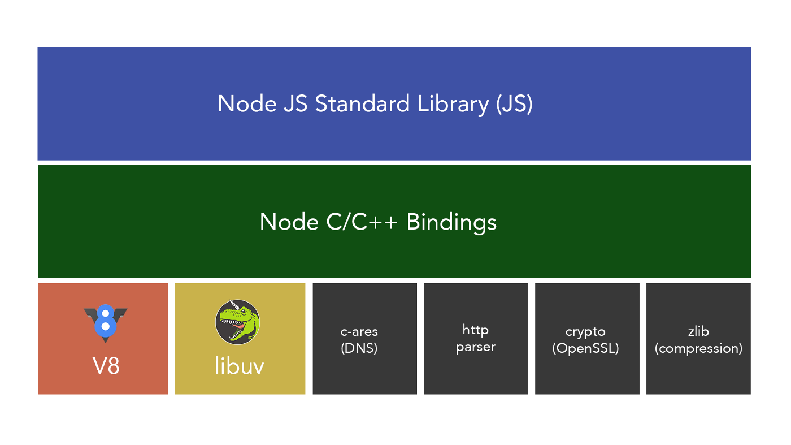

---
tags:
  - nodejs
---
# NodeJS

- NodeJS
  - 架构
    - 组成结构   
    - 架构：非阻塞 IO 模型、事件驱动架构  
  - 模块
    - 模块机制
      - 模块规范
        - CommonJS
        - ESModules
      - 模块解析以及加载机制
    - corepack 与包管理
  - [异步编程](../JavaScript/JavaScript%20异步编程.md)
  - [Node.js 事件循环](./Node.js%20事件循环.md)
  - 错误处理及调试
    - [调试指南](https://nodejs.org/zh-cn/docs/guides/debugging-getting-started/)
    - [Debugging Node.js with Chrome DevTools](https://medium.com/@paul_irish/debugging-node-js-nightlies-with-chrome-devtools-7c4a1b95ae27)
    - [node-clinic](https://github.com/clinicjs/node-clinic)
    - 内存泄漏
  - API：全局对象及内置模块
    - 文件操作
      - global.process.cwd()、global.__filename 和 global.__dirname
      - FS 模块
      - Path 模块
      - npm
        - [chokidar](https://github.com/paulmillr/chokidar)
        - [node-fs-extra](https://github.com/jprichardson/node-fs-extra)
        - [node-glob](https://github.com/isaacs/node-glob)
        - [globby](https://github.com/sindresorhus/globby)
      - A&Q
        - 系统路径大小写及系统分割符号问题？
    - Event Emitter
    - 流式操作：解决大文件内存缓存限制问题
      - [Node Stream](https://github.com/zoubin/streamify-your-node-program/blob/master/README.md)
      - [Node.js Streams: Everything you need to know](https://www.freecodecamp.org/news/node-js-streams-everything-you-need-to-know-c9141306be93/)
      - [stream-handbook](https://github.com/substack/stream-handbook)
    - Buffer
    - Cluster
    - ChildProcess
      - Spawn vs Fork vs Exec
    - WorkerThreads
      - [深入理解 Node.js Worker Threads](https://zhuanlan.zhihu.com/p/167920353)
    - VM
      - [NPM酷库：vm2，安全的沙箱环境](https://segmentfault.com/a/1190000012672620)
  - 深入
    - 第三方扩展
      - C++ addons NAPI
      - DLL
        - [node-ffi](https://github.com/node-ffi/node-ffi)
      - WebAssembly
    - [Node.js 源码剖析](https://theanarkh.github.io/understand-nodejs/)
  - 实战
    - 命令行工具
      - [Node CLI](./Node%20CLI.md)
    - [Web 服务开发](./NodeJS：Web%20服务开发.md)
    - 性能优化
      - CPU（计算性能优化、JS Profile）
        1. 减少不必要的计算
        2. 空间换时间
        3. 提高计算能力
           1. C++ 插件
      - 内存（提高系统性能）
        - 减少内存使用，减少GC次数
          - 内存池 Buffer？
        - 内存泄漏，导致 GC 过久
- 资料
  - [使用 Node.js 构建 JavaScript 应用程序](https://docs.microsoft.com/zh-cn/learn/paths/build-javascript-applications-nodejs/)
  - Node.js 设计模式
  - [An Introduction to libuv](http://nikhilm.github.io/uvbook/)
  - [node-in-debugging](https://github.com/nswbmw/node-in-debugging)
- Deno
  - 资料
    - [Deno 运行时入门教程：Node.js 的替代品](https://www.ruanyifeng.com/blog/2020/01/deno-intro.html)
- awasome
  - 线程池 [piscina](https://github.com/piscinajs/piscina)


## 计算阻塞

- cluster
- thread worker


- [nodemon](https://github.com/remy/nodemon)
- Dotenv作为你的配置


处理异步错误的其他最佳实践如下：

收听所有“出错”事件
听uncaughtException
使用domain（软弃用）或AsyncWrap
日志、日志、日志和跟踪
通知（可选）
退出并重新启动进程

```
process.on('uncaughtException', function (err) {
  console.error('uncaughtException: ', err.message)
  console.error(err.stack)
  process.exit(1)
})
```