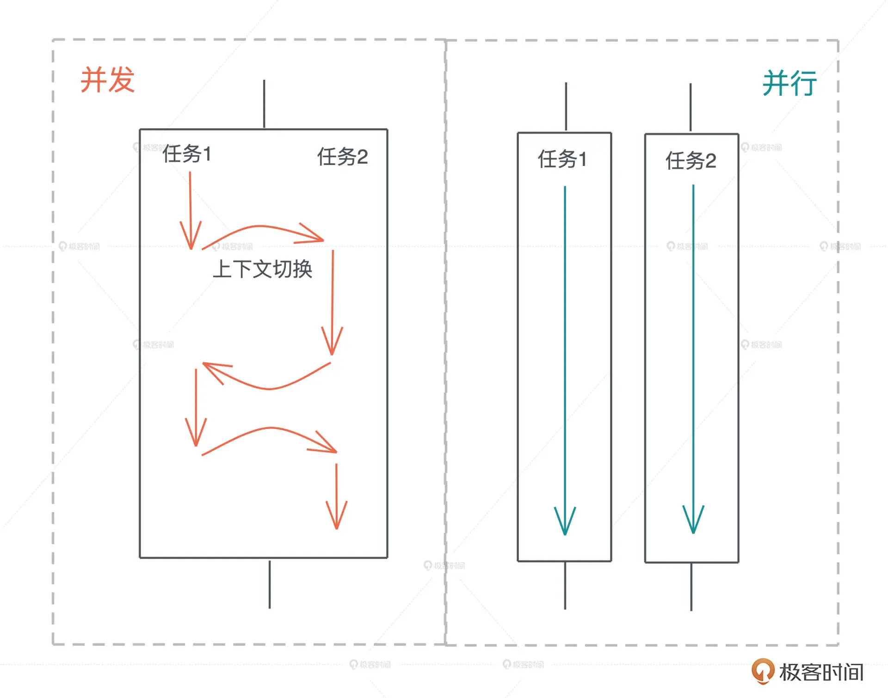

# Rust

- Rust
  - 设计理念
    - 性能、内存安全、并发安全
    - 划分 Safe rust 和 Unsafe Rust（方便与其他语言沟通）
    - 多范式编程
  - 语法特性
    - [内存安全：所有权、借用及生命周期](./内存安全：所有权、借用及生命周期.md)
    - 面向表达式
      - 一切皆是表达式，即一切皆类型（表达式会产生值，值即类型，rust 就是通过一切类型检查保证内存安全、并发安全）
        - 控制流语句
        - 函数
      - 编译期计算
  - 编程基础
    - 变量、值和类型
    - 表达式与运算符
    - 控制流
      - 顺序
      - 调用
      - 循环：`loop / while(条件) / for...in(迭代器)` + `break / continue / return`
      - 跳转
        - 分支跳转 `if ... else ...`
        - 模式匹配
          - `match expr {}`
          - `if let / while let`
        - [错误处理](./Rust%20错误处理.md)
        - 异步跳转
    - 函数 `fn`
    - 模块系统：箱、模块、路径
      - 箱 crate：一个项目也被称为一个 crate，crate 可以是可执行项目，也可以是一个库
      - 模块 `mod`：模块是一个箱内的代码组织单位，在 Rust 中声明模块的方式有两种：内联或在其他文件中声明
      - `pub`：导出
      - `use`：导入
    - 数据结构
      - 数组
      - 矢量 `Vec`
      - 哈希 `HashMap`
    - 测试
      - 单元测试
        - `#[test]`
        - `#[should_panic]` 预期的失败
        - `#[ignore]` 忽略测试
      - 文档测试 `///`
      - 集成测试
  - 进阶
    - 类型系统 
      - 类型是对值的区分，它包含了值在内存中的长度、对齐以及值可以进行的操作等信息；值是无法脱离具体的类型讨论的
      - 内存分配
        - 准则：栈上存放的数据是静态的，固定大小，固定生命周期；堆上存放的数据是动态的，不固定大小，不固定生命周期
      - 分类
        - 原生类型
        - 组合类型/复合类型
          - 结构体（struct）：多个类型组合在一起共同表达一个值的复杂数据结构
            - 经典结构体
            - 元组
            - 单元结构
          - 枚举（enum）：联合标签
      - 指针和引用
        - 指针是一个持有内存地址的值，可以通过解引用（dereference）来访问它指向的内存地址，理论上可以解引用到任意数据类型，但如果没有用正确的类型解引用一个指针，那么会引发各种各样的内存问题
        - 引用的解引用访问是受限的，它只能解引用到它引用数据的类型，不能用作它用
        - 引用的实现上比正常指针携带更多信息的指针，我们称之为胖指针（fat pointer），很多数据结构的引用，内部都是由胖指针实现的
    - 泛型
      - 数据结构的泛型
      - 使用泛型结构代码的泛型化
    - 面向接口编程
      - 接口将调用者和实现者隔离开，大大促进了代码的复用和扩展。面向接口编程可以让系统变得灵活，但是当使用接口去引用具体的类型时，在运行时变量原本的类型被抹去，我们无法单纯从一个指针分析出这个引用具备什么样的能力，所以我们就需要虚表来辅助运行时代码的执行。有了虚表，我们可以很方便地进行动态分派，它是运行时多态的基础。
      - Trait
    - 函数式编程
      - 函数往往是一等公民
      - 闭包是将函数，或者说代码和其环境一起存储的一种数据结构。闭包引用的上下文中的自由变量，会被捕获到闭包的结构中，成为闭包类型的一部分。
    - 并发编程
      - 并发是系统拥有同时与多件事情打交道的能力；并行是同时处理多件事情的手段    
      - 异步编程
    - 宏编程
      - 声明宏
      - 过程宏
        - 函数宏
        - 派生宏
        - 属性宏
    - 面向对象编程
  - 实现
    - 基于 LLVM，具有可移植性
  - 工程化
    - 工具链
      - rustup：工具链管理工具
        - rust-toolchain.toml
      - rustc：rust 编译器
        - 支持类型推导，使得写代码时的直观感受和写脚本语言差不多👍
      - [cargo：包管理工具](#cargo包管理工具)
  - 生态
    - WSAI
  - 资料
    - [x] [Microsoft Rust 教程](https://docs.microsoft.com/zh-cn/learn/paths/rust-first-steps/)
    - [ ] [Rust 程序设计语言](https://kaisery.github.io/trpl-zh-cn/title-page.html)
    - [ ] [Rust语言圣经(Rust Course)](https://course.rs/about-book.html)
    - [ ] [rust-training](https://github.com/tyrchen/rust-training)
    - [ ] [rust-learning](https://github.com/ctjhoa/rust-learning)
    - [ ] [awesome-rust](https://github.com/rust-unofficial/awesome-rust)
    - [ ] [ Asynchronous Programming in Rust](https://rust-lang.github.io/async-book/03_async_await/01_chapter.html)

## rust 程序骨架

- 分割符
  - 属性，`#![...]`
  - 分号，`;`，行分隔符
  - 花括号，`{}`，块分隔符
- 表达式和语句
  - 表达式：计算求值
  - 语句：操作
  - 程序：语句集合
  - 语句
    - 声明语句
    - 表达式语句
- 面向表达式
  - 分号也是一种表达式，`; -> ()`，返回单元类型，平常只做分隔符，在块最后可做表达式
  - 块表达式会对最后表达式求值并返回

## cargo：包管理工具

- cargo
  - 概念
    - workspace：多项目组织
  - 配置：Cargo.toml
  - 命令
    - cargo new --bin/lib
    - cargo build [--release]
    - cargo test

### cargo workspace

[cargo workspaces](https://kaisery.github.io/trpl-zh-cn/ch14-03-cargo-workspaces.html)

```toml
[workspace]

members = [
    ...
]
```

