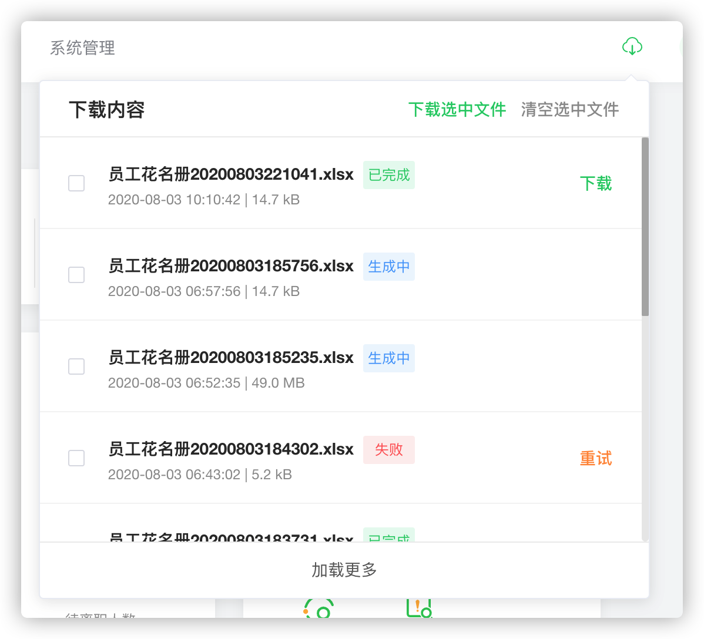
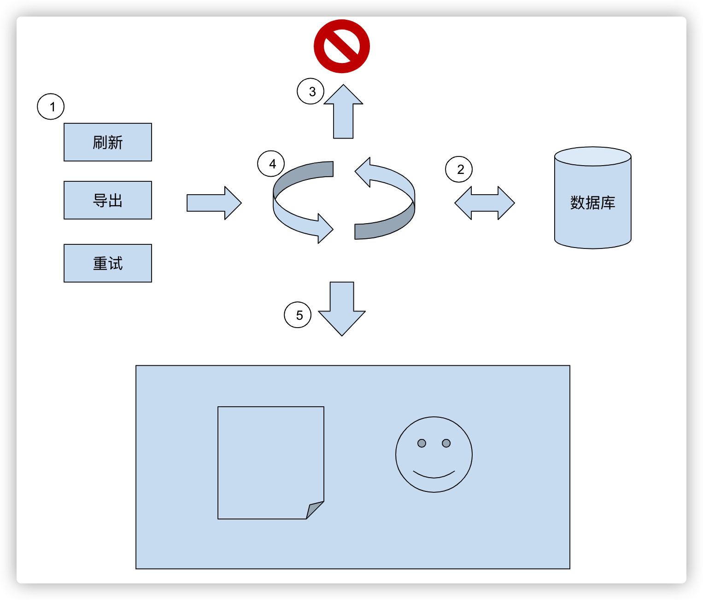

# 使用 RxJS 设计实现一个下载中心功能



原先系统的数据导出功能方案是通过前端技术相关方案实现：使用 [js-xlsx](https://github.com/SheetJS/sheetjs) 生成 excel 文件；但遇到较多数据量及复杂提高时，容易造成页面卡死现象，主要原因是主线程阻塞，后续使用 [web-workers](https://developer.mozilla.org/zh-CN/docs/Web/API/Web_Workers_API/Using_web_workers) 方案，通过其他线程完成 excel 数据处理；但是遇到庞大数据量时，前端处理大量数据会消耗大量内存，更严重导致内存泄露，页面直接崩溃情况。

为了提高用户体验，现调整为：后端异步处理数据查询和表格生成，并上传至OSS，用户在统一“附件下载中心”进行下载

对于前端设计改造需求点：

1. 附件中心记录用户的下载任务，便于重复下载
2. 附件中心实时反馈附件状态（排队、生成、完成、失败）

## 实时查询（轮询、rxjs）

为了降低系统实现复杂度，实时方案改为前端轮询请求

前端轮询时需要注意轮询请求几个点，避免造成性能浪费：



1. 何时轮询
2. 轮询间隔
3. 轮询结束
4. 轮询重复
5. 结果反馈

### 轮询时机

在用户系统使用中，产生轮询时机大概有以下三种情况：

- 刷新页面
- excel导出
- 重试任务

对于以上三种事件，前端需要响应处理。

其实像前端开发工作，大部分都是以事件驱动编程。我们往往需要面对响应不同事件处理，这些事件可能来自网络请求、用户交互反馈等，**异步回调、分散的状态和副作用**会随着代码规模增加越难维护。

### 轮询实现（rxjs）

轮询大概实现步骤：

1. 当发生页面刷新、导出数据、重试任务时
2. 发送一次列表求
3. 判断返回结果列表中是否含有有排队中、生成中的任务
4. 若有，则产生一个轮询任务，同一时间仅有一个轮询任务（防止重复轮询）
5. 轮询任务会每隔一定时间再发送列表请求
6. 直到列表状态全为已完成或者失败

先把实现逻辑搬上，轮询实现接下来借助 [rxjs](https://github.com/ReactiveX/rxjs) 利器

在 rxjs 世界里，*everything is a stream*，任何事件都是流，什么是流？流就是现在、未来的事件集，事件具有过去、现在、未来特性吧，但我们更关注的是现在发生及未来事件的到来。

既然有了事件流的概念，那我们可以订阅观察这些事件流、也可以通过 pipe 把这些事件数据处理或者转换成其他事件流。事件流的 pipe 操作就类比数组过滤 `[1, 2, 3].filter(e => {...})` 的 `filter`，数组也是数据集，只不过数组数据源上的数据操作都是同步的，不能处理异步数据，那么数据流是不是看起来就像 `[1,2,3,4...]`

我们把页面刷新(也就是重新开发)、导出下载数据、重试任务事件流分别用 `start$、download$、retry$` （流的变量命名 `$` 结尾 ）表示

```
start$:     --s-------------------------->
download$:  ----------d-------------d---->
retry$:     -----------------r----------->
merge$:     --m-------m------m------m---->

loop$:      --l->|----l->|---l->|---l---->
```

同一时间轴上，无论发生页面刷新、导出数据还是重试任务事件时，都会产生轮询事件流，使用 merge 合并三种事件流，再 map 成轮询事件流 loop$，同时也要注意当有新事件产生时，**必须停止旧的轮询任务**（上面图示中 `|` 表示完成停止） 

```javascript
 // 启动轮询，并 pipe 防止生成重复 loop
 merge(of('start'), download$, this.retry$)
     .pipe(
         // 防止频繁事件
         debounceTime(200),
         // 结束当前轮询，开始新的轮询
         switchMap(e => loop$)
     )
     .subscribe();
```

有了 loop$，我们可以对他进行副作用操作请求列表数据，通过 `repeatWhen` pipe 操作符启动轮询，`takeWhile` 判断停止轮询

```javascript
    // 轮询事件流
    let loop$ = of('loop')
      .pipe(
        tap(() => {
          // 执行副作用：请求数据
          this.getTaskList({ start: 0, size: this.dataList.length || 10 })
            .then(({ list, pendingCount }) => {
              if (this.dataList.length === 0) {
                this.dataList = list;
              } else {
                this.diff(this.dataList, list);
              }
            });
        }),
        // 重复查询
        repeatWhen(res$ => res$.pipe(
          delay(LOOP_DELAY), // 延迟查询
          takeWhile(e => this.pendingCount !== 0) // 终止判断
        ))
      );
```

总结：通过 rxjs 简洁得完成了轮询的功能实现，得益于 rxjs 高度抽象的概念和操作符，这也是 rxjs 学习成本较高的原因。不过 rxjs 不仅能够优雅得异步处理，而且还能作为状态管理，不愧是作为 2016 年新版本 Angluar 出来时就内定的利器之一

## 抛物线交互体验

为了稍微增加点用户体验，在点击导出时，做个抛物线动画，把任务添加到下载中心，抛物线的实现参考 张鑫旭大神的 [这回试试使用CSS实现抛物线运动效果](https://www.zhangxinxu.com/wordpress/2018/08/css-css3-%E6%8A%9B%E7%89%A9%E7%BA%BF%E5%8A%A8%E7%94%BB/)

主要实现思路：抛物线运动分解就是垂直方向和水平方向的运动，只要实现父子元素往不同方向进行不同速率的运动。

以下代码中，wrapper 父元素进行水平移动，ball 子元素相对 wrapper 元素进行竖直方向移动，相对而言 ball 子元素也获取水平位移

另外前端实现元素动画优先 CSS 方案，毕竟现代浏览器会对 CSS 动画有优化

```javascript
// 抛物线动画
 parabola(el) {
   let rect1 = el.getBoundingClientRect();

   let ball = document.createElement('div');
   ball.style.position = 'absolute';
   ball.style.width = '10px';
   ball.style.height = '10px';
   ball.style.borderRadius = '50%';
   ball.style.backgroundColor = 'red';
   ball.style.opacity = 1;
   ball.style.transition = 'transform .5s cubic-bezier(.2,1.01,.61,.93),opacity .5s linear';

   let wrapper = document.createElement('div');
   let initPos = {
     x: rect1.x + rect1.width / 2,
     y: rect1.y - 10
   };
   wrapper.style.position = 'fixed';
   wrapper.style.zIndex = '10000';
   wrapper.style.left = initPos.x + 'px';
   wrapper.style.top = initPos.y + 'px';
   wrapper.style.transition = 'transform .5s linear';

   // 动画结束 删除元素
   wrapper.ontransitionend = () => {
     document.body.removeChild(wrapper);
   };

   wrapper.appendChild(ball);     
   document.body.appendChild(wrapper);

   let rect2 = this.$el.getBoundingClientRect();
   wrapper.style.transform = `translateX(${rect2.x + rect2.width / 2 - initPos.x}px)`;
   ball.style.transform = `translateY(${rect2.y + rect2.height / 2 - rect1.y - 8}px)`;
   ball.style.opacity = 0;
 },
```