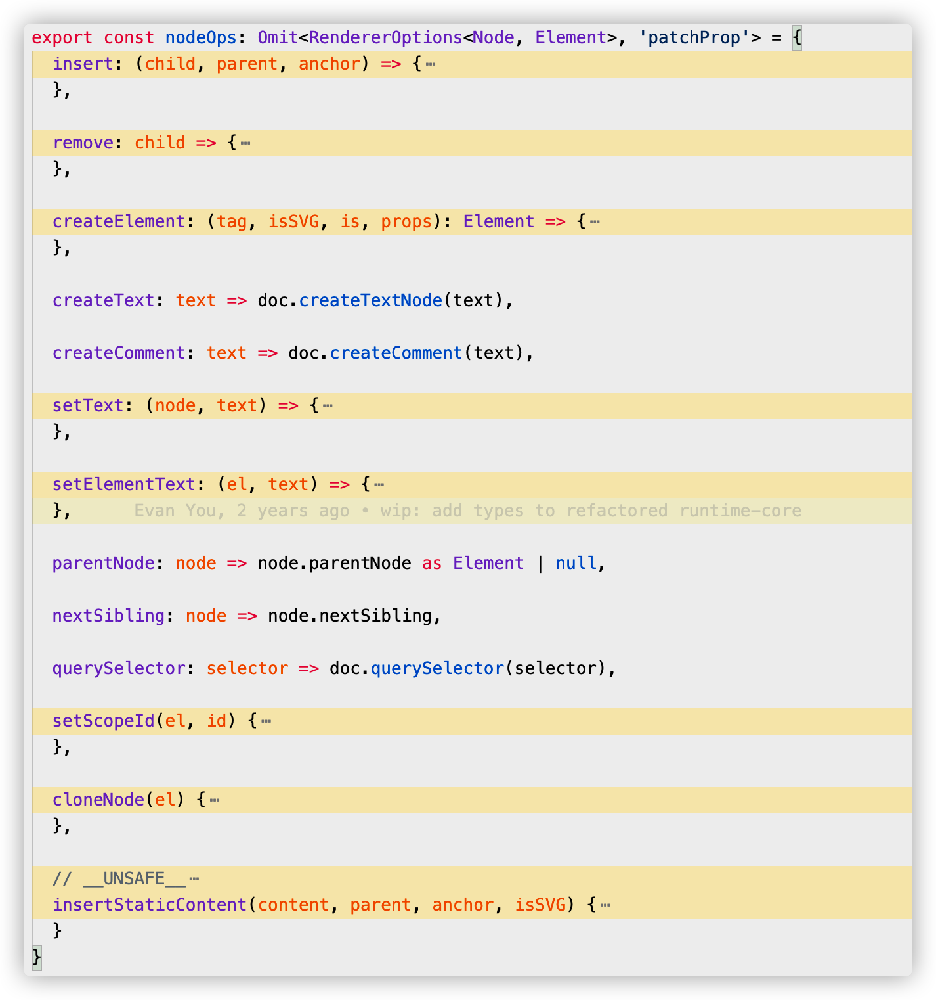

---
tags:
 - vue
 - vnode
---

# vue 组件渲染流程

任何前端框架，最主要的核心功能就是渲染视图。

## VNode

Vue 的内部渲染机制中引入 Virtual DOM 去抽象描述真实的 DOM。Virtual DOM 中每一个节点叫做 VNode，VNode 本质上是用来描述 DOM 的 JavaScript 对象，通过 `type` 指定不同的类型，比如普通元素节点、组件节点等。

```html
<button class="btn" style="width:100px;height:50px">click me</button>
```

```javascript
const vnode = {

  type: 'button',

  props: { 
    'class': 'btn',
    style: {
      width: '100px',
      height: '50px'
    }
  },
  children: 'click me'
}

```

```javascript
// packages/runtime-core/src/vnode.ts
export type VNodeTypes =
  | string
  | VNode
  | Component
  | typeof Text
  | typeof Static
  | typeof Comment
  | typeof Fragment
  | typeof TeleportImpl
  | typeof SuspenseImpl

export interface VNode<
  HostNode = RendererNode,
  HostElement = RendererElement,
  ExtraProps = { [key: string]: any }
> {
  type: VNodeTypes
  props: (VNodeProps & ExtraProps) | null
  children: VNodeNormalizedChildren
	...
}
```

我们可以用 vnode 这样表示`<button>`节点。一个 VNode 节点属性最主要的是 `type`，`props`，`children`。

引入 VNode 的好处：

1. 任何常规的 GUI 都能用**类 DOM 数据结构**去描述，引入 VNode，做一层界面抽象，提供了**跨平台**能力。
2. 提供了界面**组件化**的抽象能力。

## 组件


几乎任意类型的应用界面都可以抽象为一个组件树。每个组件包含各自的模板、状态属性、样式， **抽象组件化后提高了代码复用能力**。

例如，你可能会有页头、侧边栏、内容区等组件，每个组件又包含了其它的像导航链接、博文之类的组件。

前面我们说过，可以通过 vnode 的 type 属性是指定节点类型，在 vue 中如何声明组件类型的节点?

```javascript
// 模板中引入一个组件标签
<custom-component msg="test"></custom-component>


// 组件标签 转换对于的 vnode 
const CustomComponent = {
  // 在这里定义组件对象
}

const vnode = {
  type: CustomComponent,
  props: { 
    msg: 'test'
  }
}

```

**组件类型的 vnode 在 Virtual DOM 树中是个抽象节点，Virtual DOM 到真实 DOM 的映射中是不包含抽象节点，即组件类型节点是不会被渲染在页面上，真正反映在页面的是组件的模板**。

## 组件渲染流程

1. 使用渲染器（renderer）创建（createApp）应用实例app

2. 挂载应用（app.mount）

   1. 创建 vnode （createVNode）

   2. 渲染 vnode（render）

      1. diff

      2. patch

         

### 使用渲染器（renderer）创建（createApp）应用实例app

```javascript
// 在 Vue.js 3.0 中，标准初始化一个应用的方式如下
import { createApp } from 'vue'
import App from './app'
const app = createApp(App)
app.mount('#app')

-------------------------------------------------------------

// 在 web 平台下，runtime-dom 包中可以找到 createApp 方法定义
// packages/runtime-dom/src/index.ts
const createApp = ((...args) => {
  // 1. 使用自定义渲染器，创建 app 对象
  const app = ensureRenderer().createApp(...args)

  const { mount } = app

  // 重写 mount 方法
  app.mount = (containerOrSelector) => {
    const container = normalizeContainer(containerOrSelector)
    // 2. 调用 app.mount 核心标准方法，创建 virtual dom, 渲染 vnode
    mount(container)
    // ...
  }

  return app
})

```

#### 渲染器 renderer

vue 是跨平台支持，不同平台根据接口标准实现自定义渲染器。`renderer = createRenderer(nodeOps)`

```javascript
// packages/runtime-dom/src/index.ts
const app = ensureRenderer().createApp(...args) // 延迟创建渲染，方便 tree-shakable

// 创建自定义渲染器
function ensureRenderer() {
  return renderer || (renderer = createRenderer<Node, Element>(rendererOptions))
}

// 实现不同平台的渲染操作接口
const rendererOptions = extend({ patchProp, forcePatchProp }, nodeOps)

```

nodeOps(packages/runtime-dom/src/nodeOps.ts)



```javascript
// packages/runtime-core/src/renderer.ts

// createRenderer 是 vue 自定义渲染器的核心方法
function createRenderer(options) {
  return baseCreateRenderer(options)
}

function baseCreateRenderer(options) {
  function render(vnode, container) {
    // 组件渲染的核心逻辑
  }

  return {
    render,
    // createAppAPI 创建 createApp 
    createApp: createAppAPI(render)
  }
}

```

#### createApp

createApp 函数内部的 app.mount 方法是一个标准的可跨平台的组件渲染流程：**标准的跨平台渲染流程是先创建 vnode，再渲染 vnode**。

```javascript
// Vue.js 利用闭包和函数柯里化，createAppAPI 包装 render
function createAppAPI(render) {
  // createApp createApp 方法接受的两个参数：根组件的对象和 prop
  return function createApp(rootComponent, rootProps = null) {
    const app = {
      _component: rootComponent,
      _props: rootProps,
      mount(rootContainer) {
        // 创建根组件的 vnode
        const vnode = createVNode(rootComponent, rootProps)
        // 利用渲染器渲染 vnode
        render(vnode, rootContainer)
        app._container = rootContainer
        return vnode.component.proxy
      }
    }
    return app
  }
}
```

这里的代码的执行逻辑都是与平台无关的，启动标准渲染流程。但我们可能需要在外部重写这个方法，来完善特定平台下的渲染逻辑。

进入应用挂载阶段后，接下来就是核心渲染流程。

### 核心渲染流程：创建 vnode 和渲染 vnode

#### 创建 vnode

```javascript
// packages/runtime-core/src/vnode.ts
function _createVNode(
  type: VNodeTypes | ClassComponent | typeof NULL_DYNAMIC_COMPONENT,
  props: (Data & VNodeProps) | null = null,
  children: unknown = null,
  patchFlag: number = 0,
  dynamicProps: string[] | null = null,
  isBlockNode = false
): VNode {

  // 对 vnode 类型信息编码
  const shapeFlag = isString(type)
    ? ShapeFlags.ELEMENT
    : __FEATURE_SUSPENSE__ && isSuspense(type)
      ? ShapeFlags.SUSPENSE
      : isTeleport(type)
        ? ShapeFlags.TELEPORT
        : isObject(type)
          ? ShapeFlags.STATEFUL_COMPONENT
          : isFunction(type)
            ? ShapeFlags.FUNCTIONAL_COMPONENT
            : 0

  const vnode: VNode = {
    type,
    props,
    key: props && normalizeKey(props),
    ...
  }
	
  // 标准化子节点，把不同数据类型的 children 转成数组或者文本类型
  normalizeChildren(vnode, children)

  return vnode
}
```

工厂模式创建 vnode，并且对 props 做标准化处理、对 vnode 的类型信息编码、创建 vnode 对象，标准化子节点 children 。

#### 渲染 vnode

```javascript
const render: RootRenderFunction = (vnode, container, isSVG) => {
  if (vnode == null) {
    // 销毁组件
    if (container._vnode) {
      unmount(container._vnode, null, null, true)
    }
  } else {
    // 创建或者更新组件
    patch(container._vnode || null, vnode, container, null, null, null, isSVG)
  }
  
  // 缓存 vnode 节点，表示已经渲染
  container._vnode = vnode
}
```

patch 的功能是对比新旧节点，然后挂载 DOM 或者更新 DOM。

patch 会根据不同的组件类型派发任务给 process 处理。根 vnode 是个组件类型，故 processComponent进行处理，初次渲染调用 mountComponent 方法。

```javascript
const patch: PatchFn = (
    n1,
    n2,
    container,
    anchor = null,
    parentComponent = null,
    parentSuspense = null,
    isSVG = false,
    slotScopeIds = null,
    optimized = false
  ) => {
    // 如果存在新旧节点, 且新旧节点类型不同，则销毁旧节点
    if (n1 && !isSameVNodeType(n1, n2)) {
      anchor = getNextHostNode(n1)
      unmount(n1, parentComponent, parentSuspense, true)
      n1 = null
    }

    const { type, ref, shapeFlag } = n2
    switch (type) {
      case Text:...
      case Comment:...
      case Static:...
      case Fragment:...
      default:
        if (shapeFlag & ShapeFlags.ELEMENT) {
         ...
        } else if (shapeFlag & ShapeFlags.COMPONENT) {
          processComponent(
            n1,
            n2,
            container,
            anchor,
            parentComponent,
            parentSuspense,
            isSVG,
            slotScopeIds,
            optimized
          )
        } else if (shapeFlag & ShapeFlags.TELEPORT) {
          ...
        } else if (__FEATURE_SUSPENSE__ && shapeFlag & ShapeFlags.SUSPENSE) {
         ...
        } else if (__DEV__) {
          ...
        }
    }
          

 const processComponent = (n1, n2, container, anchor, parentComponent, parentSuspense, isSVG, optimized) => {

  if (n1 == null) {
   // 挂载组件
   mountComponent(n2, container, anchor, parentComponent, parentSuspense, isSVG, optimized)
  }
  else {
    // 更新组件
    updateComponent(n1, n2, parentComponent, optimized)
  }
}
 

// 挂载组件
const mountComponent = (initialVNode, container, anchor, parentComponent, parentSuspense, isSVG, optimized) => {

  // 创建组件实例
  const instance = (initialVNode.component = createComponentInstance(initialVNode, parentComponent, parentSuspense))

  // 设置组件实例
  setupComponent(instance)

  // 设置并运行带副作用的渲染函数，渲染组件内容
  setupRenderEffect(instance, initialVNode, container, anchor, parentSuspense, isSVG, optimized)
}


```

