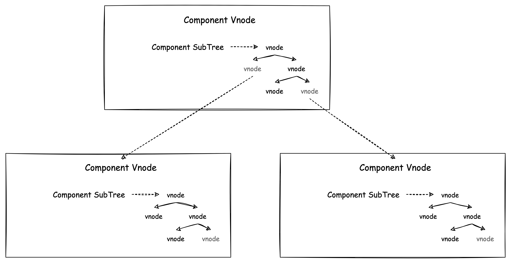
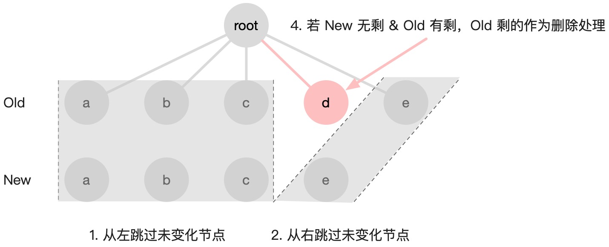
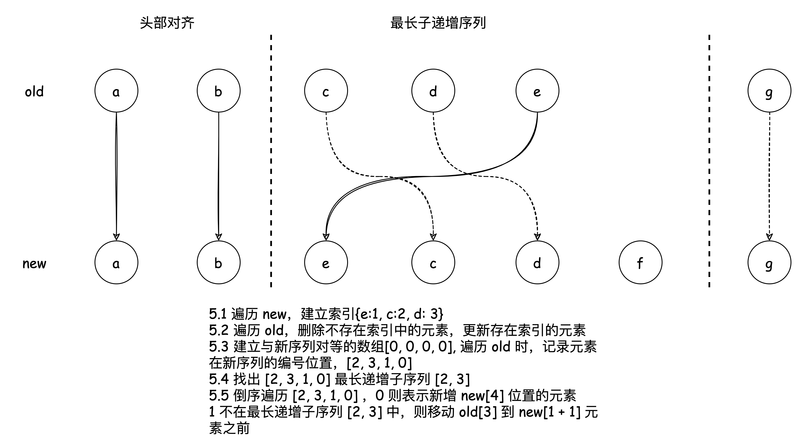

# diff 更新流程

> 以下示例代码基于 vue3.2 版本

在 Vue 中，页面是由组件构成的树形结构，整个组件树的 vnode tree 结构如下：

  

Vue 的更新粒度是组件级的，当数据变化的时候就会执行组件的渲染副作用来触发组件的更新。页面更新的本质就是递归 diff 新旧 vnode 的差异变化再去调用对应平台的渲染操作相关的 API。

## 组件更新流程

一个组件重新渲染可能会有两种场景：

- 组件 state 发生变更
- 组件 props 发生变更

渲染副作用会重新执行。

```javascript
// packages/runtime-core/src/renderer.ts
const setupRenderEffect: SetupRenderEffectFn = (
    instance,
    initialVNode,
    container,
    anchor,
    parentSuspense,
    isSVG,
    optimized
  ) => {
    const componentUpdateFn = () => {
      if (!instance.isMounted) {
       // 初次渲染
      } else {
        // 更新渲染
        // next 表示新的组件 vnode
        let { next, bu, u, parent, vnode } = instance
        let originNext = next

        // next 代表为新组件的 vnode，组件实例需更新对应的 vnode。
        // 1. 当组件 state 发生变更（next: null）
        // 2. 当组件 props 发生变更（next: vnode）  
        if (next) {
          next.el = vnode.el
          // 更新组件 vnode 节点信息
          // 主要是更改组件实例的 vnode 指针、updateProps、updateSlots
          updateComponentPreRender(instance, next, optimized)
        } else {
          next = vnode
        }

        // 新子树
        const nextTree = renderComponentRoot(instance)
        
        const prevTree = instance.subTree
        instance.subTree = nextTree

        // diff 新旧子树
        patch(
          prevTree,
          nextTree,
          // parent may have changed if it's in a teleport
          hostParentNode(prevTree.el!)!,
          // anchor may have changed if it's in a fragment
          getNextHostNode(prevTree),
          instance,
          parentSuspense,
          isSVG
        )
        
        next.el = nextTree.el
      }
    }
    //...
  }
```

组件的更新渲染主要任务：

1. 更新组件实例的 vnode、props、slots 等信息
2. 生成新的 subTree
3. diff 新旧 subTree

递归 patch 过程，父组件对子组件的更新处理：

```ts
  // processComponent => updateComponent
  const updateComponent = (n1: VNode, n2: VNode, optimized: boolean) => {
    const instance = (n2.component = n1.component)!
    // shouldUpdateComponent 函数的内部，主要是通过检测和对比组件 vnode 的 props
    if (shouldUpdateComponent(n1, n2, optimized)) {
      //...
        // normal update
        instance.next = n2
        // 去除子组件的渲染任务，防止重复更新
        invalidateJob(instance.update)
        // 子组件更新
        instance.update()
      }
    } else {
      // no update needed. just copy over properties
      n2.component = n1.component
      n2.el = n1.el
      instance.vnode = n2
    }
  }
```

子组件是否需要更新通过 `shouldUpdateComponent` 判断。

```ts
// packages/runtime-core/src/componentRenderUtils.ts
export function shouldUpdateComponent(
  prevVNode: VNode,
  nextVNode: VNode,
  optimized?: boolean
): boolean {
  const { props: prevProps, children: prevChildren, component } = prevVNode
  const { props: nextProps, children: nextChildren, patchFlag } = nextVNode
  const emits = component!.emitsOptions

  // force child update for runtime directive or transition on component vnode.
  if (nextVNode.dirs || nextVNode.transition) {
    return true
  }

  if (optimized && patchFlag >= 0) {
    // 编译优化
  } else {
    // this path is only taken by manually written render functions
    // so presence of any children leads to a forced update
    if (prevChildren || nextChildren) {
      if (!nextChildren || !(nextChildren as any).$stable) {
        return true
      }
    }
    if (prevProps === nextProps) {
      return false
    }
    if (!prevProps) {
      return !!nextProps
    }
    if (!nextProps) {
      return true
    }
    return hasPropsChanged(prevProps, nextProps, emits)
  }

  return false
}

function hasPropsChanged(
  prevProps: Data,
  nextProps: Data,
  emitsOptions: ComponentInternalInstance['emitsOptions']
): boolean {
  const nextKeys = Object.keys(nextProps)
  if (nextKeys.length !== Object.keys(prevProps).length) {
    return true
  }
  for (let i = 0; i < nextKeys.length; i++) {
    const key = nextKeys[i]
    if (
      nextProps[key] !== prevProps[key] &&
      !isEmitListener(emitsOptions, key)
    ) {
      return true
    }
  }
  return false
}
```

> 为了提高 diff 效率，vue 源码中还包含着许多编译优化的 case，我们先忽略这些，关注主流程。

在非编译优化下，主要是通过检测和对比组件 vnode 中的 **props、chidren、dirs、transiton** 来决定子组件是否需要更新。

**默认情况下有 chidren、dirs、transiton 都会导致直接发生更新**，而 props 的判断依据很简单：

1. props 长度判断
2. 基本类型做值判断
3. 引用类型做引用判断

这是很好理解的，因为在一个组件的子组件是否需要更新，我们主要依据子组件 vnode 是否存在一些会影响组件更新的属性变化进行判断，如果存在就会更新子组件。

当需要更新时，赋值新的 vnode 到 next，触发子组件的渲染副作用，并删除任务队列子组件的渲染任务防止重复更新（当一个状态发生改变可以能触发父子组件更新，父组件的更新可能会导致子组件更新，这时就要去重任务队列中的子组件渲染任务，更多了解 [vue 的响应式渲染机制](./vue%20的响应式渲染机制.md)）。

**vue 从组件树角度以组件为更新粒度，缩小了 vnode tree 的 diff 范围**，更近一步提高 diff 效率，接下来了解 vue3 的 diff 算法。

## vue diff 算法

diff 算法主要是关于如何高效得 diff vnode tree 之间的差异，以较低的成本（**减少 DOM 操作、提高节点复用**）完成子节点的更新。

理想情况（复用所有能复用的节点，实在遇到新增或删除时，才执行插入或删除）的算法的时间复杂度 O(n³) 无法接受。

> 关于 O(n³) 的由来。由于左树中任意节点都可能出现在右树，所以必须在对左树深度遍历的同时，对右树进行深度遍历，找到每个节点的对应关系，这里的时间复杂度是 O(n²)，之后需要对树的各节点进行增删移的操作，这个过程简单可以理解为加了一层遍历循环，因此再乘一个 n。

优化后的算法主要有三点：

1. 根据 type & key 去判断是否为相同节点
   1. 如果是同一类型则继续比较更新
   2. 如果不是则重新销毁创建新的节点
2. 只在同层比较（根据启发跨层 DOM 复用在实际业务场景中很少出现）
3. 同层节点采用 “**去头尾的最长递增子序列算法**” 进行比较

同层节点比较可能出现的三种操作情况：增、删、移；而对于一个 vnode 的 children 类型可能会有三种情况：纯文本、vnode 数组和空。那么就有以下不同的类型组合操作有：

- 旧：空
  - 新：空
  - 新：文本
    - 挂载文本节点
  - 新：数组
    - 挂载数组节点
- 旧：文本
  - 新：空
    - 删除文本节点
  - 新：文本
    - 更新文本节点
  - 新：数组
    - 删除文本节点
    - 挂载数组节点
- **旧：数组**
  - 新：空
    - 删除数组节点
  - 新：文本
    - 删除数组所有节点
    - 挂载文本节点
  - **新：数组**

其中最为复杂情况就是如果新旧 vnode 的 children 都是 vnode 数组，为了尽可能提高 diff 效率、节点复用，vue3 采用了去头尾的最长递增子序列算法。
### vue 去头尾的最长递增子序列算法

1. 先对齐的前置元素和后置元素
2. 对齐后存在三种情况
   1. 只有新子序列中有剩余要添加的新节点
     
   1. 只有旧子序列中有剩余要删除的新节点
     
   1. 双方都存在未知子序列
     

#### 最长递增子序列

```txt
prev [1, 2, 3, 4, 5, 6]
next [1, 3, 2, 6, 4, 5]
```
从 prev 变成 next，数组里的一些元素的顺序发生了变化，如何用最少的移动使元素顺序从 prev 变化为 next。

一种思路是在 next 中找到一个递增子序列，比如 [1, 3, 6] 、[1, 2, 4, 5]。之后对 next 数组进行倒序遍历，移动所有不在递增序列中的元素即可。

如果选择了 [1, 3, 6] 作为递增子序列，那么要移动三次，如果选择了 [1, 2, 4, 5] 作为递增子序列，遇到 5、4、2、1 不动，遇到 6、3 移动即可，也就只需要移动两次，故只要找最长递增子序列。

[最长递增子序列算法传送门](https://leetcode-cn.com/problems/longest-increasing-subsequence/)。

### 源码分析

> 以下笔者仅仅只是注释代码，可结合上面例子理解。

```js
  // packages/runtime-core/src/renderer.ts
  // can be all-keyed or mixed
  const patchKeyedChildren = (
    c1: VNode[],
    c2: VNodeArrayChildren,
    container: RendererElement,
    parentAnchor: RendererNode | null,
    parentComponent: ComponentInternalInstance | null,
    parentSuspense: SuspenseBoundary | null,
    isSVG: boolean,
    slotScopeIds: string[] | null,
    optimized: boolean
  ) => {
    let i = 0
    const l2 = c2.length
    let e1 = c1.length - 1 // 旧序列尾部索引
    let e2 = l2 - 1 // 新序列尾部索引

    // 头部对齐
    // 如果类型不同或者索引 i 大于索引 e1 或者 e2，则同步过程结束。
    // 1. sync from start
    // (a b) c
    // (a b) d e
    while (i <= e1 && i <= e2) {
      const n1 = c1[i]
      const n2 = (c2[i] = optimized
        ? cloneIfMounted(c2[i] as VNode)
        : normalizeVNode(c2[i]))
      if (isSameVNodeType(n1, n2)) {
        patch(
          n1,
          n2,
          container,
          null,
          parentComponent,
          parentSuspense,
          isSVG,
          slotScopeIds,
          optimized
        )
      } else {
        break
      }
      i++
    }
    // 头部对齐结束，此时 i 为不同类型节点的下标 

    // 尾部对齐
    // e1、e2 循环递减
    // 如果不同或者索引 i 大于索引 e1 或者 e2，则同步过程结束。
    // 2. sync from end
    // a (b c)
    // d e (b c)
    while (i <= e1 && i <= e2) {
      const n1 = c1[e1]
      const n2 = (c2[e2] = optimized
        ? cloneIfMounted(c2[e2] as VNode)
        : normalizeVNode(c2[e2]))
      if (isSameVNodeType(n1, n2)) {
        patch(
          n1,
          n2,
          container,
          null,
          parentComponent,
          parentSuspense,
          isSVG,
          slotScopeIds,
          optimized
        )
      } else {
        break
      }
      e1--
      e2--
    }

    // i > e1，i <= e2 说明旧序列已经闭合（全部对齐更新完成），只剩新序列存在新节点
    // 新增新节点
    // 3. common sequence + mount
    // (a b)
    // (a b) c
    // i = 2, e1 = 1, e2 = 2
    // (a b)
    // c (a b)
    // i = 0, e1 = -1, e2 = 0
    if (i > e1) {
      if (i <= e2) {
        const nextPos = e2 + 1
        const anchor = nextPos < l2 ? (c2[nextPos] as VNode).el : parentAnchor
        while (i <= e2) {
          patch(
            null,
            (c2[i] = optimized
              ? cloneIfMounted(c2[i] as VNode)
              : normalizeVNode(c2[i])),
            container,
            anchor,
            parentComponent,
            parentSuspense,
            isSVG,
            slotScopeIds,
            optimized
          )
          i++
        }
      }
    }

    // i > e2，i <= e1 说明新序列已经闭合（全部对齐更新完成），只剩旧序列存在旧节点
    // 删除旧节点
    // 4. common sequence + unmount
    // (a b) c
    // (a b)
    // i = 2, e1 = 2, e2 = 1
    // a (b c)
    // (b c)
    // i = 0, e1 = 0, e2 = -1
    else if (i > e2) {
      while (i <= e1) {
        unmount(c1[i], parentComponent, parentSuspense, true)
        i++
      }
    }

    // 5. unknown sequence
    // 新旧序列存在未知子序列
    // [i ... e1 + 1]: a b [c d e] f g
    // [i ... e2 + 1]: a b [e d c h] f g
    // i = 2, e1 = 4, e2 = 5
    else {
      const s1 = i // prev starting index
      const s2 = i // next starting index

      // 5.1 build key:index map for newChildren
      // 建立新序列节点索引，方便遍历旧序列式，直接查找新序列，时间换空间
      const keyToNewIndexMap: Map<string | number | symbol, number> = new Map()
      for (i = s2; i <= e2; i++) {
        const nextChild = (c2[i] = optimized
          ? cloneIfMounted(c2[i] as VNode)
          : normalizeVNode(c2[i]))
        if (nextChild.key != null) {
          if (__DEV__ && keyToNewIndexMap.has(nextChild.key)) {
            warn(
              `Duplicate keys found during update:`,
              JSON.stringify(nextChild.key),
              `Make sure keys are unique.`
            )
          }
          keyToNewIndexMap.set(nextChild.key, i)
        }
      }

      // 5.2 loop through old children left to be patched and try to patch
      // matching nodes & remove nodes that are no longer present
      // 遍历旧序列，删除不存在新序列的节点
      let j
      let patched = 0 // 已经处理节点的数量
      const toBePatched = e2 - s2 + 1 // 待处理节点的数量
      let moved = false // 标记节点序列是否移动
      // used to track whether any node has moved
      let maxNewIndexSoFar = 0 // 始终存储的是上次求值的 newIndex
      // works as Map<newIndex, oldIndex>
      // Note that oldIndex is offset by +1
      // and oldIndex = 0 is a special value indicating the new node has
      // no corresponding old node.
      // used for determining longest stable subsequence
      // 存储新子序列中的元素在原旧子序列节点的索引，用于确定最长递增子序列
      // 0 是特殊🈯️，表示新增节点，故节点索引 + 1
      const newIndexToOldIndexMap = new Array(toBePatched)
      for (i = 0; i < toBePatched; i++) newIndexToOldIndexMap[i] = 0

      // 遍历旧序列，进行删除和更新
      for (i = s1; i <= e1; i++) {
        const prevChild = c1[i]
        // 所有新的节点都已经被处理完了，那么剩余的旧节点则统统删除
        if (patched >= toBePatched) {
          // all new children have been patched so this can only be a removal
          unmount(prevChild, parentComponent, parentSuspense, true)
          continue
        }
        let newIndex // 记录节点在新序列中的位置
        if (prevChild.key != null) {
          newIndex = keyToNewIndexMap.get(prevChild.key)
        } else {
          // key-less node, try to locate a key-less node of the same type
          for (j = s2; j <= e2; j++) {
            if (
              newIndexToOldIndexMap[j - s2] === 0 &&
              isSameVNodeType(prevChild, c2[j] as VNode)
            ) {
              newIndex = j
              break
            }
          }
        }
        
        if (newIndex === undefined) { // 旧节点不存在新序列，直接删除
          unmount(prevChild, parentComponent, parentSuspense, true)
        } else { // 更新旧节点
          newIndexToOldIndexMap[newIndex - s2] = i + 1 // 0 表示新增，故需要 + 1 ，避开占位到 0
          /**
          * 用变量 maxNewIndexSoFar 跟踪判断节点是否移动，maxNewIndexSoFar 始终存储的是上次求值的 newIndex，
          * 一旦本次求值的 newIndex 小于 maxNewIndexSoFar，这说明顺序遍历旧子序列的节点在新子序列中的索引并不是一直递增的，
          * 也就说明存在移动的情况。
          */
          if (newIndex >= maxNewIndexSoFar) {
            maxNewIndexSoFar = newIndex
          } else {
            moved = true
          }
          patch(
            prevChild,
            c2[newIndex] as VNode,
            container,
            null,
            parentComponent,
            parentSuspense,
            isSVG,
            slotScopeIds,
            optimized
          )
          patched++
        }
      }

      // 前面删除更新旧节点，接下来需要对旧节点移动调整位置和新增新节点
      // 5.3 move and mount
      // generate longest stable subsequence only when nodes have moved
      // 序列发生移动，生成最长递增子序列，计算出最少移动元素
      const increasingNewIndexSequence = moved
        ? getSequence(newIndexToOldIndexMap)
        : EMPTY_ARR
      j = increasingNewIndexSequence.length - 1
      // looping backwards so that we can use last patched node as anchor
      // 倒序遍历新序列
      // 为什么倒序，DOM 平台上对插入和移动都是使用 node.insertBefore
      // node.insertBefore 对节点的移动都得使用 anchor
      // 使用倒序，保证了前面的节点是最新处理过的
      for (i = toBePatched - 1; i >= 0; i--) {
        const nextIndex = s2 + i
        const nextChild = c2[nextIndex] as VNode
        const anchor =
          nextIndex + 1 < l2 ? (c2[nextIndex + 1] as VNode).el : parentAnchor
        if (newIndexToOldIndexMap[i] === 0) {
          // mount new
          patch(
            null,
            nextChild,
            container,
            anchor,
            parentComponent,
            parentSuspense,
            isSVG,
            slotScopeIds,
            optimized
          )
        } else if (moved) {
          // move if:
          // There is no stable subsequence (e.g. a reverse)
          // OR current node is not among the stable sequence
          // 跳过在递增子序列里的元素
          if (j < 0 || i !== increasingNewIndexSequence[j]) {
            move(nextChild, container, anchor, MoveType.REORDER)
          } else {
            j--
          }
        }
      }
    }
  }
```
## Why key 

> 在 diff 新旧序列中，使用 key 能够帮助我们建立索引，更快的找到可复用的 VNode，节省性能开销。使用 index 作为 key 有可能造成 VNode 错误的复用，从而产生 bug ，而使用 random 作为 key 会导致VNode 始终无法复用，极大的影响性能。
>
> 更多详情、例子可阅读 [《我用index作为key也没啥问题啊》](https://juejin.cn/post/6999932053466644517#comment)

## 不带 key

不带 key 的情况下，vue diff 子节点是直接按顺序对比，多余的节点就删除或者新增。
如果子节点类型不同，就直接删除新增，造成更频繁的 DOM 操作。

```js
  const patchUnkeyedChildren = (
    c1: VNode[],
    c2: VNodeArrayChildren,
    container: RendererElement,
    anchor: RendererNode | null,
    parentComponent: ComponentInternalInstance | null,
    parentSuspense: SuspenseBoundary | null,
    isSVG: boolean,
    slotScopeIds: string[] | null,
    optimized: boolean
  ) => {
    c1 = c1 || EMPTY_ARR
    c2 = c2 || EMPTY_ARR
    const oldLength = c1.length
    const newLength = c2.length
    const commonLength = Math.min(oldLength, newLength)
    let i
    // 对比公共长度的子序列
    for (i = 0; i < commonLength; i++) {
      const nextChild = (c2[i] = optimized
        ? cloneIfMounted(c2[i] as VNode)
        : normalizeVNode(c2[i]))
      patch(
        c1[i],
        nextChild,
        container,
        null,
        parentComponent,
        parentSuspense,
        isSVG,
        slotScopeIds,
        optimized
      )
    }
    // 删除多余节点
    if (oldLength > newLength) {
      // remove old
      unmountChildren(
        c1,
        parentComponent,
        parentSuspense,
        true,
        false,
        commonLength
      )
    } else { // 新增多余节点
      // mount new
      mountChildren(
        c2,
        container,
        anchor,
        parentComponent,
        parentSuspense,
        isSVG,
        slotScopeIds,
        optimized,
        commonLength
      )
    }
  }
```

## 编译优化

Vue3 diff 算法的主要优势是结合**编译优化**，在编译阶段对静态模板分析，生成 Block tree，收集动态更新的节点，然后在 patch 阶段就可以只比对 Block tree 中的节点，达到提升 diff 性能的目的。而核心 diff 算法，也就是**去头尾的最长递增子序列算法**和 vue2 **双端比较算法**就性能而言差别并不大。详见 [vue 编译优化](./vue%20编译优化.md)。

## 总结

1. vue 的渲染更新都是以组件为单位的
2. 一个组件发生更新有两种情况：state、props 发生变更
3. diff 更新流程：整个更新过程树的深度递归 diff，先对比父节点，然后对子节点进行同层对比，其中子节点数组的更新又分为多种情况，其中最复杂的情况为数组到数组的更新，使用**去头尾的最长递增子序列**算法，再对每个子节点深度递归 diff。

  

## 参考

- [190.精读《DOM diff 原理详解》](https://github.com/ascoders/weekly/blob/master/%E5%89%8D%E6%B2%BF%E6%8A%80%E6%9C%AF/190.%E7%B2%BE%E8%AF%BB%E3%80%8ADOM20%diff20%%E5%8E%9F%E7%90%86%E8%AF%A6%E8%A7%A3%E3%80%8B.md)
- Vue.js 3.0 核心源码解析
- [diff 算法原理概述](https://github.com/NervJS/nerv/issues/3)


