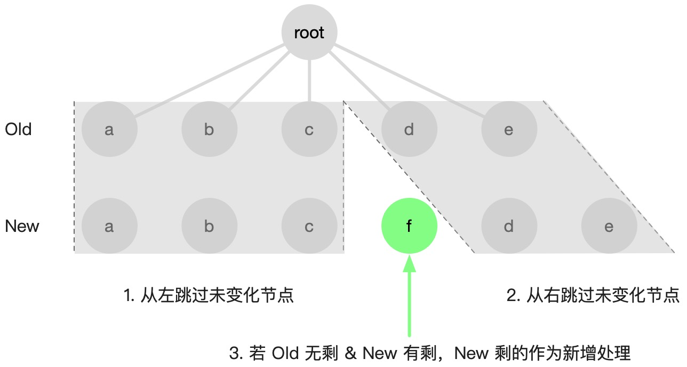
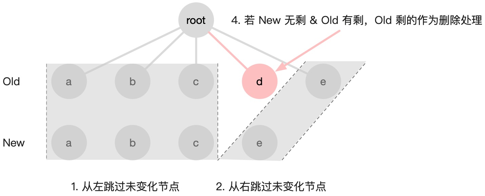

---
tags:
 - vue
 - 更新渲染
 - vdom
 - diff
---
# vdom diff 更新流程

> 以下示例代码基于 vue3.2 版本

在 Vue 中，页面是由组件构成的树形结构，整个组件树的 vnode tree 结构如下



Vue 的更新粒度是组件级的，页面更新的本质就是递归对比新旧组件的 vdom （subTress）的差异变化再去调用对应平台的渲染操作相关的 API。
## 更新流程

一个组件重新渲染可能会有两种场景：

- 响应式数据触发的组件更新（next: null）
- 父组件数据流触发的更新（next: vnode）  

```javascript
// packages/runtime-core/src/renderer.ts
const setupRenderEffect: SetupRenderEffectFn = (
    instance,
    initialVNode,
    container,
    anchor,
    parentSuspense,
    isSVG,
    optimized
  ) => {
    const componentUpdateFn = () => {
      if (!instance.isMounted) {
       // 初次渲染
      } else {
        // 更新渲染
        // next 表示新的组件 vnode
        let { next, bu, u, parent, vnode } = instance
        let originNext = next

        // next 代表为新组件的 vnode，组件实例需更新对应的 vnode。
        if (next) {
          next.el = vnode.el
          // 更新组件 vnode 节点信息
          // 主要是更改组件实例的 vnode 指针、updateProps、updateSlots
          updateComponentPreRender(instance, next, optimized)
        } else {
          next = vnode
        }

        // 新子树
        const nextTree = renderComponentRoot(instance)
        
        const prevTree = instance.subTree
        instance.subTree = nextTree

        // diff 新旧子树
        patch(
          prevTree,
          nextTree,
          // parent may have changed if it's in a teleport
          hostParentNode(prevTree.el!)!,
          // anchor may have changed if it's in a fragment
          getNextHostNode(prevTree),
          instance,
          parentSuspense,
          isSVG
        )
        
        next.el = nextTree.el
      }
    }
    //...
  }
```

组件的更新渲染主要任务：

1. 更新组件实例的 vnode、props、slots 等信息
2. 生成新的 subTree
3. 根据新旧子树 vnode 执行 patch 逻辑

进入 patch 阶段开始 diff 新旧子树。

在这个过程中，首先判断新旧节点是否是相同的 vnode 类型，如果不同则销毁掉旧的节点。如果是相同的 vnode 类型，继续 diff 更新流程了，接着会根据不同的 vnode 类型执行不同的处理逻辑。

```js
const patch: PatchFn = (
    n1,
    n2,
    container,
    anchor = null,
    parentComponent = null,
    parentSuspense = null,
    isSVG = false,
    slotScopeIds = null,
    optimized = __DEV__ && isHmrUpdating ? false : !!n2.dynamicChildren
  ) => {
    if (n1 === n2) {
      return
    }

    // patching & not same type, unmount old tree
    if (n1 && !isSameVNodeType(n1, n2)) {
      anchor = getNextHostNode(n1)
      unmount(n1, parentComponent, parentSuspense, true)
      n1 = null
    }

    const { type, ref, shapeFlag } = n2
    switch (type) {
      case Text: //...
      case Comment: //...
      case Static: //...
      case Fragment: //...
      default:
        if (shapeFlag & ShapeFlags.ELEMENT) {
          // 实际上 ELEMENT 的处理流程才是真正做 DOM 的更新
        } else if (shapeFlag & ShapeFlags.COMPONENT) {
          // 组件是渲染调度的基本单位，这里我们优先关注组件的更新逻辑
          processComponent(
            n1,
            n2,
            container,
            anchor,
            parentComponent,
            parentSuspense,
            isSVG,
            slotScopeIds,
            optimized
          )
        } else if (shapeFlag & ShapeFlags.TELEPORT) {
          //...
        } else if (__FEATURE_SUSPENSE__ && shapeFlag & ShapeFlags.SUSPENSE) {
          //...
        } 
        //...
    }
  }
```

组件类型节点的更新处理

```js
  // processComponent => updateComponent
  const updateComponent = (n1: VNode, n2: VNode, optimized: boolean) => {
    const instance = (n2.component = n1.component)!
    // shouldUpdateComponent 函数的内部，主要是通过检测和对比组件 vnode 的 props
    if (shouldUpdateComponent(n1, n2, optimized)) {
      //...
        // normal update
        instance.next = n2
        // 去除子组件的渲染任务，防止重复更新
        invalidateJob(instance.update)
        // 子组件更新
        instance.update()
      }
    } else {
      // no update needed. just copy over properties
      n2.component = n1.component
      n2.el = n1.el
      instance.vnode = n2
    }
  }
```

子组件 update 时 next 就是来自父组件在 update 的过程中，生成了新 subtree。在 diff 子节点过程中，shouldUpdateComponent 决定组件类型的子节点是否需要重新渲染，next 保存新的 vnode。

整个 diff 过程是是一个树的深度优先遍历过程，Component 是抽象节点，实现最终的更新是在处理 element 类型的时候。

```js
// processElement => patchElement
// 简化版
const patchElement = (n1, n2, parentComponent, parentSuspense, isSVG, optimized) => {
  const oldProps = (n1 && n1.props) || EMPTY_OBJ
  const newProps = n2.props || EMPTY_OBJ
  // 更新 props
  patchProps(
    //...
  )
  // 更新子节点
  patchChildren(n1, n2,
   //...
  )
}
```

更新普通元素的过程主要做两件事情：更新自身 props 和继续 diff 子节点。

`patchChildren` 会先根据子节点类型预处理下，对于一个元素的子节点类型可能会有三种情况：纯文本、vnode 数组和空。
- 旧：空
  - 直接挂载 文本节点、数组子节点
- 旧：文本
  - 新：空
    - 删除文本节点
  - 新：文本
    - 更新文本节点
  - 新：数组
    - 删除文本节点
    - 挂载数组节点
- 旧：数组
  - 新：空
    - 删除数组节点
  - 新：文本
    - 删除数组所有节点
    - 挂载文本节点
  - 新：数组

**如果新旧子节点类型都是数组时，才是真正的 diff 算法的核心**。
## 核心 diff 算法

核心 diff 算法，主要是如何高效得 diff 子节点数组，以较低的成本（**减少 DOM 操作、提高节点复用**）完成子节点的更新。

理想情况（复用所有能复用的节点）的算法的时间复杂度 O(n³) 无法接受。

> 关于 O(n³) 的由来。由于左树中任意节点都可能出现在右树，所以必须在对左树深度遍历的同时，对右树进行深度遍历，找到每个节点的对应关系，这里的时间复杂度是 O(n²)，之后需要对树的各节点进行增删移的操作，这个过程简单可以理解为加了一层遍历循环，因此再乘一个 n。

根据启发：跨层 DOM 复用在实际业务场景中很少出现，故降级为**同层对比**。

> 网上好多文章写只按层比较，算法复杂度可以从 O(n^3) 优化到 O(n) ，子节点是直接按顺序深度优先 diff，如果 type 和 key 不一致就直接替换或删除掉？？？

同层 diff 可能出现的三种情况：增、删、移。

### Vue diff 原理

#### 最长递增子序列

```txt
prev [1, 2, 3, 4, 5, 6]
next [1, 3, 2, 6, 4, 5]
```
从 prev 变成 next，数组里的一些元素的顺序发生了变化，如何用最少的移动使元素顺序从 prev 变化为 next。

一种思路是在 next 中找到一个递增子序列，比如 [1, 3, 6] 、[1, 2, 4, 5]。之后对 next 数组进行倒序遍历，移动所有不在递增序列中的元素即可。

如果选择了 [1, 3, 6] 作为递增子序列，那么要移动三次，如果选择了 [1, 2, 4, 5] 作为递增子序列，遇到 5、4、2、1 不动，遇到 6、3 移动即可，也就只需要移动两次，故只要找最长递增子序列。

[最长递增子序列算法传送门](https://leetcode-cn.com/problems/longest-increasing-subsequence/)。
#### diff 原理

1. 找到相同的前置元素和后置元素
2. 对齐后存在三种情况
   1. 只有新子序列中有剩余要添加的新节点
     
   1. 只有旧子序列中有剩余要删除的新节点
     
   1. 双方都存在未知子序列
   

### 源码分析

> 以下笔者仅仅只是注释代码。。。  
> 具体源码过程分析推荐看 [Vue 3.0 diff 算法及原理](https://juejin.cn/post/6844904104834105351)

```js
  // packages/runtime-core/src/renderer.ts
  // can be all-keyed or mixed
  const patchKeyedChildren = (
    c1: VNode[],
    c2: VNodeArrayChildren,
    container: RendererElement,
    parentAnchor: RendererNode | null,
    parentComponent: ComponentInternalInstance | null,
    parentSuspense: SuspenseBoundary | null,
    isSVG: boolean,
    slotScopeIds: string[] | null,
    optimized: boolean
  ) => {
    let i = 0
    const l2 = c2.length
    let e1 = c1.length - 1 // 旧序列尾部索引
    let e2 = l2 - 1 // 新序列尾部索引

    // 头部对齐
    // 如果类型不同或者索引 i 大于索引 e1 或者 e2，则同步过程结束。
    // 1. sync from start
    // (a b) c
    // (a b) d e
    while (i <= e1 && i <= e2) {
      const n1 = c1[i]
      const n2 = (c2[i] = optimized
        ? cloneIfMounted(c2[i] as VNode)
        : normalizeVNode(c2[i]))
      if (isSameVNodeType(n1, n2)) {
        patch(
          n1,
          n2,
          container,
          null,
          parentComponent,
          parentSuspense,
          isSVG,
          slotScopeIds,
          optimized
        )
      } else {
        break
      }
      i++
    }
    // 头部对齐结束，此时 i 为不同类型节点的下标 

    // 尾部对齐
    // e1、e2 循环递减
    // 如果不同或者索引 i 大于索引 e1 或者 e2，则同步过程结束。
    // 2. sync from end
    // a (b c)
    // d e (b c)
    while (i <= e1 && i <= e2) {
      const n1 = c1[e1]
      const n2 = (c2[e2] = optimized
        ? cloneIfMounted(c2[e2] as VNode)
        : normalizeVNode(c2[e2]))
      if (isSameVNodeType(n1, n2)) {
        patch(
          n1,
          n2,
          container,
          null,
          parentComponent,
          parentSuspense,
          isSVG,
          slotScopeIds,
          optimized
        )
      } else {
        break
      }
      e1--
      e2--
    }

    // i > e1，i <= e2 说明旧序列已经闭合（全部对齐更新完成），只剩新序列存在新节点
    // 新增新节点
    // 3. common sequence + mount
    // (a b)
    // (a b) c
    // i = 2, e1 = 1, e2 = 2
    // (a b)
    // c (a b)
    // i = 0, e1 = -1, e2 = 0
    if (i > e1) {
      if (i <= e2) {
        const nextPos = e2 + 1
        const anchor = nextPos < l2 ? (c2[nextPos] as VNode).el : parentAnchor
        while (i <= e2) {
          patch(
            null,
            (c2[i] = optimized
              ? cloneIfMounted(c2[i] as VNode)
              : normalizeVNode(c2[i])),
            container,
            anchor,
            parentComponent,
            parentSuspense,
            isSVG,
            slotScopeIds,
            optimized
          )
          i++
        }
      }
    }

    // i > e2，i <= e1 说明新序列已经闭合（全部对齐更新完成），只剩旧序列存在旧节点
    // 删除旧节点
    // 4. common sequence + unmount
    // (a b) c
    // (a b)
    // i = 2, e1 = 2, e2 = 1
    // a (b c)
    // (b c)
    // i = 0, e1 = 0, e2 = -1
    else if (i > e2) {
      while (i <= e1) {
        unmount(c1[i], parentComponent, parentSuspense, true)
        i++
      }
    }

    // 5. unknown sequence
    // 新旧序列存在未知子序列
    // [i ... e1 + 1]: a b [c d e] f g
    // [i ... e2 + 1]: a b [e d c h] f g
    // i = 2, e1 = 4, e2 = 5
    else {
      const s1 = i // prev starting index
      const s2 = i // next starting index

      // 5.1 build key:index map for newChildren
      // 建立新序列节点索引，方便遍历旧序列式，直接查找新序列，时间换空间
      const keyToNewIndexMap: Map<string | number | symbol, number> = new Map()
      for (i = s2; i <= e2; i++) {
        const nextChild = (c2[i] = optimized
          ? cloneIfMounted(c2[i] as VNode)
          : normalizeVNode(c2[i]))
        if (nextChild.key != null) {
          if (__DEV__ && keyToNewIndexMap.has(nextChild.key)) {
            warn(
              `Duplicate keys found during update:`,
              JSON.stringify(nextChild.key),
              `Make sure keys are unique.`
            )
          }
          keyToNewIndexMap.set(nextChild.key, i)
        }
      }

      // 5.2 loop through old children left to be patched and try to patch
      // matching nodes & remove nodes that are no longer present
      // 遍历旧序列，删除不存在新序列的节点
      let j
      let patched = 0 // 已经处理节点的数量
      const toBePatched = e2 - s2 + 1 // 待处理节点的数量
      let moved = false // 标记节点序列是否移动
      // used to track whether any node has moved
      let maxNewIndexSoFar = 0 // 始终存储的是上次求值的 newIndex
      // works as Map<newIndex, oldIndex>
      // Note that oldIndex is offset by +1
      // and oldIndex = 0 is a special value indicating the new node has
      // no corresponding old node.
      // used for determining longest stable subsequence
      // 存储新子序列中的元素在原旧子序列节点的索引，用于确定最长递增子序列
      // 0 是特殊🈯️，表示新增节点，故节点索引 + 1
      const newIndexToOldIndexMap = new Array(toBePatched)
      for (i = 0; i < toBePatched; i++) newIndexToOldIndexMap[i] = 0

      // 遍历旧序列，进行删除和更新
      for (i = s1; i <= e1; i++) {
        const prevChild = c1[i]
        // 所有新的节点都已经被处理完了，那么剩余的旧节点则统统删除
        if (patched >= toBePatched) {
          // all new children have been patched so this can only be a removal
          unmount(prevChild, parentComponent, parentSuspense, true)
          continue
        }
        let newIndex // 记录节点在新序列中的位置
        if (prevChild.key != null) {
          newIndex = keyToNewIndexMap.get(prevChild.key)
        } else {
          // key-less node, try to locate a key-less node of the same type
          for (j = s2; j <= e2; j++) {
            if (
              newIndexToOldIndexMap[j - s2] === 0 &&
              isSameVNodeType(prevChild, c2[j] as VNode)
            ) {
              newIndex = j
              break
            }
          }
        }
        
        if (newIndex === undefined) { // 旧节点不存在新序列，直接删除
          unmount(prevChild, parentComponent, parentSuspense, true)
        } else { // 更新旧节点
          newIndexToOldIndexMap[newIndex - s2] = i + 1 // 0 表示新增，故需要 + 1 ，避开占位到 0
          /**
          * 用变量 maxNewIndexSoFar 跟踪判断节点是否移动，maxNewIndexSoFar 始终存储的是上次求值的 newIndex，
          * 一旦本次求值的 newIndex 小于 maxNewIndexSoFar，这说明顺序遍历旧子序列的节点在新子序列中的索引并不是一直递增的，
          * 也就说明存在移动的情况。
          */
          if (newIndex >= maxNewIndexSoFar) {
            maxNewIndexSoFar = newIndex
          } else {
            moved = true
          }
          patch(
            prevChild,
            c2[newIndex] as VNode,
            container,
            null,
            parentComponent,
            parentSuspense,
            isSVG,
            slotScopeIds,
            optimized
          )
          patched++
        }
      }

      // 前面删除更新旧节点，接下来需要对旧节点移动调整位置和新增新节点
      // 5.3 move and mount
      // generate longest stable subsequence only when nodes have moved
      // 序列发生移动，生成最长递增子序列，计算出最少移动元素
      const increasingNewIndexSequence = moved
        ? getSequence(newIndexToOldIndexMap)
        : EMPTY_ARR
      j = increasingNewIndexSequence.length - 1
      // looping backwards so that we can use last patched node as anchor
      // 倒序遍历新序列
      // 为什么倒序，DOM 平台上对插入和移动都是使用 node.insertBefore
      // node.insertBefore 对节点的移动都得使用 anchor
      // 使用倒序，保证了前面的节点是最新处理过的
      for (i = toBePatched - 1; i >= 0; i--) {
        const nextIndex = s2 + i
        const nextChild = c2[nextIndex] as VNode
        const anchor =
          nextIndex + 1 < l2 ? (c2[nextIndex + 1] as VNode).el : parentAnchor
        if (newIndexToOldIndexMap[i] === 0) {
          // mount new
          patch(
            null,
            nextChild,
            container,
            anchor,
            parentComponent,
            parentSuspense,
            isSVG,
            slotScopeIds,
            optimized
          )
        } else if (moved) {
          // move if:
          // There is no stable subsequence (e.g. a reverse)
          // OR current node is not among the stable sequence
          // 跳过在递增子序列里的元素
          if (j < 0 || i !== increasingNewIndexSequence[j]) {
            move(nextChild, container, anchor, MoveType.REORDER)
          } else {
            j--
          }
        }
      }
    }
  }
```
## Why key 

> 在 diff 新旧序列中，使用 key 能够帮助我们建立索引，更快的找到可复用的 VNode，节省性能开销。使用 index 作为 key 有可能造成 VNode 错误的复用，从而产生 bug ，而使用 random 作为 key 会导致VNode 始终无法复用，极大的影响性能。
>
> 更多详情、例子可阅读 [《我用index作为key也没啥问题啊》](https://juejin.cn/post/6999932053466644517#comment)

还有不带 key 的情况下，vue diff 子节点是直接按顺序对比，多余的节点就删除或者新增。
如果子节点类型不同，就直接删除新增，造成更频繁的 DOM 操作。

```js
  const patchUnkeyedChildren = (
    c1: VNode[],
    c2: VNodeArrayChildren,
    container: RendererElement,
    anchor: RendererNode | null,
    parentComponent: ComponentInternalInstance | null,
    parentSuspense: SuspenseBoundary | null,
    isSVG: boolean,
    slotScopeIds: string[] | null,
    optimized: boolean
  ) => {
    c1 = c1 || EMPTY_ARR
    c2 = c2 || EMPTY_ARR
    const oldLength = c1.length
    const newLength = c2.length
    const commonLength = Math.min(oldLength, newLength)
    let i
    // 对比公共长度的子序列
    for (i = 0; i < commonLength; i++) {
      const nextChild = (c2[i] = optimized
        ? cloneIfMounted(c2[i] as VNode)
        : normalizeVNode(c2[i]))
      patch(
        c1[i],
        nextChild,
        container,
        null,
        parentComponent,
        parentSuspense,
        isSVG,
        slotScopeIds,
        optimized
      )
    }
    // 删除多余节点
    if (oldLength > newLength) {
      // remove old
      unmountChildren(
        c1,
        parentComponent,
        parentSuspense,
        true,
        false,
        commonLength
      )
    } else { // 新增多余节点
      // mount new
      mountChildren(
        c2,
        container,
        anchor,
        parentComponent,
        parentSuspense,
        isSVG,
        slotScopeIds,
        optimized,
        commonLength
      )
    }
  }
```
## 总结

Vue.js 的更新粒度是组件级别的，整体逻辑流程，如图


整个更新过程还是对树的深度递归执行 patch 方法。

先对比更新父节点，然后对子节点数组进行同层对比，其中子节点数组的更新又分为多种情况，其中最复杂的情况为数组到数组的更新，这正是核心 diff 所在，使用**去头尾的最长递增子序列**算法，最后在深度 diff 单个子节点，如此递归下去。
## 参考学习

- [190.精读《DOM diff 原理详解》](https://github.com/ascoders/weekly/blob/master/%E5%89%8D%E6%B2%BF%E6%8A%80%E6%9C%AF/190.%E7%B2%BE%E8%AF%BB%E3%80%8ADOM20%diff20%%E5%8E%9F%E7%90%86%E8%AF%A6%E8%A7%A3%E3%80%8B.md)
- Vue.js 3.0 核心源码解析


