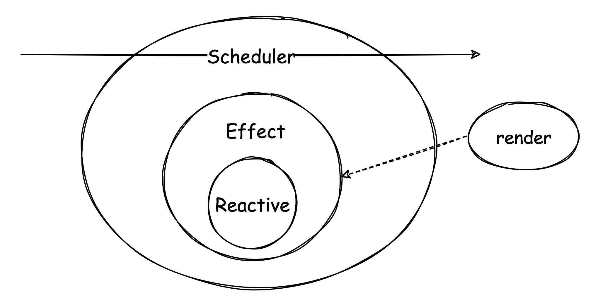
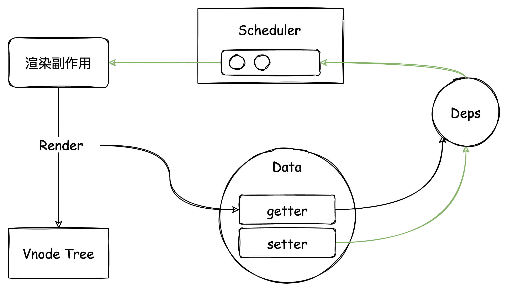
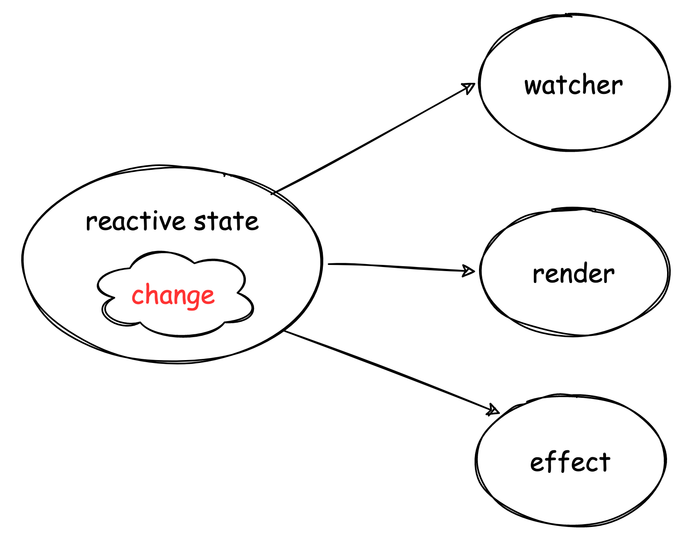
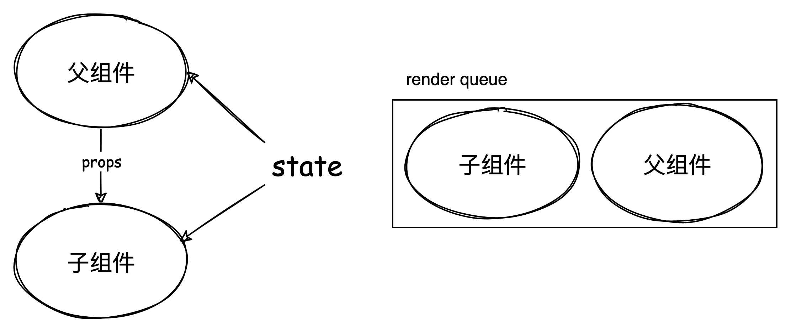
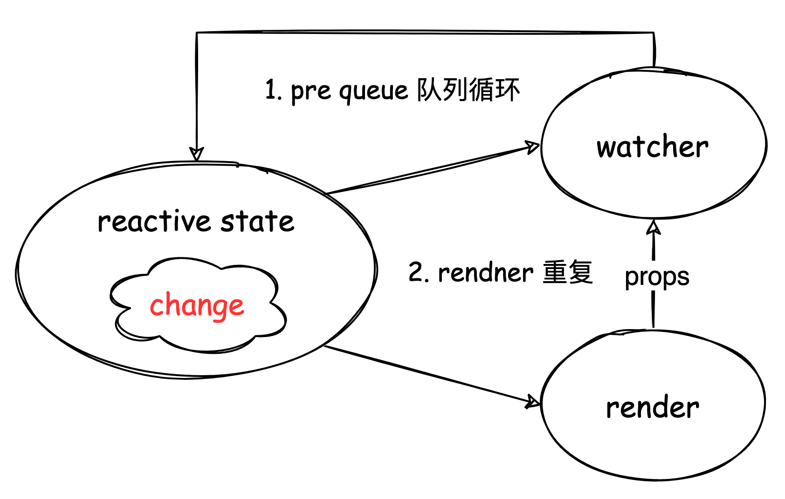
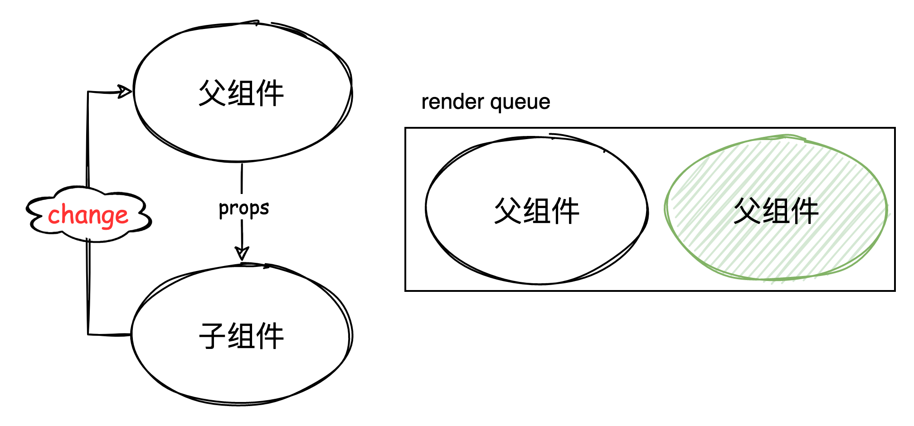
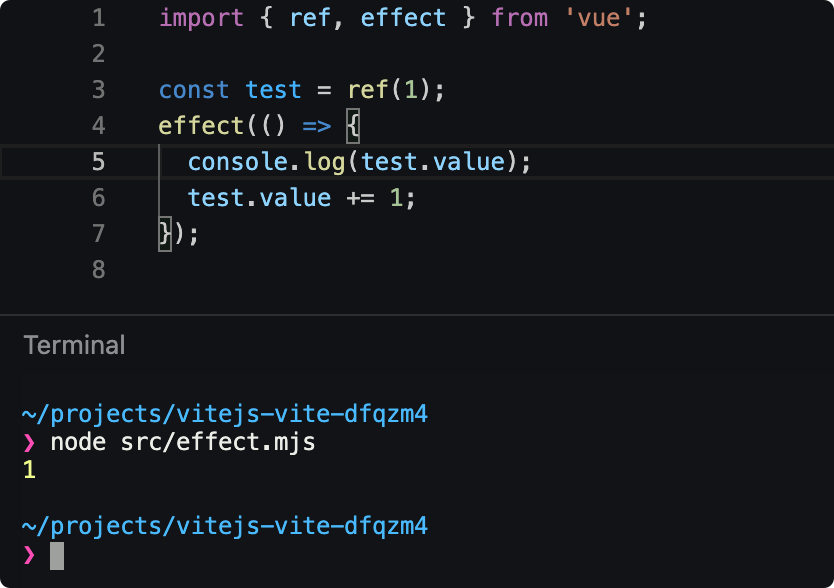

# Vue 的响应式更新渲染机制

> 以下代码示例版本 vue3.2

Vue 的响应式更新渲染机制，也就是 MDV（Model-Driven-View）数据驱动视图的实现原理。首先在 MDV 的理念下，我们只需要关注业务数据变化，至于状态如何自动化同步映射成 UI 就交给视图层框架解决。

在 vue 的响应式系统下，渲染其实也是一种副作用。

  

响应式更新渲染机制:

  

vue3 的响应式渲染机制跟 vue2 其实区别不大，其中：

1. 渲染改成副作用为单位
2. 收集渲染副作用
3. 数据变化触发更新任务进入异步队列
4. Scheduler 进行任务调度


## 渲染副作用

setupRenderEffect 创建渲染副作用。

```ts
// packages/runtime-core/src/renderer.ts
  const setupRenderEffect: SetupRenderEffectFn = (
    instance,
    initialVNode,
    container,
    anchor,
    parentSuspense,
    isSVG,
    optimized
  ) => {
    // 渲染函数
    const componentUpdateFn = () => { 
      //...
    }

    // create reactive effect for rendering
    // 创建响应式渲染副作用
    const effect = new ReactiveEffect(
      componentUpdateFn,
      () => queueJob(instance.update),
      instance.scope // track it in component's effect scope
    )

    const update = (instance.update = effect.run.bind(effect) as SchedulerJob)
    update.id = instance.uid
   
    //...
    
    // 执行渲染、触发依赖收集
    update()
  }
```

## 渲染上下文：建立数据与模板联系

```js
{
  data: () => {
    return {}
  },
  setup(){
    return {}
  }
  render() {}
}
```

组件 = 数据 + 视图模板

模板对数据的引用是通过代理访问渲染上下文

渲染上下文
1. setupState
2. data
3. props
4. instance

代理访问顺序

渲染上下文创建过程

```js
// mountComponent => setupComponent => setupStatefulComponent
function setupStatefulComponent(
  instance: ComponentInternalInstance,
  isSSR: boolean
) {
  const Component = instance.type as ComponentOptions

  // 0. create render proxy property access cache
  instance.accessCache = Object.create(null)
  // 1. create public instance / render proxy
  // also mark it raw so it's never observed
  instance.proxy = markRaw(new Proxy(instance.ctx, PublicInstanceProxyHandlers))
  if (__DEV__) {
    exposePropsOnRenderContext(instance)
  }
  // 2. call setup()
  const { setup } = Component
  if (setup) {
    const setupContext = (instance.setupContext =
      setup.length > 1 ? createSetupContext(instance) : null)

    setCurrentInstance(instance)
    pauseTracking()
    const setupResult = callWithErrorHandling(
      setup,
      instance,
      ErrorCodes.SETUP_FUNCTION,
      [__DEV__ ? shallowReadonly(instance.props) : instance.props, setupContext]
    )
    resetTracking()
    unsetCurrentInstance()

    if (isPromise(setupResult)) {
      setupResult.then(unsetCurrentInstance, unsetCurrentInstance)

      if (isSSR) {
        // return the promise so server-renderer can wait on it
        return setupResult
          .then((resolvedResult: unknown) => {
            handleSetupResult(instance, resolvedResult, isSSR)
          })
          .catch(e => {
            handleError(e, instance, ErrorCodes.SETUP_FUNCTION)
          })
      } else if (__FEATURE_SUSPENSE__) {
        // async setup returned Promise.
        // bail here and wait for re-entry.
        instance.asyncDep = setupResult
      } else if (__DEV__) {
        warn(
          `setup() returned a Promise, but the version of Vue you are using ` +
            `does not support it yet.`
        )
      }
    } else {
      handleSetupResult(instance, setupResult, isSSR)
    }
  } else {
    finishComponentSetup(instance, isSSR)
  }
}
```

## 异步更新机制

当响应式数据发生变化时并不会立即更新视图，而是将视图更新任务派发给**调度器**调度执行。也就是说 vue 的视图更新是异步的，这是因为当你有多个响应式数据修改的时候，不可能每修改一个就同步一次更新操作，而是将所有的更新任务都缓冲到下一个 tick 中去执行。

```ts
// packages/runtime-core/src/scheduler.ts
// ...
const effect = new ReactiveEffect(
      componentUpdateFn, // 组件渲染函数
      () => queueJob(instance.update), // 放进任务队列
      instance.scope // track it in component's effect scope
    )
//...
```

视图更新任务都会放进异步队列。但为了保证渲染一致性，vue 根据渲染前后分为了不同队列：

- pendingPreFlushCbs（pre queue）
- queue（render queue）
- pendingPostFlushCbs（post queue）

vue3 为开发者提供了方便的可变数据功能，却复杂了自己内部实现。相比 vue2 时期直接将更新任务放到单个异步队列而言，vue3 则是多优先级队列 + 调度机制，因为响应式触发的多个观察者需要保证他们按照预期效果执行就需要进行调度任务。

响应式数据发生变化时会触发三类任务分别是 watcher、render、effect。

  

其中 effect 是底层响应式副作用 api 生成的，是响应式同步触发；而 render 和 watcher 是 effect 基础上实现的，是给开发者们优先使用的，并且接入调度机制中。

render 任务是存放进 render queue 中，watcher 则可根据属性控制：

- pre 对应 pre queue
- post 对应 post queue
- sync 直接同步执行

了解了任务类型及对应的任务队列后，我们再了解 vue 是如何异步更新，其实很简单：
**在同一个 tick 中对触发的 watcher、render 任务用对应的任务队列进行缓冲收集并且在运行时环境创建一个异步任务用于负责执行这些更新任务**。

```ts
// queueJob 将异步更新任务插入到 render queue 队列中
export function queueJob(job: SchedulerJob) {
  if (
    // 省略...
  ) {
    // 插入队列
    queue.push(job)

    queueFlush()  // 向运行时环境发起一个异步任务
  }
}

function queueFlush() {
  // 防止重复触发
  if (!isFlushing && !isFlushPending) {
    isFlushPending = true
    // 发起异步任务
    currentFlushPromise = resolvedPromise.then(flushJobs)
  }
}

const resolvedPromise: Promise<any> = Promise.resolve()
```

这里有点一跟 vue2 不同的是：vue3 中直接只使用 Promise 去做异步任务，并没有像 vue2 去做兼容降级方案。能够支持 vue3 的环境，也就是支持 proxy api，大体基本都支持 Promise。

### 调度细节

接下来看看 flushJobs 是如何执行更新任务以及一些细节问题。

```ts
function flushJobs(seen?: CountMap) {
  isFlushPending = false
  isFlushing = true
  if (__DEV__) {
    seen = seen || new Map()
  }

  // 执行 pre queue
  flushPreFlushCbs(seen)

  // Sort queue before flush.
  // This ensures that:
  // 1. Components are updated from parent to child. (because parent is always
  //    created before the child so its render effect will have smaller
  //    priority number)
  // 2. If a component is unmounted during a parent component's update,
  //    its update can be skipped.
  queue.sort((a, b) => getId(a) - getId(b))

  // 执行 render queue
  try {
    for (flushIndex = 0; flushIndex < queue.length; flushIndex++) {
      const job = queue[flushIndex]
      if (job && job.active !== false) {
        if (__DEV__ && checkRecursiveUpdates(seen!, job)) {
          continue
        }
        // console.log(`running:`, job.id)
        callWithErrorHandling(job, null, ErrorCodes.SCHEDULER)
      }
    }
  } finally {
    flushIndex = 0
    queue.length = 0
    // 执行 post queue
    flushPostFlushCbs(seen)

    isFlushing = false
    currentFlushPromise = null
    // some postFlushCb queued jobs!
    // keep flushing until it drains.
    if (
      queue.length ||
      pendingPreFlushCbs.length ||
      pendingPostFlushCbs.length
    ) {
      flushJobs(seen)
    }
  }
}
```

从上看出

1. 队列的执行顺序依次为 pre queue、render queue、post queue 
2. render queue 执行前需要排序，为什么？
   
这主要跟 vue 组件的渲染机制有关，一个 vue 组件发生更新有两种情况：

- 依赖的响应性 state 发生修改
- 自身 props 发生修改

props 是由父组件传入，是在 render 过程中。当 props 发生改，子组件也会发生更新，**整个组件树的创建更新顺序都是从父到子**。

但有一种情况，就是父子组件刚好依赖到同一个 state，这会导致 render queue 里同时存在父子组件的 render 任务，更坏的情况是子 render 任务可能排在父 render 前。

  


子 render 任务本来就会更新子组件，而父 render 任务可能修改子组件的 props 同样也可能会导致子组件更新，也就是说 父 rennder 任务其实可能包含子 render 任务，那这样就会导致子组件在同一个 tick 中 render 两次。

源码中先进行父子排序，先执行父 render 任务，并且在更新子组件之前先能够 `invalidateJob(instance.update)` 把队列中的子 render 任务删除，这样做就不会重复更新子组件。

```ts
const updateComponent = (n1: VNode, n2: VNode, optimized: boolean) => {
    const instance = (n2.component = n1.component)!
    if (shouldUpdateComponent(n1, n2, optimized)) {
      //...
      // normal update
      instance.next = n2
      // in case the child component is also queued, remove it to avoid
      // double updating the same child component in the same flush.
      invalidateJob(instance.update)
      // instance.update is the reactive effect.
      instance.update()
      //...
    } else {
      // no update needed. just copy over properties
      n2.component = n1.component
      n2.el = n1.el
      instance.vnode = n2
    }
  }
```

接下来看，当一个组件依赖的多个状态同时发生变更时：

  

```ts
export function queueJob(job: SchedulerJob) {
  if (
    (!queue.length ||
      !queue.includes(
        job,
        isFlushing && job.allowRecurse ? flushIndex + 1 : flushIndex
      )) &&
    job !== currentPreFlushParentJob
  ) {
    if (job.id == null) {
      queue.push(job)
    } else {
      queue.splice(findInsertionIndex(job.id), 0, job)
    }
    queueFlush()
  }
}
```

其中

1. 在执行清空所有任务队列前先去重。（这时还没 flushing， flushIndex 为 0，意味着即整个队列去重）
2. 但执行队列任务过程又可以根据 `job.allowRecurse` 条件插入任务、或者重复任务，这是为什么？

  

图上有两处循环：

在执行 pre queue 中的 watcher 时，watcher 可能会修改 state，产生新的 watcher 插入 pre queue 中，所以必须循环处理完 pre queue 中任务，保证在执行 render 后视图数据一致。

```ts
export function flushPreFlushCbs(
  seen?: CountMap,
  parentJob: SchedulerJob | null = null
) {
  if (pendingPreFlushCbs.length) {
    currentPreFlushParentJob = parentJob // 先忽略
    activePreFlushCbs = [...new Set(pendingPreFlushCbs)]
    pendingPreFlushCbs.length = 0
    
    for (
      preFlushIndex = 0;
      preFlushIndex < activePreFlushCbs.length;
      preFlushIndex++
    ) {
      
      activePreFlushCbs[preFlushIndex]()
    }
    activePreFlushCbs = null
    preFlushIndex = 0
    currentPreFlushParentJob = null
    // recursively flush until it drains
    // 递归处理
    flushPreFlushCbs(seen, parentJob)
  }
}
```

在执行 render 任务时，这时 props 的改变可能会触发子组件的 watcher，在渲染子组件前同样必须先清空 pre queue。同时要注意防止往 render queue 中插入子 render 任务，因为当前的 render 任务包含了子 render 任务要执行。

```ts
// packages/runtime-core/src/renderer.ts
const updateComponentPreRender = (
 instance: ComponentInternalInstance,
 nextVNode: VNode,
 optimized: boolean
) => {
 // 省略代码...

 // props update may have triggered pre-flush watchers.
 // flush them before the render update.
 // 渲染前清空 pre queue
 // 第二参数记录当前调用栈中的父任务，此时即为子 render
 flushPreFlushCbs(undefined, instance.update)
 
 // ...
}

export function flushPreFlushCbs(
  seen?: CountMap,
  parentJob: SchedulerJob | null = null
) {
  if (pendingPreFlushCbs.length) {
    // 全局变量标记
    currentPreFlushParentJob = parentJob
    
    // ... 任务执行

    // recursively flush until it drains
    flushPreFlushCbs(seen, parentJob)
  }
}

export function queueJob(job: SchedulerJob) {
  if (
    (!queue.length ||
      !queue.includes(
        job,
        isFlushing && job.allowRecurse ? flushIndex + 1 : flushIndex
      )) &&
    // 任务对比，防止重复插入
    job !== currentPreFlushParentJob
  ) {
    //...
  }
}
```

但是我们同样也需要注意个问题：上面虽然解决了子 render 重复的问题，但 watcher 中可能会**修改到了父组件的依赖**！

一个 render 任务执行的时候有两个重要过程：

1. 创建新的 subTree
2. diff 新旧 subTree

在 patch 过程，子组件 props 发生了修改而触发的 watcher 修改到父组件依赖状态。那么这时父 render 过程生成的新的 subTree 其实已经不是最新状态的映射了，导致最后视图不一致，所以需要个**弥补机制**，父组件再 render 一次。

  

queueJob 中 `isFlushing && job.allowRecurse ? flushIndex + 1 : flushIndex` 里 `flushIndex + 1` 使得能够插入重复 render 任务。

> 这里有个 [issue](https://github.com/vuejs/vue-next/issues/1801) 上面的示例可以去调试看看。

## [ReactiveEffect.allowRecurse](#Effect.allowRecurse)

ReactiveEffect.allowRecurse 并没有过多的注释，但我们可以从 `packages/runtime-core/src/scheduler.ts` 中发现相关注释，其实 Render ReactiveEffect 就是 SchedulerJob。

```ts
export interface SchedulerJob extends Function {
  id?: number
  active?: boolean
  computed?: boolean
  /**
   * Indicates whether the effect is allowed to recursively trigger itself
   * when managed by the scheduler.
   *
   * By default, a job cannot trigger itself because some built-in method calls,
   * e.g. Array.prototype.push actually performs reads as well (#1740) which
   * can lead to confusing infinite loops.
   * The allowed cases are component update functions and watch callbacks.
   * Component update functions may update child component props, which in turn
   * trigger flush: "pre" watch callbacks that mutates state that the parent
   * relies on (#1801). Watch callbacks doesn't track its dependencies so if it
   * triggers itself again, it's likely intentional and it is the user's
   * responsibility to perform recursive state mutation that eventually
   * stabilizes (#1727).
   */
  allowRecurse?: boolean
  /**
   * Attached by renderer.ts when setting up a component's render effect
   * Used to obtain component information when reporting max recursive updates.
   * dev only.
   */
  ownerInstance?: ComponentInternalInstance
}
```

ReactiveEffect 创建实例时其 allowRecurse 是为 undefined，可以说是 false，在同一 effect 下是不会触发重复递归的。

```ts
export function triggerEffects(
  dep: Dep | ReactiveEffect[],
  debuggerEventExtraInfo?: DebuggerEventExtraInfo
) {
  // spread into array for stabilization
  for (const effect of isArray(dep) ? dep : [...dep]) {
    // 防止 effect 重复调用
    if (effect !== activeEffect || effect.allowRecurse) {
      //...
    }
  }
}
```

下面例子中，effect 中修改 test 值，但副作用只执行了一次。

  

而 **render、watcher 是可以重复递归**，其中可重复 render 是有场景需求，而watcher 则是不想违背模式，如果 watcher 里修改数据重新触发了 watcher，那更多是用户的一种责任行为。

## nextTick

```ts
export function nextTick<T = void>(
  this: T,
  fn?: (this: T) => void
): Promise<void> {
  const p = currentFlushPromise || resolvedPromise
  return fn ? p.then(this ? fn.bind(this) : fn) : p
}
```

使用 promise 链式调用，保证 nextTick 的任务在异步更新任务后执行，这样某些插件就可以获得更新后的 DOM。

## 总结

1. vue 的异步更新机制：使用队列缓存更新任务，在事件循环中安排一个异步任务执行队列中所有任务
2. 组件树的更新过程遵循自顶向下、单向数据流原则，注意在组件更新后发生数据修改，改变数据流规则可能会导致重复渲染