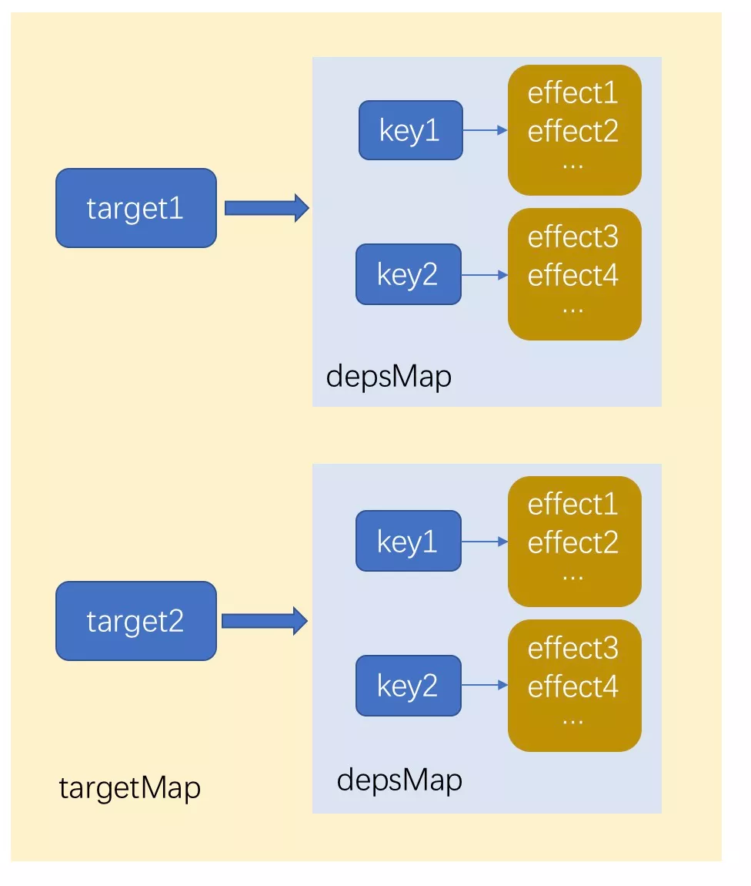
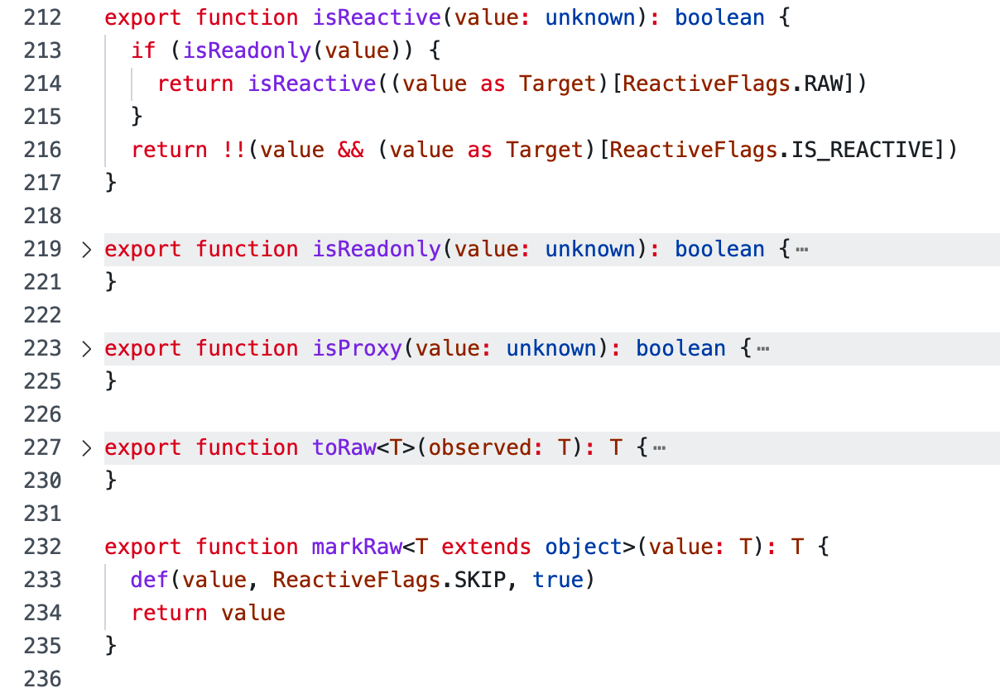
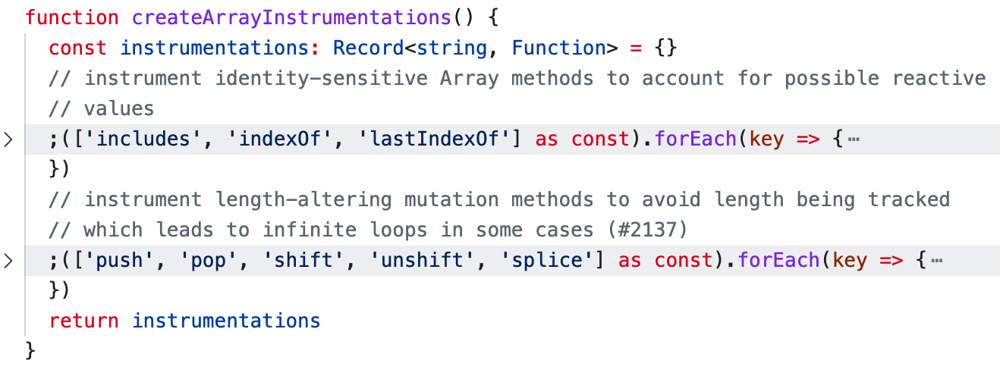

# Vue 的响应式

- Vue 的响应式
  - 响应式原理
  - Reative API
  - 响应式更新渲染机制

除了组件化，Vue.js 另一个核心设计思想就是响应式。

## 响应式原理

```js
let A = 1
let B = 2
let C = A + B // 3

// change A
A = 2

console.log(C) // 3
```

传统命令式编程下，A 发生改变，`C = A + B` 并不会重新执行。为了能够重新计算就需要将 `C = A + B` 语句包装成可复用的函数，并且观察 A 的变化以便发生改变时调用该函数。

Vue 的响应式原理的实现本质就是观察者模式，Subject、Observer 角色在 Vue 响应式设计中分别对应的是 Reactive 响应式数据、Effect 副作用的概念。

Vue2 和 Vue3 的响应式实现并其实没多大区别，大致都是需要以下重要三步：

1. 数据劫持（defineProperty => proxy 劫持数据操作事件）
2. 依赖收集（监听属性数据的 getter 事件） 
3. 变更通知（监听属性数据的 setter 事件） 

### Vue3 响应式原理 mini 实现

```js
function reactive(target) {
    // case...

    // 数据代理、操作劫持
    return new Proxy(target, {
        get(target, property) {
            // 依赖收集
            track(target, property)
            return Reflect.get(...arguments)
        },
        set(target, property) {
            const result = Reflect.set(...arguments)
            // 变更通知
            trigger(target, property)
            return result
        }
    })
}
```

JS Proxy 代理的是一个对象，对象属性能够任意访问，我们需要跟踪数据被访问的地方，将“观察者”收集起来。

为了能够方便在代码上下文中找到对应响应式数据，设计一个缓存结构 `targetMap => depsMap => deps`。

```js
// 缓存结构
// targetMap => depsMap => deps
// deps = new Set() // 收集响应式数据对应的依赖
const depsMap = new Map() // 存放代理对象的数据属性
const targetMap = new WeakMap() // 存放代理对象
```

 

reactive 包装下我们已经可以对数据进行访问、修改劫持。

那么数据被访问，我们需要收集的是什么？

上面说到 `为了能够重新计算就需要将 `C = A + B` 语句包装成可复用的函数`，可是用户自定义函数在执行过程中，我们是无法获取该函数对象。

将该需要观察数据重复调用的函数进行高阶函数封装成“副作用”，在“副作用”环境中依赖到响应式数据需要将当前“副作用”进行收集。

```js
const effectStack = [] // 副作用栈，解决嵌套副作用场景
let activeEffect = null // 当前执行的副作用环境

// 副作用
function effect(fn) {
    const _effect = (...args) => {
        // 指向当前执行的副作用环境
        activeEffect = _effect

        // 清除响应式数据收集的当前副作用依赖
        cleanup(activeEffect)

        effectStack.push(fn)
        fn(...args)
        effectStack.pop()
        activeEffect = effectStack[effectStack.length - 1]
    }

    _effect.deps = []

    return _effect()
}
```

在响应式作用下，每次副作用重新运行时都会触发响应式数据重新收集当前副作用，但并不是当前所有响应式数据都会，比如响应式数据 A 和 B，在下次重新运行因为 if 条件可能只使用到了 B，故需要清除 A 之前对当前副作用的收集。

总而言之，为了防止某个场景下，某个依赖已经不是当前副作用的依赖，该依赖发生变化会导致该副作用重新执行，故需要清除无效依赖。

一个简单方法就是将副作用之前的依赖全部清除，然后重新进行收集。

```js
// 清除依赖
function cleanup(effect) {
    const { deps } = effect
    if (deps.length) {
        for (let i = 0; i < deps.length; i++) {
            // 将副作用从当前响应式数据的依赖收集中删除
            deps[i].delete(effect)
        }
        deps.length = 0
    }
}
``` 

副作用收集。

```js
function track(target, key) {
    // 获取响应式数据的依赖集
    let depsMap = targetMap.get(target);

    if (!depsMap) {
        targetMap.set(target, (depsMap = new Map()))
    }

    let deps = depsMap.get(key);

    if (!deps) {
        depsMap.set(key, (deps = new Set()));
    }

    if (!deps.has(activeEffect)) {
        // 收集当前激活的 effect
        deps.add(activeEffect)
        // 当前响应式数据的 dpes 作为 effect 的依赖
        // clearup 时能够将副作用从响应式数据的 deps 中清除
        activeEffect.deps.push(deps)
    }
}
```

  


响应式数据修改触发副作用执行，即相当于观察者模式下的变更通知。

```js
function trigger(target, key) {
    const depsMap = targetMap.get(target);
    if (!depsMap) return;
    let deps = depsMap.get(key);

    if (deps) {
        for (const effect of [...deps]) {
            effect()
        }
    }
}
```

## Vue Reactive API 源码分析

> Vue Reactive API 基本实现原理大概类似上面，下面仅对部分源码细节分析

Vue Reactive API 大致分为两类：

- Reactive（响应式数据）
  - reactive
    - shallowReactive 浅响应式对象
  - readonly：只读响应，不会被依赖收集
    - shallowReadonly
  - ref
  - computed
  - deferredComputed
- ReactiveEffect（响应式副作用）
  - effect
  - effectScope
  - watchEffect
  - watch

### reactive

```js
// packages/reactivity/src/reactive.ts

function createReactiveObject(
  target: Target,
  isReadonly: boolean,
  baseHandlers: ProxyHandler<any>,
  collectionHandlers: ProxyHandler<any>,
  proxyMap: WeakMap<Target, any>
) {
  //proxy 对象再次 reactive 还是原 proxy，除非转是 readyonly
  if (
    target[ReactiveFlags.RAW] &&
    !(isReadonly && target[ReactiveFlags.IS_REACTIVE])
  ) {
    return target
  }

  //同一原始 target 多次执行 reactive 都会得到同一 proxy
  const existingProxy = proxyMap.get(target)
  if (existingProxy) {
    return existingProxy
  }

  // 只允许普通对象或者集合类型，内置对象类型如 Date、Function 类型则不可以
  const targetType = getTargetType(target)
  if (targetType === TargetType.INVALID) {
    return target
  }

  const proxy = new Proxy(
    target,
    // 根据数据类型，分为基础对象代理操作和集合类型代理操作
    targetType === TargetType.COLLECTION ? collectionHandlers : baseHandlers
  )
  proxyMap.set(target, proxy)
  return proxy
}

function targetTypeMap(rawType: string) {
  switch (rawType) {
    case 'Object':
    case 'Array':
      return TargetType.COMMON
    case 'Map':
    case 'Set':
    case 'WeakMap':
    case 'WeakSet':
      return TargetType.COLLECTION
    default:
      return TargetType.INVALID
  }
}
```

1. proxy 对象再次 reactive 还是原 proxy，除非转是 readyonly
2. 同一原始 target 多次执行 reactive 都会得到同一 proxy（proxyMap 缓存）
3. 只允许普通对象或者集合类型，内置对象类型如 Date、Function 类型则不可以
4. __v_skip 属性的对象、被冻结的对象

#### 内部 ReactiveFlags key

ReactiveFlags 作为响应式对象的内部特殊 key。

> 为什么不用 Symbol 去私有 key？:thinking:

```ts
export const enum ReactiveFlags {
  SKIP = '__v_skip', // 跳过响应化
  IS_REACTIVE = '__v_isReactive', // 响应式标记
  IS_READONLY = '__v_isReadonly', // 响应式只读标记
  RAW = '__v_raw' // 原始数据
}
```

工具函数 isReactive、isReadonly、isProxy、markRaw 都是 flag key 快速实现。



#### get 依赖收集

get 代理操作主要做了 3 件事：

1. 依赖跟踪、收集
2. 数组操作代理
3. 延迟响应式

```js
// packages/reactivity/src/baseHandlers.ts
function createGetter(isReadonly = false, shallow = false) {
  return function get(target: Target, key: string | symbol, receiver: object) {
    // 内部特殊 key 处理... 

    // 数组操作代理
    const targetIsArray = isArray(target)
    if (!isReadonly && targetIsArray && hasOwn(arrayInstrumentations, key)) {
      return Reflect.get(arrayInstrumentations, key, receiver)
    }

    const res = Reflect.get(target, key, receiver)

    if (!isReadonly) {
      // 依赖收集
      track(target, TrackOpTypes.GET, key)
    }

    // case...

    if (isObject(res)) {
      // 响应式子属性数据，不像以前初始化时递归响应，性能优化
      // Convert returned value into a proxy as well. we do the isObject check
      // here to avoid invalid value warning. Also need to lazy access readonly
      // and reactive here to avoid circular dependency.
      return isReadonly ? readonly(res) : reactive(res)
    }

    return res
  }
}
```

#### 数组代理



1. includes、indexOf、lastIndexOf 等搜索结果会因为元素变化导致结果可能发生变化，故需要对元素同样依赖收集。
2. push、pop 等数组操作会导致数组长度变化，并返回 length 导致再次触发 get。

```js
const test = [1, 2, 3];

const _test = new Proxy(test, {
  get(traget, key, r) {
    const res = Reflect.get(...arguments);
    console.log(key, res);
    return res;
  },
});

// 访问属性: proxy[foo]和 proxy.bar
_test.push(4); // 返回 _test.length 会再触发 get
console.log(_test.length);
```

### ReactiveEffect

响应式副作用，就是在响应式数据发生变化时能够执行某些操作。

那要在如何把响应式数据和副作用函数自动关联，就需要把这些副作用操作封装成 Vue 响应性系统中的 ReactiveEffect。

```js
export interface ReactiveEffectOptions extends DebuggerOptions {
  lazy?: boolean // 延迟执行
  scheduler?: EffectScheduler // 副作用执行调度器
  scope?: EffectScope // 副作用作用域
  allowRecurse?: boolean
  onStop?: () => void
}

export function effect<T = any>(
  fn: () => T,
  options?: ReactiveEffectOptions
): ReactiveEffectRunner {
  if ((fn as ReactiveEffectRunner).effect) {
    fn = (fn as ReactiveEffectRunner).effect.fn
  }
  // 将副作用 fn 封装成响应式副作用
  const _effect = new ReactiveEffect(fn)
  if (options) {
    extend(_effect, options)
    if (options.scope) recordEffectScope(_effect, options.scope)
  }
  // 延迟执行控制
  if (!options || !options.lazy) {
    _effect.run()
  }
  const runner = _effect.run.bind(_effect) as ReactiveEffectRunner
  runner.effect = _effect
  return runner
}

export class ReactiveEffect<T = any> {
  active = true // active 副作用调度激活标志？
  deps: Dep[] = [] // effect 存储相关响应式数据的 dep

  // can be attached after creation
  computed?: boolean
  allowRecurse?: boolean
  onStop?: () => void
  // dev only
  onTrack?: (event: DebuggerEvent) => void
  // dev only
  onTrigger?: (event: DebuggerEvent) => void

  constructor(
    public fn: () => T,
    public scheduler: EffectScheduler | null = null,
    scope?: EffectScope | null
  ) {
    recordEffectScope(this, scope)
  }

  run() {
    // 副作用执行
  }

  stop() {
    // 停止副作用
  }
}
```

ReactiveEffect 对象除了封装副作用外还记录其他一些信息，比如收集相关响应式数据的 dep。

在上面 mini 响应式实现中，每次副作用重新执行前都要 `clearup()` 清除副作用的所有依赖，然后再在执行过程中重新收集依赖。

这个过程牵涉到大量对 Set 集合的添加和删除操作。在许多场景下，依赖关系是很少改变的，因此这里存在一定的优化空间。

Vue3.2 采用大概思路就是标记清除：

1. 执行前先对所有依赖进行“已收集”标记
2. 执行过程对依赖重新标记为“新收集”
3. 删除掉所有不是最新收集的依赖

### ReactiveEffect.run 副作用执行（3.2）

```js
export const createDep = (effects) => {
  const dep = new Set(effects)
  dep.w = 0 // 标记已收集
  dep.n = 0 // 标记新收集
  return dep
}
```

```js
const effectStack: ReactiveEffect[] = [] // 副作用栈
let activeEffect: ReactiveEffect | undefined // 栈顶副作用

let effectTrackDepth = 0 // 副作用栈深度
export let trackOpBit = 1 // 用于标识依赖收集的状态
const maxMarkerBits = 30 // 表示最大标记的位数，trackOpBit 超过时则执行 clearup() 依赖全清

//...
// 响应式副作用执行
run() {
 if (!this.active) {
   return this.fn()
 }
 if (!effectStack.includes(this)) {
   try {
     // 入栈
     effectStack.push((activeEffect = this))
     enableTracking()
     // 将栈深度转换成二进制
     trackOpBit = 1 << ++effectTrackDepth

     if (effectTrackDepth <= maxMarkerBits) {
       // 将所有依赖初始化为已收集
       initDepMarkers(this)
     } else {
       cleanupEffect(this)
     }
     // 副作用执行
     return this.fn()
   } finally {
     if (effectTrackDepth <= maxMarkerBits) {
       // 清除旧依赖
       finalizeDepMarkers(this)
     }

     trackOpBit = 1 << --effectTrackDepth

     resetTracking()
     // 出栈
     effectStack.pop()
     const n = effectStack.length
     activeEffect = n > 0 ? effectStack[n - 1] : undefined
   }
 }
}
//...

const initDepMarkers = ({ deps }) => {
  if (deps.length) {
    for (let i = 0; i < deps.length; i++) {
      deps[i].w |= trackOpBit // 赋值给 w 标记依赖已经被收集
    }
  }
}
```

重新依赖收集。

```js
export function trackEffects(
  dep: Dep,
  debuggerEventExtraInfo?: DebuggerEventExtraInfo
) {
  let shouldTrack = false
  if (effectTrackDepth <= maxMarkerBits) {
    // 判断依赖是否被标记为新的
    if (!newTracked(dep)) {
      dep.n |= trackOpBit // 标记为最新依赖
      // 如果依赖已经被收集，则不需要再次收集
      shouldTrack = !wasTracked(dep)
    }
  } else {
    // Full cleanup mode.
    shouldTrack = !dep.has(activeEffect!)
  }

  if (shouldTrack) {
    dep.add(activeEffect!)
    activeEffect!.deps.push(dep)
  }
}
```

清除旧依赖。

```js
export const finalizeDepMarkers = (effect: ReactiveEffect) => {
  const { deps } = effect
  if (deps.length) {
    let ptr = 0
    for (let i = 0; i < deps.length; i++) {
      const dep = deps[i]
      if (wasTracked(dep) && !newTracked(dep)) {
        dep.delete(effect) // 删除旧依赖
      } else {
        deps[ptr++] = dep // 调整 deps 数组
      }
      // 重置上一层状态
      dep.w &= ~trackOpBit
      dep.n &= ~trackOpBit
    }
    deps.length = ptr
  }
}
```

#### trackOpBit 的设计

trackOpBit 设计为二进制位是跟踪响应式数据在 effect 嵌套深度的被收集位置，如果使用数组方式去记录状态，空间及运算效率不如二进制高。

> js 二进制数据前缀表示 0b

1. 初始时 trackOpBit = 0，w = 0
2. 数据在第一层使用时: trackOpBit = 0b10， w |= trackOpBit = 0b10
3. 数据在第二层使用 trackOpBit = 0b100， w |= trackOpBit = 0b110
4. trackOpBit = 0b100 可以表示当前是在第二层，w 通过或运算可以记录数据在哪几层使用过

```js
const wasTracked = (dep) => (dep.w & trackOpBit) > 0
```

通过与运算就可以知道该依赖是否在当前层收集过。

### 副作用调度器

```js
function createSetter(shallow = false) {
  return function set(
    target: object,
    key: string | symbol,
    value: unknown,
    receiver: object
  ): boolean {
    let oldValue = (target as any)[key]
    
    // 更新原始对象数据
    const result = Reflect.set(target, key, value, receiver)
    // 如果目标的原型链也是一个 proxy，通过 Reflect.set 修改原型链上的属性会再次触发 setter，这种情况下就没必要触发两次 trigger 了
    if (target === toRaw(receiver)) {
      if (!hadKey) {
        trigger(target, TriggerOpTypes.ADD, key, value)

        // 数据发生改变，变更通知
      } else if (hasChanged(value, oldValue)) {
        trigger(target, TriggerOpTypes.SET, key, value, oldValue)
      }
    }
    return result
  }
}
```

还未完。。。

## 参考学习

- [细说 Vue.js 3.2 关于响应式部分的优化](https://mp.weixin.qq.com/s/02-6xMskeTMuTwrJ1fkZow)