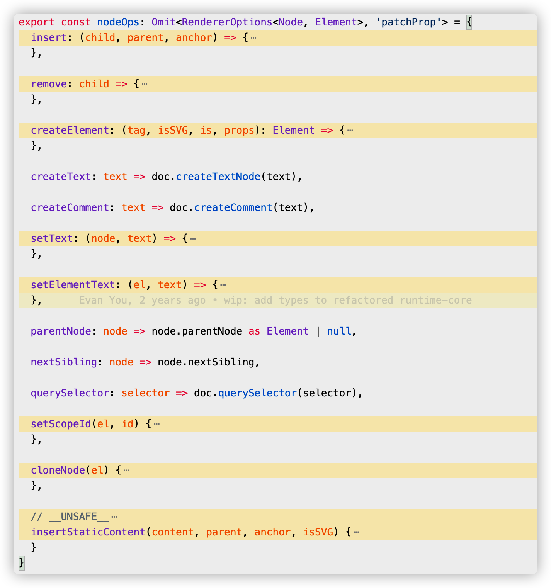
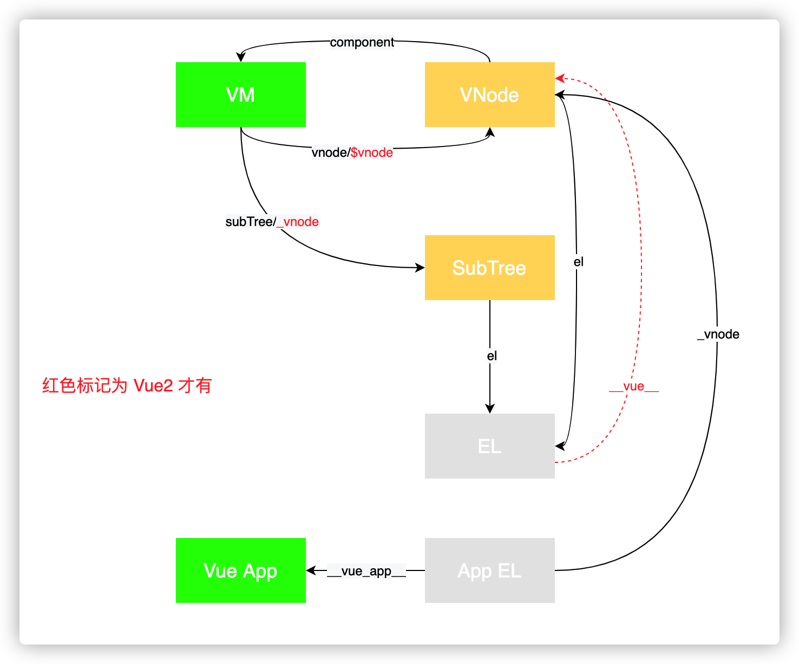

---
tags:
 - vue
 - vnode
---
# vue 组件渲染流程

> 以下示例代码基于 vue3.0 版本

任何前端框架，最主要的核心功能就是渲染视图。在 Vue 中，整个应用的页面都是通过组件来构成并渲染成页面。

  

## VNode

Vue 的渲染原理中使用 Virtual DOM 机制去抽象描述真实的 DOM。Virtual DOM 中每一个节点叫做 VNode。

我们可以用 vnode 这样表示`<button>`节点。一个 VNode 的属性最主要的是节点类型 `type`，节点属性 `props`，字节点 `children`。

```html
<button class="btn" style="width:100px;height:50px">click me</button>
```

```javascript
const vnode = {

  type: 'button',

  props: { 
    'class': 'btn',
    style: {
      width: '100px',
      height: '50px'
    }
  },
  children: 'click me'
}

```

总结来说，什么是 VNode？VNode 本质上是用来描述视图的 JavaScript 对象。

引入 VNode 的好处：

1. 任何常规的 GUI 都能用**类 DOM 数据结构**去描述，引入 VNode，主要是将视图**抽象化**，提供了**跨平台**能力。
2. 基于 vnode 实现 MDV 的功能，避免了手动操作 DOM 效率地下以及某些场景下引发导致的性能问题，可通过 diff vnode 精准计算 DOM 的最小变更操作。

vue 提供更多的 vnode 类型：

```javascript
// packages/runtime-core/src/vnode.ts
export type VNodeTypes =
  | string // element
  | VNode // slot
  | Component // 组件
  | typeof Text // 文本
  | typeof Static // 静态
  | typeof Comment // 注释
  | typeof Fragment // 片段
  | typeof TeleportImpl // 传送组件
  | typeof SuspenseImpl // 挂载组件

export interface VNode<
  HostNode = RendererNode,
  HostElement = RendererElement,
  ExtraProps = { [key: string]: any }
> {
  type: VNodeTypes
  props: (VNodeProps & ExtraProps) | null
  children: VNodeNormalizedChildren
	...
}
```
## Vue 组件
  
组件是一种抽象概念、一种复用手段。前端领域视图组件化，即

视图组件 = 视图模板 + 数据 + 视图交互逻辑

TODO: 

在 vue 中组件类型的节点声明：

```javascript
// 模板中使用自定义组件
<custom-component msg="test"></custom-component>

// 组件标签 转换对于的 vnode 
const CustomComponent = {
  // 在这里定义组件对象
}

// 组件对应的 vnode
const vnode = {
  type: CustomComponent,
  props: { 
    msg: 'test'
  }
}
```

那么一个组件类型的 vnode 是怎么渲染成我们看到的视图？

## 组件渲染流程

> 渲染流程分初始渲染和更新渲染，以下分析主要为初始渲染。
### 应用初始化（createApp 创建应用实例）

```javascript
// 在 Vue.js 3.0 中，标准初始化一个应用的方式如下
import { createApp } from 'vue'
import App from './app'
const app = createApp(App)
app.mount('#app')

-------------------------------------------------------------

// 在 web 平台下，runtime-dom 包中可以找到 createApp 方法定义
// packages/runtime-dom/src/index.ts
const createApp = ((...args) => {
  // 1. 使用自定义渲染器，创建 app 对象
  const app = ensureRenderer().createApp(...args)

  const { mount } = app

  // 重写 mount 方法
  app.mount = (containerOrSelector) => {
    const container = normalizeContainer(containerOrSelector)
    // 2. 调用 app.mount 核心标准方法，创建 vnode, 渲染 vnode
    mount(container)
    // ...
  }

  return app
})

```
#### 渲染器 renderer

```javascript
// packages/runtime-dom/src/index.ts
const app = ensureRenderer().createApp(...args) // 延迟创建渲染，方便 tree-shakable

// 创建自定义渲染器
// vue 为了跨平台支持，抽象标准化渲染器的平台渲染接口。
// renderer = createRenderer(nodeOps)
function ensureRenderer() {
  return renderer || (renderer = createRenderer<Node, Element>(rendererOptions))
}

// 实现不同平台的渲染操作接口
const rendererOptions = extend({ patchProp, forcePatchProp }, nodeOps)
```

nodeOps(packages/runtime-dom/src/nodeOps.ts)，节点的操作方法。



```javascript
// packages/runtime-core/src/renderer.ts

// createRenderer 是 vue 自定义渲染器的核心方法
function createRenderer(nodeOps) {
  return baseCreateRenderer(nodeOps)
}

function baseCreateRenderer(nodeOps) {
  // 利用闭包，将 nodeOps 保存下来
  function render(vnode, container) {
    // 组件渲染的核心逻辑
  }

  return {
    render,
    // createAppAPI 创建 createApp 
    createApp: createAppAPI(render)
  }
}

```

除了将渲染器标准化，还将应用流程创建也标准化。
#### createAppAPI

createApp 函数内部的 app.mount 方法是一个标准的跨平台的组件渲染流程：**先创建 vnode，再渲染 vnode，生成 DOM**。

```javascript
// Vue.js 利用闭包和函数柯里化，createAppAPI 包装 render
function createAppAPI(render) {
  // createApp createApp 方法接受的两个参数：根组件的对象和 prop
  return function createApp(rootComponent, rootProps = null) {
    const app = {
      _component: rootComponent,
      _props: rootProps,
      mount(rootContainer) {
        // 创建根组件的 vnode
        const vnode = createVNode(rootComponent, rootProps)
        // 调用渲染器的 render vnode
        render(vnode, rootContainer)
        app._container = rootContainer
        return vnode.component.proxy
      }
    }
    return app
  }
}
```

这里的代码的执行逻辑都是与平台无关的，启动标准渲染流程。但我们可能需要在外部重写这个方法，来完善特定平台下的渲染逻辑。

进入应用挂载阶段后，接下来就是核心渲染流程。

### 应用挂载
#### 创建 vnode

```javascript
// packages/runtime-core/src/vnode.ts
function _createVNode(
  type: VNodeTypes | ClassComponent | typeof NULL_DYNAMIC_COMPONENT,
  props: (Data & VNodeProps) | null = null,
  children: unknown = null,
  patchFlag: number = 0,
  dynamicProps: string[] | null = null,
  isBlockNode = false
): VNode {

  if (props) {
    // 处理 props 相关逻辑，标准化 class 和 style
  }

  // 对 vnode 类型信息编码
  // 以便在后面的 patch 阶段，可以根据不同的类型执行相应的处理逻辑
  const shapeFlag = isString(type)
    ? ShapeFlags.ELEMENT
    : __FEATURE_SUSPENSE__ && isSuspense(type)
      ? ShapeFlags.SUSPENSE
      : isTeleport(type)
        ? ShapeFlags.TELEPORT
        : isObject(type)
          ? ShapeFlags.STATEFUL_COMPONENT
          : isFunction(type)
            ? ShapeFlags.FUNCTIONAL_COMPONENT
            : 0

  const vnode: VNode = {
    type,
    props,
    key: props && normalizeKey(props),
    ...
  }
	
  // 标准化子节点，把不同数据类型的 children 转成数组或者文本类型
  normalizeChildren(vnode, children)

  return vnode
}
```

工厂模式创建 vnode，并且对 props、children 做标准化处理、对 vnode 的 type 做编码。

TODO: shapeFlag 是干什么用，编码有什么好处

#### 渲染 vnode

```javascript
const render: RootRenderFunction = (vnode, container, isSVG) => {
  if (vnode == null) {
    // 销毁组件
    if (container._vnode) {
      unmount(container._vnode, null, null, true)
    }
  } else {
    // 创建或者更新组件
    patch(container._vnode || null, vnode, container, null, null, null, isSVG)
  }
  
  // 缓存 vnode 节点，表示已经渲染
  container._vnode = vnode
}
```

patch 的功能是对比新旧节点，然后挂载 DOM 或者更新 DOM。

path 主要接受新 vnode、旧 vnode、容器等参数。

patch 会根据不同的组件类型派发任务给 process 处理。根 vnode 是个组件类型，故 processComponent进行处理，调用 mountComponent 方法渲染组件。

```javascript
const patch: PatchFn = (
    n1,
    n2,
    container,
    anchor = null,
    parentComponent = null,
    parentSuspense = null,
    isSVG = false,
    slotScopeIds = null,
    optimized = false
  ) => {
    // 如果存在新旧节点, 且新旧节点类型不同，则销毁旧节点
    if (n1 && !isSameVNodeType(n1, n2)) {
      anchor = getNextHostNode(n1)
      unmount(n1, parentComponent, parentSuspense, true)
      n1 = null
    }

    const { type, ref, shapeFlag } = n2
    switch (type) {
      case Text:...
      case Comment:...
      case Static:...
      case Fragment:...
      default:
        if (shapeFlag & ShapeFlags.ELEMENT) {
         ...
        } else if (shapeFlag & ShapeFlags.COMPONENT) {
          processComponent(
            n1,
            n2,
            container,
            anchor,
            parentComponent,
            parentSuspense,
            isSVG,
            slotScopeIds,
            optimized
          )
        } else if (shapeFlag & ShapeFlags.TELEPORT) {
          ...
        } else if (__FEATURE_SUSPENSE__ && shapeFlag & ShapeFlags.SUSPENSE) {
         ...
        } else if (__DEV__) {
          ...
        }
    }
          

 const processComponent = (n1, n2, container, anchor, parentComponent, parentSuspense, isSVG, optimized) => {

  if (n1 == null) {
   // 挂载组件
   mountComponent(n2, container, anchor, parentComponent, parentSuspense, isSVG, optimized)
  }
  else {
    // 更新组件
    updateComponent(n1, n2, parentComponent, optimized)
  }
}
 

// 挂载组件
const mountComponent = (initialVNode, container, anchor, parentComponent, parentSuspense, isSVG, optimized) => {

  // 创建组件实例
  const instance = (initialVNode.component = createComponentInstance(initialVNode, parentComponent, parentSuspense))

  // 调用组件的 setup 
  setupComponent(instance)

  // 设置并运行带副作用的渲染函数，渲染组件内容
  setupRenderEffect(instance, initialVNode, container, anchor, parentSuspense, isSVG, optimized)
}
```

`mountComponent` 方法渲染组件中最主要的是 `setupRenderEffect`，**该函数利用响应式库的 effect 函数创建了一个组将渲染的副作用，当组件的数据发生变化时，effect 函数包裹的组件渲染函数会重新执行一遍，从而达到重新渲染组件的目的**。

除了创建渲染副作用外，还有调起初始渲染。

```javascript
const setupRenderEffect = (instance, initialVNode, container, anchor, parentSuspense, isSVG, optimized) => {

  // 创建响应式的副作用渲染函数

  instance.update = effect(function componentEffect() {

    if (!instance.isMounted) {

      // 渲染组件生成子树 vnode

      const subTree = (instance.subTree = renderComponentRoot(instance))

      // 把子树 vnode 挂载到 container 中

      patch(null, subTree, container, anchor, instance, parentSuspense, isSVG)

      // 保留渲染生成的子树根 DOM 节点
      initialVNode.el = subTree.el

      instance.isMounted = true

    }

    else {

      // 更新组件

    }

  }, prodEffectOptions)


  // 初始渲染
  instance.update()
}
```
渲染组件生成 subTree（又模板生成而来），subTree 也是一个 vnode 对象。**组件 vnode 只是个抽象节点，实际是 patch 组件的 subTree 渲染到页面**。

这里要注意别把 subTree 和 initialVNode 弄混了（其实在 Vue.js 3.0 中，根据命名我们已经能很好地区分它们了，而在 Vue.js 2.x 中它们分别命名为 _vnode 和 $vnode），下图把 vnode、subTree、el 引用关系标记出来。

  

经过 patch 函数的递归处理，对这个子树的 vnode 类型进行判断，普通元素类型的节点才会被最终渲染到界面上。

```javascript
// patch => processElement => mountElement
const mountElement = (vnode, container, anchor, parentComponent, parentSuspense, isSVG, optimized) => {

  let el

  const { type, props, shapeFlag } = vnode

  // 创建 DOM 元素节点

  el = vnode.el = hostCreateElement(vnode.type, isSVG, props && props.is)

  if (props) {

    // 处理 props，比如 class、style、event 等属性

    for (const key in props) {

      if (!isReservedProp(key)) {

        hostPatchProp(el, key, null, props[key], isSVG)

      }

    }

  }

  if (shapeFlag & 8 /* TEXT_CHILDREN */) {

    // 处理子节点是纯文本的情况

    hostSetElementText(el, vnode.children)

  }

  else if (shapeFlag & 16 /* ARRAY_CHILDREN */) {

    // 处理子节点是数组的情况

    mountChildren(vnode.children, el, null, parentComponent, parentSuspense, isSVG && type !== 'foreignObject', optimized || !!vnode.dynamicChildren)

  }

  // 把创建的 DOM 元素节点挂载到 container 上

  hostInsert(el, container, anchor)

}
```

**最后调用抽象的 host 相关方法，比如 `hostCreateElement`，在 web 平台底层就是调用 `document.createElement` 方法**。

如果子节点是数组，则执行 `mountChildren` 方法， 递归 patch 挂载 child，**挂载的顺序是先子节点，后父节点，最终挂载到最外层的容器上**，完成渲染。
## 总结

vue 渲染流程：

1. 应用初始化（createApp 创建应用实例）
2. 挂载应用（app.mount）
   1. 创建 根组件 vnode （createVNode）
   2. 渲染 根组件 vnode（render）
3. 递归 patch 根组件 vnode
   
整个渲染逻辑流程，就是**不断递归 patch vnode 这种深度优先遍历树的方式，最终调用平台的渲染接口，生成真实的 DOM**。其中 

1. **vue 组件是抽象节点，是不会生成真实节点，调用组件模板生成 subTree 去渲染**
2. **元素类型的节点才会最终落实渲染成真实 DOM 节点**

> 下图为 vue 渲染流程，其中更新流程也包括在里面



下篇 [vdom diff 更新流程](./vdom%20diff%20更新流程.md)。